# 04-缩放点积注意力代码实现 💻

本文档基于 PyTorch 从零实现缩放点积注意力机制，涵盖环境准备、手动实现完整代码及逐行解析、PyTorch 原生优化函数的使用、注意力权重可视化方法，以及一个完整可运行的综合示例。通过理论与实践相结合的方式，帮助读者深入理解注意力机制的代码实现细节 🛠️

## 章节阅读路线图 🗺️

```mermaid
flowchart LR
    A["1. 环境准备"]:::setup --> B["2. 手动实现缩放点积注意力"]:::code
    B --> C["3. 使用PyTorch原生函数"]:::pytorch
    C --> D["4. 可视化注意力权重"]:::viz
    D --> E["5. 完整可运行示例"]:::example
    E --> F["6. 总结"]:::summary

    classDef setup fill:#e3f2fd,stroke:#1565c0
    classDef code fill:#e8f5e9,stroke:#2e7d32
    classDef pytorch fill:#fff3e0,stroke:#ef6c00
    classDef viz fill:#f3e5f5,stroke:#6a1b9a
    classDef example fill:#fce4ec,stroke:#c62828
    classDef summary fill:#e0f2f1,stroke:#00695c
```



**阅读顺序说明**：

- **第1章 → 第2章**：先确认环境就绪，再动手写核心代码
- **第2章 → 第3章**：理解手动实现后，学习 PyTorch 提供的优化版本
- **第3章 → 第4章**：有了代码基础，可视化注意力权重加深理解
- **第4章 → 第5章**：把所有内容整合成一个完整可运行的示例

---

## 1. 环境准备 🧰

> 本章确认 PyTorch 安装并导入必要库

在开始写代码之前，请确保你的环境中已经安装了 PyTorch。如果还没有安装，可以参考 [03ab-PyTorch安装教程](https://juejin.cn/post/7635465776091267122)（[CSDN](https://blog.csdn.net/2301_79239314/article/details/160747499)）。

我们需要导入以下库：

```python
import torch
import torch.nn as nn
import torch.nn.functional as F
import math
import matplotlib.pyplot as plt
```

- **torch**：PyTorch 核心库，提供张量运算和自动求导
- **torch.nn**：神经网络模块，包含各种层和损失函数
- **torch.nn.functional**：函数式 API，包含 Softmax 等操作
- **math**：Python 数学库，用于计算平方根
- **matplotlib.pyplot**：用于可视化注意力权重热力图

> 💡 如果你还没有安装 matplotlib，可以用 `pip install matplotlib` 快速安装。

---

## 2. 手动实现缩放点积注意力 🧮

> 本章从零编写缩放点积注意力的完整代码，逐行讲解

### 2.1 核心公式回顾 📝

在写代码之前，先回顾一下缩放点积注意力的核心公式：

```
Attention(Q, K, V) = softmax(Q × K^T / √d_k) × V
```

这个公式可以拆解为四个步骤：

1. 计算 Q 和 K 的转置的点积 → 得到注意力分数
2. 除以 √d_k 进行缩放 → 防止数值过大
3. Softmax 归一化 → 将分数转换为概率分布（注意力权重）
4. 用权重对 V 做加权求和 → 得到最终输出

**什么是点积（Dot Product）？**

点积是两个向量之间的一种运算，结果是一个标量（数值）。对于两个 n 维向量 **a** = [a₁, a₂, ..., aₙ] 和 **b** = [b₁, b₂, ..., bₙ]，它们的点积定义为：

```
a · b = a₁b₁ + a₂b₂ + ... + aₙbₙ = Σ(aᵢ × bᵢ)
```

**几何意义**：点积可以衡量两个向量的相似程度

```
a · b = |a| × |b| × cos(θ)
```

- |a| 和 |b| 是向量的长度（模）
- θ 是两个向量之间的夹角
- **cos(θ) 越大，说明两个向量方向越接近，越相似**

在注意力机制中，我们使用点积来计算 Query 和 Key 的相似度：
- 点积结果越大 → 两个向量越相似 → 注意力权重越高
- 点积结果越小（甚至为负）→ 两个向量越不相关 → 注意力权重越低

这就是为什么用点积来计算注意力分数——它能直观地反映"查询"和"键"的匹配程度。

---

**参考资料：**

- [点积 -- 百科](https://m.baike.com/wiki/%E7%82%B9%E7%A7%AF/1483867)
- [在注意力机制里，为什么是 Q · K -- CSDN](https://blog.csdn.net/weixin_70325224/article/details/147484980)
- [关键词解释:点积在深度学习中的意义 -- 技术栈](https://jishuzhan.net/article/1984431665645682690)
- [工程师学AI之第三篇:线性代数点积运算助你理解大模型注意力机制 -- CSDN](https://blog.csdn.net/2301_81888214/article/details/155067362)

### 2.2 完整代码实现 💻

下面是基于 PyTorch 的完整手动实现：

```python
import torch
import torch.nn as nn
import math

class ScaledDotProductAttention(nn.Module):
    """
    缩放点积注意力机制的手动实现
    
    参数:
        dropout: Dropout概率，用于防止过拟合
    """
    def __init__(self, dropout=0.1):
        super(ScaledDotProductAttention, self).__init__()
        self.dropout = nn.Dropout(dropout)
        
    def forward(self, Q, K, V, mask=None):
        """
        前向传播
        
        参数:
            Q: 查询矩阵 [batch_size, n_heads, seq_len_q, d_k]
            K: 键矩阵   [batch_size, n_heads, seq_len_k, d_k]
            V: 值矩阵   [batch_size, n_heads, seq_len_v, d_v]
            mask: 可选的掩码矩阵，用于屏蔽某些位置
            
        返回:
            output: 注意力输出 [batch_size, n_heads, seq_len_q, d_v]
            attention_weights: 注意力权重 [batch_size, n_heads, seq_len_q, seq_len_k]
        """
        # 1. 获取 Q 的最后一个维度大小，即 d_k
        d_k = Q.size(-1)
        
        # 2. 计算 Q 和 K^T 的点积，并除以 sqrt(d_k) 进行缩放
        # scores 的形状: [batch_size, n_heads, seq_len_q, seq_len_k]
        scores = torch.matmul(Q, K.transpose(-2, -1)) / math.sqrt(d_k)
        
        # 3. 如果提供了掩码，将掩码为0的位置填充为负无穷
        # 这样 Softmax 后这些位置的权重会变成0
        if mask is not None:
            scores = scores.masked_fill(mask == 0, float('-inf'))
        
        # 4. 对分数应用 Softmax，得到注意力权重
        # dim=-1 表示在最后一个维度（seq_len_k）上做归一化
        attention_weights = torch.softmax(scores, dim=-1)
        
        # 5. 应用 Dropout（训练时随机丢弃部分权重，防止过拟合）
        attention_weights = self.dropout(attention_weights)
        
        # 6. 用注意力权重对 V 做加权求和
        # output 的形状: [batch_size, n_heads, seq_len_q, d_v]
        output = torch.matmul(attention_weights, V)
        
        return output, attention_weights
```

### 2.3 代码逐行解析 🔍

> 本节详细拆解每一步的计算过程和数据形状变化

**第1步：获取维度**

```python
d_k = Q.size(-1)
```

`Q.size(-1)` 获取 Q 的最后一个维度，也就是每个头的维度 d_k。这个值用来计算缩放因子 `√d_k`。

**什么是"每个头的维度 d_k"？**

在多头注意力机制中，模型会将输入向量的总维度 `d_model` 平均分配给 `h` 个注意力头。因此：

```
d_k = d_model / h
```

举个例子，在标准 Transformer（如 BERT-base）中：
- `d_model = 512`（模型总维度）
- `h = 8`（8个注意力头）
- 每个头的维度 `d_k = 512 / 8 = 64`

这样每个头独立处理 64 维的信息，8 个头并行计算，最后将结果拼接起来，既保证了计算效率，又能从不同的"视角"捕捉信息。

**为什么用 `-1`？**

在 PyTorch 中，`.size()` 支持负索引，`-1` 表示最后一个维度，`-2` 表示倒数第二个维度，以此类推。这与 Python 列表的负索引语义一致。

假设 Q 的形状是 `[batch_size, n_heads, seq_len, d_k]`：

| 写法 | 等价写法 | 获取值 |
|------|---------|--------|
| `Q.size(0)` | - | batch_size |
| `Q.size(1)` | - | n_heads |
| `Q.size(2)` | `Q.size(-2)` | seq_len |
| `Q.size(3)` | `Q.size(-1)` | **d_k** |

使用 `-1` 的好处是代码更健壮——即使张量维度增加（比如从4维变成5维），`-1` 始终指向最后一个维度，不需要修改代码。

---

**参考资料：**

- [PyTorch中张量的索引和切片使用详解 -- CSDN](https://blog.csdn.net/qq_36812406/article/details/149341547)
- [PyTorch Tensor维度操作深度解析 -- PHP中文网](https://m.php.cn/faq/1471698.html)
- [PyTorch官方文档 - torch.Size -- PyTorch](https://pytorch.org/docs/stable/tensors.html)
- [Transformer之多头自注意力机制深度解析 -- CSDN](https://blog.csdn.net/ZuanShi1111/article/details/151187378)
- [Transformer的多头注意力机制 -- CSDN](https://blog.csdn.net/mayaohao/article/details/149832991)

**第2步：计算点积并缩放**

```python
scores = torch.matmul(Q, K.transpose(-2, -1)) / math.sqrt(d_k)
```

- `K.transpose(-2, -1)`：将 K 的最后两个维度交换，实现 K^T（转置）
- `torch.matmul(...)`：执行矩阵乘法 Q × K^T
- `/ math.sqrt(d_k)`：除以 √d_k 进行缩放

**为什么要对 K 进行转置？**

注意力机制的核心是计算**每个查询（Query）与所有键（Key）的相似度**。数学上，这需要计算 Q 和 K 的点积：

```
Scores = Q × K^T
```

如果不转置，直接计算 Q × K：
- Q 形状：`[batch, heads, seq_len, d_k]` = `[2, 4, 10, 64]`
- K 形状：`[batch, heads, seq_len, d_k]` = `[2, 4, 10, 64]`
- 矩阵乘法要求：第一个矩阵的列数 = 第二个矩阵的行数
- 这里 `64 ≠ 10`，无法直接相乘

对 K 转置后：
- K^T 形状：`[batch, heads, d_k, seq_len]` = `[2, 4, 64, 10]`
- 现在 Q 的最后一个维度 `64` = K^T 的倒数第二个维度 `64`，可以相乘
- 结果形状：`[batch, heads, seq_len, seq_len]` = `[2, 4, 10, 10]`

这个 `[10, 10]` 的矩阵就是**注意力分数矩阵**，其中第 i 行第 j 列的值表示：**第 i 个位置的词对第 j 个位置的词的关注程度**。

举个例子，如果 scores[2][5] = 3.5，表示句子中第 3 个词（索引2）对第 6 个词（索引5）有较强的注意力。

---

**参考资料：**

- [自注意力机制里，为什么查询和键要先转置再点积 -- CSDN文库](https://wenku.csdn.net/answer/5eyqqd2pz966)
- [Matrix Multiplication in Transformers -- FreeAcademy](https://freeacademy.ai/lessons/matrix-multiplication-in-transformers)
- [为什么Transformer的时间复杂度是N的平方 -- CSDN](https://blog.csdn.net/qq_39970492/article/details/143980109)
- [QKV简单叙述 -- CSDN](https://blog.csdn.net/wei12366/article/details/159767126)

**第3步：应用掩码**

```python
if mask is not None:
    scores = scores.masked_fill(mask == 0, float('-inf'))
```

掩码的作用是把某些位置的分数变成负无穷。经过 Softmax 后，`exp(-inf) = 0`，所以这些位置的注意力权重会变成 0，相当于"屏蔽"了这些位置。

这在两种场景特别重要：
- **填充掩码（Padding Mask）**：句子长度不一，用 `<PAD>` 填充的位置需要屏蔽
- **因果掩码（Causal Mask）**：解码器里，当前词只能看到前面的词，不能看到后面的词

**第4步：Softmax 归一化**

```python
attention_weights = torch.softmax(scores, dim=-1)
```

`dim=-1` 表示在最后一个维度上做 Softmax。对于 `[2, 4, 10, 10]` 的张量，就是在每个 `[10, 10]` 矩阵的每一行上做归一化，让每行加起来等于 1。

**为什么要用 Softmax 进行归一化？**

Softmax 在注意力机制中有三个关键作用：

1. **转化为概率分布**
   
   注意力分数（点积结果）可以是任意实数（正数、负数、很大或很小），但我们需要的是**权重**——表示"应该关注多少"。Softmax 将分数转换为 `[0, 1]` 区间的值，且所有权重之和为 1，形成合法的概率分布。

2. **放大差异，突出重点**
   
   Softmax 使用指数函数 `exp(x)`，具有"放大差异"的特性：
   - 分数较高的会得到更高的权重
   - 分数较低的会被压制得更低
   
   例如，分数 `[1.0, 2.0, 3.0]` 经过 Softmax 后变成 `[0.09, 0.24, 0.67]`，最高的 3.0 获得了 67% 的权重，帮助模型清晰聚焦最重要的信息。

3. **消除负数，保证正向加权**
   
   点积结果可能为负（当两个向量方向相反时）。如果直接用负数加权，会抵消 Value 中的有用信息。Softmax 的指数函数 `exp(x)` 始终输出正数，确保所有权重都是"正向贡献"，仅通过大小区分关注程度。

**直观类比**：想象 Softmax 是一个"投票计数器"——它把每个人的"支持度打分"转换成"得票百分比"，让模型能够按比例综合所有人的意见。

---

**参考资料：**

- [Transformer自注意力中的Softmax归一化详解 -- CSDN](https://blog.csdn.net/qq_41803278/article/details/151754381)
- [Softmax函数：深度学习中的多类分类基石与进化之路 -- CSDN](https://blog.csdn.net/daqianai/article/details/155397300)
- [深度学习之注意力机制中的"线性变换"、"归一化"与"加权求和" -- 腾讯云](https://cloud.tencent.com.cn/developer/article/2634501)
- [Softmax is everywhere! -- GitHub](https://github.com/QingyaFan/blog/issues/179)
- [What is an attention mechanism? -- IBM](https://www.ibm.com/think/topics/attention-mechanism) ⭐值得阅读

**第5步：Dropout**

```python
attention_weights = self.dropout(attention_weights)
```

训练时随机把一部分权重置为 0，防止模型过度依赖某些位置的信息，提升泛化能力。

**第6步：加权求和**

```python
output = torch.matmul(attention_weights, V)
```

- attention_weights 形状: `[2, 4, 10, 10]`
- V 形状: `[2, 4, 10, 64]`
- 输出形状: `[2, 4, 10, 64]`

**什么是加权求和？**

加权求和是注意力机制的最后一步，也是核心思想的体现：**根据注意力权重，将 Value 向量按重要性进行聚合**。

数学上，对于第 i 个位置的输出：

```
output[i] = Σ(j=1 to n) attention_weights[i][j] × V[j]
```

其中：
- `attention_weights[i][j]` 表示第 i 个词对第 j 个词的关注程度（权重）
- `V[j]` 是第 j 个位置的值向量（包含实际语义信息）
- 求和遍历所有位置 j

**直观理解**：想象你在写一篇关于"猫"的文章，模型已经计算出：
- "猫"对"小猫"的权重是 0.6
- "猫"对"动物"的权重是 0.3
- "猫"对"喜欢"的权重是 0.1

那么"猫"的最终表示就是：
```
output[猫] = 0.6 × V[小猫] + 0.3 × V[动物] + 0.1 × V[喜欢]
```

这样，"猫"的新表示就融合了"小猫"、"动物"、"喜欢"的语义信息，且根据相关性分配了不同的比重。

**为什么叫"加权"求和？**

普通的求和是简单相加：`a + b + c`

加权求和是给每个项分配一个权重：`0.6a + 0.3b + 0.1c`

权重的意义在于：
- **权重高** → 该项对结果影响大
- **权重低** → 该项对结果影响小
- **权重为0** → 该项被完全忽略

这正是注意力机制"抓重点"的本质——**重要的信息给高权重，无关的信息给低权重**。

---

**参考资料：**

- [03-注意力机制基础 -- CSDN](https://blog.csdn.net/2301_79239314/article/details/160742121)
- [深度学习---注意力机制(Attention Mechanism) -- CSDN](https://blog.csdn.net/2301_80079642/article/details/148118963)
- [深入拆解神经网络Attention机制 -- CSDN](https://blog.csdn.net/ZuanShi1111/article/details/151571297)
- [The Mathematics of Attention -- TeraSystems](https://www.terasystems.ai/blog-attention-math.html) ⭐值得阅读

这就是根据注意力权重对 Value 做加权求和，得到最终的注意力输出。

---

## 3. 使用 PyTorch 原生函数 ⚡

> 本章介绍 PyTorch 提供的高性能优化实现

### 3.1 torch.nn.functional.scaled_dot_product_attention

PyTorch 从 2.0 版本开始提供了原生的 `scaled_dot_product_attention` 函数，它不仅写法更简洁，还能自动选择最优的实现方式（如 FlashAttention、Memory-Efficient Attention 等），大幅提升训练和推理速度。

```python
import torch
import torch.nn.functional as F

# 假设 Q, K, V 已经准备好，形状均为 [batch, n_heads, seq_len, head_dim]
output = F.scaled_dot_product_attention(Q, K, V, attn_mask=None, dropout_p=0.0, is_causal=False)
```

**参数说明**：

| 参数 | 说明 |
|------|------|
| `query` | 查询张量 Q |
| `key` | 键张量 K |
| `value` | 值张量 V |
| `attn_mask` | 可选的注意力掩码 |
| `dropout_p` | Dropout 概率 |
| `is_causal` | 是否使用因果掩码（自动构造上三角掩码） |
| `scale` | 自定义缩放因子，默认 1/√d_k |

### 3.2 手动实现 vs 原生函数对比

| 特性 | 手动实现 | PyTorch 原生函数 |
|------|---------|-----------------|
| 代码量 | 较多，需自己处理每一步 | 一行代码即可 |
| 性能 | 一般 | 自动选择最优内核，速度更快 |
| 内存效率 | 一般 | FlashAttention 等优化大幅降低显存占用 |
| 学习价值 | 高，理解每步原理 | 低，封装了细节 |
| 适用场景 | 学习、自定义需求 | 生产环境、追求性能 |

> 💡 **建议**：学习阶段用手动实现理解原理，实际项目中用原生函数获得最佳性能。

---

## 4. 可视化注意力权重 👁️

> 本章通过热力图直观展示注意力分布

写好了代码，我们来看看注意力权重到底长什么样。下面是一个简单的可视化示例：

```python
import matplotlib.pyplot as plt
import torch
import math

# 设置 Matplotlib 支持中文显示
plt.rcParams['font.sans-serif'] = ['SimHei', 'DejaVu Sans']
plt.rcParams['axes.unicode_minus'] = False


class ScaledDotProductAttention(torch.nn.Module):
    """手动实现的缩放点积注意力"""
    def __init__(self, dropout=0.1):
        super(ScaledDotProductAttention, self).__init__()
        self.dropout = torch.nn.Dropout(dropout)
        
    def forward(self, Q, K, V, mask=None):
        d_k = Q.size(-1)
        scores = torch.matmul(Q, K.transpose(-2, -1)) / math.sqrt(d_k)
        if mask is not None:
            scores = scores.masked_fill(mask == 0, float('-inf'))
        attention_weights = torch.softmax(scores, dim=-1)
        attention_weights = self.dropout(attention_weights)
        output = torch.matmul(attention_weights, V)
        return output, attention_weights


def visualize_attention(attention_weights, tokens=None):
    """
    可视化注意力权重热力图
    
    参数:
        attention_weights: 注意力权重矩阵 [seq_len_q, seq_len_k]
        tokens: 可选的词列表，用于标注坐标轴
    """
    import numpy as np
    
    # 如果是多维张量，取第一个 batch 和第一个 head
    if attention_weights.dim() == 4:
        attention_weights = attention_weights[0, 0]
    elif attention_weights.dim() == 3:
        attention_weights = attention_weights[0]
    
    # 转换为 numpy 数组
    weights = attention_weights.detach().cpu().numpy()
    
    plt.figure(figsize=(8, 6))
    plt.imshow(weights, cmap='gray', aspect='auto')
    plt.colorbar(label='Attention Weight')
    
    if tokens is not None:
        plt.xticks(range(len(tokens)), tokens, rotation=45)
        plt.yticks(range(len(tokens)), tokens)
    
    plt.xlabel('Key Positions')
    plt.ylabel('Query Positions')
    plt.title('Attention Weights Heatmap')
    plt.tight_layout()
    plt.savefig('attention_heatmap.png', dpi=150, bbox_inches='tight')
    print("图片已保存为 attention_heatmap.png")


# ========== 运行可视化示例 ==========

# 构造一个简单的输入
batch_size, n_heads, seq_len, d_k = 2, 4, 5, 64
Q = torch.randn(batch_size, n_heads, seq_len, d_k)
K = torch.randn(batch_size, n_heads, seq_len, d_k)
V = torch.randn(batch_size, n_heads, seq_len, d_k)

# 创建注意力模块并计算
attention = ScaledDotProductAttention(dropout=0.0)
output, weights = attention(Q, K, V)

# 可视化
words = ['我', '喜欢', '深度', '学习', '。']
visualize_attention(weights, tokens=words)
```

运行后会输出：

```
图片已保存为 attention_heatmap.png
```

并在当前目录生成 `attention_heatmap.png` 文件。

**热力图解读**：

- **颜色越黑**，表示注意力权重越高
- **颜色越白**，表示注意力权重越低
- 每一行代表一个查询词（Query）对所有键词（Key）的注意力分布
- 每一行的权重之和为 1.0（Softmax 归一化的结果）

> 💡 你可以尝试修改输入序列或随机种子，观察不同词之间的注意力分布变化，这对理解注意力机制非常有帮助。

> 💡 你可以尝试修改输入序列，观察不同词之间的注意力分布变化，这对理解注意力机制非常有帮助。

---

## 5. 完整可运行示例 🎯

> 本章提供一个从头到尾可运行的完整代码

把上面的内容整合起来，下面是一个完整的可运行脚本：

```python
import torch
import torch.nn as nn
import math
import matplotlib.pyplot as plt

# 设置 Matplotlib 支持中文显示
plt.rcParams['font.sans-serif'] = ['SimHei', 'DejaVu Sans']
plt.rcParams['axes.unicode_minus'] = False


class ScaledDotProductAttention(nn.Module):
    """缩放点积注意力机制的手动实现"""
    
    def __init__(self, dropout=0.1):
        super(ScaledDotProductAttention, self).__init__()
        self.dropout = nn.Dropout(dropout)
        
    def forward(self, Q, K, V, mask=None):
        d_k = Q.size(-1)
        scores = torch.matmul(Q, K.transpose(-2, -1)) / math.sqrt(d_k)
        
        if mask is not None:
            scores = scores.masked_fill(mask == 0, float('-inf'))
        
        attention_weights = torch.softmax(scores, dim=-1)
        attention_weights = self.dropout(attention_weights)
        output = torch.matmul(attention_weights, V)
        
        return output, attention_weights


def test_attention():
    """测试注意力模块"""
    # 设置随机种子，保证结果可复现
    torch.manual_seed(42)
    
    # 参数设置
    batch_size = 2
    n_heads = 4
    seq_len = 5
    d_k = 64
    d_v = 64
    
    # 随机生成 Q, K, V
    Q = torch.randn(batch_size, n_heads, seq_len, d_k)
    K = torch.randn(batch_size, n_heads, seq_len, d_k)
    V = torch.randn(batch_size, n_heads, seq_len, d_v)
    
    # 创建注意力模块
    attention = ScaledDotProductAttention(dropout=0.0)
    
    # 前向传播
    output, weights = attention(Q, K, V)
    
    print("=" * 50)
    print("缩放点积注意力测试")
    print("=" * 50)
    print(f"Q 形状: {Q.shape}")
    print(f"K 形状: {K.shape}")
    print(f"V 形状: {V.shape}")
    print(f"输出形状: {output.shape}")
    print(f"注意力权重形状: {weights.shape}")
    print(f"权重每行求和: {weights[0, 0].sum(dim=-1)}")  # 应该接近 1.0
    print("=" * 50)
    
    return output, weights


def visualize_attention(attention_weights, tokens=None):
    """可视化注意力权重"""
    import numpy as np
    
    if attention_weights.dim() == 4:
        attention_weights = attention_weights[0, 0]
    elif attention_weights.dim() == 3:
        attention_weights = attention_weights[0]
    
    weights = attention_weights.detach().cpu().numpy()
    
    plt.figure(figsize=(8, 6))
    plt.imshow(weights, cmap='gray', aspect='auto')
    plt.colorbar(label='Attention Weight')
    
    if tokens is not None:
        plt.xticks(range(len(tokens)), tokens, rotation=45)
        plt.yticks(range(len(tokens)), tokens)
    
    plt.xlabel('Key Positions')
    plt.ylabel('Query Positions')
    plt.title('Attention Weights Heatmap')
    plt.tight_layout()
    plt.savefig('attention_heatmap.png', dpi=150, bbox_inches='tight')
    print("图片已保存为 attention_heatmap.png")


if __name__ == "__main__":
    # 运行测试
    output, weights = test_attention()
    
    # 可视化
    words = ['我', '喜欢', '深度', '学习', '。']
    visualize_attention(weights, tokens=words)
```

### 5.1 运行结果示例

```
==================================================
缩放点积注意力测试
==================================================
Q 形状: torch.Size([2, 4, 5, 64])
K 形状: torch.Size([2, 4, 5, 64])
V 形状: torch.Size([2, 4, 5, 64])
输出形状: torch.Size([2, 4, 5, 64])
注意力权重形状: torch.Size([2, 4, 5, 5])
权重每行求和: tensor([1.0000, 1.0000, 1.0000, 1.0000, 1.0000])
==================================================
图片已保存为 attention_heatmap.png
```

可以看到：
- 输出形状和 V 一致，说明注意力机制保持了序列长度和维度
- 注意力权重每行求和为 1.0，验证了 Softmax 归一化的正确性

---

## 6. 总结 📝

本节我们完成了缩放点积注意力的代码实现，核心要点回顾：

| 步骤 | 操作 | 代码对应 |
|------|------|---------|
| 1 | 计算 Q × K^T | `torch.matmul(Q, K.transpose(-2, -1))` |
| 2 | 缩放除以 √d_k | `/ math.sqrt(d_k)` |
| 3 | 应用掩码 | `masked_fill(mask == 0, float('-inf'))` |
| 4 | Softmax 归一化 | `torch.softmax(scores, dim=-1)` |
| 5 | Dropout | `self.dropout(attention_weights)` |
| 6 | 加权求和 | `torch.matmul(attention_weights, V)` |

🔴 **关键理解**：

- 手动实现帮助你理解注意力机制的每一步计算细节
- PyTorch 原生 `scaled_dot_product_attention` 在生产环境中性能更优
- 可视化是理解注意力分布的有效手段，建议多动手尝试

---

**参考资料：**

- [Transformer代码剖析14 -- 缩放点积注意力机制（pytorch实现） -- CSDN](https://blog.csdn.net/lczdyx/article/details/145997920)
- [从零实现Transformer：第 2 部分 -- 缩放点积注意力 -- CSDN](https://blog.csdn.net/flyfish1986/article/details/160566104)
- [PyTorch官方scaled_dot_product_attention文档 -- PyTorch](https://pytorch.org/docs/main/generated/torch.nn.functional.scaled_dot_product_attention.html) ⭐值得阅读
- [SDPA（Scaled Dot-Product Attention）详解 -- CSDN](https://blog.csdn.net/jerwey/article/details/148636953)
- [Transformer从0到1：注意力机制+编码器/解码器的PyTorch完整实现 -- CSDN](https://blog.csdn.net/2501_91798322/article/details/151622069)

---

**最后更新时间**：2026-05-18
