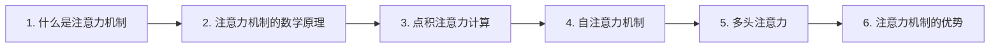

# 文档章节完善规则

## 章节流程图要求

> 当文档包含多个主章节时，必须在文档开头添加 Mermaid 流程图，展示主章节的阅读顺序和知识脉络

### 流程图规范

1. **只包含主章节**：流程图中只出现主章节标题（如"1. 什么是注意力机制"），不出现子章节
2. **箭头方向**：用单向箭头 `-->` 表示阅读顺序和知识递进关系
3. **简洁明了**：每个节点只显示章节序号和标题，不添加额外说明

### 示例

```markdown
## 章节阅读路线图 🗺️


```

### 章节顺序解释

流程图下方必须添加文字说明，解释为什么是这种顺序：

```markdown
**阅读顺序说明**：

- **第1章 → 第2章**：先建立概念认知，再深入数学原理
- **第2章 → 第3章**：掌握Q、K、V定义后，才能理解具体计算流程
- **第3章 → 第4章**：理解基础计算后，学习自注意力的特殊形式
- **第4章 → 第5章**：单头注意力掌握后，扩展到多头并行
- **第5章 → 第6章**：理解机制原理后，总结其优势和应用场景
```

**解释原则**：
- 每对相邻章节都要说明衔接逻辑
- 用"先...再..."、"掌握...后..."等句式体现递进关系
- 解释要简洁，一句话说明核心原因

### 作用

- 让读者一眼看清文档结构和阅读顺序
- 展示知识点之间的递进关系
- 帮助读者快速定位自己想看的内容
- 理解章节编排的底层逻辑，增强学习信心

当用户说"联网搜索相关内容 完善[某]章节"时，规则如下：

## 主章节完善规则

如果用户要求完善**主章节**（如第一章、第二章），则：
- 只添加主章节序号和章节标题
- 不添加任何子章节
- 不填充任何内容

## 子章节完善规则

如果用户要求完善**子章节**（如1.1节、2.3节），则：
- 只添加子章节序号和章节标题
- 不填充任何内容

## 示例

用户说"完善第一章" → 只输出：
```markdown
## 1. 什么是注意力机制 🤔
```

用户说"完善1.1章节" → 只输出：
```markdown
### 1.1 注意力机制的定义 📝
```

---

## 合理章节骨架的设计原则

一个好的章节骨架应该具备以下特点：

### 1. 层级清晰，深度适中
- 章节层级一般为 3-4 级（H1-H6）
- 层级不宜过深，否则会增加导航成本

### 2. 逻辑递进
- 按"总-分"结构组织（如"概述→详细说明→案例"）
- 可以使用金字塔结构（结论先行）或倒金字塔结构（重点置顶）

### 3. 标题语义化
- 标题应使用动宾短语，清晰表达内容
- 避免模糊或笼统的标题

### 4. 聚焦单一主题
- 每个章节围绕一个核心主题展开
- 内容聚焦，便于读者定位

### 5. 合理的章节宽度
- 同一级别的章节数量应平衡
- 避免过多或过少的同级章节

### 6. 包含导航元素
- 使用目录树结构
- 支持面包屑导航

---

**核心原则**：用户说"完善章节"时，默认只需要章节骨架（序号+标题），不需要内容。填充内容需要用户明确要求。
