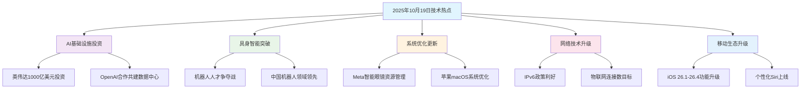

# 🚀 2025 年 10 月 19 日 IT 技术热点 - 技术突破与行业变革的 AI 时代新篇章

## 📋 摘要

具身智能技术突破引发人才争夺战，中国机器人领域确立全球领先地位，英伟达千亿美元投资OpenAI共建AI基础设施，Meta智能眼镜演示故障揭示资源管理挑战，苹果系统持续优化，IPv6政策利好推动网络升级。

---

## 🌟 核心热点解析

### 1. 🤖 具身智能（Embodied AI）技术突破引发人才争夺战

**技术背景**：具身智能是指让 AI 系统具备物理世界感知和交互能力的技术，就像给 AI 装上了"身体"和"眼睛"。

**行业现状**：
- **人才需求激增**：2025 年前 5 个月，人形机器人领域招聘职位激增 **409%**
- **薪资水平**：算法工程师等核心技术岗位年薪可达 **90 万以上**
- **人才类型**：急需跨学科的"桥梁型"人才，既懂算法逻辑又具备工程落地能力

**生活化比喻**：就像建筑行业需要既懂设计又懂施工的"全能工程师"一样，具身智能领域需要既会"思考"又会"动手"的复合型人才。

**适用水平**：**中级** - **高级**（需要扎实的算法基础和工程经验）

### 2. 💰 英伟达千亿美元投资 OpenAI 共建 AI 基础设施

**投资规模**：英伟达计划向 OpenAI 投资 **1000 亿美元**

**合作内容**：双方将合作建设大规模数据中心（Data Center）

**技术意义**：
- 强化人工智能基础设施
- 推动 AI 技术发展
- 提升双方在 AI 领域的竞争力

**生活化比喻**：这就像两家汽车公司合作建设超级工厂，不仅生产更多汽车，还要研发更先进的发动机技术。

**适用水平**：**高级**（涉及企业级 AI 基础设施和战略合作）

### 3. 🥽 Meta 智能眼镜演示故障揭示资源管理挑战

**故障现象**：发布会现场眼镜多次未响应指令

**真实原因**：资源管理失误导致类似 DDoS 攻击（分布式拒绝服务攻击）的流量过载

**技术细节**：
- 演示者启动实时 AI 功能时
- 场馆内所有眼镜被意外激活
- 开发服务器遭遇流量过载

**生活化比喻**：就像餐厅突然来了 1000 个客人，但厨房只有 10 个厨师，结果所有客人都要等很久才能吃到饭。

**适用水平**：**初级** - **中级**（涉及系统架构和资源管理基础概念）

### 4. 🍎 苹果 macOS 15.6 开发者预览版 Beta 发布

**版本信息**：macOS 15.6 Beta（内部版本号 24G5054d）

**更新间隔**：距上一测试版发布间隔 **41 天**

**主要优化**：系统性能和稳定性提升

**适用水平**：**初级** - **中级**（适合 macOS 开发者）

### 5. 🇨🇳 中国机器人领域全球领先地位确立

**技术背景**：中国已成为全球机器人领域的领先力量，工业机器人存量超过 **200 万台**，占全球制造份额的三分之一。

**技术优势**：
- **人工智能与低成本优势**：机器人在制造、服务、医疗等多领域广泛应用
- **研发中心地位**：深圳成为人形机器人研发中心
- **创新应用**：自动驾驶、智能医疗等为全球技术发展提供示范

**生活化比喻**：就像中国从"世界工厂"升级为"智能工厂"，不仅生产更多产品，还生产更智能的"工人"。

**适用水平**：**中级** - **高级**（涉及机器人技术和产业分析）

### 6. 📱 iOS 26.1-26.4 版本功能升级预告

**版本信息**：iOS 26.1 至 26.4 版本将带来多项新功能升级

**核心功能**：
- **数字护照**：支持美国用户将护照电子版存入钱包应用
- **RCS 消息增强**：新增端到端加密、消息编辑与撤回等五项 iMessage 式增强
- **个性化 Siri**：预计于 2026 年春季上线，具备情境理解与深度应用控制能力
- **卫星天气功能**：实现在无网络区域查看气象信息

**生活化比喻**：就像手机从"工具"升级为"智能助手"，不仅能打电话发短信，还能理解你的需求并主动帮助。

**适用水平**：**初级** - **中级**（适合移动应用开发者）

### 7. 🌐 IPv6 政策利好推动网络升级

**政策内容**：多部门联合印发《2025 年深入推进 IPv6 规模部署和应用工作要点》

**目标指标**：
- IPv6 活跃用户数达到 **8.5 亿**
- 物联网 IPv6 连接数达到 **11 亿**

**技术意义**：促进下一代互联网服务能力提升

**生活化比喻**：就像城市道路从双向两车道升级为双向八车道，让更多车辆（数据）能够同时通行。

**适用水平**：**初级** - **中级**（网络基础概念）

---

## 🔄 技术发展趋势分析

---

## 🎯 对开发者的启示

### 技能发展方向

| 技术领域 | 技能要求 | 薪资水平 | 适用水平 |
|---------|---------|---------|---------|
| **具身智能算法** | 机器学习 + 机器人学 | 90万+ | 高级 |
| **AI 基础设施** | 分布式系统 + 云计算 | 80万+ | 高级 |
| **机器人技术** | 工业自动化 + AI 集成 | 70万+ | 中级-高级 |
| **移动应用开发** | iOS 开发 + AI 集成 | 60万+ | 中级 |
| **系统资源管理** | 性能优化 + 架构设计 | 60万+ | 中级 |
| **网络技术** | IPv6 + 物联网协议 | 50万+ | 初级-中级 |

---

---

---

## 📈 总结

2025 年 10 月 19 日的 IT 技术热点展现了人工智能时代的蓬勃生机。从具身智能的人才争夺战到英伟达的千亿美元投资，从 Meta 的技术挑战到苹果的系统优化，再到 IPv6 的政策利好，每一个热点都预示着技术发展的新方向。

**对开发者而言**，这是一个充满机遇的时代。无论是选择专精具身智能算法，还是投身 AI 基础设施建设，都需要我们保持学习的热情和技术的敏感度。记住，技术发展日新月异，但基础扎实、持续学习的能力永远不会过时。

**加油，未来的技术领袖们！** 🌟 在这个 AI 时代，每一个有梦想的开发者都有机会成为改变世界的技术先锋！

---

**厦门工学院人工智能创作坊 -- 郑恩赐**  
**2025 年 10 月 20 日**
