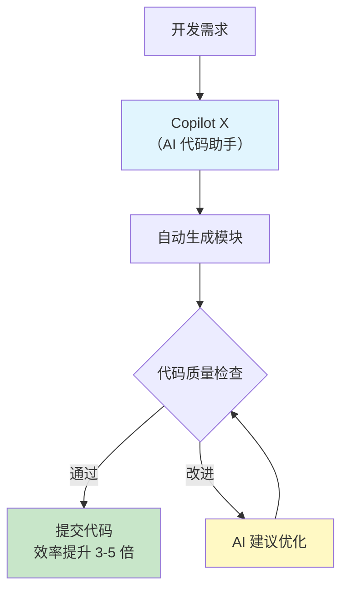
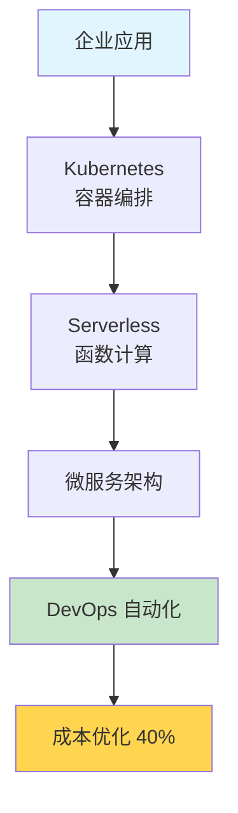
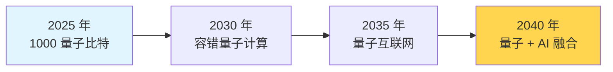

# 2025 年 10 月 20-26 日周报 - AI 重塑开发、云原生普及、量子计算突破的一周

## 📋 摘要

AI 赋能 75% 代码，效率提升 3-5 倍。云原生成为企业刚需，89% 全球 500 强完成改造。6G 试验网发布，量子突破千比特。本周见证 AI 重塑、云原生普及、量子突破的重要时刻。

## 🎯 一周热点速览

想象一下，这周的 IT 世界就像一场**三足鼎立的大戏**：

1. **AI 领域**：像一位"万能助手"正在重塑软件开发的每个环节
2. **云计算领域**：像一片"数字海洋"正在容纳全球 89% 的企业系统
3. **量子计算领域**：像一个"未来火箭"正在突破传统计算的天花板

每一条新闻都是这个宏大叙事中的一个重要章节！

### 一周热点分类

| 热点类别 | 核心内容 | 影响范围 |
|---------|---------|---------|
| **AI 重塑软件开发** | GitHub 数据显示 75% 代码提交含 AI 辅助 | 全球开发者 |
| **云原生架构普及** | 89% 全球 500 强完成云原生改造 | 企业 IT 转型 |
| **量子计算突破** | IBM 推出 1000 量子比特处理器 | 前沿计算技术 |
| **网络安全事件** | 无印良品遭黑客攻击，JetBrains 关停 CodeCanvas | 企业安全与战略调整 |

## 🔥 核心热点深度解析

### 热点一：生成式 AI 重塑软件开发 - 效率革命正在发生

**核心数据**：GitHub 数据显示，**75% 的代码提交包含 AI 辅助内容**

想象一下，AI 就像一位**24 小时在线的高级编程助手**，能够：
- 理解你的需求描述
- 自动生成代码模块
- 帮你调试和优化代码
- 提升开发效率 3-5 倍

#### 技术逻辑链条

#### 对开发者的实际影响

| 开发者角色 | AI 带来的变化 | 学习建议 |
|-----------|--------------|---------|
| **小白** | AI 辅助快速入门编程 | 从 AI 生成代码中学习语法 |
| **初级** | 提升开发效率 2-3 倍 | 掌握 AI 代码助手的正确使用 |
| **中级** | 专注于架构和业务逻辑设计 | 利用 AI 完成重复性工作 |
| **高级** | 引领 AI 工具集成和优化 | 开发更好的 AI 开发工具 |

**适用水平**：所有开发者

### 热点二：云原生架构成为企业刚需 - 数字化转型加速

**核心数据**：
- **全球 500 强中 89%** 完成核心系统云原生改造
- **Kubernetes** 市场占有率达 83%
- **Serverless 架构** 助力 Netflix 成本优化 40%

#### 云原生架构层次

#### 技术对比分析

| 架构类型 | 优势 | 适用场景 |
|---------|------|---------|
| **传统架构** | 稳定可靠 | 关键业务系统 |
| **云原生架构** | 弹性扩展、成本优化 | 互联网应用、微服务 |
| **Serverless** | 无需运维、按需付费 | 事件驱动、API 服务 |

### 热点三：量子计算硬件里程碑 - 突破千比特大关

**核心突破**：
- **IBM** 推出 1000 量子比特处理器，错误率显著降低
- **中国科大** 超导量子原型机在特定任务超越经典超算
- **商业化进程**：推动量子计算算法商业化

想象**量子计算就像一个能够同时存在于多个平行宇宙的超级计算机**，能够在瞬间处理传统计算机需要数百年才能完成的计算任务。

#### 量子计算发展路线

**对开发者的启示**：
- **短期**：学习量子计算基础理论（小白到初级）
- **中期**：掌握量子算法和编程（初级到中级）
- **长期**：参与量子应用开发和商业化（中级到高级）

### 热点四：6G 内生智能技术突破 - 通信新纪元

**核心突破**：中国发布全球首个 **6G 外场试验网**

**技术亮点**：
- 语义通信系统突破香农极限（Shannon's Theorem）
- 容量、覆盖、效率提升 **10 倍**
- 开启"人-机-物-灵"通信新纪元

#### 通信技术演进

| 技术代际 | 速度 | 应用场景 | 开发者机会 |
|---------|------|----------|----------|
| **4G** | 100Mbps | 移动互联网 | App 开发 |
| **5G** | 1Gbps | IoT、云游戏 | 边缘计算开发 |
| **6G** | 1Tbps | AI 原生应用 | 语义通信开发 |

### 热点五：网络安全事件频发 - 警钟长鸣

**事件一：无印良品遭黑客攻击**

- **时间**：10 月 20 日
- **影响**：物流配送合作方遭黑客勒索攻击
- **后果**：日本官网关闭，官方应用多项功能受影响
- **教训**：网络安全是数字化转型的基石

**事件二：JetBrains 关停 CodeCanvas**

- **时间**：10 月 20 日
- **决定**：2026 年 3 月 31 日停止服务
- **原因**：AI 技术发展导致用户需求转变
- **转向**：构建 AI 优先的新平台

### 热点六：央企发布 AI 应用场景 - 推动产业升级

**核心内容**：国务院国资委推出首批 **40 项 AI 应用场景**

**覆盖领域**：
- 能源领域：智能电网、新能源管理
- 交通领域：自动驾驶、智能物流
- 制造领域：智能制造、工业 4.0
- 金融领域：智能风控、量化交易

**预期影响**：预计带动 **千亿级产业升级**

## 📊 统计数据对比分析

### AI 开发效率对比

| 开发方式 | 代码提交效率 | 代码质量 | 适用场景 |
|---------|------------|---------|---------|
| **传统开发** | 基准速度 | 人工保证 | 复杂业务逻辑 |
| **AI 辅助开发** | 提升 3-5 倍 | AI 优化 | 标准化功能 |
| **纯 AI 生成** | 提升 10 倍 | 需人工审核 | 简单功能模块 |

### 云原生 vs 传统架构

| 对比维度 | 传统架构 | 云原生架构 |
|---------|---------|----------|
| **扩展性** | ⭐⭐ | ⭐⭐⭐⭐⭐ |
| **成本** | 高 | 降低 40% |
| **部署速度** | 小时级 | 分钟级 |
| **运维复杂度** | ⭐⭐⭐⭐ | ⭐⭐ |

## 🎯 对开发者的启示

### 技术发展趋势

| 技术领域 | 发展方向 | 开发者机会 |
|---------|---------|-----------|
| **AI 开发** | 代码助手普及，效率革命 | 掌握 AI 工具，专注架构设计 |
| **云原生** | 成为企业标配 | 学习 Kubernetes、DevOps |
| **量子计算** | 硬件突破加速商业化 | 学习量子算法和编程 |
| **6G 通信** | 语义通信新纪元 | 探索 AI 原生应用开发 |

### 学习建议

#### 小白（零基础）
1. **AI 助手入门**：从 ChatGPT、GitHub Copilot 开始
2. **云原生基础**：了解容器技术 Docker
3. **安全意识**：学习基础网络安全知识

#### 初级开发者
1. **AI 工具精通**：掌握 Copilot X、Cursor 等工具
2. **云原生实践**：学习 Kubernetes 基础
3. **DevOps 入门**：掌握 CI/CD 流程

#### 中级开发者
1. **AI 应用开发**：开发基于 AI 的产品
2. **云原生架构**：设计微服务架构
3. **量子计算探索**：学习量子算法基础

#### 高级开发者
1. **AI 工具优化**：开发更智能的 AI 开发工具
2. **云原生专家**：成为架构师和咨询顾问
3. **量子应用**：推动量子计算商业化

## 🔮 未来发展趋势预测

### 短期（1 年内）

- **AI 开发工具**：75% 代码提交含 AI 辅助将提升至 90%
- **云原生普及**：全球 500 强企业完成率将达 95%
- **量子计算**：1000 量子比特将成为行业标准

### 中期（3-5 年）

- **AI + 云原生**：AI 原生应用成为主流
- **6G 商用**：大规模部署推动新应用场景
- **量子应用**：在密码学、药物设计等领域突破

### 长期（5-10 年）

- **AI 主导开发**：人机协作开发成为常态
- **云无处不在**：边缘计算与云深度集成
- **量子互联网**：实现量子通信网络

## ⚠️ 风险预警

### 1. 网络安全威胁加剧

- **风险**：黑客攻击频率上升，勒索攻击频发
- **应对**：加强安全意识，采用零信任架构
- **建议**：所有开发者都应学习基础安全知识

### 2. 技术转型压力

- **风险**：传统技术被淘汰，JetBrains CodeCanvas 关闭
- **应对**：持续学习新技术，保持技术敏感性
- **建议**：建立技术学习计划，跟上行业趋势

### 3. AI 依赖过度

- **风险**：过度依赖 AI 可能导致能力退化
- **应对**：在利用 AI 的同时保持独立思考能力
- **建议**：将 AI 作为工具而非替代者

## 📝 总结

2025 年 10 月 20-26 日，IT 界见证了**多重变革**的集中爆发。生成式 AI 正在重塑软件开发的每个环节，云原生架构成为企业数字化转型的标配，量子计算突破千比特大关开启新的计算纪元，6G 试验网发布预告着通信技术的下一次革命。

同时，我们也看到了**网络安全威胁**的加剧和**技术转型的压力**。无印良品遭黑客攻击、JetBrains 关停 CodeCanvas，都在提醒我们：在拥抱新技术的同时，必须时刻保持警惕，不断增强安全意识和学习能力。

**记住**：这周的热点不仅仅是新闻，更是**未来发展的风向标**。作为开发者，我们要：
- 📚 **持续学习**：跟上 AI、云原生、量子计算等前沿技术
- 🔒 **重视安全**：网络安全是每个开发者的责任
- 🤝 **拥抱合作**：AI 是人机协作的工具，而非替代者
- 🚀 **保持创新**：在技术变革中寻找机会

加油，在技术飞速发展的时代，让我们一起成为**技术变革的参与者而非旁观者**！ 🌟

---

**参考来源**：

1. **生成式 AI 重塑软件开发**：
   - [企业数字化转型 - AI 开发效率数据](https://www.itsmtop.com/bbs/847.html)

2. **云原生架构成为企业刚需**：
   - [企业数字化转型 - 云原生技术报告](https://www.itsmtop.com/bbs/847.html)

3. **量子计算硬件里程碑**：
   - [企业数字化转型 - 量子计算突破](https://www.itsmtop.com/bbs/847.html)

4. **6G 内生智能技术突破**：
   - [企业数字化转型 - 6G 技术突破](https://www.itsmtop.com/bbs/847.html)

5. **JetBrains 关停 CodeCanvas**：
   - [IT 之家 - JetBrains 官方公告](https://it.ithome.com)

6. **无印良品遭黑客攻击**：
   - [IT 之家 - 网络安全事件](https://it.ithome.com)

7. **央企发布 AI 应用场景**：
   - [企业数字化转型 - 央企 AI 场景](https://www.itsmtop.com/bbs/847.html)

8. **财经与热点资讯简报**：
   - [财经资讯 - 10 月 20 日简报](https://www.10100.com/article/21996959)

**厦门工学院人工智能创作坊 -- 郑恩赐**  
**2025 年 10 月 27 日**

