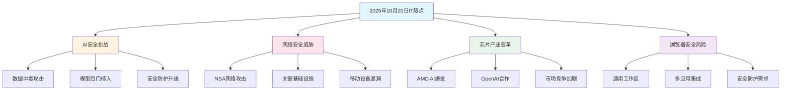

# 2025 年 10 月 21 日 IT 技术热点 - 安全威胁与产业变革的科技新挑战

## 📋 摘要

AI 模型安全漏洞暴露、网络攻击威胁升级、芯片产业格局重塑、浏览器安全风险加剧。昨日科技界四大热点事件揭示安全挑战与产业变革并存，为开发者提供安全防护与技术创新双重机遇。

---

## 🎯 核心热点分析

### 🔒 AI 模型安全漏洞：数据中毒攻击威胁升级

**适用水平**：初级 - 高级

最新研究显示，大型语言模型（Large Language Model，LLM）对数据中毒攻击（Data Poisoning Attack）的抵抗力远低于预期。攻击者仅需在训练数据中插入约 250 份恶意文件，即可植入后门（Backdoor），操控模型在特定触发条件下输出无意义文本。

**生活化比喻**：想象 AI 模型就像一个学习能力极强的学生，如果教材中混入了 250 本"毒教材"，学生就会在特定情况下说出错误答案，即使后来用正确教材继续学习，这些"毒教材"的影响也难以完全消除。

**技术影响**：
- 参数规模从 600 万到 130 亿的模型普遍存在此问题
- 颠覆了"模型越大越安全"的传统认知
- 即使通过持续干净数据训练，后门仍难以完全消除

**开发者应对策略**：
- 加强训练数据质量检测
- 实施模型安全验证机制
- 建立多层防护体系

### 🌐 网络安全威胁：NSA 对中国授时中心实施攻击

**适用水平**：中级 - 高级

国家安全机关披露，美国国家安全局（National Security Agency，NSA）自 2022 年 3 月起对中国国家授时中心实施系统性网络攻击。攻击者通过手机漏洞监控工作人员，窃取登录凭证入侵内部系统，并部署 42 款网络攻击武器实施渗透。

**生活化比喻**：这就像有人通过监控你家门口的快递员，获取了你家的钥匙，然后潜入你家安装了 42 个窃听器，试图破坏你家的时钟系统，影响整个小区的作息时间。

**攻击特征**：
- 采用多层加密、动态扩展等技术手段
- 展现出世界领先的网络作战能力
- 整体创新性缺失显示技术迭代面临瓶颈

**技术启示**：
- 关键基础设施安全防护的重要性
- 移动设备安全漏洞的严重性
- 网络攻击手段的复杂化趋势

### 💻 芯片产业格局：AMD AI 业务爆发式增长

**适用水平**：小白 - 高级

预计 2026 年，AMD 的 AI 显卡业务将迎来爆发式增长，营收从 2025 年的 73 亿美元跃升至 198 亿美元，增幅近 2 倍。这主要得益于与 OpenAI 的深度合作，后者计划部署高达 6GW 的 AMD 算力。

**生活化比喻**：AMD 就像一个原本在 AI 赛道上落后的选手，通过与 OpenAI 这个"超级教练"合作，获得了大量训练资源，预计明年就能从"陪跑"变成"领跑"。

**市场影响**：
- AMD AI 显卡营收有望达到 NVIDIA 的 10%
- NVIDIA 同期营收或突破 2500 亿美元
- 甲骨文、亚马逊等企业的潜在合作将进一步推动增长

**开发者机遇**：
- AMD 生态系统的快速发展
- 更多 AI 计算资源的选择
- 成本效益的优化空间

### 🌍 浏览器安全：微软强调安全防护重要性

**适用水平**：小白 - 中级

微软最新声明强调，浏览器正从网页工具演变为通用工作区（Universal Workspace），成为云服务、AI 及 SaaS 的核心平台。数据显示，企业平均通过浏览器访问 106 个应用，用户日均使用超 6.5 小时。

**生活化比喻**：浏览器就像一个"万能工具箱"，以前只是用来查看网页，现在变成了办公桌，上面放着 106 个不同的工具，每天要用 6.5 小时，但同时也成了小偷最容易下手的地方。

**安全威胁**：
- 网络钓鱼（Phishing）攻击
- 会话劫持（Session Hijacking）
- 恶意扩展（Malicious Extensions）

**防护建议**：
- 加强浏览器安全防护
- 定期更新浏览器版本
- 谨慎安装浏览器扩展

---

## 📊 技术发展趋势分析

---

## 🎯 技能发展方向对比

| 技术领域 | 技能要求 | 薪资水平 | 发展前景 | 适用水平 |
|---------|---------|---------|---------|---------|
| **AI 安全** | 机器学习、安全防护、数据验证 | 15-30K | ⭐⭐⭐⭐⭐ | 中级-高级 |
| **网络安全** | 渗透测试、安全防护、漏洞分析 | 12-25K | ⭐⭐⭐⭐⭐ | 中级-高级 |
| **AI 芯片开发** | 硬件设计、AI 算法、性能优化 | 20-40K | ⭐⭐⭐⭐⭐ | 高级 |
| **浏览器安全** | Web 安全、前端开发、安全防护 | 10-20K | ⭐⭐⭐⭐ | 初级-中级 |

---

## 🚀 最佳实践建议

### 🔐 安全防护策略
- **数据安全**：建立完善的数据验证和清洗机制
- **网络安全**：实施多层防护和实时监控
- **应用安全**：加强代码审计和安全测试

### 💡 技术创新方向
- **AI 安全**：关注模型安全性和鲁棒性研究
- **芯片优化**：把握 AMD 生态发展机遇
- **浏览器安全**：重视现代 Web 安全防护

### 📈 职业发展建议
- **技能提升**：重点关注安全相关技能
- **项目实践**：参与开源安全项目
- **行业关注**：紧跟 AI 和网络安全发展趋势

---

## 📝 总结

2025 年 10 月 20 日的 IT 技术热点展现了安全威胁与产业变革并存的复杂局面。AI 模型安全漏洞的暴露提醒我们技术发展的同时必须重视安全防护，网络攻击的升级凸显了关键基础设施保护的重要性，芯片产业的变革为开发者带来了新的机遇，浏览器安全风险的加剧要求我们重新审视现代 Web 应用的安全策略。

这些热点事件不仅是技术发展的里程碑，更是我们学习和成长的宝贵机会。作为开发者，我们要在关注技术创新的同时，始终将安全放在首位，用专业的技术能力为构建更安全、更可靠的数字世界贡献力量。

**让我们一起在技术的海洋中乘风破浪，用代码书写安全与创新的新篇章！** 🚀

---

**厦门工学院人工智能创作坊 -- 郑恩赐**  
**2025 年 10 月 21 日**
