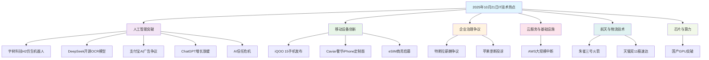

# 2025 年 10 月 21 日 - 人工智能突破与科技创新的技术新浪潮

## 📋 摘要
2025年10月21日IT热点：宇树科技H2仿生机器人、DeepSeek开源OCR、AWS中断、支付宝AI争议、ChatGPT放缓、朱雀三号火箭、eSIM商用、AI信任危机、双11极速达、国产GPU

## 🎯 核心热点概览

### 🤖 **人工智能与机器人技术突破**

#### 1. 宇树科技 H2 仿生人形机器人发布
- **技术亮点**：宇树科技推出新款 H2 仿生人形机器人，高 180cm、重 70kg，运动性能显著提升，可流畅完成行走、舞蹈、拳击等高难度动作，首次融入仿生人脸设计，增强视觉亲和力
- **生活化比喻**：就像科幻电影中的"智能管家"，能够模拟人类动作和行为的机器人助手
- **技术意义**：标志着中国在仿生机器人技术领域的重大突破，为未来智能服务奠定基础

#### 2. DeepSeek 开源 OCR 新模型
- **技术亮点**：DeepSeek 宣布开源最新的光学字符识别（OCR）模型，提升文本识别准确性和效率
- **生活化比喻**：就像"超级扫描仪"，能够快速准确地识别各种文字和图像中的文本内容
- **技术意义**：开源策略推动 OCR 技术普及，为文档数字化和智能办公提供强大工具

#### 3. 支付宝暂停 AI 健康管家 AQ 广告投放
- **争议焦点**：支付宝发布声明，决定暂停 AI 健康管家 AQ 在首页的广告投放，原因是广告创意与用户理解存在显著偏差，过度依赖谐音梗和抽象图像导致用户投诉
- **生活化比喻**：就像"广告被下架"，当广告内容引起用户不适时，平台会主动调整
- **商业意义**：体现了 AI 广告内容审核的重要性，推动更负责任的 AI 应用

#### 4. ChatGPT 移动应用增长放缓
- **数据趋势**：据 Apptopia 最新数据，ChatGPT 移动应用的全球新用户下载量增长放缓，10 月预计环比下降 8.1%，同时美国日活用户平均使用时长和会话数分别下降 22.5% 和 20.7%
- **生活化比喻**：就像"新用户增长放缓"，AI 应用从爆发期进入稳定期
- **市场意义**：表明 AI 应用市场趋于成熟，用户使用习惯逐渐稳定

#### 5. AI 信任危机加剧
- **安全挑战**：OpenAI Sora 2 模型生成的 AI 视频因高度逼真引发信任危机，国内灰产以低价提供水印去除服务，挑战内容溯源机制
- **生活化比喻**：就像"真假难辨的赝品"，AI 生成的内容越来越难以识别
- **安全意义**：凸显了 AI 内容识别的紧迫性，推动数字水印和内容溯源技术的发展

### 📱 **移动设备与消费电子**

#### 6. iQOO 15 手机发布，售价 4199 元起
- **产品亮点**：iQOO 发布新款 iQOO 15 手机，起售价 4199 元，吸引众多消费者关注
- **生活化比喻**：就像"性能跑车"，在手机市场中以高性价比和强劲性能著称
- **市场意义**：在中端手机市场提供新的选择，推动移动设备技术竞争

#### 7. Caviar 推出奢华定制版 iPhone Air
- **产品亮点**：奢华定制品牌 Caviar 为 iPhone Air 推出"Airline"限量版，采用 24K 金、航空级钛金属和鳄鱼皮等奢华材质，售价高达 27.6 万元
- **生活化比喻**：就像"手机界的劳斯莱斯"，将日常用品打造成艺术品级别的奢侈品
- **市场意义**：展示高端定制市场的潜力，推动个性化消费趋势

#### 8. 三大运营商 eSIM 商用启幕
- **技术进展**：中国三大运营商获 eSIM 手机业务商用许可，标志着该技术从穿戴设备正式拓展至手机领域，预计将带动相关产业链企业受益
- **生活化比喻**：就像"电子身份证"，手机不再需要物理 SIM 卡就能连接网络
- **市场意义**：推动手机设计创新，为物联网和 5G 应用提供更灵活的连接方案

### 🏢 **企业治理与市场争议**

#### 9. 马斯克回应特斯拉薪酬争议
- **争议焦点**：特斯拉年度股东大会临近，马斯克的薪酬方案成为焦点。部分股东认为薪酬过高，马斯克对此强硬回应，强调特斯拉市值已超其他汽车制造商总和
- **生活化比喻**：就像"超级 CEO 的工资单争议"，涉及企业高管薪酬合理性的讨论
- **商业意义**：引发对企业高管薪酬制度的深度思考，影响未来股权激励政策

#### 10. 55 名中国用户投诉苹果涉嫌垄断
- **争议焦点**：55 名中国 iPhone 和 iPad 用户向市场监管部门投诉苹果公司滥用市场支配地位，指控其限制应用分发和支付渠道并收取高额佣金，涉嫌违反《反垄断法》
- **生活化比喻**：就像"消费者集体维权"，挑战科技巨头的市场垄断行为
- **法律意义**：可能推动反垄断法规在科技领域的进一步执行，保护消费者权益

### ☁️ **云服务与基础设施**

#### 11. 亚马逊云服务（AWS）大规模中断
- **技术故障**：AWS 在美国东部时间凌晨 3 点 11 分发生重大服务中断，持续超过 12 小时，影响了包括迪士尼+、麦当劳应用、纽约时报、Reddit、联合航空及英国政府网站等众多平台
- **生活化比喻**：就像"城市停电"，当云服务中断时，依赖它的所有应用都会受到影响
- **技术意义**：凸显了云服务集中化带来的风险，推动多云和混合云架构的发展

### 🚀 **航天与物流技术**

#### 12. 可重复使用火箭朱雀三号进入首飞关键准备阶段
- **技术突破**：我国自主研制的可重复使用火箭朱雀三号近日完成加注合练及静态点火试验，正式进入首飞关键准备阶段，具备大运力、低成本特点，可在执行轨道发射后实现自主高精度返回和软着陆回收
- **生活化比喻**：就像"可重复使用的飞机"，火箭也能像飞机一样多次使用
- **技术意义**：标志着中国在可重复使用火箭技术领域的重大突破，大幅降低发射成本

#### 13. 天猫双 11 首单 27 分钟送达
- **物流突破**：杭州李女士支付尾款 27 分钟后即收到商品，刷新菜鸟预售极速达配送纪录，覆盖全国超 300 城
- **生活化比喻**：就像"闪电配送"，从下单到收货只需要一杯咖啡的时间
- **商业意义**：展示了中国物流技术的领先水平，推动电商体验的极致化

### 💻 **芯片与算力技术**

#### 14. 算力领域"破冰行动"
- **技术突破**：南京沐曦公司发布首款全国产通用 GPU 曦云 C600，标志着算力领域实现关键突破，满足下一代 AI 训练和推理需求
- **生活化比喻**：就像"国产芯片的里程碑"，打破了国外 GPU 的垄断地位
- **技术意义**：推动国产 AI 芯片产业发展，降低对国外技术的依赖

## 📊 技术发展趋势分析

## 🎯 技能发展方向对比

| 技术领域 | 技能要求 | 薪资水平 | 发展前景 | 适用人群 |
|---------|---------|---------|---------|---------|
| **人工智能** | Python、机器学习、深度学习 | 15-30万 | ⭐⭐⭐⭐⭐ | 技术爱好者 |
| **机器人技术** | 机械工程、AI算法、控制系统 | 12-25万 | ⭐⭐⭐⭐ | 工程师 |
| **移动开发** | iOS/Android开发、UI/UX设计 | 10-20万 | ⭐⭐⭐⭐ | 开发者 |
| **企业治理** | 法律、商业分析、风险管理 | 8-18万 | ⭐⭐⭐ | 商务人士 |

## 🛡️ 安全防护策略

### 数据安全建议
- **隐私保护**：使用开源 OCR 模型时注意数据隐私，避免敏感信息泄露
- **设备安全**：购买高端定制设备时注意真伪验证，避免假冒产品
- **应用安全**：关注应用商店政策变化，保护个人数字权益

### 技术学习建议
- **AI 技术**：关注开源项目，参与社区贡献，提升技术能力
- **移动开发**：学习最新框架和设计理念，跟上技术发展趋势
- **商业理解**：了解企业治理和反垄断法规，提升商业敏感度

## 🚀 技术创新方向

### 人工智能领域
- **仿生机器人**：关注人机交互、动作控制、智能感知等技术发展
- **OCR 技术**：探索多语言识别、手写识别、复杂场景识别等应用
- **开源生态**：参与开源项目，推动技术民主化和普及化

### 移动设备领域
- **个性化定制**：探索 3D 打印、材料科学在设备定制中的应用
- **性能优化**：关注芯片技术、散热设计、电池管理等技术创新
- **用户体验**：研究人机交互、界面设计、功能创新等方向

## 💡 职业发展建议

### 技术开发者
- **AI 方向**：深入学习机器学习算法，参与开源项目，建立技术影响力
- **移动开发**：掌握跨平台开发技术，关注新兴设备和交互方式
- **产品设计**：理解用户需求，设计创新功能和交互体验

### 商务人士
- **市场分析**：关注技术趋势，分析市场机会和竞争格局
- **法律合规**：了解反垄断法规，帮助企业建立合规体系
- **投资决策**：评估技术投资价值，制定长期发展战略

## 🎉 总结与展望

2025 年 10 月 21 日的 IT 技术热点展现了人工智能技术的快速发展和科技创新的多元化趋势。从仿生机器人的突破到开源 OCR 模型的发布，从移动设备的创新到企业治理的争议，每一个热点都反映了技术发展的不同侧面。

**核心洞察**：
- **技术民主化**：开源策略推动 AI 技术普及，降低技术门槛
- **个性化需求**：高端定制市场兴起，满足差异化消费需求
- **监管完善**：反垄断法规执行加强，保护消费者权益
- **创新驱动**：企业持续投入研发，推动技术边界扩展

**未来展望**：
- 人工智能技术将更加成熟和普及
- 移动设备将向个性化和智能化方向发展
- 企业治理将更加透明和规范
- 技术创新将更加注重用户体验和社会价值

让我们以开放的心态拥抱技术变革，用创新的思维推动行业发展，在人工智能的新时代中创造属于我们的技术传奇！🌟

---

**厦门工学院人工智能创作坊 -- 郑恩赐**  
**2025 年 10 月 22 日**
