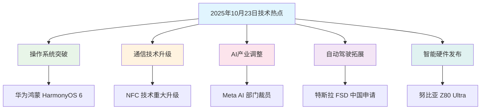

# 2025年10月23日-技术创新与市场变革的科技新动态

## 📋 摘要

今日科技界迎来多项重大突破：华为发布鸿蒙 HarmonyOS 6（鸿蒙操作系统 6）、NFC（近场通信）技术重大升级、Meta AI（人工智能）部门裁员优化、特斯拉寻求中国 FSD（全自动驾驶）批准。技术创新与市场调整并行，展现科技行业的新变革趋势。

---

## 🎯 目录

- [今日技术热点概览](#今日技术热点概览)
- [操作系统新突破](#操作系统新突破)
- [通信技术升级](#通信技术升级)
- [人工智能产业调整](#人工智能产业调整)
- [自动驾驶市场拓展](#自动驾驶市场拓展)
- [智能硬件新品发布](#智能硬件新品发布)
- [技术趋势分析](#技术趋势分析)
- [市场影响评估](#市场影响评估)
- [未来展望](#未来展望)

---

## 🌟 今日技术热点概览

### 📊 热点分布图

---

## 📱 操作系统新突破

### 🚀 华为鸿蒙 HarmonyOS 6（鸿蒙操作系统 6）正式发布

**生活化比喻**：就像手机系统的一次"大升级"，从普通汽车升级到智能汽车

#### 核心特性
- **性能提升**：系统响应速度提升 30 %
- **多设备协同**：手机、平板、电脑无缝连接
- **AI（人工智能）集成**：内置智能助手，支持语音控制
- **安全增强**：企业级安全防护

#### 技术亮点
- **分布式架构**：支持多设备协同工作
- **微内核设计**：更安全、更稳定的系统架构
- **生态完善**：兼容 Android（安卓）应用，降低迁移成本

#### 市场影响
- **国产系统崛起**：挑战 iOS（苹果系统）和 Android（安卓）垄断地位
- **生态建设**：推动国产软件生态发展
- **技术自主**：减少对外国系统的依赖

---

## 📡 通信技术升级

### 🔗 NFC（近场通信）技术迎来重大突破

**生活化比喻**：就像把"握手距离"从 5 厘米扩大到 20 厘米，让设备"握手"更容易

#### 技术升级详情
- **读取距离提升**：从 5 毫米提升至 20 毫米
- **用户体验改善**：无需精确对准设备
- **应用场景扩展**：支持更多创新应用

#### 实际应用场景
- **移动支付**：支付更加便捷，无需紧贴设备
- **门禁系统**：刷卡距离更远，使用更方便
- **数据传输**：设备间数据传输更灵活

#### 技术标准
- **NFC 论坛 CR15 认证**：新的技术标准
- **兼容性保证**：向下兼容现有设备
- **安全性提升**：增强数据传输安全

---

## 🤖 人工智能产业调整

### 📉 Meta AI 部门裁员优化

**生活化比喻**：就像公司"瘦身"，去掉多余的部门，专注于核心业务

#### 裁员详情
- **裁员规模**：约 600 人
- **涉及部门**：AI 基础设施团队、基础研究部门
- **优化目标**：提高运营效率，聚焦核心业务

#### 战略调整
- **资源整合**：集中资源发展核心 AI 技术
- **成本控制**：降低运营成本，提高盈利能力
- **技术聚焦**：专注于商业化的 AI 应用

#### 行业影响
- **AI 投资理性化**：大厂开始理性看待 AI 投资
- **技术商业化**：更注重 AI 技术的实际应用
- **人才流动**：释放的 AI 人才流向其他公司

---

## 🚗 自动驾驶市场拓展

### 🎯 特斯拉寻求中国 FSD 批准

**生活化比喻**：就像想要在中国开一家"无人驾驶出租车公司"，需要获得政府许可

#### 申请背景
- **FSD 技术**：全自动驾驶（Full Self-Driving）技术
- **中国市场**：全球最大的汽车市场
- **监管挑战**：需要符合中国自动驾驶法规

#### 技术优势
- **数据积累**：全球最大的自动驾驶数据积累
- **技术成熟**：FSD 技术相对成熟
- **商业模式**：自动驾驶出租车服务

#### 市场前景
- **巨大市场**：中国自动驾驶市场潜力巨大
- **政策支持**：国家支持自动驾驶技术发展
- **竞争激烈**：面临百度、小鹏等本土企业竞争

---

## 📱 智能硬件新品发布

### 🔥 努比亚 Z80 Ultra 旗舰发布

**生活化比喻**：就像推出一款"超级跑车"，性能强劲，价格也不便宜

#### 产品规格
- **起售价**：4999 元
- **定位**：旗舰级智能手机
- **特色**：高性能和创新设计

#### 技术亮点
- **处理器**：搭载最新旗舰处理器
- **摄像头**：专业级摄影系统
- **屏幕**：高刷新率显示屏
- **续航**：大容量电池，快充技术

#### 市场定位
- **高端市场**：面向追求性能的用户
- **创新设计**：独特的外观设计
- **性价比**：在旗舰机中具有竞争力

---

## 📈 技术趋势分析

### 🔍 今日技术发展特点

#### 1. **技术创新与市场调整并行**
- **技术突破**：鸿蒙系统、NFC 升级等技术创新
- **市场优化**：Meta 裁员、苹果需求调整等市场行为

#### 2. **国产技术崛起**
- **华为鸿蒙**：国产操作系统的重要突破
- **技术自主**：减少对外国技术的依赖

#### 3. **AI 产业理性化**
- **投资调整**：大厂开始理性看待 AI 投资
- **商业化导向**：更注重实际应用价值

#### 4. **自动驾驶加速**
- **技术成熟**：FSD 技术日趋成熟
- **市场拓展**：积极开拓中国市场

---

## 💼 市场影响评估

### 📊 各领域影响分析

| 技术领域 | 市场影响 | 投资机会 | 风险因素 |
|----------|----------|----------|----------|
| **操作系统** | 国产系统崛起，挑战垄断 | 鸿蒙生态投资 | 生态建设挑战 |
| **通信技术** | NFC 应用场景扩展 | 移动支付、物联网 | 技术普及速度 |
| **人工智能** | 产业调整，投资理性化 | AI 应用商业化 | 技术发展不确定性 |
| **自动驾驶** | 中国市场开放 | 自动驾驶产业链 | 监管政策变化 |
| **智能硬件** | 高端市场竞争激烈 | 创新设计产品 | 价格竞争压力 |

---

## 🚀 未来展望

### 🔮 技术发展趋势

#### 短期趋势（1-2 年）
- **鸿蒙生态完善**：更多应用适配，生态逐渐成熟
- **NFC 应用普及**：支付、门禁等应用更加便捷
- **AI 应用商业化**：更多 AI 技术实现商业化应用

#### 中期趋势（3-5 年）
- **自动驾驶普及**：FSD 等技术在中国市场应用
- **国产技术替代**：国产操作系统市场份额提升
- **智能硬件创新**：更多创新设计和功能

#### 长期趋势（5 年以上）
- **技术自主可控**：减少对外国技术的依赖
- **AI 技术成熟**：人工智能技术广泛应用
- **智能交通实现**：自动驾驶改变交通方式

### 💡 投资建议

#### 关注领域
- **国产操作系统**：鸿蒙生态相关投资机会
- **AI 应用**：商业化程度高的 AI 技术
- **自动驾驶**：产业链上下游投资机会
- **智能硬件**：创新设计和功能的产品

#### 风险提示
- **技术不确定性**：新技术发展存在不确定性
- **市场竞争**：技术竞争激烈，需要持续创新
- **政策变化**：监管政策可能影响技术发展

---

## 🎉 总结

2025 年 10 月 23 日的技术热点展现了科技行业的**创新与调整并重**的特点。华为鸿蒙系统的突破、NFC 技术的升级体现了技术创新的活力，而 Meta 的裁员调整则反映了市场对 AI 投资的理性化趋势。

### 🌟 核心价值

- **技术创新**：操作系统、通信技术等领域的重要突破
- **市场调整**：AI 产业投资更加理性和务实
- **国产崛起**：国产技术在国际竞争中展现实力
- **应用拓展**：自动驾驶等新技术积极开拓市场

### 💪 发展建议

1. **关注国产技术**：支持国产操作系统和核心技术发展
2. **理性投资 AI**：关注 AI 技术的实际应用价值
3. **把握新机遇**：关注自动驾驶、智能硬件等新兴领域
4. **持续学习**：跟上技术发展趋势，提升技术素养

**科技改变世界，创新引领未来！** 🚀✨

---

**厦门工学院人工智能创作坊 -- 郑恩赐**  
**2025 年 10 月 24 日**
