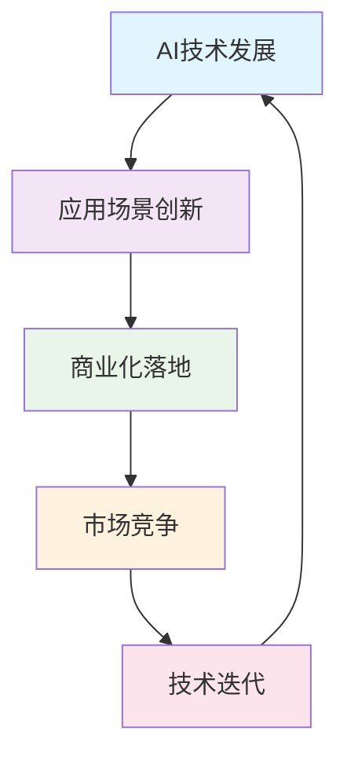

# 2025年10月24日-财报扭亏与AI应用竞争的技术新格局

## 📋 摘要
英特尔财报扭亏为盈，字节跳动推出游戏平台，快手强调AI应用竞争，中国邮政构建全球最大无人货运网络，阿里巴巴推出AI眼镜，科技行业迎来新一轮发展机遇。

## 🔥 核心热点

### 💰 英特尔财报扭亏为盈
**事件概述**：英特尔公司公布2025年第三季度财报，营收137亿美元，同比增长3%，成功实现扭亏为盈。

**技术影响**：
- **芯片制造**：标志着英特尔在先进制程技术上的突破
- **AI芯片**：为人工智能计算提供更强硬件支撑
- **行业信心**：提振整个半导体行业的投资信心

**生活化比喻**：就像一家曾经亏损的工厂，通过技术升级和效率提升，重新实现盈利，为整个制造业注入信心。

### 🎮 字节跳动推出游戏发行平台
**事件概述**：字节跳动计划在海外推出类似Steam的游戏发行平台GameTop，已开启运营招聘。

**技术影响**：
- **游戏生态**：挑战Steam在PC游戏发行领域的垄断地位
- **云游戏**：结合字节跳动的技术优势，可能推动云游戏发展
- **AI游戏**：利用AI技术提升游戏体验和内容生成

**生活化比喻**：就像在购物中心开了一家新的游戏商店，不仅卖游戏，还可能用AI技术让游戏更好玩。

### 🤖 快手强调AI应用竞争
**事件概述**：在快手1024程序员节上，创始人程一笑表示，未来科技行业竞争的关键在于AI技术与具体应用场景的深度结合。

**技术影响**：
- **应用场景**：AI技术必须与实际业务场景深度融合
- **竞争策略**：从技术领先转向应用创新
- **行业趋势**：AI应用化成为新的竞争焦点

**生活化比喻**：就像有了最好的工具，但关键是要知道在什么场合使用，如何让工具发挥最大价值。

### 🚚 中国邮政构建全球最大无人货运网络
**事件概述**：中国邮政集中采购7000台九识智能无人车，构建全球最大规模的无人货运网络。

**技术影响**：
- **物流自动化**：推动传统物流向智能化转型
- **无人驾驶**：在特定场景下的大规模商业化应用
- **成本优化**：降低人力成本，提升配送效率

**生活化比喻**：就像把7000个不会累的快递员派到全国各地，24小时不间断工作，让包裹更快到达。

### 👓 阿里巴巴推出AI眼镜
**事件概述**：阿里巴巴宣布推出夸克AI眼镜，集成多模态交互技术，支持实时语音翻译、场景识别等功能。

**技术影响**：
- **可穿戴设备**：AI技术在可穿戴设备上的创新应用
- **多模态交互**：语音、视觉、触觉的融合交互体验
- **商业化进程**：推动AI技术从实验室走向市场

**生活化比喻**：就像给眼镜装上了智能大脑，不仅能看，还能听懂、翻译、识别，让生活更智能。

## 📊 技术趋势分析

### 🎯 AI应用化竞争加剧

**趋势特点**：
- **从技术驱动到应用驱动**：AI技术成熟度提升，应用创新成为关键
- **场景化竞争**：不同公司在特定场景下的AI应用竞争
- **商业化加速**：AI技术快速从实验室走向市场

### 🏭 传统行业智能化转型
**转型特点**：
- **物流行业**：无人化、智能化成为发展方向
- **制造业**：通过技术升级实现效率提升
- **服务业**：AI技术提升用户体验

## 🔍 行业影响分析

### 📈 投资机会
| 领域 | 投资机会 | 风险等级 | 建议关注 |
|------|----------|----------|----------|
| AI应用 | 场景化AI解决方案 | 中等 | ⭐⭐⭐ |
| 无人驾驶 | 物流配送应用 | 高 | ⭐⭐⭐⭐ |
| 游戏平台 | 新兴发行平台 | 中等 | ⭐⭐ |
| 可穿戴设备 | AI眼镜等产品 | 高 | ⭐⭐⭐ |

### 🎯 技术发展方向
1. **AI应用场景化**：从通用AI向特定场景AI发展
2. **无人化技术**：在物流、配送等领域的规模化应用
3. **多模态交互**：语音、视觉、触觉的融合交互
4. **云游戏技术**：游戏发行和体验的技术创新

## 💡 学习建议

### 🔥 高优先级（必须掌握）
- **AI应用开发**：学习如何将AI技术应用到具体场景
- **多模态交互**：掌握语音、视觉、文本的综合处理技术

### ⭐ 中优先级（建议掌握）
- **无人驾驶技术**：了解自动驾驶在特定场景的应用
- **游戏平台开发**：学习游戏发行和云游戏技术

### 💡 低优先级（可选掌握）
- **财报分析**：了解科技公司的财务表现和技术投资关系
- **行业趋势分析**：掌握IT行业发展趋势的分析方法

## 🚀 未来展望

### 📅 短期趋势（1-2年）
- AI应用将更加场景化和专业化
- 无人驾驶在物流领域将实现规模化应用
- 游戏平台竞争将更加激烈

### 📅 中期趋势（3-5年）
- 多模态AI交互将成为主流
- 传统行业智能化转型将加速
- AI技术将深度融入日常生活

### 📅 长期趋势（5年以上）
- AI技术将实现真正的通用化
- 人机交互将更加自然和智能
- 科技行业将重新定义竞争规则

## 🎯 总结

2025年10月24日的IT热点展现了科技行业的新格局：**从技术突破转向应用创新**。英特尔财报扭亏为盈标志着芯片技术的成熟，字节跳动和快手的布局体现了AI应用化竞争的重要性，中国邮政和阿里巴巴的创新则展示了传统行业智能化转型的巨大潜力。

**关键启示**：
- **应用为王**：AI技术的价值在于实际应用场景的深度结合
- **场景创新**：不同行业需要找到适合自己的AI应用场景
- **技术融合**：多模态交互将成为未来技术发展的重要方向

**给开发者的建议**：
- 关注AI技术在具体场景中的应用机会
- 学习多模态交互技术的开发方法
- 了解传统行业智能化转型的技术需求

**加油，未来的AI应用专家！** 在这个AI应用化的时代，掌握场景化AI技术将成为你的核心竞争力！

---

**厦门工学院人工智能创作坊 -- 郑恩赐**  
**2025年10月25日**
