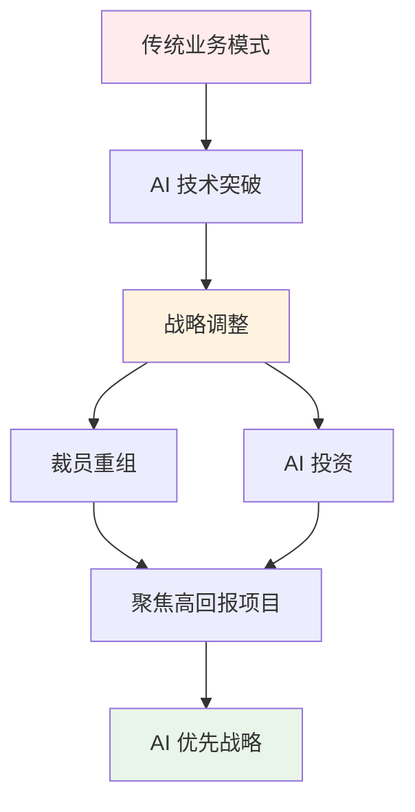

# 2025 年 10 月 25 日 - AI 战略转型与网络安全挑战的科技新格局

## 📋 摘要
2025 年 10 月 25 日 IT 热点：英特尔裁员 3.5 万人聚焦 AI、字节跳动推出 GameTop 游戏平台、JetBrains 转向 AI 优先开发、无印良品遭遇黑客攻击，揭秘科技巨头战略调整与安全挑战！

---

## 🔥 热点事件概览

### 1. 英特尔两年裁员 3.5 万人，聚焦 AI 战略转型

#### 📰 事件概述
新任 CEO 陈立武上任后，英特尔裁减了超过 2 万个岗位，重组成本超过 10 亿美元，主要集中在工程与技术部门。公司计划聚焦高回报项目，控制资本支出。

#### 💡 生活化比喻
就像一家大工厂，发现某些生产线不赚钱，决定关闭这些生产线，把资源集中到最赚钱的产品上（AI 芯片），虽然要裁掉一些员工，但这样公司才能活下去。

#### 🔧 技术影响
- **芯片制造**：聚焦 AI 芯片和高性能计算，放弃低利润产品线
- **人才流动**：大量工程师和技术人员进入市场，可能加入竞争对手或创业
- **行业竞争**：英特尔面临 AMD、NVIDIA 等竞争对手的压力，必须转型求生
- **技术投资**：减少传统 CPU 投资，增加 AI 加速器和数据中心芯片研发

---

### 2. 字节跳动计划推出游戏发行平台 GameTop

#### 📰 事件概述
字节跳动计划在海外推出类似 Steam 的游戏发行平台 GameTop，提供多样化游戏内容和社交空间。此举是其游戏业务战略调整的一部分，整合了沐瞳科技、朝夕光年等资源，强调精细化运营和 AI 技术融合。

#### 💡 生活化比喻
就像开了一家游戏商店，不仅卖游戏，还提供玩家交流的空间（类似网吧+游戏店），用 AI 技术推荐游戏，让玩家更容易找到喜欢的游戏。

#### 🔧 技术影响
- **游戏生态**：挑战 Steam 的垄断地位，为开发者提供新的发行渠道
- **AI 应用**：利用 AI 技术进行游戏推荐、内容审核、玩家匹配
- **社交网络**：整合字节跳动的社交基因，打造游戏社交生态
- **全球化战略**：海外市场布局，与国际游戏平台竞争

---

### 3. JetBrains 宣布明年关停云端开发环境平台 CodeCanvas

#### 📰 事件概述
JetBrains 宣布停止 CodeCanvas 云端开发环境的开发与运营，现有服务将持续至 2026 年 3 月 31 日。团队表示将转向构建 AI 优先的新平台，引入自主 AI 代理人设计。

#### 💡 生活化比喻
就像一家餐厅，发现云端厨房（CodeCanvas）不赚钱，决定关闭，转而开发 AI 厨师（AI 代理人），让 AI 帮你做菜（写代码），这样更高效。

#### 🔧 技术影响
- **开发工具**：从云端 IDE 转向 AI 辅助编程，反映行业趋势
- **AI 代理人**：自主 AI 代理人将成为开发者的智能助手
- **竞争格局**：与 GitHub Copilot、Cursor 等 AI 编程工具竞争
- **技术演进**：云端开发环境让位于 AI 优先的开发模式

---

### 4. 无印良品因物流合作方遭遇黑客攻击关闭日本官方网店

#### 📰 事件概述
无印良品的物流配送合作方遭遇黑客勒索攻击，导致其在日本的官方网店关闭，官方应用程序的多项功能也受到影响，暂时无法浏览购物、查看历史订单等。

#### 💡 生活化比喻
就像一家商店，负责送货的快递公司被小偷盯上了（黑客攻击），快递公司的系统瘫痪了，商店只能暂时关门，等快递公司修好系统再开门营业。

#### 🔧 技术影响
- **供应链安全**：物流系统成为黑客攻击的重点目标
- **勒索软件**：勒索攻击日益猖獗，企业需加强防护
- **业务连续性**：第三方服务商的安全问题会影响主营业务
- **安全投资**：企业需要增加网络安全投资，保护供应链

---

## 📊 技术趋势分析

### AI 战略转型加速

**核心趋势**：
- **英特尔**：裁员 3.5 万人，聚焦 AI 芯片
- **JetBrains**：关停云端 IDE，转向 AI 代理人
- **字节跳动**：游戏平台融合 AI 推荐技术

### 网络安全挑战升级

| 安全威胁 | 影响范围 | 应对策略 | 投资建议 |
|---------|---------|---------|---------|
| 勒索软件攻击 | 供应链、物流系统 | 加强防护、数据备份 | 🔥 高优先级 |
| 第三方风险 | 合作伙伴系统 | 安全审计、应急预案 | ⭐ 中优先级 |
| 业务连续性 | 在线服务、电商平台 | 灾备系统、多云部署 | 🔥 高优先级 |

---

## 💼 给开发者的建议

### 🎯 高优先级（必须关注）
1. **AI 技术学习**：掌握 AI 编程工具（GitHub Copilot、Cursor 等）
2. **网络安全技能**：学习安全防护、漏洞检测、应急响应
3. **云原生开发**：掌握容器化、微服务、DevOps

### ⭐ 中优先级（建议关注）
1. **游戏开发**：关注游戏平台生态，了解游戏发行渠道
2. **供应链安全**：学习供应链安全管理、第三方风险评估
3. **AI 代理人开发**：研究自主 AI 代理人的设计与实现

### 💡 低优先级（可选关注）
1. **芯片设计**：了解 AI 芯片架构和设计原理
2. **游戏社交**：研究游戏社交网络的设计与运营
3. **云端 IDE**：关注云端开发环境的演进趋势

---

## 🔮 未来展望

### 短期（1-2 年）
- **AI 编程工具普及**：AI 代理人成为开发者标配
- **网络安全投资增加**：企业加大安全防护投资
- **游戏平台竞争加剧**：GameTop 与 Steam 展开竞争

### 中期（3-5 年）
- **AI 芯片市场爆发**：英特尔、NVIDIA、AMD 三足鼎立
- **供应链安全标准化**：建立统一的供应链安全标准
- **游戏社交生态成熟**：游戏平台成为社交网络的一部分

### 长期（5 年以上）
- **AI 优先开发模式**：传统编程让位于 AI 辅助编程
- **零信任安全架构**：企业全面采用零信任安全模型
- **元宇宙游戏平台**：游戏平台演进为元宇宙入口

---

## 📈 投资机会分析

| 领域 | 投资机会 | 风险等级 | 建议关注度 |
|------|---------|---------|-----------|
| AI 芯片 | 英特尔、NVIDIA、AMD | 中等 | 🔥 高 |
| 网络安全 | 安全防护、勒索软件防护 | 低 | 🔥 高 |
| 游戏平台 | GameTop、Steam、Epic | 高 | ⭐ 中 |
| AI 编程工具 | GitHub Copilot、Cursor | 中等 | 🔥 高 |
| 云原生技术 | 容器化、微服务、DevOps | 低 | ⭐ 中 |

---

## 🎓 学习建议

### 🔥 高优先级技能
1. **AI 编程**：学习使用 AI 编程工具，提升开发效率
2. **网络安全**：掌握安全防护技能，保护系统安全
3. **云原生**：学习容器化、微服务、DevOps

### ⭐ 中优先级技能
1. **游戏开发**：了解游戏开发流程，掌握游戏引擎
2. **供应链安全**：学习供应链安全管理，评估第三方风险
3. **AI 代理人**：研究自主 AI 代理人的设计与实现

### 💡 低优先级技能
1. **芯片设计**：了解 AI 芯片架构和设计原理
2. **游戏社交**：研究游戏社交网络的设计与运营
3. **云端 IDE**：关注云端开发环境的演进趋势

---

## 📝 总结

### 关键启示
1. **AI 战略转型不可逆**：科技巨头纷纷裁员重组，聚焦 AI 高回报项目
2. **网络安全挑战升级**：勒索软件攻击日益猖獗，供应链安全成为重点
3. **游戏平台竞争加剧**：字节跳动挑战 Steam，游戏生态面临洗牌
4. **AI 优先开发模式**：云端 IDE 让位于 AI 代理人，开发模式变革

### 给开发者的建议
- **拥抱 AI 技术**：学习 AI 编程工具，提升开发效率
- **重视安全技能**：掌握网络安全防护，保护系统安全
- **关注行业动态**：紧跟科技巨头战略调整，把握职业发展方向
- **持续学习成长**：技术迭代加速，保持学习热情

### 鼓励的话
科技行业正经历深刻变革，AI 战略转型和网络安全挑战并存。作为开发者，我们要拥抱变化，学习新技术，提升核心竞争力。无论是 AI 编程、网络安全，还是游戏开发，都是值得投入的方向。继续加油，未来的科技领袖就是你！🚀

---

**厦门工学院人工智能创作坊 -- 郑恩赐**  
**2025 年 10 月 26 日**

