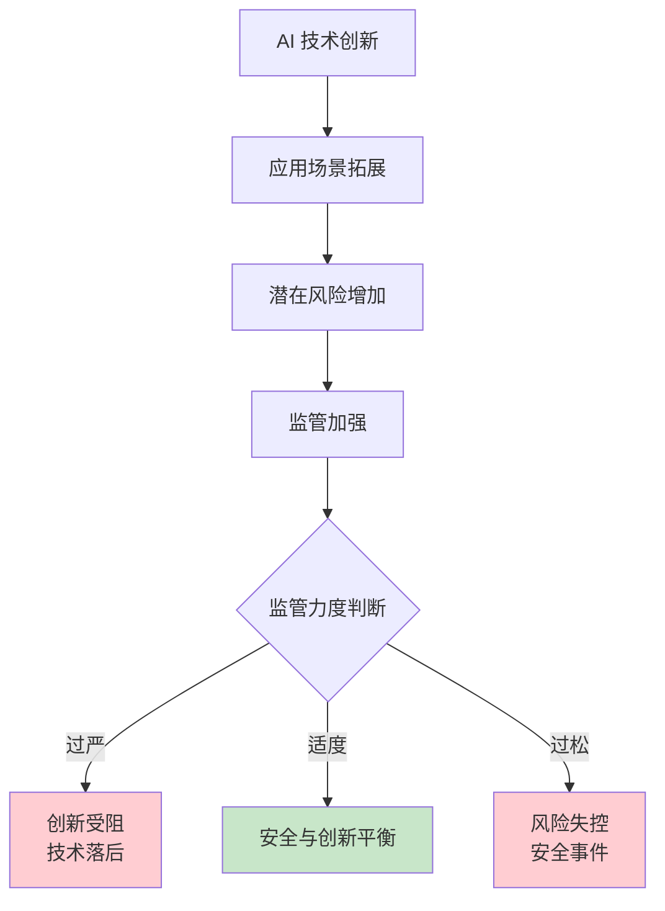
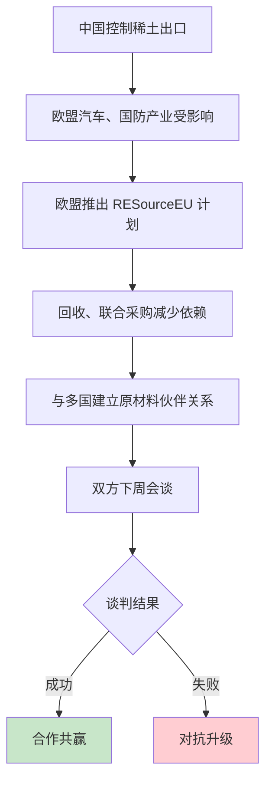

# 2025 年 10 月 26 日 - AI 安全争议与全球供应链科技博弈的行业风暴

## 📋 摘要

苹果 M5 芯片 AI 性能提升 4 倍，谷歌推 Vibe Coding 降低开发门槛。沪指创十年新高，算力芯片股领涨。Sora 创始人反对安全监管过严，欧盟警告稀土出口管制，中美经贸磋商推进。

## 🎯 核心热点速览

想象一下，AI 的世界就像一场**马拉松比赛**。跑步者（创新者）想要全力冲刺，但裁判（监管者）担心比赛太激烈会导致意外，于是设置各种安全规则。**Sora 的创始人正在向裁判大声疾呼**：规则太严格了，这样会让我们失去竞争力！

同时，在全球科技舞台上，各国就像**下围棋**一样，争夺着"稀土"这颗珍贵棋子。谁控制了稀土，谁就在 AI、芯片、新能源等领域拥有话语权。

### 三大核心热点

| 热点 | 核心内容 | 影响范围 |
|------|----------|----------|
| **AI 安全监管争议** | Sora 创始人公开反对过度安全监管 | AI 创新与安全平衡 |
| **稀土供应链博弈** | 欧盟对中国稀土出口管制发出警告 | 全球科技产业格局 |
| **国际战略论坛** | 北大举办多国专家参与的战略对话 | 政策制定参考 |

## 🔥 热点一：AI 安全监管争议 - 创新者的呐喊

### Sora 创始人的核心观点

**核心问题**：AI 安全监管是否过严，正在扼杀技术创新？

根据知乎专栏和相关报道，Sora（OpenAI 的视频生成 AI）创始人公开表示，当前的安全监管措施过于严格，可能**扼杀 AI 创新的活力**。

### 争议的核心逻辑

### 各方观点

| 立场 | 观点 | 理由 |
|------|------|------|
| **创新派** | 监管过严，扼杀创新 | 过度安全审查导致技术无法快速迭代 |
| **安全派** | 必须加强监管 | AI 风险不可控，需要严格管理 |
| **平衡派** | 寻找中间点 | 既保证安全，又促进创新 |

### 现实影响

- **技术发展**：过于严格的监管可能导致 AI 技术发展滞后
- **产业竞争**：影响国家在 AI 领域的全球竞争力
- **应用落地**：限制 AI 在多个领域的实际应用

## 🌍 热点二：稀土供应链博弈 - 科技的"石油战争"

### 欧盟的强硬立场

**关键事件**：欧盟委员会主席冯德莱恩在柏林全球对话会议上发出警告。

**核心内容**：
- 欧盟正寻求与中国就稀土出口管制问题达成解决方案
- **威胁**：如果谈判失败，将动用"所有可用工具"应对
- **数据支撑**：欧盟 **90% 以上的稀土磁铁依赖中国进口**

### 战略逻辑链条

### 稀土的重要性

想象**稀土就像汽车的心脏**，离了它，再好的技术也动不起来：

- **AI 领域**：芯片制造必需稀土元素
- **新能源**：电动汽车电池离不开稀土
- **国防军工**：先进武器系统依赖稀土材料
- **科技产业**：手机、电脑等电子产品需要稀土

### 全球响应

- **中国、印尼、沙特**：联手推进稀土产业合作
- **中国、巴西**：60 亿美元合作协议，巴西希望成为东盟完全成员国
- **国际战略论坛**：专家齐聚北大，探讨应对策略

## 🎓 热点三：北大国际战略论坛 - 智慧碰撞

### 论坛核心议题

**"北阁对话"年会**聚焦美国对外战略变化：

- **美印关系**：印度难以再信任特朗普政府
- **美俄关系**：特朗普对俄采取"胡萝卜加大棒"策略
- **大国博弈**：需要欧洲参与才能达成有效方案

### 专家观点

| 专家身份 | 核心观点 | 预期影响 |
|----------|----------|----------|
| 美前驻印大使 | 印度难再信任美国 | 国际关系格局变化 |
| 俄罗斯专家 | 特朗普对俄施压 | 双边关系复杂化 |
| 印度专家 | 关税问题有望妥协 | 经贸合作可能改善 |

## 📊 其他重要热点

### 1. 苹果发布 M5 芯片新品 - AI 性能提升 4 倍

**核心事件**：苹果发布搭载 M5 芯片的新款 MacBook Pro 和 iPad Pro。

**技术亮点**：
- **M5 芯片**：AI 性能较前代 M4 芯片提升 **4 倍**
- **定位**：面向开发者和内容创作者
- **意义**：推动本地 AI 计算能力发展，减少对云端计算的依赖

**开发者影响**：
- 本地 AI 模型训练速度大幅提升
- 支持更复杂的 AI 应用开发
- 降低 AI 开发硬件门槛

**适用水平**：所有开发者

### 2. 谷歌升级 AI Studio 平台 - Vibe Coding 功能

**核心更新**：谷歌推出"Vibe Coding"功能，降低 AI 代理开发门槛。

**技术特点**：
- **模块化组件**：简化 AI 代理开发流程
- **一键部署**：快速构建和部署 AI 应用
- **低门槛**：不需要深厚编程背景也能开发 AI 应用

**开发者影响**：
- AI 开发门槛大幅降低
- 非专业开发者也能参与 AI 应用开发
- AI 生态将更加繁荣

**适用水平**：小白、初级开发者

### 3. 中美经贸磋商在吉隆坡举行

**核心议题**：
- 海事物流合作
- 关税暂停协商
- 芬太尼合作
- 农产品贸易

**技术影响**：
- 缓解贸易摩擦，改善科技产品跨境流通
- 为中美科技合作创造更好环境
- 开发者能接触到更多先进技术

### 4. 沪指创十年新高 - 科技股表现亮眼

**市场表现**：
- **沪指突破年内高点**
- **算力、芯片等科技股表现突出**
- A 股市场放量上攻

**技术影响**：
- 市场对科技股信心增强
- 科技产业投资增加
- 为开发者创造更多就业机会

**适用水平**：所有开发者（投资参考）

### 5. 苹果 iPhone 18 或配备 12GB 内存

**核心配置**：
- **内存容量**：12GB
- **预期性能**：进一步提升

**技术意义**：
- 移动设备性能持续提升
- 支持更复杂的应用和 AI 模型
- 推动移动 AI 应用发展

**开发者影响**：
- 移动应用可以运行更复杂的算法
- 支持更大的 AI 模型本地运行
- 移动开发空间进一步拓展

### 6. 网络安全事件频发

- **美国北卡罗来纳州枪击事件**：大型聚会枪击，2 死 13 伤
- **瑞典耶夫勒市枪击事件**：多人受伤，仍在调查中

**技术影响**：凸显数字化社会安全管理的重要性，AI 辅助监控技术需求增长。

### 7. 自然灾害与技术监测

- **俄罗斯堪察加地区**：发生 6.3 级地震
- **技术应用**：地震监测系统及时预警，彰显科技防灾能力

## 🎯 对开发者的启示

### 技术发展趋势

| 技术领域 | 发展方向 | 开发者机会 |
|----------|----------|------------|
| **AI 安全** | 监管与创新平衡 | 开发安全合规的 AI 应用 |
| **供应链技术** | 减少依赖，本土化 | 参与稀土替代技术研发 |
| **国际协作** | 多国合作项目 | 跨境技术交流与开发 |

### 学习建议

#### 小白（零基础）
1. **关注 AI 安全**：了解 AI 安全的基本概念和监管要求
2. **学习供应链管理**：了解科技产业的供应链逻辑
3. **追踪国际动态**：关注全球科技政策变化

#### 初级开发者
1. **AI 合规开发**：学习如何开发符合安全标准的 AI 应用
2. **开源项目参与**：加入供应链管理相关的开源项目
3. **国际协作**：参与跨国技术交流和合作

#### 中级开发者
1. **安全框架研究**：深入研究 AI 安全框架和标准
2. **替代技术探索**：研发稀土替代材料和技术
3. **战略思维**：培养对全球科技趋势的分析能力

#### 高级开发者
1. **政策制定参与**：参与 AI 安全监管政策制定
2. **核心技术突破**：在关键领域实现技术突破
3. **国际合作**：推动国际技术标准制定

## 🔮 未来发展趋势预测

### 短期（1 年内）

- **AI 监管框架**：各国将出台更细化的 AI 监管政策
- **供应链重构**：减少对特定国家或地区的依赖
- **国际合作**：多国联合研发核心技术

### 中期（3-5 年）

- **技术创新**：在监管框架内实现重大技术突破
- **产业重塑**：全球科技产业链重新布局
- **标准统一**：形成国际通行的技术标准和规范

### 长期（5-10 年）

- **AI 自主可控**：各国拥有相对独立的 AI 技术体系
- **可持续发展**：建立可持续的技术创新生态系统
- **全球治理**：形成有效的全球科技治理机制

## 📝 总结

2025 年 10 月 26 日，科技界见证了**创新与监管的激烈碰撞**。Sora 创始人代表创新者发出呼声，欧盟为供应链安全发出强硬警告，国际战略专家深入探讨应对之道。这些热点不仅是当天的新闻，更是**未来科技发展走向的重要信号**。

**记住**：作为开发者，不仅要关注技术本身，更要理解技术背后的政策环境、国际格局和产业逻辑。在全球化的今天，技术的发展从来不是孤立的技术问题，而是**政策、市场、国际关系等多重因素交织的复杂系统**。

加油，在风云变幻的科技世界中，保持敏锐的洞察力和持续的学习能力！ 🚀

---

**参考来源**：

1. **苹果 M5 芯片和谷歌 AI Studio 升级**：
   - [讯飞 AI 开发者社区 - 苹果发布 M5 芯片](https://xfyun.csdn.net)
   - [谷歌 AI Studio 平台升级](https://ai.google.dev/)

2. **中美经贸磋商**：
   - [新浪新闻 - 中美经贸磋商在吉隆坡举行](https://news.sina.com.cn/zx/ds/2025-10-26/doc-infvfitq0787632.shtml)

3. **A 股科技股市场表现**：
   - [新浪财经 - 沪指创十年新高](https://finance.sina.com.cn/headline/2025-10-26/doc-infvehfu6613556.shtml)

4. **苹果 iPhone 18 配置消息**：
   - [新浪财经 - 苹果 iPhone 18 或配备 12GB 内存](https://finance.sina.cn/stock/jdts/2025-10-26/detail-infvenpy1201554.d.html)

5. **AI 安全监管争议**：
   - [知乎专栏 - AI 安全监管争议](https://zhuanlan.zhihu.com/p/663392308)

6. **国际资讯热点**：
   - [新浪新闻 - 国际资讯 AI 速递](https://news.sina.cn/2025-10-26/detail-infvehfx6659677.d.html)

**厦门工学院人工智能创作坊 -- 郑恩赐**  
**2025 年 10 月 27 日**

