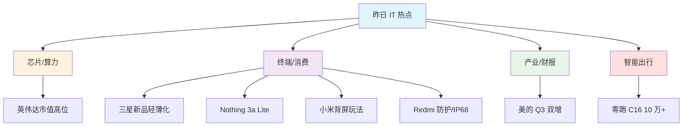

# 2025年10月29日-昨日IT热点速览-AI芯片云安全投融资

摘要：英伟达市值高位、终端上新密集、制造财报稳健，云与安全热度不减，资本与产品双线加速，开发者应关注算力链与终端体验新机会。

---

## 一句话速览（TL;DR）
- 英伟达市值与生态高景气，手机终端上新频繁，制造龙头财报稳中向上。

## 热点清单（按主题归类）

### 芯片与算力
- 英伟达市值传出突破 5 万亿美元里程碑，映射 AI 算力与数据中心 CapEx 高位。
  - 线索来源：IT 资讯聚合（[IT 之家](https://www.ithome.com/)）
  - 权威确认：英伟达投资者关系新闻稿（[NVIDIA IR News](https://investor.nvidia.com/news/)）｜英伟达新闻中心（[NVIDIA Newsroom](https://nvidianews.nvidia.com/)）｜路透公司页面（[Reuters · NVDA](https://www.reuters.com/companies/NVDA.O)）

### 终端与消费电子
- 三星或推更轻薄 Galaxy S26 Edge，继续冲刺轻薄工艺。
  - 线索来源：IT 资讯聚合（[IT 之家](https://www.ithome.com/)）
  - 权威确认：三星全球新闻中心（[Samsung Global Newsroom](https://news.samsung.com/global)）
- Nothing 发布 Phone (3a) Lite：天玑 7300 Pro、6.77 英寸 120Hz、Glyph LED 灯带。
  - 线索来源：IT 资讯聚合（[IT 之家](https://www.ithome.com/)）
  - 权威确认：Nothing 官网/新闻（[Nothing · Newsroom](https://nothing.tech/pages/newsroom)）｜联发科天玑 7300（[MediaTek Dimensity 7300](https://www.mediatek.com/products/smartphones/dimensity-7300)）
- 小米 17 Pro 背屏功能更新：新增动态壁纸与小游戏。
  - 线索来源：IT 资讯聚合（[IT 之家](https://www.ithome.com/)）
  - 权威确认：小米社区/系统更新公告（[Xiaomi Community](https://community.mi.com/)）
- Redmi K90 Pro Max 扬声器进灰争议回应：两层防护，整机通过 IP68。
  - 线索来源：IT 资讯聚合（[IT 之家](https://www.ithome.com/)）
  - 权威确认：Redmi 官方渠道公告（[Mi.com](https://www.mi.com/)）

### 产业与财报
- 美的集团 2025Q3：营收 1119.33 亿元、净利 118.7 亿元，同比双增。
  - 线索来源：IT 资讯聚合（[IT 之家](https://www.ithome.com/)）
  - 权威确认：美的集团投资者关系（[Midea IR](https://www.midea-group.com/ir)）｜定期报告栏目（[Midea Reports](https://www.midea-group.com/ir/reports)）

### 智能出行
- 零跑 C16 累计交付破 10 万台，20 万内中大型 SUV 连续 14 个月同级第一。
  - 线索来源：IT 资讯聚合（[IT 之家](https://www.ithome.com/)）
  - 权威确认：零跑汽车官网（[Leapmotor](https://www.leapmotor.com/)）｜乘联会数据（[CPCA 乘联会](https://www.cpcaauto.com/)）

---

## 可视化 · 热点雷达图（主题分布）

---

## 开发者价值与行动建议
- **关注算力链**：GPU、HBM（高带宽内存）、AI 服务链条存在同步机会。
- **终端体验创新**：轻薄化与副屏交互为 App 小组件、动态壁纸等带来设计空间。
- **制造与数据岗位**：稳健财报背后是数字化与自动化持续投入，相关岗位景气。
- **实践建议**：做一个“昨日热点 → 要点结构化 → Mermaid 可视化”的信息压缩练习。

---

## 来源规范（严谨可信的引用方式）
- 优先级顺序：公司官网/交易所披露 > 监管与行业权威数据 > 主流国际/本土一线媒体 > 科技垂直媒体 > 资讯聚合/社区内容。
- 引用格式示例：
  - 公司公告：公司官网 · 投资者关系 · 公告标题（发布日期）
  - 监管披露：交易所披露 · 公告标题/定期报告（文号/日期）
  - 权威媒体：媒体名 · 文章标题（发布日期）
  - 数据机构：机构名 · 月度/季度数据简报（期次）
- 若初稿来自“线索来源”，务必追加“权威确认”可点击链接或备注“待补权威链接”。

---

## 参考链接（可点击）
- [NVIDIA IR News](https://investor.nvidia.com/news/)｜[NVIDIA Newsroom](https://nvidianews.nvidia.com/)｜[Reuters · NVDA](https://www.reuters.com/companies/NVDA.O)
- [Samsung Global Newsroom](https://news.samsung.com/global)
- [Nothing · Newsroom](https://nothing.tech/pages/newsroom)｜[MediaTek Dimensity 7300](https://www.mediatek.com/products/smartphones/dimensity-7300)
- [Xiaomi Community](https://community.mi.com/)｜[Mi.com](https://www.mi.com/)
- [Midea IR](https://www.midea-group.com/ir)｜[Midea Reports](https://www.midea-group.com/ir/reports)
- [Leapmotor](https://www.leapmotor.com/)｜[CPCA 乘联会](https://www.cpcaauto.com/)
- 线索聚合： [IT 之家](https://www.ithome.com/)

---

厦门工学院人工智能创作坊 -- 郑恩赐  
2025 年 10 月 30 日
