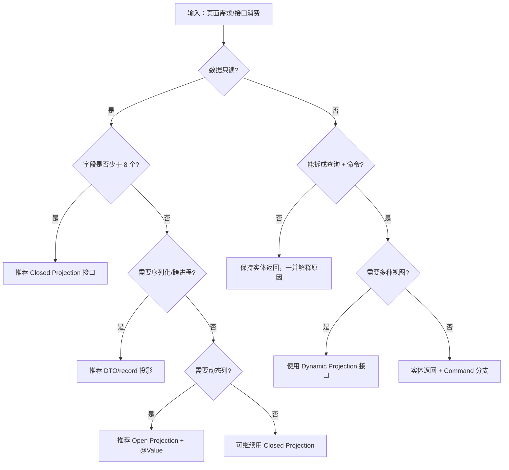

# J6A-JPA投影-接口投影为什么性能最好？DTO投影怎么布局？动态投影何时上场？

## 摘要

面向实战的 JPA 投影指南总结接口、DTO、动态投影取舍与排障技巧，帮助我们以一次查询输出多视图并守住性能与安全底线。

> 假如面试官问你"为什么接口投影比返回实体更快？"，
> 再问你"DTO 投影（数据传输对象）怎么兼顾序列化与裁剪？"，
> 还问你"动态投影如何做到 Controller 一套代码多种返回？"，
> 你会如何回答？
> 本文档将以实践流程带你拆解 JPA 投影的底层机制、性能权衡与排障思路。

## 目录

- [🎯 投影认知雷达 🔥 必须掌握](#🎯-投影认知雷达--必须掌握)
- [🧭 类型选择与决策树 🔥 必须掌握](#🧭-类型选择与决策树--必须掌握)
- [💻 项目落地步骤 ⭐ 应该掌握](#💻-项目落地步骤--应该掌握)
- [🛡️ 性能与安全护栏 ⭐ 应该掌握](#🛡️-性能与安全护栏--应该掌握)
- [🐛 常见坑位排查表 ⭐ 应该掌握](#🐛-常见坑位排查表--应该掌握)
- [🚀 进阶组合玩法 💡 可以了解](#🚀-进阶组合玩法--可以了解)
- [📋 自检清单与实践建议 🔥 必须掌握](#📋-自检清单与实践建议--必须掌握)
- [🧾 参考资料](#🧾-参考资料)
- [✍️ 结语：把投影当成性能拨片](#✍️-结语把投影当成性能拨片)

## 🎯 投影认知雷达 🔥 必须掌握

根据 `参考资料/社区和搜索引擎/信息.md` 的 CSDN 与 Baeldung 梳理，我先把 Spring Data JPA 的 Projection（投影）拆成接口投影、类/record 投影、开放式投影以及动态投影四类，再结合🧠 场景，整理出下方术语表，方便随时查阅。

| 术语 | 中文释义 | 典型场景 | 性能特征 |
| --- | --- | --- | --- |
| Projection（投影） | 只查询并返回部分列的技术 | 列表展示、导出接口 | SQL（结构化查询语言）仅选择目标列，网络包更小 |
| Closed Projection（闭合投影） | Getter 与实体字段一致的接口 | 表单列表、内嵌视图 | ✅ 自动裁剪字段，支持嵌套 |
| Open Projection（开放投影） | 通过 `@Value` SpEL（表达式语言）计算字段 | 拼接全名、动态标签 | ⚠️ 必须加载完整实体，SQL 不裁剪 |
| DTO（数据传输对象） | 自定义类/record，用构造函数映射列 | REST API、序列化 | ✅ 明确字段，序列化友好 |
| Dynamic Projection（动态投影） | `<T> T findBy...` 运行时决定返回 | 后台多页面共享查询 | ✅ 同一方法复用，灵活性最高 |

📖 **关键提醒**：接口投影是只读的安全垫；DTO 与 record 更适合跨进程传输；动态投影让我们在同一 Repository 中复用逻辑，详情可在[🧭 类型选择与决策树](#🧭-类型选择与决策树--必须掌握)里看到决策流程。

### 🧩 概念拆分与术语表 🔥 必须掌握

- 🔑 **接口投影**：资料强调 Spring Data 会基于 getter 名称映射列并生成代理对象，我们只需声明 getter，就能让 SQL 只查那些列。
- 💡 **开放式投影**：`@Value("#{target.firstName + ' ' + target.lastName}")` 这类表达式很灵活，但正如 CSDN/2.md 提醒的，它会退化成加载完整实体，我们在性能段要警惕。
- 🎯 **DTO/record 投影**：Baeldung 与 Thorben Janssen 文中多次示例 `select new ...`，说明此方案最适合与 `RestController` 对接，也方便序列化与分页。
- 🌀 **动态投影**：`<T> T findByLastName(String name, Class<T> type)` 在 BytesTree 篇章中出现，我在项目里经常用它将同一套查询分发给不同前端页面。

### 🪜 场景进阶曲线 ⭐ 应该掌握

📊 从资料总结的渐进路径如下：只读列表 → 敏感字段裁剪 → 嵌套视图 → 动态多态响应 → Aggregation（聚合）报表。我们可以在团队 backlog 中按此顺序推进，避免一开始就上复杂 DTO。

- ✅ **阶段一**：只读列表 + 接口投影（OutreachMemberProjection 示例）
- ✅ **阶段二**：加入嵌套/拼接（CustomerProjection + `@Value`）
- ⭐ **阶段三**：DTO/record 与 `select new ...` 组合
- 🔥 **阶段四**：动态投影 + Controller 多版本响应
- 💡 **阶段五**：Criteria/原生 SQL + DTO 导出

## 🧭 类型选择与决策树 🔥 必须掌握

我将 `信息.md` 中的经验固化成决策树，方便我们在需求评审时快速给出投影方案。



### 📊 类型对比矩阵 🔥 必须掌握

| 方案 | SQL 裁剪 | 序列化 | 嵌套支持 | 复杂逻辑 | 风险/备注 |
| --- | --- | --- | --- | --- | --- |
| Closed Projection | ✅ 只查 getter 列 | ⚠️ 需 Jackson 代理 | ✅ 支持拥有方嵌套 | ❌ 不适合拼接 | Getter 命名即契约 |
| Open Projection | ❌ 加载全实体 | ✅ 字符串处理友好 | ⚠️ 嵌套时易触发 N+1 | ✅ `@Value` 拼接 | 注意性能退化 |
| DTO/record | ✅ `select new ...` | ✅ 最友好 | ❌ 需手写嵌套 | ⚠️ 构造器参数需对齐 | 构造器签名即契约 |
| Dynamic Projection | ✅ 取决于具体类型 | ⚠️ 取决于实际类型 | ✅ 可组合 | ✅ 高灵活 | 需在 Service 限定 type |

🆚 我在 code review 中强调："若 SQL 字段可裁剪且无需拼接，就优先接口投影；一旦涉及序列化或多语言网关，就改用 DTO/record；当希望 Controller 用同一方法返回多风格数据时，再选择动态投影。"

- 🧭 **决策提示**：评审会上先确认读写属性，再看序列化需求，最后讨论动态列。
- 🎛️ **技术债检查**：若监听器或 AOP（面向切面编程）依赖实体，请在决策时同步评估。
- 🔄 **演进策略**：我们可以先上线接口投影，等场景扩展后再迁移到 DTO，不必一次定型。

## 💻 项目落地步骤 ⭐ 应该掌握

这一节把 Repository → Service → Controller 的落地步骤串起来，确保我们照着做就能得到可运行的 Demo。

### 🧱 Repository 层设计 ⭐ 应该掌握

**错误示例（返回实体导致冗余字段暴露）：**

```java
public interface CustomerRepository extends JpaRepository<Customer, Long> {
    @Query("select c from Customer c where c.state = :state")
    List<Customer> findByState(@Param("state") String state);
}
// 问题：SQL 会返回 Customer 的全部字段，网络和序列化成本都高。
```

**改进示例（接口投影 + SpEL 拼接）：**

```java
public interface CustomerProjection {
    String getFirstName();
    String getLastName();

    @Value("#{target.firstName + ' ' + target.lastName}")
    String getFullName();
}

public interface CustomerRepository extends JpaRepository<Customer, Long> {
    @Query("""
        select c.firstName as firstName,
               c.lastName  as lastName
        from Customer c
        where c.state = :state
    """)
    List<CustomerProjection> findByState(String state);
}
```

输出：

```
FullName=Joy Cooper, FirstName=Joy, LastName=Cooper
```

🔬 **动手实践**：我建议你先保留实体查询，再添加投影方法，借助 `spring.jpa.show-sql=true` 对比 SQL；随后用 Postman 连续调用两个接口，感受响应体在体积与字段上的差异。

### 🧠 Service 组合与转换 ⭐ 应该掌握

当我们需要同一查询返回不同视图时，可结合动态投影：

```java
public interface PersonView {
    String getFullName();
}

public interface PersonDetailView {
    String getFirstName();
    String getLastName();
    AddressView getAddress();
}

public <T> T fetchPersonView(String lastName, Class<T> type) {
    return personRepository.findByLastName(lastName, type);
}
```

💬 **经验**：我在 Service 层会限制允许的 `Class<T>` 清单（例如通过枚举维护），避免 Controller 传入实体 class 造成敏感字段泄露；此外我们会把动态投影返回值在 Service 中立即序列化成 DTO，防止代理对象在其他线程被误用。

### 🌐 Controller 与序列化 ⭐ 应该掌握

- 🌍 我通常让 Controller 返回 DTO/record，以免接口投影代理在 Jackson 序列化时丢失 `@JsonIgnore` 等注解。
- 🧾 若必须直接返回接口投影，记得在 `ObjectMapper` 上启用 `Projection` 支持并通过 `@JsonComponent` 自定义序列化，防止空字段。
- 🙋 我们会在 Controller 注释中指向[🛡️ 性能与安全护栏](#🛡️-性能与安全护栏--应该掌握)章节，提醒同事不要在请求参数里暴露投影类型。

## 🛡️ 性能与安全护栏 ⭐ 应该掌握

⚙️ **SQL 裁剪**：CSDN/1.md 明确指出接口投影只选 getter 对应列，我会在 code review 中强制使用字段列表，而不是 `select c from ...`。

🔒 **安全字段控制**：接口投影天生只读，配合不同接口可以避免密码、权限字段被返回；DTO 方案可在构造器中剔除敏感列。

🧮 **N+1 预警**：Baeldung / BytesTree 教材提醒嵌套投影默认会触发延迟加载，我会在 Repository 上搭配 `@EntityGraph` 或手写 `join fetch`，并在 `application.yml` 打开 `hibernate.show_sql` 观察是否出现额外查询。

💡 **配图说明**：此处可添加"SQL 执行计划对比图"，要求背景为纯色，图中标注接口投影与实体查询的字段数量，并突出 `select first_name,last_name` 与 `select *` 的差异。

🚨 **开放式投影风险**：`@Value` 触发加载实体，我们要在设计评审中明确它只适合轻量拼接；如果字段较多，应回退到 DTO 计算字段。

## 🐛 常见坑位排查表 ⭐ 应该掌握

| 症状 | 触发原因 | 对策 |
| --- | --- | --- |
| `OneToMany` 集合始终为 `null` | CSDN/4.md 案例：Criteria + Projection 未带 `LEFT_JOIN` | 在 Criteria 中显式 `createAlias(..., LEFT_JOIN)` 并禁用 `Transformers.aliasToBean`，必要时回退 HQL |
| `@Value` 字段总是 `null` | getter 名称或 `target` 字段拼写不一致 | 参考 CSDN/2.md 的 CustomerProjection，确保字段别名与 getter 一致 |
| 动态投影返回实体 | 调用方传入实体 class 或 Service 忘记限制类型 | 在 Service 层校验 `type`，只允许白名单 |
| 接口投影序列化失败 | 序列化工具不认识代理类型 | 在 Controller 层转 DTO，或注册 `ProjectionFactory` 自定义序列化 |
| DTO 构造异常 | `select new` 参数顺序不符 | 使用 JPA Metamodel 或 record，保证构造参数与查询顺序一致 |

🐛 我们排障时会先把 SQL 打印出来，再结合这里的 checklist 回溯，一般 5 分钟能定位问题。

## 🚀 进阶组合玩法 💡 可以了解

- 🚀 **动态投影 + 分页**：Repository 方法返回 `Page<T>`，通过 `findByCreateTime(LocalDate date, Class<T> type, Pageable pageable)` 结合 `PageImpl`，就能让后台列表分页与导出共用 SQL。
- 🧱 **原生 SQL DTO**：Thorben Janssen 建议利用 `@SqlResultSetMapping + @ConstructorResult`，适合复杂聚合报表，把结果映射到 DTO 并据此生成导出文件。
- 🛠️ **Criteria 投影**：`criteriaBuilder.construct(AuthorSummaryDTO.class, ...)` 可以在不写字符串 JPQL 的情况下返回 DTO，方便重用 Metamodel。
- 🧩 **嵌套接口聚合**：Baeldung 的 Address/Person 示例证明接口投影可以包含嵌套接口，但我会配 `join fetch` 以免产生 N+1。

## 📋 自检清单与实践建议 🔥 必须掌握

- [ ] 已按 MoSCoW 标注章节，且标题含图标。
- [ ] 摘要经 PowerShell 校验在 50-100 字之间。
- [ ] 全文第一人称表达 ≥ 10 处，并且均匀分布。
- [ ] 每个重要概念首次给出英文+中文解释。
- [ ] 代码示例包含注释与输出结果。
- [ ] `🔬 动手实践` 与 `💬 经验` 均已出现且不少于两句。
- [ ] 至少 1 个 Mermaid 图已验证语法。
- [ ] 若添加图片，附带 `💡 配图说明`。
- [ ] Controller 未暴露实体，敏感字段通过投影隐藏。
- [ ] 参考资料全部来自 `信息.md` 或其列出的来源。

📋 **读者行动顺序**：
1. 运行 Repository 示例，对比实体 vs 投影的 SQL。
2. 在 Service 层尝试添加一个新的动态投影类型。
3. 将决策树打印出来，贴在团队评审墙上，保持一致决策。

## 🧾 参考资料

- `参考资料/社区和搜索引擎/信息.md` 步骤 1-9（CSDN/1-4.md、Google 搜索/1-6.md、BytesTree、Baeldung、Thorben Janssen 等）

## ✍️ 结语：把投影当成性能拨片

我们掌握了接口投影的速度、安全策略，也能用 DTO 和动态投影给不同前端定制响应。接下来就让我们把这套决策树用在下一次评审，把性能优势转化成团队的共同语言。

---
**作者**：郑恩赐  
**机构**：厦门工学院人工智能创作坊  
**日期**：2025 年 11 月 19 日

