# J0A-JPA持久化技术专栏链接目录

Java持久化API（JPA）技术专栏文档链接目录与学习路线

## 📋 专栏概述

Java持久化API（JPA）是Java EE规范中用于对象关系映射（ORM）的标准接口，现已成为Jakarta Persistence API。本专栏基于最新技术趋势，涵盖JPA核心概念、实体建模、Repository设计、事务管理、性能优化以及SpringBoot集成等关键技术，帮助开发者从入门到精通掌握企业级JPA持久化技术。

> 📌 **文档更新说明**：本文档会不定期更新，随着新文档的发布，将及时在下方链接目录中添加对应的在线文档链接。

### 🔄 **学习路线修正说明**
基于联网搜索结果，对原学习路线进行了以下优化：
1. **优化阶段划分** - 从3个阶段调整为4个阶段，逻辑更清晰
2. **补充关键内容** - 增加Repository接口、EntityManager、SpringBoot集成等核心内容
3. **调整学习顺序** - 按照"基础→查询→事务→高级"的合理顺序

## 🗺️ JPA技术学习路线图

```mermaid
graph TD
    Start["JPA持久化技术学习路线图"]
    
    J1["第一阶段：JPA基础概念"]
    J1A["JPA核心概念与架构<br/>(J0A)"]
    J1B["实体类建模与注解<br/>(J5B-J5E)"]
    J1C["JPA配置与数据源<br/>(J1F)"]
    J1D["EntityManager基础<br/>(J1G)"]
    
    J2["第二阶段：查询与Repository"]
    J2A["Repository接口设计<br/>(J2A)"]
    J2B["查询方法详解<br/>(J2B)"]
    J2C["JPA投影技术<br/>(J6A)"]
    J2D["SQL语句使用指南<br/>(J6B)"]
    J2E["数据库连接配置<br/>(J6C)"]
    
    J3["第三阶段：事务管理"]
    J3A["ACID事务原理<br/>(J6D)"]
    J3B["事务管理配置<br/>(J3B)"]
    J3C["事务隔离级别<br/>(J3C)"]
    
    J4["第四阶段：高级特性"]
    J4A["缓存机制优化<br/>(J4A)"]
    J4B["性能优化策略<br/>(J4B)"]
    J4C["审计功能实现<br/>(J4C)"]
    J4D["SpringBoot集成<br/>(J4D)"]
    
    Links["专栏文档链接目录"]
    
    Start --> J1
    J1 --> J1A --> J1B --> J1C --> J1D
    J1D --> J2
    J2 --> J2A --> J2B --> J2C --> J2D --> J2E
    J2E --> J3
    J3 --> J3A --> J3B --> J3C
    J3C --> J4
    J4 --> J4A --> J4B --> J4C --> J4D
    J4D --> Links
    
    style Start fill:#e3f2fd,stroke:#1976d2,stroke-width:3px
    style J1 fill:#e1f5fe,stroke:#0288d1
    style J2 fill:#e8f5e9,stroke:#388e3c
    style J3 fill:#fff3e0,stroke:#f57c00
    style J4 fill:#f3e5f5,stroke:#7b1fa2
    style Links fill:#fff9c4,stroke:#fbc02d
```

**📚 专栏文档链接目录（按学习顺序排序）：**
- J0A-JPA持久化技术学习路线完全指南：本文档
- J6D-ACID到底是什么？：
  - [CSDN](https://blog.csdn.net/2301_79239314/article/details/159202368)
  - [掘金](https://juejin.cn/post/7618135820970098715)

---

最后更新时间：2026-03-18