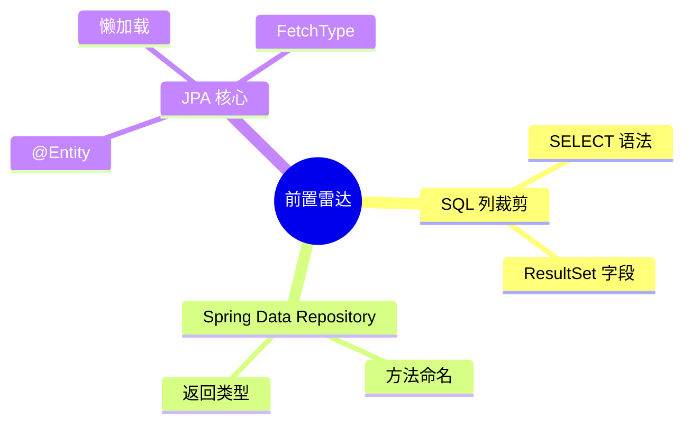

# J6A3-Java 投影是什么及运行机制-结构纲要

## 00｜摘要
- 这份纲要依次覆盖“开发痛点速览→Java 投影定义→运行机制→进阶类型→排障清单→FAQ”，帮助读者用流程图和对比表看懂 Projection（投影）如何按需裁剪列、压缩 SQL 负载，并提供实操 Checklist 保障 3 分钟入门即可落地。

## 01｜前置知识点
- 基础 SQL 查询与 `SELECT column` 语法。
- Spring Data Repository 方法命名规则。
- JPA 实体注解（`@Entity`、`@Column`）与懒加载概念。
 - 建议先了解这些前置知识再进入正文，阅读体验更顺畅。




## 02｜开头引入
> 假如面试官问你"为什么列表接口只要两列却被你查了整张表？"  
> 再问你"Spring Data 是如何根据接口投影自动裁剪 SQL 的？"  
> 还问你"运行时想切换 DTO/接口投影需要改多少代码？"  
> 你会如何回答？本文档以投影运行机制为主线，从定义到实现细节全程陪跑，帮你把答案一步步走通。

## 03｜目录（Must）
- 待写正文时插入 `[TOC]` 或手写目录，需与下列章节标题逐字一致。

## 04｜开发痛点
适合：正在为列表接口炸字段、慢 SQL 与 DTO 维护成灾而焦虑的团队。本章梳理“没有使用 Java 投影时”最常踩的坑，依据近期对 Spring Data / JPA 投影实践的调研资料整理，可直接用来对照自家项目。

### ✅/❌ 痛点对照表
| 场景 | 传统做法（❌） | 投影方案（✅） | 影响 |
| --- | --- | --- | --- |
| REST 列表只需 2 列，却返回整个实体 | `select *` + 直接序列化实体，JSON 体积倍增 | 定义接口投影，只取 `getName()/getStatus()` | 带宽、序列化耗时至少减少 30%+，移动端更友好 |
| 报表/多端组合字段 | 拼 DTO、复制实体字段，逻辑层大量手动映射 | 类/record 投影一次性构造所需字段 | 避免字段遗漏与重复映射，降低维护成本 |
| 敏感列/权限裁剪 | 实体暴露密码、额度等敏感字段，再靠前端过滤 | 投影层直接不声明敏感 getter，配合权限条件 | 从查询源头减少敏感数据流出，合规压力小 |
| 高并发查询 | ResultSet 带回所有列，网络与内存压力骤增 | 列裁剪 + 流式映射，ResultSet 更轻 | 数据库 I/O 与 JVM GC 压力同步下降，响应更稳定 |

### 💥 常见痛点卡片
1. **慢 SQL 难定位**：`select *` 加多表 JOIN，Explain 表现正常但实际单次查询耗时 >400ms。关键原因是列过多导致磁盘 I/O 与网络传输时间不可控，投影可以直接砍掉非关键列。  
2. **类型安全与维护成本**：DTO 复制粘贴，一旦需求新增字段，需要同步修改 3-5 处代码，还经常漏改。接口投影依赖 Spring Data 的方法签名生成 SQL，不再手写映射，减少“人肉同步”。  
3. **安全风险**：实体里藏着 `passwordHash`、`isAdmin` 等敏感字段，团队常以“前端不用就不显示”为理由忽略。投影让敏感字段完全不出库，配合数据脱敏策略更安全。  
4. **测试覆盖盲区**：因为查询字段太多，单测和集成测都难以覆盖所有列，导致线上才发现“这个字段其实没值”。投影帮助“声明即测试”，没写 getter 就不会查，易于验证。

### 🛠️ 快速应对建议
1. 先统计接口响应体大小和数据库返回列数，确认冗余数据比例。  
2. 为列表、下拉、导出等典型接口创建接口投影，逐一替换 `select *`。  
3. 针对报表/多条件接口，引入类/record 投影或 `select new`，统一字段管理。  
4. 在敏感数据场景配合权限表达式（如 `@Query` + SpEL）只暴露必要列。  
5. 开启 `spring.jpa.show-sql=true` 或接入 p6spy 记录列裁剪效果，持续回顾。

> 小白只需记住：痛点的根源都是“查太多、传太多”，投影的价值就是“只拿要用的”。

## 05｜Java 投影是什么？（Must）
- 结构：`是什么 → 用来解决什么痛点 → 对比实体返回`，用表格/图标呈现。
- 定义模块包含：Projection（投影，按需列映射）、静态投影（接口/类）、动态投影（运行时决定）。
- 以 `✅ 投影` vs `❌ 实体全量` 的概念对比，突出“只声明 getter=只查询对应列”的核心。
- 必须附“术语双语 + 第二次提醒”，并在结尾写 `小白只需记住：投影=我点什么就只给什么。`

## 06｜投影运行机制拆解（Must）
- 06.1 概念速览：Projection（投影）、DTO（数据传输对象）双语提醒。
- 06.2 Mermaid `flowchart`：方法签名 → Query 解析 → SQL 生成 → ResultSet → 投影映射。
- 06.3 Loading 细节：接口投影、类/record 投影、动态投影。附"快递只按清单装箱"比喻。
- 每子节末尾添加 `> 小白只需记住` 句。

## 07｜分层进阶：类投影 & 动态投影（Should/Could）
- 07.1 类/record 投影（Should）：适合已有 DTO，需要 MoSCoW 标注，应提供构造器示例、Checklist。
- 07.2 动态投影 + 原生 SQL（Could）：适合报表/多场景复用，加入 Mermaid `mindmap` 决策图，提示性能权衡。
- 每段提供 "适合：___" 及第一人称经验句式（例如"我通常在……场景切换到动态投影"）。

## 08｜常见坑与排障（Must）
- ⚠️ 清单：列名不匹配、懒加载异常、分页 + 投影失效。
- `❌ 现象 / ✅ 快速修复 / 🔧 排障步骤` 三列表格，并引用相关章（如"详见 08.2 流程"）。
- 预留脚本：开启 `spring.jpa.show-sql=true`、启用 `p6spy` 的操作步骤。

## 09｜🔧 实操 Checklist（Must）
- 分"接入前 / 接入中 / 接入后"三段，每段 3-4 条可勾选项（字段对齐、单元测试、日志校验）。
- 明确"MoSCoW：Must"标签，并提醒"写完请在 `✅ 小白自检` 中复盘"。

## 10｜❓ FAQ（Must）
- 必答三类：我为什么要用投影？与 DTO/数据库视图区别？报错怎么查？
- 采用 Q/A 列表，术语再次双语提醒，必要时引用前文章节。
- 末尾安排"更多疑问请带着日志回看 08 章排障"指引。

## 11｜结语与鼓励（Must）
- 三段式模板：价值回顾 → 运行机制复盘 → 鼓励语（使用 🚀/💪 表情）。
- 强调第一人称陪练语气（"我和你一起复盘……"）。

## 12｜作者信息（Must）
```
---
**作者**：郑恩赐  
**机构**：厦门工学院人工智能创作坊  
**日期**：powershell -Command "Get-Date -Format 'yyyy 年 MM 月 dd 日'"
```

