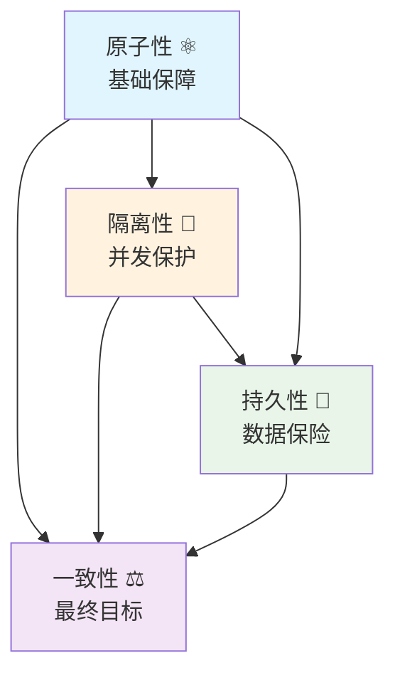

# J6D-ACID到底是什么？

## 📋 文档概述

ACID（原子性、一致性、隔离性、持久性）是数据库事务的四个核心特性，也是保证数据完整性和可靠性的基石。本文档将深入解析ACID每个特性的本质含义、工作原理和实际意义，帮助开发者真正理解事务的核心机制。

## 🗂️ 文档结构

### 1. ACID到底是什么？ 🤔

咱们今天来聊聊ACID这个听起来高大上的词儿！其实它没那么神秘，就是数据库事务的四个核心特性，保证咱们的数据不会出乱子。

#### 1.1 ACID到底是个啥？ �
- **ACID**其实就是四个英文单词的首字母缩写：
  - **A**tomicity（原子性）⚛️ - 要么全干，要么全不干
  - **C**onsistency（一致性）⚖️ - 数据要讲道理
  - **I**solation（隔离性）🚧 - 各忙各的，互不干扰
  - **D**urability（持久性）💾 - 干完的活儿不能丢
- 这概念是**Jim Gray**老哥在1970年代想出来的，现在所有靠谱的数据库都认它

#### 1.2 为啥非得有ACID？ ❓
举个咱们都懂的例子 - 银行转账💰：
- 要是没有原子性：钱可能扣了但对方没收到，这不坑人吗？
- 要是没有一致性：账户余额可能变成负数，银行不得亏死？
- 要是没有隔离性：两个人同时转账，钱可能算错了
- 要是没有持久性：转账成功后系统崩了，钱就没了

所以ACID就是为了让咱们的数据操作靠谱点！

#### 1.3 ACID有啥用？ 🎯
- **数据不会乱**：保证数据整整齐齐的
- **多人同时用**：大家都能安全地操作数据
- **系统崩了也不怕**：数据不会丢
- **关键系统靠它**：银行、电商这些都得靠ACID撑腰

### 2. 原子性：要么全干，要么全不干 ⚛️

原子性这玩意儿说白了就是"要么全干，要么全不干"，跟咱们平时说的"一荣俱荣，一损俱损"一个道理。

#### 2.1 原子性到底啥意思？ 🤔
- **原子性**就是事务里所有操作必须当成一个整体
- 要么全部成功执行，要么全部失败回滚
- 就像原子一样不可分割，不能只执行一半

举个咱们都懂的例子 - 银行转账💰：
- 扣款和入账必须同时成功，或者同时失败
- 不能出现钱扣了但对方没收到的情况
- 也不能出现对方收到钱但你没扣款的情况

#### 2.2 原子性咋实现的？ 🔧
数据库用**事务日志**来保证原子性：
- 开始事务时记录所有要做的操作
- 如果中间出错了，就按照日志回滚到开始状态
- 如果全部成功了，就提交事务

这就像咱们做项目�：
- 要么全部完成交付
- 要么完全不开始
- 不能做一半就撂挑子，那客户不得投诉？

#### 2.3 原子性有啥好处？ ✨
- **数据不会丢**：要么全成功，要么全失败
- **操作更靠谱**：不会出现半吊子状态
- **系统更稳定**：出错时能自动恢复

说白了，原子性就是让咱们的数据操作变得靠谱，不会出现那种"卡在中间"的尴尬情况！

### 3. 一致性：数据要讲道理 ⚖️

一致性就是让数据"讲道理"，不能胡来。比如账户余额不能是负数，这就是数据要遵守的基本规则。

#### 3.1 一致性到底啥意思？ 🤔
- **一致性**就是事务前后数据都要符合预设的规则
- 开始和结束状态都要是合理的
- 就像咱们玩游戏要有规则一样，不能乱来

还是用银行转账的例子💰：
- 转账前：A有1000元，B有500元
- 转账后：A有900元，B有600元
- 总金额始终是1500元，这就是一致性

#### 3.2 一致性靠啥保证？ 🔒
数据库用**约束规则**来保证一致性：
- **主键约束**：每个记录要有唯一标识
- **外键约束**：关联的数据要存在
- **唯一约束**：某些字段不能重复
- **检查约束**：数据要符合特定条件

这就像咱们的身份证📇：
- 每个人要有唯一的身份证号
- 年龄不能是负数
- 性别只能是男或女
- 这些规则保证了数据的合理性

#### 3.3 一致性有啥好处？ ✨
- **数据不会乱**：始终符合业务逻辑
- **防止错误操作**：不合法的数据会被拒绝
- **系统更可靠**：数据始终处于正确状态

说白了，一致性就是给数据定规矩，让它们老老实实按规则办事！

### 4. 隔离性：各忙各的，互不干扰 🚧

隔离性就是让多个事务"各忙各的"，互不干扰。就像咱们在图书馆看书，不能互相打扰一样。

#### 4.1 隔离性到底啥意思？ 🤔
- **隔离性**就是多个事务同时操作时互不干扰
- 每个事务都觉得自己在独占数据库
- 就像多个人同时用电脑，但各自用各自的窗口

还是银行转账的例子💰：
- 你正在转账给朋友
- 同时你老婆在查余额
- 隔离性保证她不会看到你转账的中间状态

#### 4.2 隔离性会遇到啥问题？ 🚨
当隔离性不够时会出现三大问题：
- **脏读**：读到别人没提交的数据，就像偷看别人没写完的作业
- **不可重复读**：两次读取同一数据结果不同，就像天气预报变来变去
- **幻读**：读到别人新增的数据，就像突然发现多了一个座位

#### 4.3 隔离性咋解决的？ 🔧
数据库用**隔离级别**来控制隔离程度：
- **读未提交**：最低级别，啥都能看到
- **读已提交**：只能看到别人提交的数据
- **可重复读**：保证多次读取结果一致
- **串行化**：最高级别，像排队一样顺序执行

这就像咱们的隐私保护🔒：
- 读未提交：像在公共场合大声说话
- 读已提交：像在会议室小声讨论
- 可重复读：像在私人办公室谈话
- 串行化：像在保险库单独谈话

#### 4.4 隔离性有啥好处？ ✨
- **数据更安全**：不会读到不完整的数据
- **操作更稳定**：不会因为别人操作而受影响
- **系统更高效**：多个用户可以同时操作

说白了，隔离性就是给每个事务划个地盘，让大家都能安心干活！

### 5. 持久性：干完的活儿不能丢 💾

持久性就是保证"干完的活儿不能丢"，即使系统崩了、断电了，数据也得稳稳地保存下来。

#### 5.1 持久性到底啥意思？ 🤔
- **持久性**就是事务提交后数据就永久保存了
- 即使系统崩溃、断电，数据也不会丢失
- 就像咱们写日记，写完了就得好好保存

还是银行转账的例子💰：
- 你转账成功后，系统突然断电了
- 重启后你的转账记录还在
- 这就是持久性的功劳

#### 5.2 持久性咋实现的？ 🔧
数据库用**事务日志**来保证持久性：
- **WAL机制**：先写日志，再写数据
- **检查点**：定期保存数据快照
- **备份策略**：多份数据备份

这就像咱们的保险箱🔐：
- 先记录要存多少钱（写日志）
- 再把钱放进保险箱（写数据）
- 定期清点保险箱里的钱（检查点）
- 准备多个保险箱备份（备份策略）

#### 5.3 持久性遇到故障咋办？ 🚨
当系统出问题时：
- **系统崩溃**：用事务日志恢复数据
- **硬盘损坏**：用备份数据恢复
- **断电**：用检查点快速恢复

就像咱们的应急预案🚒：
- 家里着火了：用保险箱里的备份文件
- 保险箱坏了：用银行的备份保险箱
- 整个楼塌了：用异地备份的数据中心

#### 5.4 持久性有啥好处？ ✨
- **数据永不丢**：即使天塌下来数据也在
- **系统更可靠**：不怕各种意外情况
- **用户更放心**：不用担心数据丢失

说白了，持久性就是给数据上保险，让咱们能安心睡觉！

### 第六章：ACID特性的相互关系 🤝

前面咱们聊了ACID的四个特性，现在来聊聊它们之间是怎么配合的。这就像一支足球队，每个球员都有自己的位置，但得配合起来才能赢球！

#### 6.1 四个特性怎么配合？ 🎯

ACID这四个特性可不是各干各的，它们之间有着紧密的联系。咱们用个图来直观看看它们是怎么配合的：

**图表说明**：
- **原子性**是地基，为其他特性提供基础保障
- **一致性**是目标，其他三个特性都服务于它
- **隔离性**保护一致性，防止并发操作干扰
- **持久性**保证所有成果不会丢失

#### 6.2 实际应用中的权衡 ⚖️

ACID虽好，但也不是万能的，实际应用中需要权衡：

**性能 vs 安全性**：
- 隔离级别越高，安全性越好，但性能越差
- 读未提交最快，但可能读到脏数据
- 串行化最安全，但性能最差

**可用性 vs 一致性**：
- 强一致性保证数据准确，但可能影响系统可用性
- 弱一致性提高性能，但数据可能不一致
- 需要根据业务需求选择合适的平衡点

**实时性 vs 持久性**：
- 同步写日志保证持久性，但影响实时性
- 异步写日志提高性能，但可能丢失数据
- 需要根据重要性选择合适的策略

#### 6.3 为什么ACID是黄金标准？ 🏆

ACID能成为数据库事务的黄金标准，是因为它：

**构建了完整的安全网**🛡️：
- 原子性防止操作中断
- 隔离性防止并发干扰
- 持久性防止数据丢失
- 一致性保证最终正确

**适应各种场景**🌍：
- 从银行系统到电商平台
- 从单机应用到分布式系统
- 都能提供可靠的事务保障

**经过时间考验**⏳：
- 从1970年代提出到现在
- 被所有主流数据库采用
- 证明是可靠的事务模型

---

最后更新时间：2026-03-18