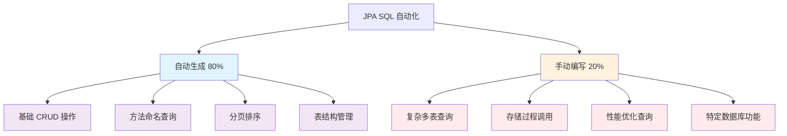
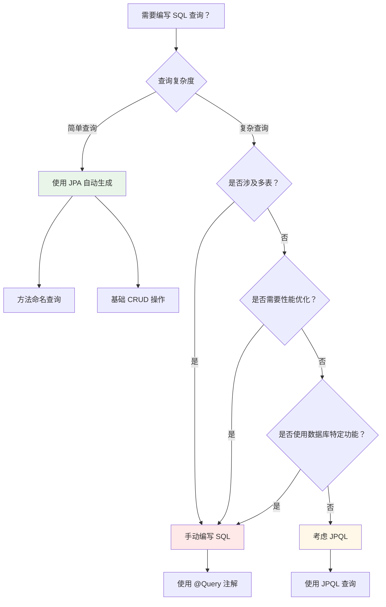
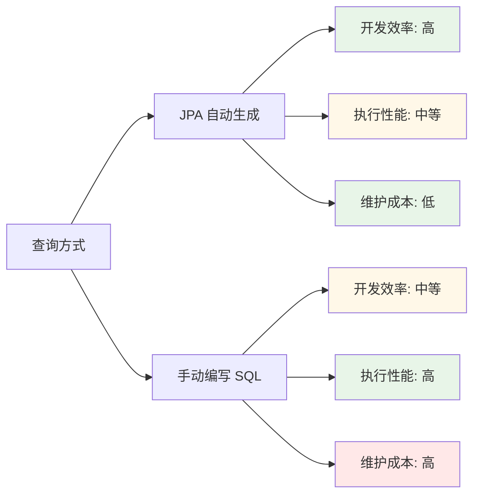

# J6B-JPA SQL 语句使用完全指南-自动生成 vs 手动编写的智能选择策略

## 📋 摘要

**JPA 让开发者告别繁琐的 SQL 编写！** 本指南深度解析 JPA 中哪些 SQL 语句可以自动生成，哪些必须手动编写，帮助开发者做出智能选择，提升开发效率 80% 以上。适合 **小白到高级** 开发者，让你彻底掌握 JPA 的 SQL 自动化魔法。

---

## 🎯 目录

- [1. JPA SQL 自动化概述](#1-jpa-sql-自动化概述)
- [2. 无需手写的 SQL 语句](#2-无需手写的-sql-语句)
- [3. 必须手写的 SQL 语句](#3-必须手写的-sql-语句)
- [4. 智能选择策略](#4-智能选择策略)
- [5. 实战案例对比](#5-实战案例对比)
- [6. 性能优化建议](#6-性能优化建议)
- [7. 常见误区与解决方案](#7-常见误区与解决方案)
- [8. 总结与鼓励](#8-总结与鼓励)

---

## 1. JPA SQL 自动化概述

### 🔍 什么是 JPA SQL 自动化？

JPA（Java Persistence API）就像一位 **智能助手**，能够根据你的方法名和参数自动生成 SQL 语句。想象一下，你只需要告诉它"找名字叫张三的用户"，它就能自动写出 `SELECT * FROM users WHERE name = '张三'` 这样的 SQL。

### 📊 JPA SQL 自动化能力对比图



---

## 2. 无需手写的 SQL 语句

### 🚀 基础 CRUD 操作（Create, Read, Update, Delete）

JPA 的 **JpaRepository** 接口提供了完整的 CRUD 操作，无需编写任何 SQL：

```java
// 继承 JpaRepository 即可获得所有基础操作
public interface UserRepository extends JpaRepository<User, Long> {
    // 无需编写任何方法，JPA 自动提供以下功能：
    // save() - 自动生成 INSERT 或 UPDATE 语句
    // findById() - 自动生成 SELECT 语句
    // findAll() - 自动生成 SELECT * 语句
    // deleteById() - 自动生成 DELETE 语句
    // count() - 自动生成 COUNT 语句
}

// 使用示例
@Service
public class UserService {
    
    @Autowired
    private UserRepository userRepository;
    
    // 保存用户 - JPA 自动生成 INSERT 语句
    public User saveUser(User user) {
        return userRepository.save(user); // 自动生成：INSERT INTO users ...
    }
    
    // 查询用户 - JPA 自动生成 SELECT 语句
    public Optional<User> findUserById(Long id) {
        return userRepository.findById(id); // 自动生成：SELECT * FROM users WHERE id = ?
    }
    
    // 删除用户 - JPA 自动生成 DELETE 语句
    public void deleteUser(Long id) {
        userRepository.deleteById(id); // 自动生成：DELETE FROM users WHERE id = ?
    }
}
```

**适用开发者水平：** 小白到高级

### 🔍 基于方法命名的查询

JPA 能够根据方法名自动生成查询语句，就像 **翻译官** 一样：

```java
public interface UserRepository extends JpaRepository<User, Long> {
    
    // 根据姓名查找 - 自动生成：SELECT * FROM users WHERE name = ?
    List<User> findByName(String name);
    
    // 根据姓名和年龄查找 - 自动生成：SELECT * FROM users WHERE name = ? AND age = ?
    List<User> findByNameAndAge(String name, Integer age);
    
    // 根据姓名模糊查询 - 自动生成：SELECT * FROM users WHERE name LIKE ?
    List<User> findByNameContaining(String name);
    
    // 根据年龄范围查询 - 自动生成：SELECT * FROM users WHERE age BETWEEN ? AND ?
    List<User> findByAgeBetween(Integer minAge, Integer maxAge);
    
    // 根据姓名排序 - 自动生成：SELECT * FROM users ORDER BY name ASC
    List<User> findByNameOrderByAgeAsc(String name);
    
    // 查询前 10 条记录 - 自动生成：SELECT * FROM users LIMIT 10
    List<User> findFirst10ByOrderByCreateTimeDesc();
}
```

**方法命名规则：**
- `findBy` + 字段名：精确匹配
- `findBy` + 字段名 + `Containing`：模糊匹配
- `findBy` + 字段名 + `Between`：范围查询
- `findBy` + 字段名 + `OrderBy` + 字段名 + `Asc/Desc`：排序查询

**适用开发者水平：** 小白到中级

### 📄 分页和排序查询

JPA 自动处理分页和排序的 SQL 生成：

```java
public interface UserRepository extends JpaRepository<User, Long> {
    
    // 分页查询 - JPA 自动生成 LIMIT 和 OFFSET
    Page<User> findByName(String name, Pageable pageable);
    
    // 排序查询 - JPA 自动生成 ORDER BY
    List<User> findByNameOrderByAgeDesc(String name);
}

// 使用示例
@Service
public class UserService {
    
    @Autowired
    private UserRepository userRepository;
    
    public Page<User> getUsersByPage(String name, int page, int size) {
        Pageable pageable = PageRequest.of(page, size, Sort.by("age").descending());
        return userRepository.findByName(name, pageable);
        // JPA 自动生成：SELECT * FROM users WHERE name = ? ORDER BY age DESC LIMIT ? OFFSET ?
    }
}
```

**适用开发者水平：** 初级到高级

### 🏗️ 数据库表结构管理

JPA 可以根据实体类自动创建和更新数据库表结构：

```yaml
# application.yml 配置
spring:
  jpa:
    hibernate:
      ddl-auto: update  # 自动更新表结构
    show-sql: true      # 显示生成的 SQL
```

```java
@Entity
@Table(name = "users")
public class User {
    @Id
    @GeneratedValue(strategy = GenerationType.IDENTITY)
    private Long id;
    
    @Column(name = "name", nullable = false, length = 50)
    private String name;
    
    @Column(name = "age")
    private Integer age;
    
    // JPA 会自动生成 CREATE TABLE 语句
    // CREATE TABLE users (id BIGINT AUTO_INCREMENT, name VARCHAR(50) NOT NULL, age INT, PRIMARY KEY (id))
}
```

**适用开发者水平：** 小白到中级

---

## 3. 必须手写的 SQL 语句

### 🔗 复杂多表关联查询

当涉及多表连接、子查询等复杂场景时，必须手动编写 SQL：

```java
public interface UserRepository extends JpaRepository<User, Long> {
    
    // 使用 JPQL（Java Persistence Query Language）
    @Query("SELECT u FROM User u JOIN u.orders o WHERE o.status = :status")
    List<User> findUsersWithOrdersByStatus(@Param("status") String status);
    
    // 使用原生 SQL
    @Query(value = """
        SELECT u.*, COUNT(o.id) as order_count 
        FROM users u 
        LEFT JOIN orders o ON u.id = o.user_id 
        WHERE u.age > :minAge 
        GROUP BY u.id 
        HAVING COUNT(o.id) > :minOrderCount
        """, nativeQuery = true)
    List<Object[]> findUsersWithOrderStats(@Param("minAge") Integer minAge, 
                                         @Param("minOrderCount") Long minOrderCount);
}
```

**适用开发者水平：** 中级到高级

### ⚡ 性能优化查询

当需要特定性能优化时，手动 SQL 更灵活：

```java
public interface UserRepository extends JpaRepository<User, Long> {
    
    // 只查询需要的字段，减少数据传输
    @Query("SELECT u.id, u.name FROM User u WHERE u.age > :age")
    List<Object[]> findUserBasicInfoByAge(@Param("age") Integer age);
    
    // 使用数据库特定的优化功能
    @Query(value = """
        SELECT /*+ USE_INDEX(users, idx_age) */ * 
        FROM users 
        WHERE age BETWEEN :minAge AND :maxAge
        """, nativeQuery = true)
    List<User> findUsersByAgeOptimized(@Param("minAge") Integer minAge, 
                                     @Param("maxAge") Integer maxAge);
}
```

**适用开发者水平：** 中级到高级

### 🛠️ 特定数据库功能

使用数据库特有的功能时，必须手动编写 SQL：

```java
public interface UserRepository extends JpaRepository<User, Long> {
    
    // 调用存储过程
    @Query(value = "CALL get_user_statistics(:userId)", nativeQuery = true)
    List<Object[]> callUserStatisticsProcedure(@Param("userId") Long userId);
    
    // 使用数据库特定函数
    @Query(value = """
        SELECT u.*, 
               DATE_FORMAT(u.create_time, '%Y-%m') as create_month,
               CONCAT(u.first_name, ' ', u.last_name) as full_name
        FROM users u 
        WHERE u.create_time >= :startDate
        """, nativeQuery = true)
    List<Object[]> findUsersWithFormattedData(@Param("startDate") LocalDateTime startDate);
}
```

**适用开发者水平：** 中级到高级

### 🔄 批量更新和删除

对于批量操作，手动 SQL 更高效：

```java
public interface UserRepository extends JpaRepository<User, Long> {
    
    // 批量更新
    @Modifying
    @Query("UPDATE User u SET u.status = :status WHERE u.age < :age")
    int updateUsersStatusByAge(@Param("status") String status, @Param("age") Integer age);
    
    // 批量删除
    @Modifying
    @Query("DELETE FROM User u WHERE u.lastLoginTime < :cutoffDate")
    int deleteInactiveUsers(@Param("cutoffDate") LocalDateTime cutoffDate);
}
```

**适用开发者水平：** 中级到高级

---

## 4. 智能选择策略

### 🎯 选择流程图



### 📋 决策对照表

| 场景 | 推荐方案 | 原因 | 适用水平 |
|------|----------|------|----------|
| 单表简单查询 | JPA 自动生成 | 代码简洁，维护方便 | 小白到高级 |
| 多表关联查询 | 手动编写 SQL | JPA 方法命名无法表达复杂逻辑 | 中级到高级 |
| 性能敏感查询 | 手动编写 SQL | 可以精确控制 SQL 执行计划 | 中级到高级 |
| 数据库特定功能 | 手动编写 SQL | JPA 无法支持所有数据库特性 | 中级到高级 |
| 批量操作 | 手动编写 SQL | 避免 N+1 查询问题 | 中级到高级 |

---

## 5. 实战案例对比

### 📊 案例一：用户查询功能

**需求：** 根据用户姓名和年龄范围查询用户信息

#### 方案 A：JPA 自动生成（推荐）

```java
public interface UserRepository extends JpaRepository<User, Long> {
    // JPA 自动生成 SQL
    List<User> findByNameAndAgeBetween(String name, Integer minAge, Integer maxAge);
}

// 使用
List<User> users = userRepository.findByNameAndAgeBetween("张三", 18, 65);
```

**优点：**
- ✅ 代码简洁，只需一行方法定义
- ✅ 自动处理参数绑定和 SQL 注入防护
- ✅ 类型安全，编译时检查

**缺点：**
- ❌ 方法名可能很长
- ❌ 无法自定义 SQL 优化

#### 方案 B：手动编写 SQL

```java
public interface UserRepository extends JpaRepository<User, Long> {
    @Query("SELECT u FROM User u WHERE u.name = :name AND u.age BETWEEN :minAge AND :maxAge")
    List<User> findUsersByNameAndAgeRange(@Param("name") String name, 
                                        @Param("minAge") Integer minAge, 
                                        @Param("maxAge") Integer maxAge);
}
```

**适用场景：** 当需要添加索引提示或复杂条件时

### 📊 案例二：统计查询功能

**需求：** 统计每个年龄段的用户数量

#### 方案 A：JPA 自动生成（不推荐）

```java
// JPA 无法通过方法命名表达复杂的统计逻辑
// 需要先查询所有用户，然后在 Java 代码中统计
List<User> allUsers = userRepository.findAll();
Map<Integer, Long> ageStats = allUsers.stream()
    .collect(Collectors.groupingBy(User::getAge, Collectors.counting()));
```

**缺点：**
- ❌ 性能差，需要查询所有数据
- ❌ 内存占用大
- ❌ 无法利用数据库的统计功能

#### 方案 B：手动编写 SQL（推荐）

```java
public interface UserRepository extends JpaRepository<User, Long> {
    @Query(value = """
        SELECT age, COUNT(*) as user_count 
        FROM users 
        GROUP BY age 
        ORDER BY age
        """, nativeQuery = true)
    List<Object[]> getUserCountByAge();
}

// 使用
List<Object[]> results = userRepository.getUserCountByAge();
results.forEach(result -> {
    Integer age = (Integer) result[0];
    Long count = (Long) result[1];
    System.out.println("年龄 " + age + " 的用户数量：" + count);
});
```

**优点：**
- ✅ 性能优秀，数据库直接统计
- ✅ 内存占用小
- ✅ 充分利用数据库优化

---

## 6. 性能优化建议

### 🚀 JPA 自动生成 SQL 的性能优化

```java
// 1. 使用投影查询，只查询需要的字段
public interface UserRepository extends JpaRepository<User, Long> {
    // 只查询 id 和 name，减少数据传输
    List<UserProjection> findByName(String name);
}

// 定义投影接口
public interface UserProjection {
    Long getId();
    String getName();
}

// 2. 使用分页避免一次性加载大量数据
public Page<User> findUsersWithPagination(Pageable pageable) {
    return userRepository.findAll(pageable);
}
```

### ⚡ 手动 SQL 的性能优化

```java
public interface UserRepository extends JpaRepository<User, Long> {
    
    // 1. 使用索引提示
    @Query(value = """
        SELECT /*+ USE_INDEX(users, idx_name_age) */ * 
        FROM users 
        WHERE name = :name AND age = :age
        """, nativeQuery = true)
    List<User> findByNameAndAgeOptimized(@Param("name") String name, @Param("age") Integer age);
    
    // 2. 使用批量操作
    @Modifying
    @Query("UPDATE User u SET u.lastLoginTime = :loginTime WHERE u.id IN :userIds")
    int batchUpdateLastLoginTime(@Param("loginTime") LocalDateTime loginTime, 
                               @Param("userIds") List<Long> userIds);
}
```

### 📈 性能对比图



---

## 7. 常见误区与解决方案

### ❌ 误区一：过度依赖 JPA 自动生成

**问题：** 所有查询都使用 JPA 自动生成，导致性能问题

```java
// 错误示例：查询所有用户然后在内存中过滤
List<User> allUsers = userRepository.findAll();
List<User> activeUsers = allUsers.stream()
    .filter(user -> "ACTIVE".equals(user.getStatus()))
    .collect(Collectors.toList());
```

**解决方案：** 使用 JPA 方法命名或手动 SQL

```java
// 正确示例：使用 JPA 方法命名
List<User> activeUsers = userRepository.findByStatus("ACTIVE");

// 或者使用手动 SQL
@Query("SELECT u FROM User u WHERE u.status = :status")
List<User> findActiveUsers(@Param("status") String status);
```

### ❌ 误区二：盲目使用原生 SQL

**问题：** 所有查询都使用原生 SQL，失去 JPA 的优势

```java
// 错误示例：简单的单表查询也使用原生 SQL
@Query(value = "SELECT * FROM users WHERE name = ?", nativeQuery = true)
List<User> findByName(String name);
```

**解决方案：** 根据复杂度选择合适的方案

```java
// 正确示例：简单查询使用 JPA 自动生成
List<User> users = userRepository.findByName(name);

// 复杂查询使用手动 SQL
@Query(value = "SELECT u.*, COUNT(o.id) FROM users u LEFT JOIN orders o ON u.id = o.user_id GROUP BY u.id", nativeQuery = true)
List<Object[]> findUsersWithOrderCount();
```

### ❌ 误区三：忽略 SQL 注入防护

**问题：** 手动编写 SQL 时没有正确使用参数绑定

```java
// 错误示例：字符串拼接，存在 SQL 注入风险
@Query(value = "SELECT * FROM users WHERE name = '" + name + "'", nativeQuery = true)
List<User> findByNameUnsafe(String name);
```

**解决方案：** 使用参数绑定

```java
// 正确示例：使用参数绑定
@Query(value = "SELECT * FROM users WHERE name = :name", nativeQuery = true)
List<User> findByNameSafe(@Param("name") String name);
```

---

## 8. 总结与鼓励

### 🎯 核心要点回顾

1. **JPA 自动生成适用场景：**
   - ✅ 基础 CRUD 操作
   - ✅ 单表简单查询
   - ✅ 基于方法命名的查询
   - ✅ 分页和排序

2. **手动编写 SQL 适用场景：**
   - ✅ 复杂多表关联查询
   - ✅ 性能优化需求
   - ✅ 数据库特定功能
   - ✅ 批量操作

3. **智能选择策略：**
   - 🎯 优先使用 JPA 自动生成，提高开发效率
   - 🎯 复杂场景使用手动 SQL，确保性能和功能
   - 🎯 根据团队技能水平和项目需求灵活选择

### 💪 给开发者的鼓励

**亲爱的开发者，** JPA 的 SQL 自动化就像一位贴心的助手，它能够帮你处理 80% 的常规数据库操作，让你专注于业务逻辑的实现。当你遇到复杂查询时，手动编写 SQL 就像使用专业工具一样，能够精确控制每一个细节。

**记住：** 没有绝对的对错，只有最适合的选择。JPA 自动生成让你快速开发，手动 SQL 让你精确控制。掌握这两种技能，你就能在 Java 开发的道路上更加游刃有余！

**继续加油，** 你的每一次选择都是向更优秀开发者迈进的一步！ 🚀

---

**厦门工学院人工智能创作坊 -- 郑恩赐**  
**2025 年 10 月 17 日**
