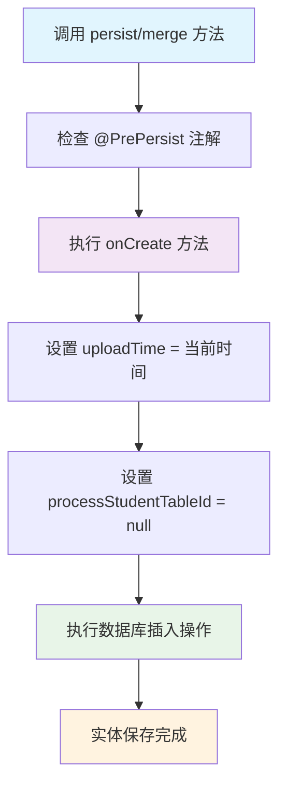

# J5E-@PrePersist注解详解-实体持久化前的自动初始化机制

## 📋 摘要

`@PrePersist` 是 JPA 生命周期回调注解，在实体保存到数据库前自动执行初始化操作。就像质检环节，确保数据入库前完成必要设置，提升开发效率。

---

## 🎯 核心概念

`@PrePersist` 注解是 JPA 生命周期回调（Lifecycle Callbacks）机制的重要组成部分，它允许开发者在实体对象被持久化到数据库之前执行特定的业务逻辑。

### 🔍 注解作用时机

当调用以下方法时，`@PrePersist` 标注的方法会被触发：
- `EntityManager.persist()` 方法
- `EntityManager.merge()` 方法（对于新实体）
- 级联持久化操作

### 📝 代码示例解析

```java
@Entity
public class StudentRecord {
    @Id
    private Long id;
    
    private LocalDateTime uploadTime;
    private Long processStudentTableId;
    
    @PrePersist
    protected void onCreate() {
        uploadTime = LocalDateTime.now();  // 自动设置上传时间
        processStudentTableId = null;      // 重置处理状态
    }
}
```

**代码说明：**
- `onCreate()` 方法在实体保存前自动执行
- `uploadTime` 自动设置为当前时间，无需手动赋值
- `processStudentTableId` 重置为 `null`，确保数据状态一致

---

## ⚙️ 使用规范

### 📋 方法要求

| 要求 | 说明 |
|------|------|
| **返回类型** | 必须是 `void` |
| **访问修饰符** | 不能是 `static` 或 `final` |
| **参数** | 实体类中定义时无参数，监听器类中需一个实体类型参数 |

### 🎯 适用场景

- **自动时间戳设置**：创建时间、更新时间
- **数据初始化**：设置默认值、重置状态
- **业务逻辑处理**：计算字段、验证数据
- **审计信息记录**：操作人、操作时间

---

## 🔄 执行流程图



---

## 💡 实际应用价值

### ✅ 优势特点

- **自动化处理**：减少手动设置，避免遗漏
- **数据一致性**：确保关键字段正确初始化
- **代码简洁**：业务逻辑集中管理
- **维护性强**：修改规则只需调整一处

### 🎯 开发者适用性

| 开发者水平 | 适用程度 | 说明 |
|------------|----------|------|
| **小白（零基础）** | ⭐⭐⭐ | 概念简单，易于理解 |
| **刚入门（初级）** | ⭐⭐⭐⭐ | 常用功能，实用性强 |
| **入门一段时间（中级）** | ⭐⭐⭐⭐⭐ | 深度应用，优化性能 |
| **资深开发者（高级）** | ⭐⭐⭐⭐ | 复杂业务场景应用 |

---

## 🎉 总结

`@PrePersist` 注解是 JPA 中非常实用的生命周期回调机制，它让实体持久化前的初始化操作变得自动化和标准化。通过合理使用这个注解，开发者可以显著提升代码质量和开发效率，让数据管理更加智能和可靠。

**💪 加油！** 掌握 `@PrePersist` 注解，让你的 JPA 实体管理更加得心应手，数据持久化更加优雅高效！

---

**厦门工学院人工智能创作坊 -- 郑恩赐**  
**2025 年 10 月 8 日**
