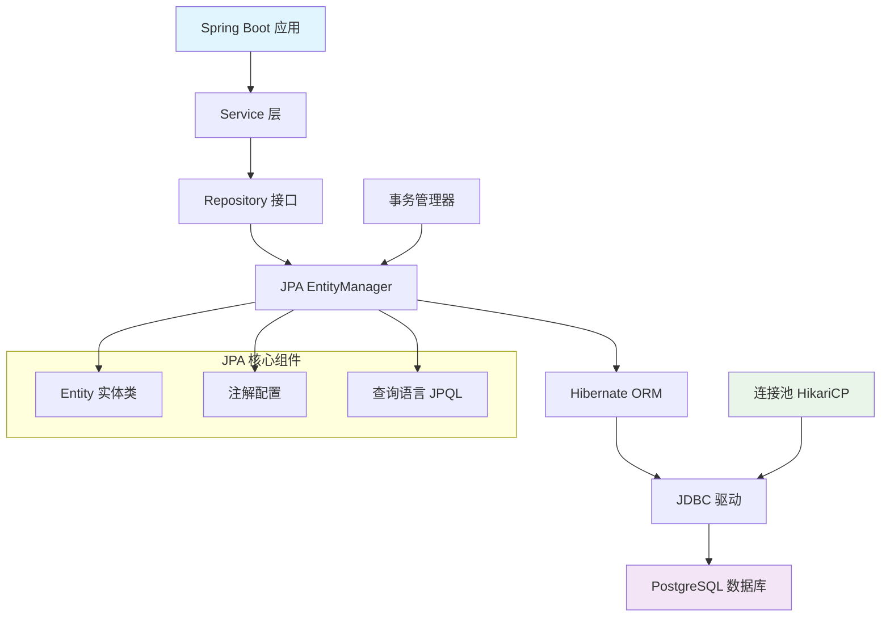
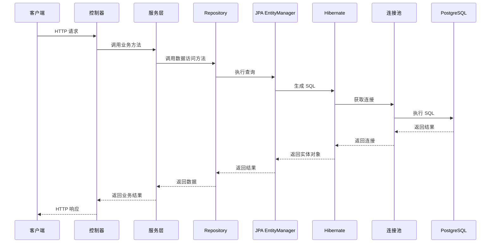

# J6C-JPA连接 PostgreSQL 数据库完全指南-驱动配置到排障

## 📋 摘要

本指南将带你从零开始，掌握使用 JPA 连接 PostgreSQL 数据库的完整技能！无论你是 Java 新手还是想要提升数据库操作能力的开发者，这篇指南都将为你提供最全面、最实用的解决方案。我们将通过 Spring Boot 框架，一步步构建一个完整的数据库应用，涵盖依赖配置、实体映射、Repository 设计、连接池优化等核心知识点。跟着我们的步伐，你将轻松掌握企业级数据库开发技能，让你的 Java 应用与 PostgreSQL 数据库完美融合！💪

## 📚 目录

- [环境准备](#环境准备)
- [项目依赖配置](#项目依赖配置)
- [数据库连接配置](#数据库连接配置)
- [实体类设计](#实体类设计)
- [Repository 接口](#repository-接口)
- [服务层实现](#服务层实现)
- [连接池优化](#连接池优化)
- [常见问题解决](#常见问题解决)
- [最佳实践](#最佳实践)

## 🛠️ 环境准备

在开始之前，确保你的开发环境已经准备就绪：

### 必需软件
- ☕ **Java 17+** (推荐使用 Java 21)
- 🐘 **PostgreSQL 15+** (最新稳定版)
- 🍃 **Spring Boot 3.2+** (2025 年最新版本)
- 🔧 **IDE** (IntelliJ IDEA 或 Eclipse)

### PostgreSQL 安装验证
```sql
-- 连接到 PostgreSQL 并创建测试数据库
CREATE DATABASE jpa_test_db;
\c jpa_test_db;
```

## 📦 项目依赖配置

### Maven 配置

在 `pom.xml` 文件中添加以下依赖：

```xml
<dependencies>
    <!-- Spring Boot Web Starter -->
    <dependency>
        <groupId>org.springframework.boot</groupId>
        <artifactId>spring-boot-starter-web</artifactId>
    </dependency>
    
    <!-- Spring Boot Data JPA -->
    <dependency>
        <groupId>org.springframework.boot</groupId>
        <artifactId>spring-boot-starter-data-jpa</artifactId>
    </dependency>
    
    <!-- PostgreSQL 驱动 -->
    <dependency>
        <groupId>org.postgresql</groupId>
        <artifactId>postgresql</artifactId>
        <scope>runtime</scope>
    </dependency>
    
    <!-- 连接池 (HikariCP 已内置) -->
    <dependency>
        <groupId>com.zaxxer</groupId>
        <artifactId>HikariCP</artifactId>
    </dependency>
    
    <!-- 开发工具 -->
    <dependency>
        <groupId>org.springframework.boot</groupId>
        <artifactId>spring-boot-devtools</artifactId>
        <scope>runtime</scope>
        <optional>true</optional>
    </dependency>
</dependencies>
```

### Gradle 配置

在 `build.gradle` 文件中添加：

```gradle
dependencies {
    implementation 'org.springframework.boot:spring-boot-starter-web'
    implementation 'org.springframework.boot:spring-boot-starter-data-jpa'
    runtimeOnly 'org.postgresql:postgresql'
    implementation 'com.zaxxer:HikariCP'
    developmentOnly 'org.springframework.boot:spring-boot-devtools'
}
```

## ⚙️ 数据库连接配置

### application.yml 配置 (推荐)

```yaml
spring:
  application:
    name: jpa-postgresql-demo
  
  # 数据源配置
  datasource:
    url: jdbc:postgresql://localhost:5432/jpa_test_db
    username: postgres
    password: your_password
    driver-class-name: org.postgresql.Driver
    
    # HikariCP 连接池配置
    hikari:
      maximum-pool-size: 20
      minimum-idle: 5
      idle-timeout: 300000
      max-lifetime: 1200000
      connection-timeout: 20000
      pool-name: JpaPostgresPool
  
  # JPA 配置
  jpa:
    hibernate:
      ddl-auto: update
    show-sql: true
    properties:
      hibernate:
        dialect: org.hibernate.dialect.PostgreSQLDialect
        format_sql: true
        jdbc:
          batch_size: 20
        order_inserts: true
        order_updates: true
    open-in-view: false

# 日志配置
logging:
  level:
    org.hibernate.SQL: DEBUG
    org.hibernate.type.descriptor.sql.BasicBinder: TRACE
    org.springframework.web: INFO
```

### application.properties 配置

```properties
# 数据库连接
spring.datasource.url=jdbc:postgresql://localhost:5432/jpa_test_db
spring.datasource.username=postgres
spring.datasource.password=your_password
spring.datasource.driver-class-name=org.postgresql.Driver

# 连接池配置
spring.datasource.hikari.maximum-pool-size=20
spring.datasource.hikari.minimum-idle=5
spring.datasource.hikari.idle-timeout=300000
spring.datasource.hikari.max-lifetime=1200000
spring.datasource.hikari.connection-timeout=20000

# JPA 配置
spring.jpa.hibernate.ddl-auto=update
spring.jpa.show-sql=true
spring.jpa.properties.hibernate.dialect=org.hibernate.dialect.PostgreSQLDialect
spring.jpa.properties.hibernate.format_sql=true
spring.jpa.properties.hibernate.jdbc.batch_size=20
spring.jpa.properties.hibernate.order_inserts=true
spring.jpa.properties.hibernate.order_updates=true
spring.jpa.open-in-view=false

# 日志配置
logging.level.org.hibernate.SQL=DEBUG
logging.level.org.hibernate.type.descriptor.sql.BasicBinder=TRACE
```

## 🏗️ 实体类设计

### 基础实体类示例

```java
package com.example.jpa.entity;

import jakarta.persistence.*;
import java.time.LocalDateTime;
import java.util.Objects;

/**
 * 用户实体类
 * 演示 JPA 与 PostgreSQL 的完美结合
 */
@Entity
@Table(name = "users", 
       indexes = {
           @Index(name = "idx_user_email", columnList = "email"),
           @Index(name = "idx_user_username", columnList = "username")
       })
public class User {
    
    @Id
    @GeneratedValue(strategy = GenerationType.IDENTITY)
    @Column(name = "id")
    private Long id;
    
    @Column(name = "username", nullable = false, unique = true, length = 50)
    private String username;
    
    @Column(name = "email", nullable = false, unique = true, length = 100)
    private String email;
    
    @Column(name = "password_hash", nullable = false)
    private String passwordHash;
    
    @Column(name = "first_name", length = 50)
    private String firstName;
    
    @Column(name = "last_name", length = 50)
    private String lastName;
    
    @Enumerated(EnumType.STRING)
    @Column(name = "status", nullable = false)
    private UserStatus status = UserStatus.ACTIVE;
    
    @Column(name = "created_at", nullable = false, updatable = false)
    private LocalDateTime createdAt;
    
    @Column(name = "updated_at")
    private LocalDateTime updatedAt;
    
    // 构造函数
    public User() {}
    
    public User(String username, String email, String passwordHash) {
        this.username = username;
        this.email = email;
        this.passwordHash = passwordHash;
        this.createdAt = LocalDateTime.now();
        this.updatedAt = LocalDateTime.now();
    }
    
    // JPA 生命周期回调
    @PrePersist
    protected void onCreate() {
        createdAt = LocalDateTime.now();
        updatedAt = LocalDateTime.now();
    }
    
    @PreUpdate
    protected void onUpdate() {
        updatedAt = LocalDateTime.now();
    }
    
    // Getters and Setters
    public Long getId() { return id; }
    public void setId(Long id) { this.id = id; }
    
    public String getUsername() { return username; }
    public void setUsername(String username) { this.username = username; }
    
    public String getEmail() { return email; }
    public void setEmail(String email) { this.email = email; }
    
    public String getPasswordHash() { return passwordHash; }
    public void setPasswordHash(String passwordHash) { this.passwordHash = passwordHash; }
    
    public String getFirstName() { return firstName; }
    public void setFirstName(String firstName) { this.firstName = firstName; }
    
    public String getLastName() { return lastName; }
    public void setLastName(String lastName) { this.lastName = lastName; }
    
    public UserStatus getStatus() { return status; }
    public void setStatus(UserStatus status) { this.status = status; }
    
    public LocalDateTime getCreatedAt() { return createdAt; }
    public void setCreatedAt(LocalDateTime createdAt) { this.createdAt = createdAt; }
    
    public LocalDateTime getUpdatedAt() { return updatedAt; }
    public void setUpdatedAt(LocalDateTime updatedAt) { this.updatedAt = updatedAt; }
    
    @Override
    public boolean equals(Object o) {
        if (this == o) return true;
        if (o == null || getClass() != o.getClass()) return false;
        User user = (User) o;
        return Objects.equals(id, user.id);
    }
    
    @Override
    public int hashCode() {
        return Objects.hash(id);
    }
    
    @Override
    public String toString() {
        return "User{" +
                "id=" + id +
                ", username='" + username + '\'' +
                ", email='" + email + '\'' +
                ", status=" + status +
                '}';
    }
}

/**
 * 用户状态枚举
 */
enum UserStatus {
    ACTIVE, INACTIVE, SUSPENDED, DELETED
}
```

### 复杂实体关系示例

```java
package com.example.jpa.entity;

import jakarta.persistence.*;
import java.util.ArrayList;
import java.util.List;

/**
 * 文章实体 - 演示一对多关系
 */
@Entity
@Table(name = "articles")
public class Article {
    
    @Id
    @GeneratedValue(strategy = GenerationType.IDENTITY)
    private Long id;
    
    @Column(nullable = false, length = 200)
    private String title;
    
    @Column(columnDefinition = "TEXT")
    private String content;
    
    @ManyToOne(fetch = FetchType.LAZY)
    @JoinColumn(name = "author_id", nullable = false)
    private User author;
    
    @OneToMany(mappedBy = "article", cascade = CascadeType.ALL, orphanRemoval = true)
    private List<Comment> comments = new ArrayList<>();
    
    @Enumerated(EnumType.STRING)
    @Column(nullable = false)
    private ArticleStatus status = ArticleStatus.DRAFT;
    
    // 构造函数、getters、setters...
}

/**
 * 评论实体 - 演示多对一关系
 */
@Entity
@Table(name = "comments")
public class Comment {
    
    @Id
    @GeneratedValue(strategy = GenerationType.IDENTITY)
    private Long id;
    
    @Column(columnDefinition = "TEXT", nullable = false)
    private String content;
    
    @ManyToOne(fetch = FetchType.LAZY)
    @JoinColumn(name = "article_id", nullable = false)
    private Article article;
    
    @ManyToOne(fetch = FetchType.LAZY)
    @JoinColumn(name = "author_id", nullable = false)
    private User author;
    
    // 构造函数、getters、setters...
}

enum ArticleStatus {
    DRAFT, PUBLISHED, ARCHIVED
}
```

## 🔌 Repository 接口

### 基础 Repository

```java
package com.example.jpa.repository;

import com.example.jpa.entity.User;
import org.springframework.data.jpa.repository.JpaRepository;
import org.springframework.data.jpa.repository.Query;
import org.springframework.data.repository.query.Param;
import org.springframework.stereotype.Repository;

import java.util.List;
import java.util.Optional;

/**
 * 用户数据访问层
 */
@Repository
public interface UserRepository extends JpaRepository<User, Long> {
    
    // 方法命名查询
    Optional<User> findByUsername(String username);
    
    Optional<User> findByEmail(String email);
    
    List<User> findByStatus(UserStatus status);
    
    List<User> findByFirstNameContainingIgnoreCase(String firstName);
    
    // 自定义查询
    @Query("SELECT u FROM User u WHERE u.email = :email AND u.status = 'ACTIVE'")
    Optional<User> findActiveUserByEmail(@Param("email") String email);
    
    @Query(value = "SELECT * FROM users WHERE created_at >= :startDate", nativeQuery = true)
    List<User> findUsersCreatedAfter(@Param("startDate") String startDate);
    
    // 统计查询
    @Query("SELECT COUNT(u) FROM User u WHERE u.status = :status")
    long countByStatus(@Param("status") UserStatus status);
    
    // 更新查询
    @Query("UPDATE User u SET u.status = :status WHERE u.id = :id")
    void updateUserStatus(@Param("id") Long id, @Param("status") UserStatus status);
}
```

### 自定义 Repository 实现

```java
package com.example.jpa.repository;

import com.example.jpa.entity.User;
import jakarta.persistence.EntityManager;
import jakarta.persistence.PersistenceContext;
import org.springframework.stereotype.Repository;

import java.util.List;

/**
 * 自定义 Repository 实现
 */
@Repository
public class UserRepositoryImpl {
    
    @PersistenceContext
    private EntityManager entityManager;
    
    /**
     * 复杂查询示例
     */
    public List<User> findUsersWithComplexCriteria(String keyword, UserStatus status) {
        return entityManager.createQuery(
            "SELECT u FROM User u WHERE " +
            "(:keyword IS NULL OR " +
            "LOWER(u.username) LIKE LOWER(CONCAT('%', :keyword, '%')) OR " +
            "LOWER(u.email) LIKE LOWER(CONCAT('%', :keyword, '%'))) " +
            "AND (:status IS NULL OR u.status = :status) " +
            "ORDER BY u.createdAt DESC", User.class)
            .setParameter("keyword", keyword)
            .setParameter("status", status)
            .getResultList();
    }
    
    /**
     * 批量更新示例
     */
    public int batchUpdateUserStatus(List<Long> userIds, UserStatus newStatus) {
        return entityManager.createQuery(
            "UPDATE User u SET u.status = :status, u.updatedAt = CURRENT_TIMESTAMP " +
            "WHERE u.id IN :userIds")
            .setParameter("status", newStatus)
            .setParameter("userIds", userIds)
            .executeUpdate();
    }
}
```

## 🎯 服务层实现

```java
package com.example.jpa.service;

import com.example.jpa.entity.User;
import com.example.jpa.repository.UserRepository;
import org.springframework.beans.factory.annotation.Autowired;
import org.springframework.data.domain.Page;
import org.springframework.data.domain.Pageable;
import org.springframework.stereotype.Service;
import org.springframework.transaction.annotation.Transactional;

import java.util.List;
import java.util.Optional;

/**
 * 用户服务层
 */
@Service
@Transactional
public class UserService {
    
    @Autowired
    private UserRepository userRepository;
    
    /**
     * 创建用户
     */
    public User createUser(User user) {
        // 业务逻辑验证
        if (userRepository.findByUsername(user.getUsername()).isPresent()) {
            throw new RuntimeException("用户名已存在");
        }
        
        if (userRepository.findByEmail(user.getEmail()).isPresent()) {
            throw new RuntimeException("邮箱已存在");
        }
        
        return userRepository.save(user);
    }
    
    /**
     * 根据 ID 查找用户
     */
    @Transactional(readOnly = true)
    public Optional<User> findById(Long id) {
        return userRepository.findById(id);
    }
    
    /**
     * 根据用户名查找用户
     */
    @Transactional(readOnly = true)
    public Optional<User> findByUsername(String username) {
        return userRepository.findByUsername(username);
    }
    
    /**
     * 分页查询用户
     */
    @Transactional(readOnly = true)
    public Page<User> findAllUsers(Pageable pageable) {
        return userRepository.findAll(pageable);
    }
    
    /**
     * 更新用户信息
     */
    public User updateUser(Long id, User userDetails) {
        User user = userRepository.findById(id)
            .orElseThrow(() -> new RuntimeException("用户不存在"));
        
        user.setFirstName(userDetails.getFirstName());
        user.setLastName(userDetails.getLastName());
        user.setEmail(userDetails.getEmail());
        
        return userRepository.save(user);
    }
    
    /**
     * 删除用户
     */
    public void deleteUser(Long id) {
        if (!userRepository.existsById(id)) {
            throw new RuntimeException("用户不存在");
        }
        userRepository.deleteById(id);
    }
    
    /**
     * 软删除用户
     */
    public void softDeleteUser(Long id) {
        User user = userRepository.findById(id)
            .orElseThrow(() -> new RuntimeException("用户不存在"));
        
        user.setStatus(UserStatus.DELETED);
        userRepository.save(user);
    }
    
    /**
     * 批量操作示例
     */
    @Transactional
    public void batchUpdateUserStatus(List<Long> userIds, UserStatus status) {
        userRepository.updateUserStatus(userIds, status);
    }
}
```

## 🏊‍♂️ 连接池优化

### HikariCP 高级配置

```yaml
spring:
  datasource:
    hikari:
      # 连接池大小
      maximum-pool-size: 20
      minimum-idle: 5
      
      # 连接超时设置
      connection-timeout: 20000
      idle-timeout: 300000
      max-lifetime: 1200000
      
      # 连接验证
      connection-test-query: SELECT 1
      validation-timeout: 5000
      
      # 性能优化
      leak-detection-threshold: 60000
      register-mbeans: true
      
      # 连接池名称
      pool-name: JpaPostgresPool
      
      # 数据源属性
      data-source-properties:
        cachePrepStmts: true
        prepStmtCacheSize: 250
        prepStmtCacheSqlLimit: 2048
        useServerPrepStmts: true
        rewriteBatchedStatements: true
        cacheResultSetMetadata: true
        cacheServerConfiguration: true
        elideSetAutoCommits: true
        maintainTimeStats: false
```

### 连接池监控

```java
package com.example.jpa.config;

import com.zaxxer.hikari.HikariDataSource;
import org.springframework.beans.factory.annotation.Autowired;
import org.springframework.context.annotation.Bean;
import org.springframework.context.annotation.Configuration;
import org.springframework.boot.actuate.health.HealthIndicator;
import org.springframework.boot.actuate.health.Health;

/**
 * 数据库连接池监控配置
 */
@Configuration
public class DatabaseConfig {
    
    @Autowired
    private HikariDataSource dataSource;
    
    @Bean
    public HealthIndicator dbHealthIndicator() {
        return () -> {
            try {
                dataSource.getConnection().close();
                return Health.up()
                    .withDetail("database", "PostgreSQL")
                    .withDetail("pool", dataSource.getPoolName())
                    .withDetail("active", dataSource.getHikariPoolMXBean().getActiveConnections())
                    .withDetail("idle", dataSource.getHikariPoolMXBean().getIdleConnections())
                    .build();
            } catch (Exception e) {
                return Health.down()
                    .withDetail("error", e.getMessage())
                    .build();
            }
        };
    }
}
```

## 🔧 常见问题解决

### 1. 连接超时问题

```yaml
# 解决方案：调整连接超时配置
spring:
  datasource:
    hikari:
      connection-timeout: 30000
      validation-timeout: 10000
```

### 2. 字符编码问题

```yaml
# 解决方案：在连接 URL 中指定编码
spring:
  datasource:
    url: jdbc:postgresql://localhost:5432/jpa_test_db?useUnicode=true&characterEncoding=UTF-8
```

### 3. 时区问题

```yaml
# 解决方案：设置时区
spring:
  datasource:
    url: jdbc:postgresql://localhost:5432/jpa_test_db?serverTimezone=Asia/Shanghai
  jpa:
    properties:
      hibernate:
        jdbc:
          time_zone: Asia/Shanghai
```

### 4. 批量操作优化

```java
// 解决方案：启用批量操作
@Transactional
public void batchInsertUsers(List<User> users) {
    for (int i = 0; i < users.size(); i++) {
        entityManager.persist(users.get(i));
        if (i % 20 == 0) { // 每 20 条记录刷新一次
            entityManager.flush();
            entityManager.clear();
        }
    }
}
```

## 🎨 最佳实践

### 1. 实体设计最佳实践

```java
// ✅ 好的实践
@Entity
@Table(name = "users", indexes = {
    @Index(name = "idx_user_email", columnList = "email")
})
public class User {
    @Id
    @GeneratedValue(strategy = GenerationType.IDENTITY)
    private Long id;
    
    @Column(nullable = false, unique = true)
    private String username;
    
    @PrePersist
    protected void onCreate() {
        createdAt = LocalDateTime.now();
    }
}

// ❌ 避免的做法
@Entity
public class User {
    @Id
    private Long id; // 缺少 @GeneratedValue
    
    private String username; // 缺少约束注解
}
```

### 2. Repository 最佳实践

```java
// ✅ 好的实践
@Repository
public interface UserRepository extends JpaRepository<User, Long> {
    @Query("SELECT u FROM User u WHERE u.status = :status")
    List<User> findActiveUsers(@Param("status") UserStatus status);
}

// ❌ 避免的做法
@Repository
public interface UserRepository extends JpaRepository<User, Long> {
    // 避免过于复杂的查询方法名
    List<User> findByFirstNameAndLastNameAndEmailAndStatusAndCreatedAtBetween(
        String firstName, String lastName, String email, 
        UserStatus status, LocalDateTime start, LocalDateTime end);
}
```

### 3. 事务管理最佳实践

```java
// ✅ 好的实践
@Service
@Transactional
public class UserService {
    
    @Transactional(readOnly = true)
    public List<User> findAllUsers() {
        return userRepository.findAll();
    }
    
    @Transactional(rollbackFor = Exception.class)
    public User createUser(User user) {
        return userRepository.save(user);
    }
}
```

## 📊 JPA 架构图



## 🔄 数据流转图



## 🎉 总结

恭喜你！🎊 通过这篇详细的指南，你已经掌握了使用 JPA 连接 PostgreSQL 数据库的完整技能栈！

### 🚀 你学到的核心技能：

1. **环境搭建** - 从零开始配置开发环境
2. **依赖管理** - 正确配置 Maven/Gradle 依赖
3. **数据库配置** - 优化连接池和 JPA 参数
4. **实体设计** - 创建符合规范的 JPA 实体类
5. **数据访问** - 实现高效的 Repository 层
6. **服务架构** - 构建清晰的分层架构
7. **性能优化** - 掌握连接池和批量操作技巧
8. **问题解决** - 应对常见的开发难题

### 💡 下一步建议：

- 🔍 **深入学习** - 探索 JPA 的高级特性，如二级缓存、懒加载优化
- 🏗️ **项目实践** - 将这些知识应用到实际项目中
- 📚 **持续学习** - 关注 Spring Data JPA 的最新特性和最佳实践
- 🤝 **社区参与** - 加入开发者社区，分享你的经验和学习心得

记住，成为优秀的 Java 开发者需要不断实践和探索。你已经迈出了重要的一步，继续保持学习的热情，相信你一定能成为数据库开发的高手！🌟

---

**厦门工学院人工智能创作坊 -- 郑恩赐**  
**2025 年 10 月 7 日**
