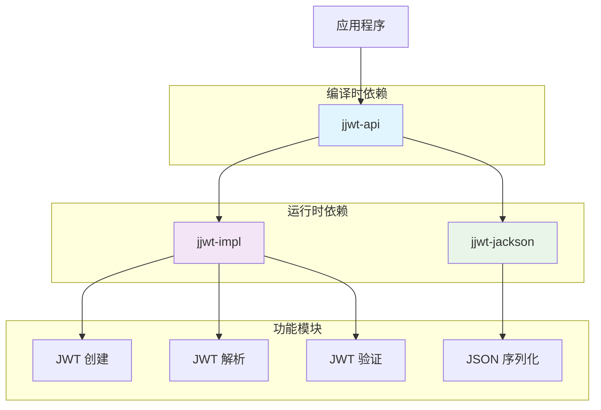

# 🔐 JJWT 依赖包完全指南 - 从入门到精通

## 📋 摘要

在现代化的 Java 应用中，JWT（JSON Web Token）已成为身份认证和授权的主流方案。JJWT 作为 Java 生态中最受欢迎的 JWT 库，其模块化设计让开发者能够灵活选择所需功能。本指南将深入解析 JJWT 0.12.3 版本的三个核心依赖包：`jjwt-api`、`jjwt-impl` 和 `jjwt-jackson`，帮助您理解它们的作用、区别以及最佳使用方式。无论您是 JWT 新手还是经验丰富的开发者，都能从中获得实用的知识和技巧。

---

## 🎯 目录

- [JJWT 简介](#jjwt-简介)
- [核心依赖包详解](#核心依赖包详解)
- [模块关系图](#模块关系图)
- [依赖配置详解](#依赖配置详解)
- [实际使用示例](#实际使用示例)
- [最佳实践](#最佳实践)
- [常见问题解答](#常见问题解答)
- [总结](#总结)

---

## 🚀 JJWT 简介

JJWT（Java JWT）是一个功能强大且易于使用的 Java 库，专门用于创建、解析和验证 JSON Web Token（JWT）。自 0.10.0 版本开始，JJWT 采用了模块化架构设计，将功能拆分为多个独立的模块，这种设计带来了以下优势：

- ✅ **灵活性**：开发者可以根据需求选择特定模块
- ✅ **可维护性**：模块化设计便于维护和更新
- ✅ **性能优化**：避免引入不必要的依赖
- ✅ **版本兼容性**：API 与实现分离，确保向后兼容

---

## 🔧 核心依赖包详解

### 1. jjwt-api 📚

**作用**：提供 JWT 的核心接口和抽象类

**特点**：
- 🎯 定义所有 JWT 操作的公共 API
- 🔒 包含接口和抽象类，不包含具体实现
- 📦 编译时依赖，必须添加到项目中
- 🛡️ API 稳定，向后兼容性良好

**核心类**：
```java
// 主要接口和类
Jwts.builder()           // JWT 构建器
Jwts.parserBuilder()     // JWT 解析器构建器
Claims                   // JWT 声明接口
JwtParser                // JWT 解析器接口
```

### 2. jjwt-impl ⚙️

**作用**：包含 `jjwt-api` 接口的具体实现

**特点**：
- 🔨 提供所有 API 接口的具体实现
- 🏃 运行时依赖，编译时不需要
- 🔄 实现细节可能在版本更新中变化
- 📊 包含加密、签名等核心算法实现

**为什么使用 runtime scope**：
- 编译时只依赖稳定的 API 接口
- 实现细节的变化不会影响编译
- 提高代码的稳定性和可维护性

### 3. jjwt-jackson 🎨

**作用**：提供基于 Jackson 的 JSON 序列化/反序列化支持

**特点**：
- 📝 支持将 JWT 声明序列化为 JSON
- 🔄 支持将 JSON 反序列化为 Java 对象
- 🎯 基于 Jackson 库实现
- 🏃 运行时依赖，编译时不需要

**替代方案**：
- `jjwt-gson`：基于 Gson 的 JSON 处理
- `jjwt-orgjson`：基于 org.json 的 JSON 处理

---

## 📊 模块关系图



---

## ⚙️ 依赖配置详解

### Maven 配置

```xml
<!-- 核心 API 依赖（编译时必需） -->
<dependency>
    <groupId>io.jsonwebtoken</groupId>
    <artifactId>jjwt-api</artifactId>
    <version>0.12.3</version>
</dependency>

<!-- 具体实现（运行时必需） -->
<dependency>
    <groupId>io.jsonwebtoken</groupId>
    <artifactId>jjwt-impl</artifactId>
    <version>0.12.3</version>
    <scope>runtime</scope>
</dependency>

<!-- Jackson JSON 处理（运行时必需） -->
<dependency>
    <groupId>io.jsonwebtoken</groupId>
    <artifactId>jjwt-jackson</artifactId>
    <version>0.12.3</version>
    <scope>runtime</scope>
</dependency>
```

### Gradle 配置

```gradle
dependencies {
    // 核心 API 依赖
    implementation 'io.jsonwebtoken:jjwt-api:0.12.3'
    
    // 运行时依赖
    runtimeOnly 'io.jsonwebtoken:jjwt-impl:0.12.3'
    runtimeOnly 'io.jsonwebtoken:jjwt-jackson:0.12.3'
}
```

### 简化配置（推荐）

如果您不需要精细控制依赖，可以使用聚合依赖：

```xml
<dependency>
    <groupId>io.jsonwebtoken</groupId>
    <artifactId>jjwt</artifactId>
    <version>0.12.3</version>
</dependency>
```

---

## 💻 实际使用示例

### 1. 创建 JWT Token

```java
import io.jsonwebtoken.Jwts;
import io.jsonwebtoken.security.Keys;
import java.security.Key;
import java.util.Date;

public class JwtService {
    
    // 密钥（实际项目中应从配置文件读取）
    private static final String SECRET_KEY = "mySecretKey123456789012345678901234567890";
    private static final Key key = Keys.hmacShaKeyFor(SECRET_KEY.getBytes());
    
    /**
     * 创建 JWT Token
     */
    public String createToken(String username, String role) {
        return Jwts.builder()
                .setSubject(username)                    // 设置主题
                .claim("role", role)                     // 添加自定义声明
                .setIssuedAt(new Date())                 // 设置签发时间
                .setExpiration(new Date(System.currentTimeMillis() + 86400000)) // 24小时后过期
                .signWith(key)                           // 使用密钥签名
                .compact();                              // 生成紧凑的 JWT 字符串
    }
}
```

### 2. 解析和验证 JWT Token

```java
import io.jsonwebtoken.Claims;
import io.jsonwebtoken.Jwts;
import io.jsonwebtoken.security.Keys;

public class JwtValidator {
    
    private static final String SECRET_KEY = "mySecretKey123456789012345678901234567890";
    private static final Key key = Keys.hmacShaKeyFor(SECRET_KEY.getBytes());
    
    /**
     * 解析 JWT Token
     */
    public Claims parseToken(String token) {
        return Jwts.parserBuilder()
                .setSigningKey(key)                      // 设置签名密钥
                .build()
                .parseClaimsJws(token)                   // 解析 JWT
                .getBody();                              // 获取声明内容
    }
    
    /**
     * 验证 Token 是否有效
     */
    public boolean validateToken(String token) {
        try {
            Jwts.parserBuilder()
                .setSigningKey(key)
                .build()
                .parseClaimsJws(token);
            return true;
        } catch (Exception e) {
            return false;
        }
    }
    
    /**
     * 从 Token 中获取用户名
     */
    public String getUsernameFromToken(String token) {
        Claims claims = parseToken(token);
        return claims.getSubject();
    }
}
```

### 3. Spring Boot 集成示例

```java
import org.springframework.stereotype.Component;
import io.jsonwebtoken.*;
import java.util.Date;

@Component
public class JwtUtil {
    
    private final String secret = "mySecretKey123456789012345678901234567890";
    private final int jwtExpiration = 86400000; // 24小时
    
    /**
     * 生成 JWT Token
     */
    public String generateToken(String username) {
        return Jwts.builder()
                .setSubject(username)
                .setIssuedAt(new Date())
                .setExpiration(new Date(System.currentTimeMillis() + jwtExpiration))
                .signWith(SignatureAlgorithm.HS512, secret)
                .compact();
    }
    
    /**
     * 验证 JWT Token
     */
    public boolean validateToken(String token) {
        try {
            Jwts.parser().setSigningKey(secret).parseClaimsJws(token);
            return true;
        } catch (JwtException | IllegalArgumentException e) {
            return false;
        }
    }
    
    /**
     * 获取用户名
     */
    public String getUsernameFromToken(String token) {
        return Jwts.parser()
                .setSigningKey(secret)
                .parseClaimsJws(token)
                .getBody()
                .getSubject();
    }
}
```

---

## 🎯 最佳实践

### 1. 安全配置

```java
// ✅ 推荐：使用强密钥
private static final String SECRET_KEY = "myVeryLongSecretKeyThatIsAtLeast256BitsLongForHS256Algorithm";

// ❌ 不推荐：使用弱密钥
private static final String WEAK_KEY = "123456";
```

### 2. 异常处理

```java
public Claims parseTokenSafely(String token) {
    try {
        return Jwts.parserBuilder()
                .setSigningKey(key)
                .build()
                .parseClaimsJws(token)
                .getBody();
    } catch (ExpiredJwtException e) {
        log.error("Token 已过期: {}", e.getMessage());
        throw new TokenExpiredException("Token 已过期");
    } catch (UnsupportedJwtException e) {
        log.error("不支持的 Token: {}", e.getMessage());
        throw new UnsupportedTokenException("不支持的 Token 格式");
    } catch (MalformedJwtException e) {
        log.error("Token 格式错误: {}", e.getMessage());
        throw new MalformedTokenException("Token 格式错误");
    } catch (SignatureException e) {
        log.error("Token 签名验证失败: {}", e.getMessage());
        throw new InvalidSignatureException("Token 签名验证失败");
    } catch (IllegalArgumentException e) {
        log.error("Token 参数错误: {}", e.getMessage());
        throw new InvalidTokenException("Token 参数错误");
    }
}
```

### 3. 配置管理

```yaml
# application.yml
jwt:
  secret: ${JWT_SECRET:myDefaultSecretKey123456789012345678901234567890}
  expiration: 86400000  # 24小时
  refresh-expiration: 604800000  # 7天
```

### 4. 性能优化

```java
// ✅ 推荐：缓存解析器
private final JwtParser jwtParser;

public JwtUtil() {
    this.jwtParser = Jwts.parserBuilder()
            .setSigningKey(key)
            .build();
}

// ❌ 不推荐：每次都创建新的解析器
public Claims parseToken(String token) {
    return Jwts.parserBuilder()  // 每次都创建新实例
            .setSigningKey(key)
            .build()
            .parseClaimsJws(token)
            .getBody();
}
```

---

## ❓ 常见问题解答

### Q1: 为什么需要三个依赖包？

**A**: JJWT 采用模块化设计，将 API 定义、具体实现和 JSON 处理分离，这样可以让开发者根据需要选择特定功能，避免引入不必要的依赖。

### Q2: 可以只使用 jjwt-api 吗？

**A**: 不可以。`jjwt-api` 只提供接口定义，没有具体实现。必须同时引入 `jjwt-impl` 才能正常工作。

### Q3: jjwt-jackson 是必需的吗？

**A**: 是的，JJWT 需要 JSON 处理库来序列化和反序列化 JWT 内容。如果不使用 Jackson，可以选择 `jjwt-gson` 或 `jjwt-orgjson`。

### Q4: 如何选择合适的 JSON 处理库？

**A**: 
- **Jackson**：功能最全面，性能优秀，推荐使用
- **Gson**：Google 开发，API 简洁
- **org.json**：轻量级，功能基础

### Q5: 版本 0.12.3 有什么新特性？

**A**: 0.12.3 版本主要修复了安全漏洞，提升了性能，并增强了与最新 Java 版本的兼容性。

---

## 🎉 总结

通过本指南，您已经全面了解了 JJWT 0.12.3 版本的三个核心依赖包：

- 🔑 **jjwt-api**：提供稳定的 API 接口
- ⚙️ **jjwt-impl**：包含具体的实现逻辑  
- 🎨 **jjwt-jackson**：处理 JSON 序列化

这种模块化设计让您能够灵活选择所需功能，同时保持代码的稳定性和可维护性。记住，在现代化的 Java 应用中，JWT 不仅是身份认证的利器，更是构建安全、可扩展系统的基石。

现在就开始您的 JWT 之旅吧！🚀 无论是构建微服务架构还是开发企业级应用，JJWT 都将成为您最可靠的伙伴。让我们一起用 JWT 构建更安全、更高效的 Java 应用！

---

**厦门工学院人工智能创作坊 -- 郑恩赐**  
**2025年10月7日**
