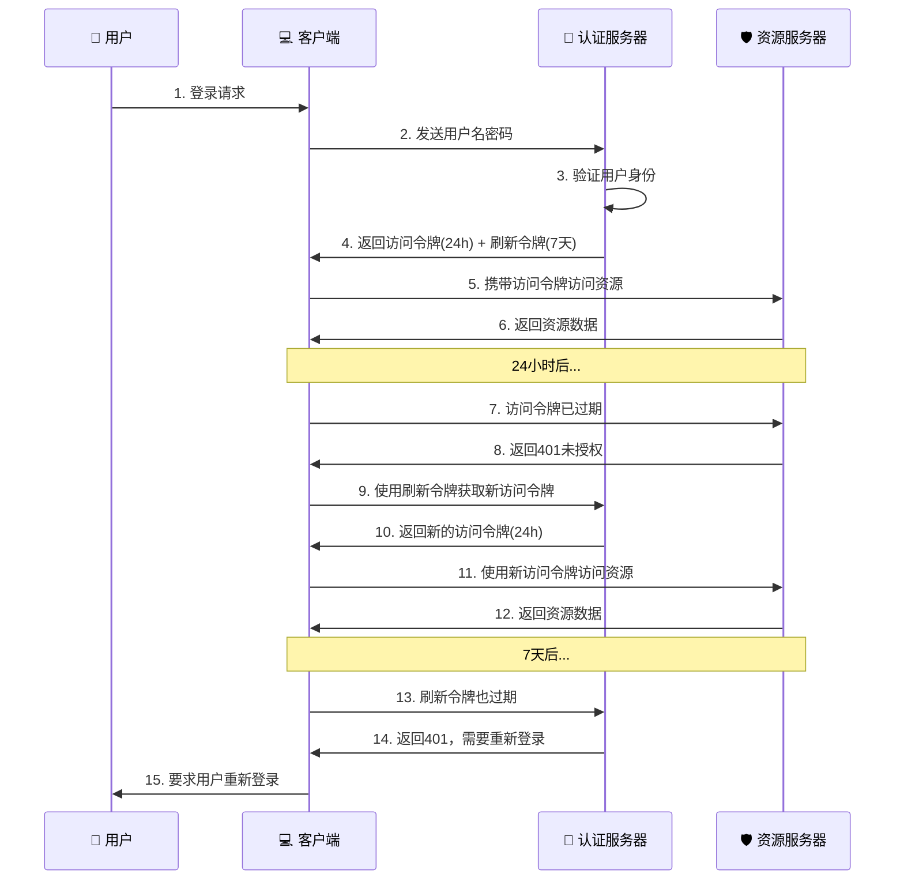
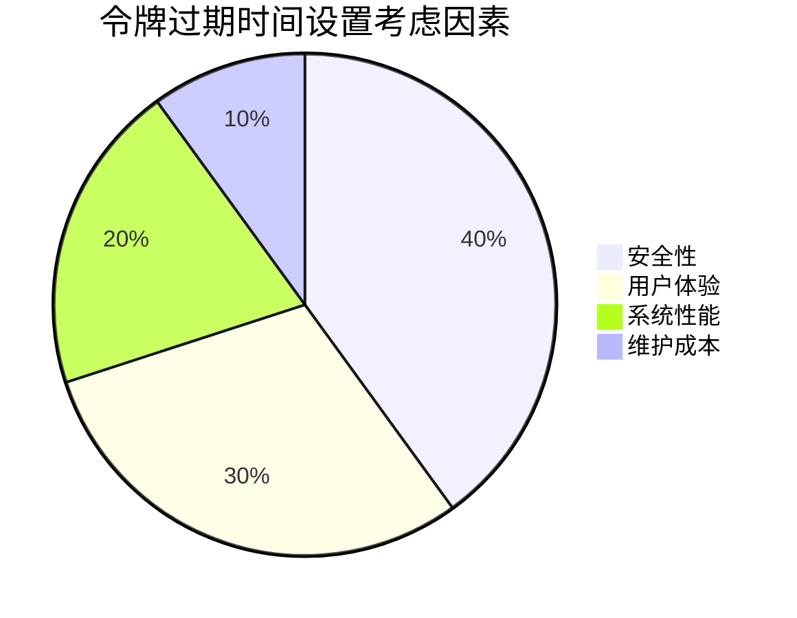

# 🔐 JWT 访问令牌与刷新令牌过期时间完全解析 - 24 小时 vs 7 天的安全密码

## 📋 摘要

在现代化的 Web 应用中，JWT（JSON Web Token）技术已成为身份认证的核心。本文将深入解析访问令牌（Access Token）24 小时过期时间与刷新令牌（Refresh Token）7 天过期时间的本质区别。通过对比分析、实际案例和最佳实践，帮助开发者理解为什么需要设置不同的过期时间，以及如何在实际项目中正确配置这些关键参数。无论你是 JWT 新手还是经验丰富的开发者，都能从中获得实用的技术洞察和安全配置建议。

---

## 🎯 什么是 JWT 令牌过期时间？

JWT 令牌过期时间是指令牌从创建到失效的时间间隔，通常以秒为单位表示。在 JWT 技术中，主要有两种令牌类型：

- **访问令牌（Access Token）**：用于访问受保护资源的短期令牌
- **刷新令牌（Refresh Token）**：用于获取新访问令牌的长期令牌

## ⏰ 两种令牌过期时间对比

### 📊 基本配置对比

| 令牌类型 | 过期时间 | 秒数 | 用途 | 安全级别 |
|---------|---------|------|------|---------|
| 🔑 访问令牌 | 24 小时 | 86,400 秒 | 访问 API 资源 | 高 |
| 🔄 刷新令牌 | 7 天 | 604,800 秒 | 获取新访问令牌 | 极高 |

### 🔍 详细分析

#### 1. 访问令牌（Access Token）- 86,400 秒（24 小时）

**特点：**
- ⏱️ **短期有效**：24 小时的生命周期
- 🎯 **频繁使用**：每次 API 请求都需要携带
- 🛡️ **安全优先**：短时间减少被盗用风险
- 🔄 **自动刷新**：过期后通过刷新令牌获取新令牌

**配置示例：**
```yaml
# 访问令牌过期时间（秒）- 24 小时
access-token-expiration: 86400
```

#### 2. 刷新令牌（Refresh Token）- 604,800 秒（7 天）

**特点：**
- ⏰ **长期有效**：7 天的生命周期
- 🎯 **偶尔使用**：仅在访问令牌过期时使用
- 🔒 **高安全要求**：需要更严格的保护措施
- 👤 **用户体验**：减少用户频繁登录

**配置示例：**
```yaml
# 刷新令牌过期时间（秒）- 7 天  
refresh-token-expiration: 604800
```

## 🔄 JWT 令牌刷新流程



## 🛡️ 为什么需要不同的过期时间？

### 🔐 安全考虑

#### 访问令牌 - 短期策略
- **降低风险**：24 小时的短生命周期意味着即使令牌被盗用，攻击者也只能在有限时间内使用
- **频繁轮换**：每天自动刷新，减少长期暴露风险
- **最小权限**：每次刷新都会重新验证用户状态

#### 刷新令牌 - 长期策略
- **用户体验**：7 天的有效期避免用户频繁登录
- **安全存储**：刷新令牌通常存储在更安全的地方（如 HttpOnly Cookie）
- **单次使用**：每次使用后通常会被撤销并生成新的

### 📊 时间设置的科学依据



## 💻 实际应用场景

### 🏢 企业级应用

**场景描述：** 企业内部管理系统
- **访问令牌**：24 小时（86,400 秒）
- **刷新令牌**：7 天（604,800 秒）
- **原因**：员工每天工作，但周末可能不登录

### 📱 移动应用

**场景描述：** 手机 App 应用
- **访问令牌**：2 小时（7,200 秒）
- **刷新令牌**：30 天（2,592,000 秒）
- **原因**：移动设备更容易丢失，需要更短的安全窗口

### 🌐 Web 应用

**场景描述：** 电商网站
- **访问令牌**：24 小时（86,400 秒）
- **刷新令牌**：7 天（604,800 秒）
- **原因**：平衡安全性和购物体验

## ⚙️ Spring Boot 配置实现

### 📝 application.yml 配置

```yaml
# JWT 配置
jwt:
  # 访问令牌过期时间（秒）- 24 小时
  access-token-expiration: 86400
  # 刷新令牌过期时间（秒）- 7 天
  refresh-token-expiration: 604800
  # 密钥
  secret: your-secret-key
  # 令牌前缀
  token-prefix: "Bearer "
  # 请求头名称
  header-name: "Authorization"
```

### 🔧 Java 配置类

```java
@Configuration
@ConfigurationProperties(prefix = "jwt")
@Data
public class JwtConfig {
    
    /**
     * 访问令牌过期时间（秒）- 24 小时
     */
    private Long accessTokenExpiration = 86400L;
    
    /**
     * 刷新令牌过期时间（秒）- 7 天
     */
    private Long refreshTokenExpiration = 604800L;
    
    private String secret;
    private String tokenPrefix;
    private String headerName;
}
```

### 🛠️ JWT 工具类实现

```java
@Component
@Slf4j
public class JwtTokenUtil {
    
    @Autowired
    private JwtConfig jwtConfig;
    
    /**
     * 生成访问令牌（24 小时有效期）
     */
    public String generateAccessToken(UserDetails userDetails) {
        Map<String, Object> claims = new HashMap<>();
        claims.put("tokenType", "ACCESS");
        return createToken(claims, userDetails.getUsername(), 
                          jwtConfig.getAccessTokenExpiration());
    }
    
    /**
     * 生成刷新令牌（7 天有效期）
     */
    public String generateRefreshToken(UserDetails userDetails) {
        Map<String, Object> claims = new HashMap<>();
        claims.put("tokenType", "REFRESH");
        return createToken(claims, userDetails.getUsername(), 
                          jwtConfig.getRefreshTokenExpiration());
    }
    
    /**
     * 创建令牌
     */
    private String createToken(Map<String, Object> claims, String subject, Long expiration) {
        return Jwts.builder()
                .setClaims(claims)
                .setSubject(subject)
                .setIssuedAt(new Date(System.currentTimeMillis()))
                .setExpiration(new Date(System.currentTimeMillis() + expiration * 1000))
                .signWith(SignatureAlgorithm.HS512, jwtConfig.getSecret())
                .compact();
    }
}
```

## 🔍 令牌验证与刷新逻辑

### 🔐 访问令牌验证

```java
@Component
public class JwtAuthenticationFilter extends OncePerRequestFilter {
    
    @Override
    protected void doFilterInternal(HttpServletRequest request, 
                                  HttpServletResponse response, 
                                  FilterChain filterChain) throws ServletException, IOException {
        
        String token = extractTokenFromRequest(request);
        
        if (token != null && jwtTokenUtil.validateToken(token)) {
            // 验证访问令牌
            String username = jwtTokenUtil.getUsernameFromToken(token);
            UserDetails userDetails = userDetailsService.loadUserByUsername(username);
            
            UsernamePasswordAuthenticationToken authentication = 
                new UsernamePasswordAuthenticationToken(userDetails, null, userDetails.getAuthorities());
            SecurityContextHolder.getContext().setAuthentication(authentication);
        }
        
        filterChain.doFilter(request, response);
    }
}
```

### 🔄 刷新令牌处理

```java
@RestController
@RequestMapping("/api/auth")
public class AuthController {
    
    @PostMapping("/refresh")
    public ResponseEntity<?> refreshToken(@RequestBody RefreshTokenRequest request) {
        try {
            String refreshToken = request.getRefreshToken();
            
            // 验证刷新令牌
            if (jwtTokenUtil.validateToken(refreshToken) && 
                "REFRESH".equals(jwtTokenUtil.getTokenType(refreshToken))) {
                
                String username = jwtTokenUtil.getUsernameFromToken(refreshToken);
                UserDetails userDetails = userDetailsService.loadUserByUsername(username);
                
                // 生成新的访问令牌
                String newAccessToken = jwtTokenUtil.generateAccessToken(userDetails);
                
                return ResponseEntity.ok(new TokenResponse(newAccessToken, refreshToken));
            }
            
            return ResponseEntity.status(HttpStatus.UNAUTHORIZED)
                    .body("刷新令牌无效或已过期");
                    
        } catch (Exception e) {
            log.error("刷新令牌失败", e);
            return ResponseEntity.status(HttpStatus.INTERNAL_SERVER_ERROR)
                    .body("服务器内部错误");
        }
    }
}
```

## 📈 性能优化建议

### ⚡ 缓存策略

```java
@Service
public class TokenCacheService {
    
    @Autowired
    private RedisTemplate<String, Object> redisTemplate;
    
    /**
     * 缓存访问令牌（24 小时）
     */
    public void cacheAccessToken(String token, UserDetails userDetails) {
        String key = "access_token:" + token;
        redisTemplate.opsForValue().set(key, userDetails, Duration.ofHours(24));
    }
    
    /**
     * 缓存刷新令牌（7 天）
     */
    public void cacheRefreshToken(String token, UserDetails userDetails) {
        String key = "refresh_token:" + token;
        redisTemplate.opsForValue().set(key, userDetails, Duration.ofDays(7));
    }
}
```

### 🔄 自动刷新机制

```javascript
// 前端自动刷新令牌
class TokenManager {
    constructor() {
        this.accessToken = localStorage.getItem('accessToken');
        this.refreshToken = localStorage.getItem('refreshToken');
        this.setupAutoRefresh();
    }
    
    setupAutoRefresh() {
        // 每 23 小时检查一次（提前 1 小时刷新）
        setInterval(() => {
            this.refreshAccessToken();
        }, 23 * 60 * 60 * 1000);
    }
    
    async refreshAccessToken() {
        try {
            const response = await fetch('/api/auth/refresh', {
                method: 'POST',
                headers: {
                    'Content-Type': 'application/json',
                },
                body: JSON.stringify({
                    refreshToken: this.refreshToken
                })
            });
            
            if (response.ok) {
                const data = await response.json();
                this.accessToken = data.accessToken;
                localStorage.setItem('accessToken', this.accessToken);
            }
        } catch (error) {
            console.error('刷新令牌失败:', error);
            this.logout();
        }
    }
}
```

## 🚨 安全最佳实践

### 🔒 令牌安全存储

#### 访问令牌存储
- **内存存储**：推荐存储在内存中，页面刷新后需要重新获取
- **Session Storage**：浏览器会话期间有效
- **避免 Local Storage**：容易被 XSS 攻击获取

#### 刷新令牌存储
- **HttpOnly Cookie**：最安全的存储方式
- **Secure 标志**：仅在 HTTPS 连接中传输
- **SameSite 属性**：防止 CSRF 攻击

### 🛡️ 安全配置示例

```java
@Configuration
public class SecurityConfig {
    
    @Bean
    public CookieCsrfTokenRepository csrfTokenRepository() {
        CookieCsrfTokenRepository repository = new CookieCsrfTokenRepository();
        repository.setCookieHttpOnly(true);
        repository.setSecure(true);
        repository.setSameSite("Strict");
        return repository;
    }
    
    @Bean
    public CookieSerializer cookieSerializer() {
        DefaultCookieSerializer serializer = new DefaultCookieSerializer();
        serializer.setCookieName("refreshToken");
        serializer.setCookieMaxAge(604800); // 7 天
        serializer.setUseHttpOnlyCookie(true);
        serializer.setUseSecureCookie(true);
        serializer.setSameSite("Strict");
        return serializer;
    }
}
```

## 📊 监控与日志

### 📈 令牌使用统计

```java
@Component
public class TokenMetrics {
    
    private final MeterRegistry meterRegistry;
    
    public TokenMetrics(MeterRegistry meterRegistry) {
        this.meterRegistry = meterRegistry;
    }
    
    /**
     * 记录访问令牌使用
     */
    public void recordAccessTokenUsage() {
        meterRegistry.counter("jwt.access_token.usage").increment();
    }
    
    /**
     * 记录刷新令牌使用
     */
    public void recordRefreshTokenUsage() {
        meterRegistry.counter("jwt.refresh_token.usage").increment();
    }
    
    /**
     * 记录令牌过期
     */
    public void recordTokenExpiration(String tokenType) {
        meterRegistry.counter("jwt.token.expiration", "type", tokenType).increment();
    }
}
```

### 📝 详细日志记录

```java
@Aspect
@Component
@Slf4j
public class TokenLoggingAspect {
    
    @Around("@annotation(TokenOperation)")
    public Object logTokenOperation(ProceedingJoinPoint joinPoint) throws Throwable {
        String methodName = joinPoint.getSignature().getName();
        Object[] args = joinPoint.getArgs();
        
        log.info("开始执行令牌操作: {}, 参数: {}", methodName, Arrays.toString(args));
        
        try {
            Object result = joinPoint.proceed();
            log.info("令牌操作成功: {}", methodName);
            return result;
        } catch (Exception e) {
            log.error("令牌操作失败: {}, 错误: {}", methodName, e.getMessage());
            throw e;
        }
    }
}
```

## 🎯 实际项目配置建议

### 🏗️ 项目结构

```
src/main/java/com/example/jwt/
├── config/
│   ├── JwtConfig.java          # JWT 配置类
│   └── SecurityConfig.java     # 安全配置
├── controller/
│   └── AuthController.java     # 认证控制器
├── service/
│   ├── JwtTokenService.java    # JWT 令牌服务
│   └── UserService.java        # 用户服务
├── util/
│   └── JwtTokenUtil.java       # JWT 工具类
└── filter/
    └── JwtAuthenticationFilter.java  # JWT 认证过滤器
```

### 📋 配置文件模板

```yaml
# application.yml
spring:
  application:
    name: jwt-demo
  
# JWT 配置
jwt:
  # 访问令牌过期时间（秒）- 24 小时
  access-token-expiration: 86400
  # 刷新令牌过期时间（秒）- 7 天
  refresh-token-expiration: 604800
  # JWT 密钥（生产环境请使用更复杂的密钥）
  secret: mySecretKey123456789012345678901234567890
  # 令牌前缀
  token-prefix: "Bearer "
  # 请求头名称
  header-name: "Authorization"

# Redis 配置（用于令牌缓存）
spring:
  redis:
    host: localhost
    port: 6379
    database: 0
    timeout: 2000ms
    lettuce:
      pool:
        max-active: 8
        max-wait: -1ms
        max-idle: 8
        min-idle: 0

# 日志配置
logging:
  level:
    com.example.jwt: DEBUG
    org.springframework.security: DEBUG
```

## 🔧 常见问题与解决方案

### ❓ 问题 1：访问令牌过期太频繁

**问题描述：** 用户抱怨需要频繁重新登录

**解决方案：**
```java
// 调整访问令牌过期时间为 4 小时
access-token-expiration: 14400  // 4 小时
```

### ❓ 问题 2：刷新令牌被盗用

**问题描述：** 刷新令牌被恶意获取

**解决方案：**
```java
// 实现刷新令牌撤销机制
@Service
public class TokenRevocationService {
    
    @Autowired
    private RedisTemplate<String, Object> redisTemplate;
    
    public void revokeRefreshToken(String token) {
        String key = "revoked_token:" + token;
        redisTemplate.opsForValue().set(key, "revoked", Duration.ofDays(7));
    }
    
    public boolean isTokenRevoked(String token) {
        String key = "revoked_token:" + token;
        return redisTemplate.hasKey(key);
    }
}
```

### ❓ 问题 3：跨域令牌传递

**问题描述：** 前端跨域请求时令牌丢失

**解决方案：**
```java
@Configuration
public class CorsConfig {
    
    @Bean
    public CorsConfigurationSource corsConfigurationSource() {
        CorsConfiguration configuration = new CorsConfiguration();
        configuration.setAllowedOriginPatterns(Arrays.asList("*"));
        configuration.setAllowedMethods(Arrays.asList("GET", "POST", "PUT", "DELETE", "OPTIONS"));
        configuration.setAllowedHeaders(Arrays.asList("*"));
        configuration.setAllowCredentials(true);
        configuration.setExposedHeaders(Arrays.asList("Authorization"));
        
        UrlBasedCorsConfigurationSource source = new UrlBasedCorsConfigurationSource();
        source.registerCorsConfiguration("/**", configuration);
        return source;
    }
}
```

## 📚 总结

通过本文的深入解析，我们了解了 JWT 访问令牌 24 小时过期时间与刷新令牌 7 天过期时间的核心区别：

### 🎯 关键要点

1. **安全优先**：访问令牌的短期设计（24 小时）最大化了安全性
2. **用户体验**：刷新令牌的长期设计（7 天）优化了用户体验
3. **平衡策略**：两种不同的过期时间实现了安全性与便利性的完美平衡
4. **实际应用**：根据具体业务场景调整过期时间配置

### 🚀 实践建议

- 🔐 **安全第一**：始终将安全性放在首位
- ⚡ **性能优化**：合理使用缓存提升系统性能
- 📊 **监控告警**：建立完善的监控和日志系统
- 🔄 **持续改进**：根据用户反馈不断优化配置

### 💪 开发者寄语

JWT 令牌过期时间的配置看似简单，实则是系统安全架构的重要组成部分。掌握这些细节，不仅能提升你的技术实力，更能让你在开发过程中做出更明智的架构决策。记住，每一个看似微小的配置都可能影响整个系统的安全性和用户体验。继续深入学习，你将成为更优秀的开发者！

---

**厦门工学院人工智能创作坊 -- 郑恩赐**  
**2025 年 10 月 7 日**
