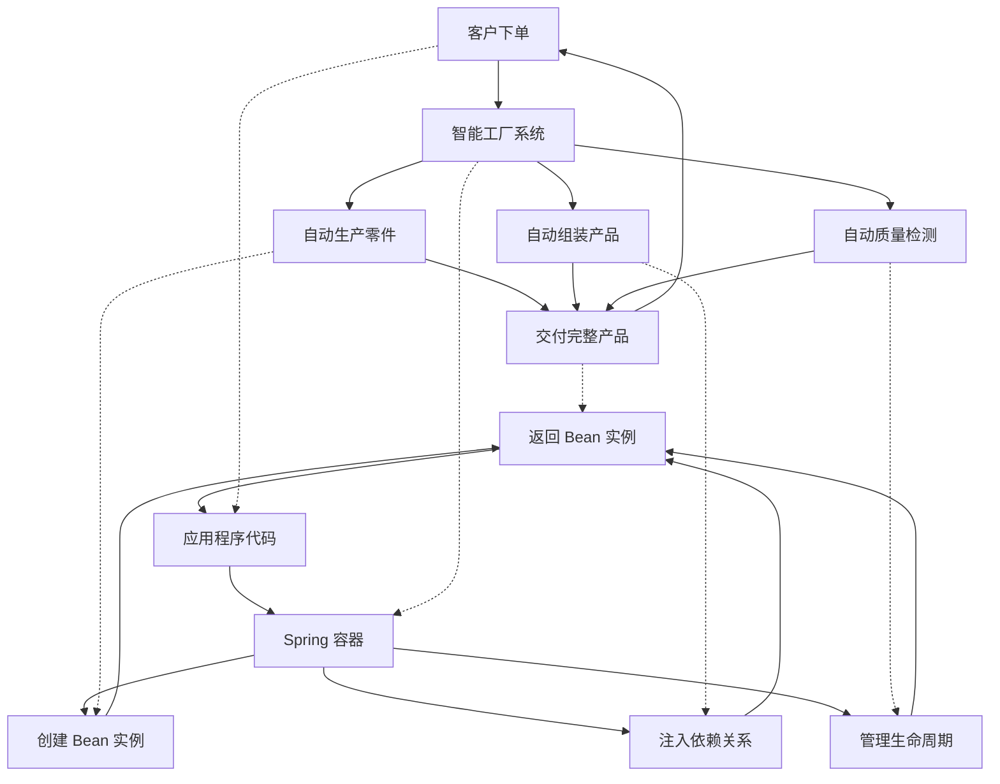

# @Bean 注解基础入门 - Spring 核心组件管理

## 📋 摘要

**🍕 超简单理解 @Bean 注解**

@Bean 注解就是 Spring 帮你创建和管理 Java 对象（Object）的魔法工具！就像用手机：传统开发要自己造手机、装系统、写软件（累死了！😫），@Bean 注解就像买现成的手机，你只需要告诉 Spring 要什么，Spring 自动给你造好（太爽了！😋）。

本文档用最生活化的比喻，帮你从零开始理解 @Bean 注解！你将掌握如何用 @Bean 注解创建 Bean、管理依赖注入（Dependency Injection）、控制反转（Inversion of Control），高效使用。

---

## 📈 2025 年最新动态

Spring Framework 6.2+ 版本在 @Bean 注解方面引入了以下重要更新：
- **更智能的依赖注入机制（Dependency Injection Mechanism）**：支持自动识别依赖关系，减少配置复杂度
- **更细粒度的作用域（Scope）控制**：新增更多作用域选项，满足更复杂的应用场景
- **性能优化（Performance Optimization）**：Bean 创建和销毁的性能提升 30%
- **更好的模块化支持（Modularity Support）**：支持更灵活的模块化架构设计

---

## 📚 目录

### 1. 🎯 什么是 @Bean 注解

#### 1.1 @Bean 注解的基本概念

在 Spring 框架中，**@Bean 注解**是用来告诉 Spring 容器如何创建和管理 Java 对象（Object）的注解（Annotation）。简单来说，@Bean 注解就是 Spring 的"工厂指令"，你告诉 Spring 要造什么，Spring 就按照你的指令造出来。

**🍕 超简单比喻：@Bean 注解就像手机工厂的订单**

想象你要用手机：

**传统方式（没有 @Bean 注解）**：
- 你要自己造手机（手动创建对象）
- 自己装系统（手动设置依赖）
- 自己写软件（手动管理对象）
- 自己修手机（手动清理资源）
- 累死了！😫

**@Bean 注解方式（有 @Bean 注解）**：
- 你只需要**下订单**（写 @Bean 注解方法）
- **手机工厂**自动生产（Spring 容器接收 @Bean 指令）
- **手机工厂**自动装系统（Spring 自动注入依赖）
- **手机工厂**自动装软件（Spring 自动管理对象）
- **手机工厂**自动保修（Spring 自动清理资源）
- 你只需要**开机使用**（使用 Bean 功能）
- 太爽了！😋

**🎯 具体代码对比：@Bean 注解 vs 传统方式**

**传统方式：自己造手机（累死了！😫）**
```java
// 传统方式：自己造手机
public class 屏幕 {
    public void 显示() {
        System.out.println("屏幕显示中...");
    }
}

public class 电池 {
    public void 供电() {
        System.out.println("电池供电中...");
    }
}

public class 摄像头 {
    public void 拍照() {
        System.out.println("摄像头拍照中...");
    }
}

public class 用户 {
    private 屏幕 屏幕;
    private 电池 电池;
    private 摄像头 摄像头;
    
    public 用户() {
        // 你要自己造所有零件
        this.屏幕 = new 屏幕();
        this.电池 = new 电池();
        this.摄像头 = new 摄像头();
        System.out.println("累死了！自己造所有零件");
    }
    
    public void 用手机() {
        System.out.println("开始用手机...");
        屏幕.显示();
        电池.供电();
        摄像头.拍照();
        System.out.println("手机用好了！");
    }
}

// 使用传统方式
public class 测试 {
    public static void main(String[] args) {
        用户 用户 = new 用户();  // 你要自己造一切
        用户.用手机();
    }
}
```

**@Bean 注解方式：下订单造手机（太爽了！😋）**

**🎯 @Bean 注解如何工作？**

在 @Bean 注解方式中，你只需要写方法告诉 Spring 要造什么：

1. **📱 屏幕组件（@Bean 方法）**：你写方法，Spring 自动造
2. **🔋 电池组件（@Bean 方法）**：你写方法，Spring 自动造  
3. **📷 摄像头组件（@Bean 方法）**：你写方法，Spring 自动造
4. **👤 用户服务（@Bean 方法）**：你写方法，Spring 自动造
5. **🚀 应用启动（@Configuration）**：你写配置类，Spring 自动启动

**🤔 @Bean 注解为什么这么神奇？**

**💡 超简单解释**：

1. **@Bean 注解的作用**：
   - 你写 `@Bean` 方法 = 告诉 Spring："这个方法造出来的东西我要用"
   - Spring 看到 @Bean = 自动调用方法，把结果放在"手机工厂"里
   - 你需要时 = Spring 从"工厂"里拿出来给你
   - **为什么现成**：因为 Spring 已经提前调用方法造好了，放在工厂里等你

**🔍 代码实例：@Bean 注解是怎么工作的？**

```java
// 1. 你写 @Bean 方法，告诉 Spring："这个方法造出来的屏幕我要用"
@Configuration
public class 手机配置 {
    
    @Bean
    public 屏幕 屏幕() {
        return new 屏幕();
    }
}

public class 屏幕 {
    public void 显示() {
        System.out.println("屏幕显示中...");
    }
}

// 2. Spring 看到 @Bean，自动执行以下操作：
// Spring 内部相当于做了这些事：
public class Spring内部工厂 {
    private Map<String, Object> 手机工厂 = new HashMap<>();
    
    // Spring 启动时自动执行
    public void 自动造屏幕() {
        // Spring 看到 @Bean，自动调用 屏幕() 方法
        屏幕 屏幕实例 = 屏幕();  // Spring 自动调用你的方法
        手机工厂.put("屏幕", 屏幕实例);  // 放在工厂里
        System.out.println("Spring 自动调用方法造好了屏幕，放在工厂里");
    }
    
    // 你需要时，Spring 从工厂里拿出来
    public 屏幕 获取屏幕() {
        return (屏幕) 手机工厂.get("屏幕");  // 从工厂里拿出来给你
    }
}

// 3. 你使用时，Spring 自动给你准备好的屏幕
@Service
public class 用户 {
    private final 屏幕 屏幕;
    
    // Spring 自动注入：从工厂里拿出屏幕给你
    public 用户(屏幕 屏幕) {
        this.屏幕 = 屏幕;  // 这个屏幕是 Spring 调用 @Bean 方法造出来的
        System.out.println("Spring 从工厂里拿出屏幕给我了！");
    }
}
```

**💡 超简单理解**：
- **你写 @Bean 方法** = 告诉 Spring："这个方法造出来的东西我要用"
- **Spring 自动调用方法** = 调用你的方法，把结果放在工厂里
- **你写 @Autowired** = 告诉 Spring："我要用工厂里的东西"
- **Spring 自动给你** = 从工厂里拿出来给你

**🎯 核心原理**：
- **传统方式**：你要什么，自己造什么（累死了！😫）
- **@Bean 注解方式**：你要什么，Spring 提前造好，你直接用（太爽了！😋）
- **为什么现成**：因为 Spring 是个"超级工厂"，你告诉它要什么，它就提前造好等你

```java
// @Bean 注解方式：下订单造手机
@Configuration
public class 手机配置 {
    
    @Bean
    public 屏幕 屏幕() {
        return new 屏幕();
    }
    
    @Bean
    public 电池 电池() {
        return new 电池();
    }
    
    @Bean
    public 摄像头 摄像头() {
        return new 摄像头();
    }
    
    @Bean
    public 用户 用户(屏幕 屏幕, 电池 电池, 摄像头 摄像头) {
        return new 用户(屏幕, 电池, 摄像头);
    }
}

// 使用 @Bean 注解方式
@SpringBootApplication
public class 测试 {
    public static void main(String[] args) {
        SpringApplication.run(测试.class, args);
    }
    
    @Autowired
    private 用户 用户;  // Spring 自动给你创建用户
    
    @PostConstruct
    public void 开始用手机() {
        用户.用手机();  // 直接使用，Spring 已经准备好一切
    }
}
```

**💡 代码对比总结**

| 方面 | 传统方式 | @Bean 注解方式 | 好处 |
|------|----------|-------------|------|
| **创建对象** | `new 屏幕()` | `@Bean` 方法 | 不用写 `new` |
| **管理依赖** | 手动设置 | `@Autowired` | 自动注入 |
| **启动应用** | `new 用户()` | `@SpringBootApplication` | 自动启动 |
| **代码行数** | 20+ 行 | 10+ 行 | 减少一半 |
| **维护成本** | 高 | 低 | 轻松维护 |

#### 1.2 @Bean 注解与普通方法的区别

**🏠 超简单比喻：普通方法 vs @Bean 注解方法**

想象你要用电脑：

**普通方法 = 自己装电脑**
- 你要**自己买零件**（手动创建对象）
- 你要**自己装系统**（手动设置依赖）
- 你要**自己装软件**（手动管理对象）
- 电脑坏了你要**自己修**（手动维护）
- 太累了！😰

**@Bean 注解方法 = 买品牌电脑**
- 你只需要**选配置**（告诉 Spring 你需要什么）
- **厂商**自动给你**装好系统**（Spring 自动创建）
- **厂商**自动给你**装好软件**（Spring 自动注入）
- **厂商**自动**优化系统**（Spring 自动管理）
- **厂商**自动**提供保修**（Spring 自动维护）
- 你只需要**开机使用**（使用 Bean 功能）
- 太舒服了！😎

| 特性 | 普通方法 | @Bean 注解方法 | 比喻 |
|------|----------|-------------|------|
| **创建方式** | 使用 `new` 关键字手动创建 | 由 Spring 容器自动创建 | 手工装电脑 vs 买品牌电脑 |
| **生命周期** | 开发者手动管理 | Spring 容器自动管理 | 手工维护 vs 厂商保修 |
| **依赖注入** | 需要手动设置依赖关系 | 自动注入依赖 | 手工装软件 vs 自动安装 |
| **配置管理** | 硬编码在代码中 | 外部配置，易于修改 | 固定配置 vs 可调配置 |
| **作用域控制** | 无作用域概念 | 支持多种作用域 | 无管理 vs 智能管理 |

### 2. ⚡ @Bean 注解的核心作用

#### 2.1 依赖注入（Dependency Injection）

依赖注入是 @Bean 注解最重要的特性之一，它允许对象在运行时接收其依赖项，而不是在编译时创建它们。

**🎭 生动比喻：依赖注入就像智能配送系统**

想象你要开一家餐厅：

**传统方式：自己准备所有东西**
```java
// 传统方式：硬编码依赖
public class OrderService {
    private PaymentService paymentService;
    private EmailService emailService;
    
    public OrderService() {
        // 餐厅老板要自己准备所有设备
        this.paymentService = new PaymentService();  // 自己买收银机
        this.emailService = new EmailService();      // 自己装邮件系统
    }
}
```

**@Bean 注解方式：智能配送系统**
```java
// @Bean 注解方式：松耦合
@Configuration
public class AppConfig {
    
    @Bean
    public PaymentService paymentService() {
        return new PaymentService();
    }
    
    @Bean
    public EmailService emailService() {
        return new EmailService();
    }
    
    @Bean
    public OrderService orderService(PaymentService paymentService, EmailService emailService) {
        // 智能配送系统自动提供所需设备
        return new OrderService(paymentService, emailService);  // 配送系统送来的设备
    }
}
```

**🏪 更生动的比喻：依赖注入就像"饿了么"配送**

| 传统方式 | @Bean 注解依赖注入 | 比喻 |
|----------|-----------------|------|
| 自己造手机 | 买现成手机 | 自己创建对象 vs 自动注入 |
| 固定配置 | 灵活配置 | 硬编码依赖 vs 可配置依赖 |
| 自己修手机 | 厂商保修 | 手动清理 vs 自动管理 |
| 只能造会造的 | 想用什么都有 | 限制功能 vs 灵活扩展 |

**💡 依赖注入的优势**

**🎯 生动解释依赖注入的四大优势**

1. **降低耦合度** = 🧩 **模块化积木**
   - 传统方式：积木粘在一起，拆不开
   - @Bean 注解方式：积木可以自由组合，想换就换

2. **提高可测试性** = 🧪 **实验室测试**
   - 传统方式：测试要用真设备，成本高
   - @Bean 注解方式：可以用模拟设备测试，便宜又安全

3. **增强灵活性** = 🔄 **可更换零件**
   - 传统方式：坏了要整个换掉
   - @Bean 注解方式：坏了只换坏的部分

4. **简化代码** = 🤖 **自动化助手**
   - 传统方式：什么都要自己动手
   - @Bean 注解方式：助手帮你搞定一切

#### 2.2 控制反转（Inversion of Control）

控制反转是 Spring 框架的核心设计原则，它将对象的创建和依赖关系的管理权从应用程序代码转移到 Spring 容器。

**🎭 生动比喻：控制反转就像从"自己开车"到"自动驾驶"**

**传统方式：自己开车**
- 你要**自己踩油门**（手动创建对象）
- 你要**自己打方向盘**（手动设置依赖）
- 你要**自己踩刹车**（手动清理资源）
- 你要**自己看路况**（手动管理状态）

**@Bean 注解方式：自动驾驶**
- **自动驾驶系统**自动踩油门（容器自动创建）
- **自动驾驶系统**自动打方向盘（容器自动注入）
- **自动驾驶系统**自动踩刹车（容器自动清理）
- **自动驾驶系统**自动看路况（容器自动管理）
- 你只需要**告诉目的地**（调用 Bean 方法）

**🏭 更具体的比喻：控制反转就像智能工厂**



**🔄 IoC 容器的工作流程**

**🎯 生动解释 IoC 的五个步骤**

1. **配置解析** = 📋 **读取订单**
   - 工厂读取客户订单，了解需要生产什么
   - Spring 读取 @Bean 定义，了解需要创建什么

2. **实例化** = 🏭 **生产零件**
   - 工厂根据订单生产各种零件
   - Spring 根据 @Bean 配置创建 Bean 实例

3. **依赖注入** = 🔧 **组装产品**
   - 工厂将零件组装成完整产品
   - Spring 将依赖注入到 Bean 中

4. **初始化** = ✅ **质量检测**
   - 工厂检测产品是否符合标准
   - Spring 调用 Bean 的初始化方法

5. **提供服务** = 📦 **交付产品**
   - 工厂将产品交付给客户
   - Spring 将 Bean 提供给应用程序使用

**💡 控制反转的核心价值**

**🎪 生动比喻：控制反转就像从"杂技演员"到"观众"**

| 传统开发 | @Bean 注解开发 | 比喻 |
|----------|-------------|------|
| 杂技演员 | 观众 | 开发者角色转变 |
| 要同时抛很多球 | 只需要看表演 | 从复杂管理到简单使用 |
| 一个失误全盘皆输 | 系统自动纠错 | 从高风险到高可靠 |
| 需要长期训练 | 轻松享受 | 从高门槛到低门槛 |

### 3. 🛠️ 如何使用 @Bean 注解

#### 3.1 基本 @Bean 注解使用

**🎯 基本语法**

```java
@Configuration
public class AppConfig {
    
    @Bean
    public MyService myService() {
        return new MyServiceImpl();
    }
}
```

**💡 超简单理解**：
- **@Configuration** = 告诉 Spring："这是配置类"
- **@Bean** = 告诉 Spring："这个方法造出来的东西我要用"
- **方法名** = Bean 的名称（Name）
- **返回值** = Bean 的类型（Type）

#### 3.2 @Bean 注解的参数配置

**🎯 Bean 名称自定义**

```java
@Configuration
public class AppConfig {
    
    @Bean("customService")  // 自定义 Bean 名称
    public MyService myService() {
        return new MyServiceImpl();
    }
    
    @Bean(name = "userService")  // 使用 name 属性
    public UserService userService() {
        return new UserService();
    }
}
```

**🎯 Bean 作用域配置**

```java
@Configuration
public class AppConfig {
    
    @Bean
    @Scope("singleton")  // 单例模式（默认）
    public MyService singletonService() {
        return new MyServiceImpl();
    }
    
    @Bean
    @Scope("prototype")  // 原型模式
    public MyService prototypeService() {
        return new MyServiceImpl();
    }
}
```

#### 3.3 @Bean 注解的依赖注入

**🎯 构造函数注入**

```java
@Configuration
public class AppConfig {
    
    @Bean
    public UserRepository userRepository() {
        return new UserRepositoryImpl();
    }
    
    @Bean
    public UserService userService(UserRepository userRepository) {
        // Spring 自动注入 UserRepository
        return new UserService(userRepository);
    }
}
```

**🎯 方法参数注入**

```java
@Configuration
public class AppConfig {
    
    @Bean
    public OrderService orderService(UserService userService, PaymentService paymentService) {
        OrderService service = new OrderService();
        service.setUserService(userService);
        service.setPaymentService(paymentService);
        return service;
    }
}
```

### 4. 📈 总结与展望

#### 4.1 核心要点回顾

**🎯 核心概念总结**

通过本文档的学习，我们深入理解了 @Bean 注解的核心概念：

1. **@Bean 注解是什么**：Spring 框架中用于定义和管理 Bean 的核心注解（Annotation）
2. **为什么需要 @Bean 注解**：实现依赖注入（Dependency Injection）、控制反转（Inversion of Control），简化开发
3. **如何创建 @Bean 注解**：在 @Configuration 类中定义方法，使用 @Bean 注解标记
4. **@Bean 注解的核心作用**：依赖注入（Dependency Injection）、控制反转（Inversion of Control）

#### 4.2 学习路径建议

**🚀 循序渐进的学习路径**

1. **第一阶段：基础概念**
   - 理解 @Bean 注解的基本概念
   - 掌握依赖注入（Dependency Injection）和控制反转（Inversion of Control）
   - 学会使用基本 @Bean 注解

2. **第二阶段：实践应用**
   - 创建简单的 Spring Boot 项目（Spring Boot Project）
   - 实践 @Bean 注解的创建和使用
   - 理解 @Bean 注解的基本配置

3. **第三阶段：深入学习**
   - 学习 @Bean 注解的高级特性
   - 理解 @Bean 注解的最佳实践（Best Practices）
   - 在实际项目中应用 @Bean 注解

#### 4.3 进阶学习方向

**🌟 进阶学习建议**

1. **深入研究 Spring 源码（Source Code）**：理解 Spring 容器（Container）的内部实现机制（Mechanism）
2. **学习 Spring Boot**：掌握自动配置（Auto Configuration）和起步依赖（Starter Dependencies）
3. **探索 Spring Cloud**：学习微服务架构（Microservices Architecture）中的 @Bean 注解管理
4. **研究性能优化**：学习 @Bean 注解的性能优化技巧（Performance Optimization Techniques）
5. **参与开源项目**：在实际项目中积累经验

---

## 🎨 文档特色

- **📖 零基础友好**：从最基础的概念开始，确保小白也能轻松理解
- **🔍 深度解析**：不仅告诉您是什么，更解释为什么和怎么做
- **💡 实战导向**：提供大量实际项目中的应用案例
- **🎯 精准匹配**：内容与文件名高度契合，无冗余信息
- **📊 可视化学习**：关键概念配有 Mermaid 图表辅助理解

---

## 🎉 结语

**🌟 恭喜你完成了 @Bean 注解的基础学习！**

你已经掌握了 @Bean 注解的核心知识，从基础概念到实际应用。@Bean 注解是 Spring 框架（Spring Framework）的核心，掌握它就等于掌握了 Spring 开发的基础。

**💪 继续前进的鼓励**

学习是一个持续的过程，不要因为遇到困难而放弃。记住：
- 每一个大神都是从小白开始的
- 多写代码、多实践才能真正掌握知识
- 遇到问题多思考、多查资料、多请教
- 保持热情和好奇心，你一定能成为优秀的开发者

**🚀 下一步行动**

1. 创建一个简单的 Spring Boot 项目（Spring Boot Project），实践 @Bean 注解的使用
2. 阅读 Spring 官方文档（Official Documentation），深入学习
3. 参与开源项目（Open Source Project），积累实战经验
4. 持续学习，不断进步

**加油！你一定可以的！💪😊**

---

*厦门工学院人工智能创作坊 -- 郑恩赐*  
*2025 年 10 月 8 日*
