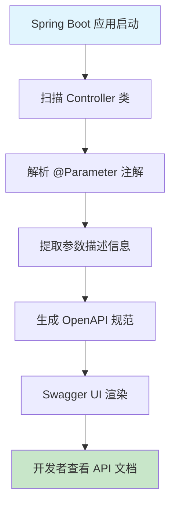

# @Parameter 注解技术解析 - 从 API 文档生成到接口描述清晰的 Spring Boot 利器

## 📋 摘要

@Parameter 注解是 Spring Boot OpenAPI 文档生成的核心利器，通过参数描述让 API 文档更清晰易懂，提升接口可读性和团队协作效率。

## 🎯 适用开发者水平

- **小白（零基础）**：了解基本概念和简单用法
- **初级开发者**：掌握基础参数描述
- **中级开发者**：熟练使用复杂参数配置和高级特性
- **高级开发者**：精通 API 文档最佳实践和团队协作

## 📚 目录

1. [🔍 @Parameter 注解概览](#-parameter-注解概览)
2. [🔧 语法结构深度解析](#-语法结构深度解析)
3. [⚡ 执行流程详解](#-执行流程详解)
4. [🎯 实际应用场景](#-实际应用场景)
5. [❓ 常见问题与解决方案](#-常见问题与解决方案)
6. [🎉 总结](#-总结)

## 🔍 @Parameter 注解概览

### 什么是 @Parameter 注解？

@Parameter 注解是 Spring Boot 中用于 **API 文档生成**（API Documentation）的核心注解，通常与 OpenAPI（Swagger）集成使用。它就像一个**智能标签机**，为每个接口参数贴上详细的说明标签，让 API 文档更加清晰易懂。

### 核心价值

- **📖 文档清晰**：为参数提供详细描述，提升 API 可读性
- **🤝 团队协作**：减少沟通成本，提升开发效率
- **🔧 自动生成**：结合 Swagger 自动生成完整的 API 文档
- **🎯 规范统一**：统一参数描述格式，保持文档一致性

## 🔧 语法结构深度解析

### 基础语法结构

```java
// 示例命令：@Parameter 注解基础用法
@Parameter(description = "参数描述", required = true, example = "示例值")
```

### 完整属性配置

```java
// 示例命令：@Parameter 注解完整配置
@Parameter(
    description = "参数详细描述",           // 参数描述
    required = true,                      // 是否必填
    example = "示例值",                   // 示例值
    schema = @Schema(type = "string"),     // 数据类型
    hidden = false,                       // 是否隐藏
    allowEmptyValue = false,             // 是否允许空值
    allowReserved = false                // 是否允许保留字符
)
```

### 与 @RequestParam 结合使用

```java
// 示例命令：@Parameter 与 @RequestParam 结合使用
@GetMapping("/get-top-students-by-attendance-count-in-time-range")
@Operation(summary = "指定时间内签到次数最多的前 N 名学生", 
          description = "获取指定时间内签到次数最多的前 N 名学生, 包含姓名、等级、年级、专业和签到次数")
public Result<List<TopStudentsByAttendanceCountInTimeRangeVO>> getTopStudentsByAttendanceCountInTimeRange(
        @Parameter(description = "开始时间, 格式: yyyy-MM-ddTHH:mm:ss") 
        @RequestParam("startTime") String startTime,
        
        @Parameter(description = "结束时间, 格式: yyyy-MM-ddTHH:mm:ss") 
        @RequestParam("endTime") String endTime,
        
        @Parameter(description = "前 N 名") 
        @RequestParam("topN") Integer topN
) {
    // 方法实现
    return studentService.getTopStudentsByAttendanceCount(startTime, endTime, topN);
}
```

### 与 @PathVariable 结合使用

```java
// 示例命令：@Parameter 与 @PathVariable 结合使用
@GetMapping("/students/{studentId}")
@Operation(summary = "根据学生 ID 获取学生信息")
public Result<StudentVO> getStudentById(
        @Parameter(description = "学生唯一标识符", example = "12345") 
        @PathVariable("studentId") Long studentId
) {
    return studentService.getStudentById(studentId);
}
```

### 与 @RequestBody 结合使用

```java
// 示例命令：@Parameter 与 @RequestBody 结合使用
@PostMapping("/students")
@Operation(summary = "创建新学生")
public Result<StudentVO> createStudent(
        @Parameter(description = "学生信息", required = true) 
        @RequestBody @Valid StudentCreateDTO studentDTO
) {
    return studentService.createStudent(studentDTO);
}
```

## ⚡ 执行流程详解

### API 文档生成流程



### 参数描述处理机制

想象一下**图书馆标签系统**的工作原理：
1. **标签制作**：@Parameter 注解就像制作详细的标签（参数描述）
2. **标签粘贴**：将标签粘贴到对应的书籍上（参数绑定）
3. **分类整理**：按照标签信息对书籍进行分类（API 文档生成）
4. **读者查阅**：读者通过标签快速找到需要的书籍（开发者查看文档）

## 🎯 实际应用场景

### 场景 1：学生管理系统 API 📚

**适用水平**：初级开发者

```java
// 示例命令：学生查询 API 参数描述
@GetMapping("/students/search")
@Operation(summary = "搜索学生", description = "根据条件搜索学生信息")
public Result<PageVO<StudentVO>> searchStudents(
        @Parameter(description = "学生姓名，支持模糊查询", example = "张三") 
        @RequestParam(value = "name", required = false) String name,
        
        @Parameter(description = "学生年级", example = "2023") 
        @RequestParam(value = "grade", required = false) String grade,
        
        @Parameter(description = "专业名称", example = "计算机科学与技术") 
        @RequestParam(value = "major", required = false) String major,
        
        @Parameter(description = "页码，从 1 开始", example = "1") 
        @RequestParam(value = "page", defaultValue = "1") Integer page,
        
        @Parameter(description = "每页大小", example = "10") 
        @RequestParam(value = "size", defaultValue = "10") Integer size
) {
    // 示例命令：执行学生搜索
    StudentSearchDTO searchDTO = new StudentSearchDTO();
    searchDTO.setName(name);
    searchDTO.setGrade(grade);
    searchDTO.setMajor(major);
    
    return studentService.searchStudents(searchDTO, page, size);
}
```

### 场景 2：课程管理系统 API 🎓

**适用水平**：中级开发者

```java
// 示例命令：课程管理 API 参数描述
@PostMapping("/courses")
@Operation(summary = "创建课程", description = "创建新的课程信息")
public Result<CourseVO> createCourse(
        @Parameter(description = "课程信息", required = true) 
        @RequestBody @Valid CourseCreateDTO courseDTO
) {
    return courseService.createCourse(courseDTO);
}

@PutMapping("/courses/{courseId}")
@Operation(summary = "更新课程", description = "更新指定课程的信息")
public Result<CourseVO> updateCourse(
        @Parameter(description = "课程唯一标识符", example = "C001") 
        @PathVariable("courseId") String courseId,
        
        @Parameter(description = "课程更新信息", required = true) 
        @RequestBody @Valid CourseUpdateDTO courseDTO
) {
    return courseService.updateCourse(courseId, courseDTO);
}

@GetMapping("/courses/{courseId}/students")
@Operation(summary = "获取课程学生列表", description = "获取指定课程的所有学生")
public Result<List<StudentVO>> getCourseStudents(
        @Parameter(description = "课程唯一标识符", example = "C001") 
        @PathVariable("courseId") String courseId,
        
        @Parameter(description = "是否包含已退课学生", example = "false") 
        @RequestParam(value = "includeDropped", defaultValue = "false") Boolean includeDropped
) {
    return courseService.getCourseStudents(courseId, includeDropped);
}
```

### 场景 3：复杂查询 API 🔍

**适用水平**：高级开发者

```java
// 示例命令：复杂统计查询 API 参数描述
@GetMapping("/statistics/attendance")
@Operation(summary = "考勤统计", description = "获取学生考勤统计数据")
public Result<AttendanceStatisticsVO> getAttendanceStatistics(
        @Parameter(description = "开始日期，格式: yyyy-MM-dd", example = "2024-01-01") 
        @RequestParam("startDate") @DateTimeFormat(pattern = "yyyy-MM-dd") LocalDate startDate,
        
        @Parameter(description = "结束日期，格式: yyyy-MM-dd", example = "2024-12-31") 
        @RequestParam("endDate") @DateTimeFormat(pattern = "yyyy-MM-dd") LocalDate endDate,
        
        @Parameter(description = "统计维度", example = "DAILY") 
        @RequestParam(value = "dimension", defaultValue = "DAILY") 
        @Schema(enumeration = {"DAILY", "WEEKLY", "MONTHLY"}) String dimension,
        
        @Parameter(description = "学生 ID 列表，多个用逗号分隔", example = "1,2,3") 
        @RequestParam(value = "studentIds", required = false) String studentIds,
        
        @Parameter(description = "是否包含节假日", example = "true") 
        @RequestParam(value = "includeHolidays", defaultValue = "true") Boolean includeHolidays
) {
    // 示例命令：解析学生 ID 列表
    List<Long> studentIdList = null;
    if (StringUtils.hasText(studentIds)) {
        studentIdList = Arrays.stream(studentIds.split(","))
                .map(String::trim)
                .map(Long::valueOf)
                .collect(Collectors.toList());
    }
    
    AttendanceStatisticsQueryDTO queryDTO = new AttendanceStatisticsQueryDTO();
    queryDTO.setStartDate(startDate);
    queryDTO.setEndDate(endDate);
    queryDTO.setDimension(AttendanceDimension.valueOf(dimension));
    queryDTO.setStudentIds(studentIdList);
    queryDTO.setIncludeHolidays(includeHolidays);
    
    return attendanceService.getAttendanceStatistics(queryDTO);
}
```

## ❓ 常见问题与解决方案

### 问题 1：@Parameter 注解不生效

**症状**：Swagger UI 中看不到参数描述

**原因分析**：
- 缺少 OpenAPI 依赖
- 配置类未正确配置
- 注解导入错误

**解决方案**：

```java
// 示例命令：检查 Maven 依赖
<dependency>
    <groupId>org.springdoc</groupId>
    <artifactId>springdoc-openapi-starter-webmvc-ui</artifactId>
    <version>2.2.0</version>
</dependency>

// 示例命令：配置类设置
@Configuration
@EnableOpenApi
public class OpenApiConfig {
    
    @Bean
    public OpenAPI customOpenAPI() {
        return new OpenAPI()
                .info(new Info()
                        .title("学生管理系统 API")
                        .version("1.0.0")
                        .description("学生管理系统的 RESTful API 文档"));
    }
}

// 示例命令：正确的导入语句
import io.swagger.v3.oas.annotations.Parameter;
import io.swagger.v3.oas.annotations.Operation;
import io.swagger.v3.oas.annotations.media.Schema;
```

### 问题 2：参数描述过长影响美观

**症状**：参数描述文本过长，影响 Swagger UI 显示效果

**解决方案**：

```java
// ❌ 错误示例：描述过长
@Parameter(description = "这是一个非常长的参数描述，包含了大量的详细信息，可能会影响 Swagger UI 的显示效果，让界面看起来不够美观")

// ✅ 正确示例：简洁描述
@Parameter(description = "学生姓名，支持模糊查询")

// ✅ 高级示例：使用 Schema 提供详细信息
@Parameter(description = "学生信息")
@Schema(description = "学生详细信息，包含姓名、年龄、专业等字段", 
        example = "{\"name\":\"张三\",\"age\":20,\"major\":\"计算机科学\"}")
@RequestBody StudentDTO studentDTO
```

### 问题 3：复杂参数类型描述困难

**症状**：复杂对象参数难以用简单描述说明

**解决方案**：

```java
// 示例命令：复杂参数类型描述
@PostMapping("/students/batch")
@Operation(summary = "批量创建学生", description = "一次性创建多个学生")
public Result<List<StudentVO>> batchCreateStudents(
        @Parameter(description = "学生创建信息列表", required = true) 
        @RequestBody @Valid List<StudentCreateDTO> students,
        
        @Parameter(description = "是否跳过重复学生", example = "false") 
        @RequestParam(value = "skipDuplicates", defaultValue = "false") Boolean skipDuplicates,
        
        @Parameter(description = "重复检查字段", example = "email") 
        @RequestParam(value = "duplicateCheckField", defaultValue = "email") 
        @Schema(enumeration = {"email", "phone", "studentId"}) String duplicateCheckField
) {
    BatchCreateRequest request = new BatchCreateRequest();
    request.setStudents(students);
    request.setSkipDuplicates(skipDuplicates);
    request.setDuplicateCheckField(duplicateCheckField);
    
    return studentService.batchCreateStudents(request);
}

// 示例命令：使用 Schema 注解提供详细说明
@Schema(description = "学生创建信息", 
        example = "{\"name\":\"张三\",\"email\":\"zhangsan@example.com\",\"phone\":\"13800138000\"}")
public class StudentCreateDTO {
    
    @Schema(description = "学生姓名", example = "张三", maxLength = 50)
    @NotBlank(message = "学生姓名不能为空")
    private String name;
    
    @Schema(description = "邮箱地址", example = "zhangsan@example.com", format = "email")
    @Email(message = "邮箱格式不正确")
    private String email;
    
    @Schema(description = "手机号码", example = "13800138000", pattern = "^1[3-9]\\d{9}$")
    @Pattern(regexp = "^1[3-9]\\d{9}$", message = "手机号码格式不正确")
    private String phone;
}
```

## 🎉 总结

@Parameter 注解是 Spring Boot OpenAPI 文档生成的**核心利器**，通过为接口参数提供详细描述，让 API 文档更加清晰易懂。就像**智能标签机**一样，它为每个参数贴上清晰的说明标签，大幅提升团队协作效率和接口可读性。

### 核心要点回顾

- **📖 文档清晰**：为参数提供详细描述，提升 API 可读性
- **🤝 团队协作**：减少沟通成本，提升开发效率
- **🔧 自动生成**：结合 Swagger 自动生成完整的 API 文档
- **🎯 规范统一**：统一参数描述格式，保持文档一致性

### 最佳实践建议

1. **描述简洁明了**：避免过长描述，保持简洁有力
2. **示例值实用**：提供真实可用的示例值
3. **类型准确**：确保参数类型描述准确
4. **必填标识**：明确标识必填和可选参数
5. **格式说明**：对特殊格式参数提供格式说明

掌握 @Parameter 注解的使用，你就能像**文档大师**一样，让每个 API 接口都拥有清晰易懂的说明！继续探索 API 文档化的更多可能性，让团队协作变得更加高效！ 🚀

---

**厦门工学院人工智能创作坊 -- 郑恩赐**  
**2025 年 10 月 14 日**
