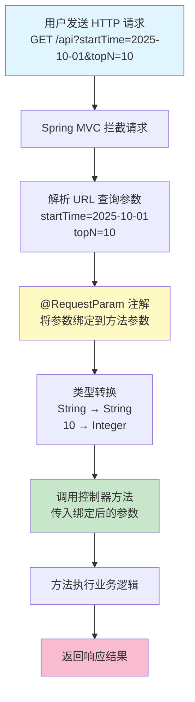

# @RequestParam 注解完全指南 - 从参数绑定到接口调用的 Web 开发利器

## 📝 摘要
@RequestParam 注解用于处理 HTTP 请求参数，像餐厅服务员接收点单，将 URL 查询参数自动绑定到方法参数。本文通过生活化比喻，讲解参数绑定原理、常用属性和最佳实践。

---

## 🎯 什么是 @RequestParam 注解？

### 基本概念
`@RequestParam` 是 Spring Boot 中用于**绑定 HTTP 请求参数**的注解，它能将 URL 中的查询参数（Query Parameters，查询参数）自动映射到控制器方法的参数上。

### 生活化比喻 🍽️
想象你在餐厅点餐：
- **顾客**：在点餐单上写下菜品名称、数量、要求（就像 URL 中的参数）
- **服务员**：拿到点餐单后，把每一项信息准确传达给厨房（就像 `@RequestParam` 注解）
- **厨房**：根据服务员传达的信息准备菜品（就像控制器方法根据参数处理业务逻辑）

`@RequestParam` 就像**智能服务员**，自动识别 URL 中的参数，并准确传递给方法！

---

## 🔧 @RequestParam 的工作原理

### 执行流程图



### 工作步骤详解
1. **请求拦截**：Spring MVC 拦截到 HTTP 请求
2. **参数解析**：从 URL 中提取查询参数（`?` 后面的键值对）
3. **参数绑定**：`@RequestParam` 根据参数名将值绑定到方法参数
4. **类型转换**：自动将字符串转换为目标类型（如 `Integer`、`Boolean` 等）
5. **方法调用**：将绑定后的参数传入控制器方法
6. **业务处理**：方法执行具体业务逻辑并返回结果

---

## 📚 @RequestParam 的核心属性

### 属性对比表

| 属性名 | 类型 | 默认值 | 说明 | 适用水平 |
|--------|------|--------|------|----------|
| **value** / **name** | String | "" | 指定要绑定的请求参数名称 | 小白（零基础） |
| **required** | boolean | true | 参数是否必需，true 表示必须传递 | 小白（零基础） |
| **defaultValue** | String | "" | 参数的默认值，未传递时使用 | 初级 |

### 属性详解

#### 1. value / name 属性
**作用**：指定要绑定的请求参数名称

```java
// 适用水平：小白（零基础）
@GetMapping("/search")
public Result<List<Student>> searchStudents(
    @RequestParam("keyword") String searchKeyword  // 将 URL 中的 keyword 参数绑定到 searchKeyword 变量
) {
    // keyword 参数值会自动绑定到 searchKeyword 变量
    return studentService.search(searchKeyword);
}

// 请求示例：GET /search?keyword=张三
// searchKeyword 的值为 "张三"
```

#### 2. required 属性
**作用**：控制参数是否必须传递

```java
// 适用水平：初级
@GetMapping("/get-students")
public Result<List<Student>> getStudents(
    @RequestParam(value = "grade", required = true) String grade,      // 必须传递 grade 参数
    @RequestParam(value = "major", required = false) String major      // major 参数可选
) {
    // 如果未传递 grade 参数，会抛出异常
    // 如果未传递 major 参数，major 的值为 null
    return studentService.getByGradeAndMajor(grade, major);
}

// 正确请求：GET /get-students?grade=2023
// 错误请求：GET /get-students （缺少必需的 grade 参数，会报错）
```

#### 3. defaultValue 属性
**作用**：为参数提供默认值

```java
// 适用水平：初级
@GetMapping("/get-top-students")
public Result<List<Student>> getTopStudents(
    @RequestParam(value = "topN", defaultValue = "10") Integer topN  // 未传递时默认为 10
) {
    // 如果 URL 中没有 topN 参数，topN 的值为 10
    return studentService.getTopStudents(topN);
}

// 请求示例 1：GET /get-top-students?topN=20  →  topN = 20
// 请求示例 2：GET /get-top-students  →  topN = 10（使用默认值）
```

---

## 💡 实际应用场景

### 场景一：学生签到系统 - 基础参数绑定
**适用水平**：小白（零基础）

```java
// 功能：获取指定时间内签到次数最多的前 N 名学生
@GetMapping("/get-top-students-by-attendance-count-in-time-range")
@Operation(summary = "指定时间内签到次数最多的前 N 名学生", 
           description = "获取指定时间内签到次数最多的前 N 名学生, 包含姓名、等级、年级、专业和签到次数")
public Result<List<TopStudentsByAttendanceCountInTimeRangeVO>> getTopStudentsByAttendanceCountInTimeRange(
    @Parameter(description = "开始时间, 格式: yyyy-MM-ddTHH:mm:ss") 
    @RequestParam("startTime") String startTime,  // 绑定 startTime 参数
    
    @Parameter(description = "结束时间, 格式: yyyy-MM-ddTHH:mm:ss") 
    @RequestParam("endTime") String endTime,      // 绑定 endTime 参数
    
    @Parameter(description = "前 N 名") 
    @RequestParam("topN") Integer topN            // 绑定 topN 参数
) {
    // 调用服务层方法，传入绑定后的参数
    List<TopStudentsByAttendanceCountInTimeRangeVO> students = 
        studentService.getTopStudentsByAttendanceCount(startTime, endTime, topN);
    
    return Result.success(students);
}

// 请求示例：
// GET /get-top-students-by-attendance-count-in-time-range?startTime=2025-10-01T00:00:00&endTime=2025-10-14T23:59:59&topN=10

// 参数绑定结果：
// startTime = "2025-10-01T00:00:00"
// endTime = "2025-10-14T23:59:59"
// topN = 10
```

**代码解析**：
1. `@RequestParam("startTime") String startTime`：将 URL 中的 `startTime` 参数绑定到方法的 `startTime` 变量
2. `@RequestParam("endTime") String endTime`：将 URL 中的 `endTime` 参数绑定到方法的 `endTime` 变量
3. `@RequestParam("topN") Integer topN`：将 URL 中的 `topN` 参数绑定到方法的 `topN` 变量，并自动转换为 `Integer` 类型

### 场景二：课程管理系统 - 可选参数与默认值
**适用水平**：初级

```java
// 功能：根据条件搜索课程
@GetMapping("/search-courses")
public Result<List<Course>> searchCourses(
    @RequestParam("keyword") String keyword,                                // 必需参数：搜索关键词
    @RequestParam(value = "category", required = false) String category,    // 可选参数：课程分类
    @RequestParam(value = "page", defaultValue = "1") Integer page,         // 默认值参数：页码，默认第 1 页
    @RequestParam(value = "pageSize", defaultValue = "20") Integer pageSize // 默认值参数：每页数量，默认 20 条
) {
    // 根据参数查询课程
    return courseService.search(keyword, category, page, pageSize);
}

// 请求示例 1：GET /search-courses?keyword=Java
// 结果：keyword="Java", category=null, page=1, pageSize=20

// 请求示例 2：GET /search-courses?keyword=Java&category=编程&page=2&pageSize=10
// 结果：keyword="Java", category="编程", page=2, pageSize=10
```

### 场景三：数据分析系统 - 多参数类型转换
**适用水平**：中级

```java
// 功能：根据多个条件统计数据
@GetMapping("/statistics")
public Result<StatisticsVO> getStatistics(
    @RequestParam("startDate") @DateTimeFormat(pattern = "yyyy-MM-dd") LocalDate startDate,  // 日期类型自动转换
    @RequestParam("endDate") @DateTimeFormat(pattern = "yyyy-MM-dd") LocalDate endDate,
    @RequestParam(value = "includeWeekends", defaultValue = "false") Boolean includeWeekends, // 布尔类型转换
    @RequestParam(value = "departments", required = false) List<String> departments           // 列表类型转换
) {
    // 根据参数统计数据
    return statisticsService.calculate(startDate, endDate, includeWeekends, departments);
}

// 请求示例：
// GET /statistics?startDate=2025-10-01&endDate=2025-10-14&includeWeekends=true&departments=技术部&departments=市场部

// 参数绑定结果：
// startDate = LocalDate.of(2025, 10, 1)
// endDate = LocalDate.of(2025, 10, 14)
// includeWeekends = true
// departments = ["技术部", "市场部"]
```

---

## ⚠️ 常见问题与解决方案

### 问题 1：参数名不匹配导致绑定失败
**现象**：请求报错 `Required request parameter 'xxx' is not present`

**原因**：URL 中的参数名与 `@RequestParam` 指定的名称不一致

```java
// ❌ 错误示例
@GetMapping("/search")
public Result search(@RequestParam("keyword") String searchKeyword) {
    return null;
}
// 请求：GET /search?search=Java  （参数名是 search，而不是 keyword）
// 结果：报错！

// ✅ 正确示例
@GetMapping("/search")
public Result search(@RequestParam("keyword") String searchKeyword) {
    return null;
}
// 请求：GET /search?keyword=Java  （参数名正确）
// 结果：成功绑定！
```

**解决方案**：
1. 确保 URL 中的参数名与 `@RequestParam` 指定的名称一致
2. 或者将参数设为可选：`@RequestParam(value = "keyword", required = false)`

### 问题 2：必需参数未传递
**现象**：请求报错 `Required request parameter 'xxx' for method parameter type xxx is not present`

**原因**：`required = true`（默认值）的参数在请求中缺失

```java
// ❌ 错误示例
@GetMapping("/get-student")
public Result getStudent(@RequestParam("id") Long id) {  // required 默认为 true
    return studentService.getById(id);
}
// 请求：GET /get-student  （缺少 id 参数）
// 结果：报错！

// ✅ 解决方案 1：传递参数
// 请求：GET /get-student?id=123

// ✅ 解决方案 2：设为可选参数
@GetMapping("/get-student")
public Result getStudent(@RequestParam(value = "id", required = false) Long id) {
    if (id == null) {
        return Result.error("学生 ID 不能为空");
    }
    return studentService.getById(id);
}

// ✅ 解决方案 3：提供默认值
@GetMapping("/get-students")
public Result getStudents(@RequestParam(value = "page", defaultValue = "1") Integer page) {
    return studentService.getByPage(page);
}
```

### 问题 3：类型转换失败
**现象**：请求报错 `Failed to convert value of type 'java.lang.String' to required type 'xxx'`

**原因**：URL 参数值无法转换为目标类型

```java
// ❌ 错误示例
@GetMapping("/get-students")
public Result getStudents(@RequestParam("page") Integer page) {
    return null;
}
// 请求：GET /get-students?page=abc  （abc 无法转换为 Integer）
// 结果：报错！

// ✅ 解决方案 1：在前端验证参数类型
// 前端确保传递的是数字字符串：page=1

// ✅ 解决方案 2：使用全局异常处理
@RestControllerAdvice
public class GlobalExceptionHandler {
    
    @ExceptionHandler(MethodArgumentTypeMismatchException.class)
    public Result handleTypeMismatch(MethodArgumentTypeMismatchException e) {
        return Result.error("参数类型错误：" + e.getName() + " 应为 " + e.getRequiredType().getSimpleName());
    }
}

// ✅ 解决方案 3：使用 String 接收后手动转换
@GetMapping("/get-students")
public Result getStudents(@RequestParam("page") String pageStr) {
    try {
        Integer page = Integer.parseInt(pageStr);
        return studentService.getByPage(page);
    } catch (NumberFormatException e) {
        return Result.error("页码格式错误");
    }
}
```

### 问题 4：@RequestParam 与 @Parameter 的区别
**常见困惑**：两个注解看起来很相似，什么时候用哪个？

**区别对比**：

| 注解 | 所属框架 | 作用 | 使用位置 |
|------|----------|------|----------|
| **@RequestParam** | Spring MVC | 绑定 HTTP 请求参数到方法参数 | 方法参数上 |
| **@Parameter** | SpringDoc OpenAPI | 为 API 文档添加参数描述信息 | 方法参数上（配合 @RequestParam 使用） |

```java
// ✅ 正确用法：两个注解配合使用
@GetMapping("/search")
public Result search(
    @Parameter(description = "搜索关键词")  // API 文档描述
    @RequestParam("keyword") String keyword  // 参数绑定
) {
    return null;
}

// ❌ 错误理解：@Parameter 不能代替 @RequestParam
@GetMapping("/search")
public Result search(
    @Parameter(description = "搜索关键词") String keyword  // 缺少 @RequestParam，无法绑定参数！
) {
    return null;
}
```

---

## 🚀 最佳实践建议

### 1. 参数命名规范
```java
// ✅ 推荐：使用清晰的参数名
@GetMapping("/search-students")
public Result search(
    @RequestParam("studentName") String studentName,
    @RequestParam("gradeLevel") String gradeLevel
) {
    return null;
}

// ❌ 不推荐：使用缩写或模糊的参数名
@GetMapping("/search-students")
public Result search(
    @RequestParam("sn") String sn,
    @RequestParam("gl") String gl
) {
    return null;
}
```

### 2. 合理使用 required 和 defaultValue
```java
// ✅ 推荐：为可选参数提供默认值
@GetMapping("/get-students")
public Result getStudents(
    @RequestParam("grade") String grade,                        // 必需参数
    @RequestParam(value = "page", defaultValue = "1") Integer page,
    @RequestParam(value = "pageSize", defaultValue = "20") Integer pageSize
) {
    return null;
}

// ❌ 不推荐：大量必需参数，增加调用难度
@GetMapping("/get-students")
public Result getStudents(
    @RequestParam("grade") String grade,
    @RequestParam("major") String major,
    @RequestParam("level") String level,
    @RequestParam("page") Integer page,
    @RequestParam("pageSize") Integer pageSize
) {
    return null;  // 调用时必须传递所有参数，太繁琐！
}
```

### 3. 参数校验增强
```java
// ✅ 推荐：添加参数校验
@GetMapping("/get-top-students")
public Result getTopStudents(
    @RequestParam("topN") @Min(1) @Max(100) Integer topN  // 限制范围：1-100
) {
    return studentService.getTopStudents(topN);
}

// 需要在类上添加 @Validated 注解
@RestController
@Validated
@RequestMapping("/api/students")
public class StudentController {
    // ...
}
```

### 4. 复杂参数使用对象封装
```java
// 当参数过多时，推荐使用对象封装
// ❌ 不推荐：参数过多
@GetMapping("/search")
public Result search(
    @RequestParam("keyword") String keyword,
    @RequestParam("category") String category,
    @RequestParam("startDate") String startDate,
    @RequestParam("endDate") String endDate,
    @RequestParam("page") Integer page,
    @RequestParam("pageSize") Integer pageSize
) {
    return null;  // 参数太多，代码冗长！
}

// ✅ 推荐：使用对象封装（DTO 模式）
@Data
public class SearchRequest {
    private String keyword;
    private String category;
    private String startDate;
    private String endDate;
    private Integer page = 1;
    private Integer pageSize = 20;
}

@GetMapping("/search")
public Result search(SearchRequest request) {  // Spring 会自动绑定所有参数到对象
    return null;
}
```

### 5. API 文档完善
```java
// ✅ 推荐：配合 @Parameter 注解完善 API 文档
@GetMapping("/get-top-students")
@Operation(summary = "获取签到排行榜", description = "根据签到次数获取前 N 名学生")
public Result getTopStudents(
    @Parameter(description = "开始时间，格式：yyyy-MM-ddTHH:mm:ss", example = "2025-10-01T00:00:00")
    @RequestParam("startTime") String startTime,
    
    @Parameter(description = "结束时间，格式：yyyy-MM-ddTHH:mm:ss", example = "2025-10-14T23:59:59")
    @RequestParam("endTime") String endTime,
    
    @Parameter(description = "前 N 名，范围：1-100", example = "10")
    @RequestParam("topN") Integer topN
) {
    return null;
}
```

---

## 📖 总结

`@RequestParam` 注解是 Spring Boot 中处理 HTTP 请求参数的核心工具，它能够：

✅ **自动绑定参数**：将 URL 查询参数自动映射到方法参数  
✅ **类型自动转换**：支持 String、Integer、Boolean、List 等多种类型  
✅ **灵活参数控制**：通过 `required` 和 `defaultValue` 属性控制参数行为  
✅ **增强代码可读性**：参数绑定逻辑清晰，代码简洁易懂  

通过本文的学习，你已经掌握了 `@RequestParam` 注解的核心用法和最佳实践！

### 🎓 学习路径建议

| 学习阶段 | 掌握内容 | 实践建议 |
|----------|----------|----------|
| **小白（零基础）** | 基本参数绑定、value 属性使用 | 实现简单的查询接口，绑定 1-2 个参数 |
| **初级** | required、defaultValue 属性使用 | 实现带分页、排序的查询接口 |
| **中级** | 多种类型转换、对象封装 | 实现复杂查询接口，处理多参数场景 |
| **高级** | 参数校验、全局异常处理、API 文档完善 | 构建企业级 RESTful API，完善异常处理和文档 |

**继续加油！** 🚀 掌握 `@RequestParam` 注解后，你就能轻松处理各种 HTTP 请求参数，构建高质量的 RESTful API！

---

**厦门工学院人工智能创作坊 -- 郑恩赐**  
**2025 年 10 月 14 日**

