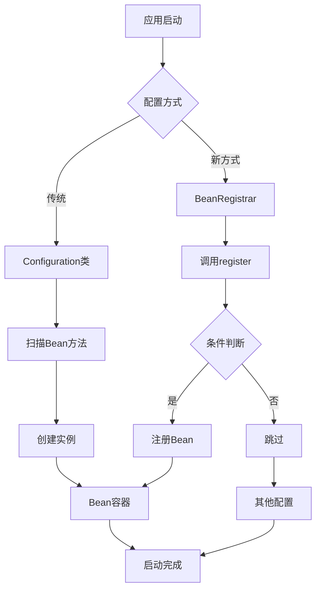
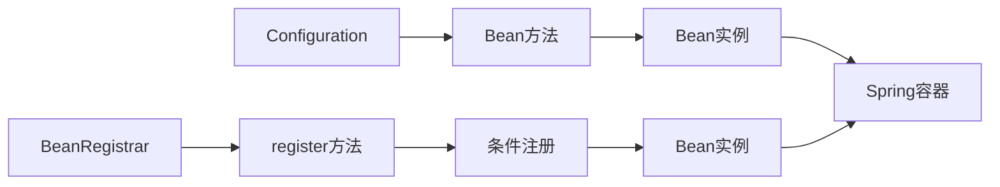

# 🚀 Spring Boot 4.0.0-SNAPSHOT @Configuration 问题解决指南

## 📋 摘要

Spring Boot 4.0.0-SNAPSHOT 作为最新的快照版本，引入了许多激动人心的新特性，但同时也带来了一些配置上的挑战。其中最令人困扰的问题就是传统的 `@Configuration` 注解在某些场景下无法正常工作。本指南将深入分析这一问题的根本原因，并提供多种实用的解决方案，帮助开发者顺利过渡到 Spring Boot 4.0 的新时代。无论你是 Spring Boot 新手还是资深开发者，都能从中获得宝贵的经验和技巧。

---

## 🔍 问题分析

### 为什么 Spring Boot 4.0.0-SNAPSHOT 无法使用 @Configuration？

Spring Boot 4.0.0-SNAPSHOT 建立在 Spring Framework 7.0 之上，带来了许多重大变更：

#### 🎯 核心原因

1. **快照版本的不稳定性**
   - Spring Boot 4.0.0-SNAPSHOT 仍处于开发阶段
   - 某些功能可能尚未完全实现或存在已知问题
   - API 接口可能随时发生变化

2. **新的配置机制**
   - 引入了 `BeanRegistrar` 接口，提供编程式 Bean 注册
   - 自动配置类的行为发生了变化
   - 配置加载顺序可能受到影响

3. **依赖版本兼容性**
   - 最低要求 Java 17，推荐 Java 21
   - Spring Framework 7.0 的新特性影响
   - 第三方库兼容性问题

---

## 🛠️ 解决方案

### 方案一：使用 BeanRegistrar 接口 ⭐

Spring Boot 4.0 引入了全新的 `BeanRegistrar` 接口，这是解决 `@Configuration` 问题的最佳方案：

```java
import org.springframework.beans.factory.BeanRegistrar;
import org.springframework.beans.factory.BeanRegistry;
import org.springframework.context.annotation.Configuration;
import org.springframework.context.annotation.Import;
import org.springframework.core.env.Environment;

@Configuration
@Import(MyBeansRegistrar.class)
public class MyConfiguration {
    // 传统配置类仍然可以使用
}

public class MyBeansRegistrar implements BeanRegistrar {

    @Override
    public void register(BeanRegistry registry, Environment env) {
        // 无条件注册 Student Bean
        registry.registerBean("student", Student.class);

        // 仅在 dev 环境下注册 Article Bean
        if ("dev".equals(env.getProperty("spring.profiles.active"))) {
            registry.registerBean("article", Article.class, 
                () -> new Article("Dev Article"));
        }
        
        // 注册带参数的 Bean
        registry.registerBean("userService", UserService.class,
            () -> new UserService(env.getProperty("app.name", "default")));
    }
}
```

#### 🎨 BeanRegistrar 的优势

- ✅ **条件注册**：可以根据环境变量动态注册 Bean
- ✅ **编程式控制**：完全控制 Bean 的创建过程
- ✅ **性能优化**：避免不必要的 Bean 创建
- ✅ **类型安全**：编译时检查，减少运行时错误

### 方案二：使用 @SpringBootApplication 注解

确保主应用程序类正确使用 `@SpringBootApplication` 注解：

```java
@SpringBootApplication
public class MyApplication {
    public static void main(String[] args) {
        SpringApplication.run(MyApplication.class, args);
    }
}
```

#### 🔧 排除特定自动配置

```java
@SpringBootApplication(exclude = { 
    DataSourceAutoConfiguration.class,
    SecurityAutoConfiguration.class 
})
public class MyApplication {
    // 应用配置
}
```

### 方案三：使用 @Import 注解

手动导入特定的配置类：

```java
@SpringBootApplication
@Import({ 
    DatabaseConfiguration.class,
    SecurityConfiguration.class,
    CacheConfiguration.class 
})
public class MyApplication {
    public static void main(String[] args) {
        SpringApplication.run(MyApplication.class, args);
    }
}
```

### 方案四：混合使用传统配置和新特性

```java
@Configuration
@EnableConfigurationProperties(MyProperties.class)
public class HybridConfiguration {
    
    @Bean
    @ConditionalOnProperty(name = "app.feature.enabled", havingValue = "true")
    public MyService myService() {
        return new MyService();
    }
    
    // 结合 BeanRegistrar 使用
    @Bean
    public BeanRegistrar customBeanRegistrar() {
        return new CustomBeanRegistrar();
    }
}
```

---

## 📊 配置流程对比图



### 🏗️ 配置方式对比



---

## 🎯 最佳实践建议

### 1. 版本选择策略

```xml
<!-- 推荐：使用稳定版本 -->
<parent>
    <groupId>org.springframework.boot</groupId>
    <artifactId>spring-boot-starter-parent</artifactId>
    <version>3.3.0</version>
    <relativePath/>
</parent>

<!-- 谨慎：仅在测试环境使用快照版本 -->
<parent>
    <groupId>org.springframework.boot</groupId>
    <artifactId>spring-boot-starter-parent</artifactId>
    <version>4.0.0-SNAPSHOT</version>
    <relativePath/>
</parent>
```

### 2. 环境配置检查

```java
@Component
public class EnvironmentChecker {
    
    @PostConstruct
    public void checkEnvironment() {
        System.out.println("Java 版本: " + System.getProperty("java.version"));
        System.out.println("Spring Boot 版本: " + SpringBootVersion.getVersion());
        System.out.println("Spring 版本: " + SpringVersion.getVersion());
    }
}
```

### 3. 渐进式迁移策略

1. **第一阶段**：保持现有 `@Configuration` 类不变
2. **第二阶段**：逐步引入 `BeanRegistrar` 处理新功能
3. **第三阶段**：优化和重构现有配置
4. **第四阶段**：完全迁移到新配置方式

---

## ⚠️ 注意事项

### 常见陷阱

1. **版本兼容性**
   - 确保所有依赖都支持 Spring Boot 4.0
   - 检查第三方库的兼容性

2. **性能考虑**
   - `BeanRegistrar` 在启动时执行，避免复杂逻辑
   - 合理使用条件注册，避免不必要的 Bean 创建

3. **调试技巧**
   - 使用 `@ConditionalOnProperty` 进行条件调试
   - 启用 `debug=true` 查看自动配置报告

### 错误排查

```java
@Configuration
@Slf4j
public class DebugConfiguration {
    
    @Bean
    public ApplicationRunner debugRunner() {
        return args -> {
            log.info("=== Spring Boot 4.0 配置调试信息 ===");
            log.info("当前环境: {}", System.getProperty("spring.profiles.active"));
            log.info("Java 版本: {}", System.getProperty("java.version"));
        };
    }
}
```

---

## 🔮 未来展望

Spring Boot 4.0 正式版发布后，`@Configuration` 注解的问题将得到彻底解决。同时，`BeanRegistrar` 接口将成为配置 Bean 的推荐方式，提供更灵活和强大的配置能力。

### 即将到来的特性

- 🚀 更智能的自动配置
- 🔧 增强的条件注册机制
- 📊 更好的性能监控
- 🛡️ 更强的类型安全

---

## 📚 相关资源

- [Spring Boot 官方文档](https://spring.io/projects/spring-boot)
- [Spring Framework 7.0 新特性](https://spring.io/blog)
- [BeanRegistrar API 文档](https://docs.spring.io/spring-framework/docs/current/javadoc-api/)

---

## 🏷️ 标签

`#SpringBoot` `#Configuration` `#BeanRegistrar` `#Java` `#SpringFramework` `#问题解决`

---

**厦门工学院人工智能创作坊 -- 郑恩赐**  
**2025 年 10 月 3 日**
