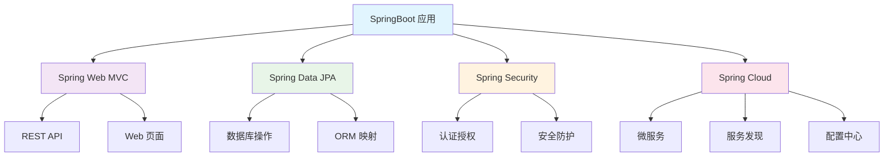

# SpringBoot 完全指南 - 从零基础到企业级应用的 Java 开发利器

## 📋 摘要

SpringBoot 是 Java 开发者的福音，像贴心的助手帮你自动处理繁琐配置。无论新手还是资深开发者，都能在几分钟内搭建完整 Web 应用，告别复杂 XML 配置，专注业务逻辑实现。

---

## 🎯 目录

- [小白学习路径指南](#小白学习路径指南)
- [什么是 SpringBoot](#什么是-springboot)
- [SpringBoot 的核心特性](#springboot-的核心特性)
- [SpringBoot 的优势](#springboot-的优势)
- [快速开始 - 第一个 SpringBoot 应用](#快速开始---第一个-springboot-应用)
- [SpringBoot 核心注解详解](#springboot-核心注解详解)
- [配置文件管理](#配置文件管理)
- [SpringBoot 生态系统](#springboot-生态系统)
- [企业级应用最佳实践](#企业级应用最佳实践)
- [微服务架构支持](#微服务架构支持)
- [性能优化建议](#性能优化建议)
- [开发工具推荐](#开发工具推荐)
- [未来发展趋势](#未来发展趋势)
- [总结与展望](#总结与展望)

---

## 🎯 小白学习路径指南

### ✅ 建议优先学习的内容（按顺序）

1. **快速开始 - 第一个 SpringBoot 应用** - 先体验成功的感觉
2. **@RestController 注解** - 学会创建简单的 API
3. **application.properties 基础配置** - 学会修改端口等简单配置
4. **开发工具推荐** - 选择合适的开发环境

### ⚠️ 需要一定基础后再学习的内容

1. **SpringBoot 核心注解详解** - 需要 Java 面向对象基础
2. **配置文件管理** - 需要理解配置概念
3. **SpringBoot 生态系统** - 需要项目经验

### ❌ 不建议小白实践的内容

1. **@Repository 和数据库操作** - 需要数据库基础知识
2. **企业级应用最佳实践** - 需要丰富的项目经验
3. **微服务架构支持** - 需要扎实的 SpringBoot 基础
4. **性能优化建议** - 需要深入的系统知识

### 📚 学习建议

- **先实践，后理论**：先让代码跑起来，再理解原理
- **循序渐进**：不要急于学习高级特性
- **多动手**：理论结合实践，加深理解

---

## 🚀 什么是 SpringBoot

SpringBoot 是由 Pivotal 团队于 2014 年发布的开源 Java 框架，它是 Spring 生态系统中的一个重要成员。如果把传统的 Spring 框架比作一辆需要手动组装的汽车，那么 SpringBoot 就是一辆已经组装好的智能汽车，你只需要踩油门就能上路。

### 🎨 SpringBoot 的设计理念

SpringBoot 遵循 **"约定优于配置"（Convention over Configuration）** 的设计理念，这意味着：

- **自动化配置**：框架会根据你的依赖自动配置应用
- **零配置启动**：大多数情况下无需编写 XML 配置文件
- **开箱即用**：内置常用功能，如 Web 服务器、数据库连接等

---

## ⭐ SpringBoot 的核心特性

### 1. 🏃‍♂️ 独立运行（Standalone）

SpringBoot 应用可以打包成可执行的 JAR 文件，内嵌了 Tomcat、Jetty 等 Web 服务器，无需额外部署 WAR 文件。

```java
// 只需要一个 main 方法就能启动整个应用
@SpringBootApplication
public class MyApplication {
    public static void main(String[] args) {
        SpringApplication.run(MyApplication.class, args);
    }
}
```

### 2. 🔧 自动配置（Auto Configuration）

SpringBoot 会根据项目中的依赖自动配置相应的组件，就像一位智能管家，知道你需要什么就提前准备好。

```java
// 添加数据库依赖后，SpringBoot 会自动配置数据源
@SpringBootApplication
public class Application {
    // 无需手动配置 DataSource，SpringBoot 自动处理
}
```

### 3. 📦 Starter 依赖管理

SpringBoot 提供了丰富的 Starter 依赖，每个 Starter 都包含了一组相关的依赖，让你一键引入所需功能。

| Starter | 功能描述 |
|---------|----------|
| `spring-boot-starter-web` | Web 应用开发 |
| `spring-boot-starter-data-jpa` | JPA 数据访问 |
| `spring-boot-starter-security` | 安全认证 |
| `spring-boot-starter-test` | 单元测试 |

### 4. 🏥 生产就绪特性

SpringBoot 内置了生产环境所需的功能：

- **健康检查**：监控应用运行状态
- **指标收集**：性能数据统计
- **外部化配置**：环境变量管理
- **日志管理**：统一的日志配置

---

## 🎯 SpringBoot 的优势

### 💡 开发效率提升

- **减少样板代码**：自动生成常用配置
- **快速原型开发**：几分钟搭建完整应用
- **热重载支持**：代码修改即时生效

### 🚀 部署简化

- **单一 JAR 文件**：包含所有依赖
- **内嵌服务器**：无需外部容器
- **云原生支持**：完美适配 Docker、Kubernetes

### 🌟 生态丰富

- **Spring 全家桶**：与 Spring 生态无缝集成
- **第三方集成**：支持主流中间件
- **社区活跃**：持续更新和维护

---

## 🚀 快速开始 - 第一个 SpringBoot 应用

### 步骤 1：创建项目

使用 Spring Initializr（https://start.spring.io/）创建项目：

1. 选择 **Maven** 或 **Gradle** 构建工具
2. 选择 **Java** 语言和 **Spring Boot** 版本
3. 添加 **Spring Web** 依赖
4. 点击 **Generate** 下载项目

### 步骤 2：编写控制器

```java
// 创建一个简单的 REST 控制器
@RestController
@RequestMapping("/api")
public class HelloController {
    
    @GetMapping("/hello")
    public String hello() {
        return "Hello, SpringBoot! 🎉";
    }
    
    @GetMapping("/user/{name}")
    public String greetUser(@PathVariable String name) {
        return "Hello, " + name + "! Welcome to SpringBoot! 👋";
    }
}
```

### 步骤 3：启动应用

> **✅ 小白可实践**：这是最简单的启动方式，直接运行即可

```java
// 主应用类
@SpringBootApplication
public class SpringBootDemoApplication {
    public static void main(String[] args) {
        SpringApplication.run(SpringBootDemoApplication.class, args);
    }
}
```

> **📚 学习建议**：理解 `@SpringBootApplication` 注解是 SpringBoot 的核心，但暂时不需要深入其原理

### 步骤 4：测试应用

> **✅ 小白可实践**：直接在浏览器访问这些链接，看到结果就说明成功了

启动应用后，访问以下 URL：
- `http://localhost:8080/api/hello`
- `http://localhost:8080/api/user/张三`

> **🎉 恭喜**：如果能看到返回的文字，说明你的第一个 SpringBoot 应用已经成功运行了！

---

## 🏷️ SpringBoot 核心注解详解

> **⚠️ 小白注意**：这部分内容需要一定的 Java 基础，建议先完成上面的实践部分，再回来学习注解

### @SpringBootApplication

这是 SpringBoot 应用的主注解，它包含了三个重要注解：

```java
@SpringBootApplication
public class Application {
    // 等价于以下三个注解的组合：
    // @Configuration - 标识配置类
    // @EnableAutoConfiguration - 启用自动配置
    // @ComponentScan - 启用组件扫描
}
```

### @RestController

> **✅ 小白可实践**：这个注解很简单，直接使用即可

专门用于创建 RESTful Web 服务的控制器：

```java
@RestController
public class UserController {
    
    @GetMapping("/users")
    public List<User> getUsers() {
        // 返回用户列表
        return userService.getAllUsers();
    }
    
    @PostMapping("/users")
    public User createUser(@RequestBody User user) {
        // 创建新用户
        return userService.saveUser(user);
    }
}
```

> **📚 学习建议**：先学会使用 `@GetMapping` 和 `@PostMapping`，其他注解可以后续学习

### @Service

> **⚠️ 小白注意**：这部分涉及依赖注入，需要先理解 Java 面向对象编程

标识业务逻辑层组件：

```java
@Service
public class UserService {
    
    @Autowired
    private UserRepository userRepository;
    
    public List<User> getAllUsers() {
        return userRepository.findAll();
    }
    
    public User saveUser(User user) {
        return userRepository.save(user);
    }
}
```

> **📚 学习建议**：先掌握基本的 Java 类和方法，再学习 `@Service` 和 `@Autowired` 注解

### @Repository

> **❌ 小白不建议实践**：这部分涉及数据库操作，需要先学习数据库基础知识

标识数据访问层组件：

```java
@Repository
public interface UserRepository extends JpaRepository<User, Long> {
    // Spring Data JPA 自动提供 CRUD 方法
    List<User> findByName(String name);
    List<User> findByAgeGreaterThan(int age);
}
```

> **📚 学习建议**：先学习数据库基础知识和 SQL 语句，再学习 JPA 和 Repository 模式

---

## ⚙️ 配置文件管理

> **⚠️ 小白注意**：配置文件是 SpringBoot 的重要部分，但需要先掌握基础概念

### application.properties

> **✅ 小白可实践**：修改端口号等简单配置可以直接尝试

```properties
# 服务器配置
server.port=8080
server.servlet.context-path=/api

# 数据库配置
spring.datasource.url=jdbc:mysql://localhost:3306/mydb
spring.datasource.username=root
spring.datasource.password=password
spring.datasource.driver-class-name=com.mysql.cj.jdbc.Driver

# JPA 配置
spring.jpa.hibernate.ddl-auto=update
spring.jpa.show-sql=true
spring.jpa.properties.hibernate.dialect=org.hibernate.dialect.MySQL8Dialect
```

> **📚 学习建议**：先学会修改 `server.port` 端口号，其他配置可以后续学习

### application.yml

> **⚠️ 小白注意**：YAML 格式需要特别注意缩进，建议先掌握 properties 格式

```yaml
# YAML 格式更易读
server:
  port: 8080
  servlet:
    context-path: /api

spring:
  datasource:
    url: jdbc:mysql://localhost:3306/mydb
    username: root
    password: password
    driver-class-name: com.mysql.cj.jdbc.Driver
  
  jpa:
    hibernate:
      ddl-auto: update
    show-sql: true
    properties:
      hibernate:
        dialect: org.hibernate.dialect.MySQL8Dialect
```

> **📚 学习建议**：YAML 格式更美观，但容易因缩进错误导致配置失败，建议有一定经验后再使用

### 环境特定配置

> **❌ 小白不建议实践**：多环境配置需要项目经验，建议先掌握单环境配置

```yaml
# application-dev.yml (开发环境)
spring:
  datasource:
    url: jdbc:mysql://localhost:3306/devdb

---
# application-prod.yml (生产环境)
spring:
  datasource:
    url: jdbc:mysql://prod-server:3306/proddb
```

> **📚 学习建议**：先专注于开发环境，等有实际项目经验后再学习多环境配置

---

## 🌐 SpringBoot 生态系统

> **⚠️ 小白注意**：这部分是概念性内容，建议先完成实践部分，再回来了解生态系统

### 核心组件关系图



### 常用 Starter 依赖

| 功能领域 | Starter 依赖 | 主要功能 |
|----------|--------------|----------|
| **Web 开发** | `spring-boot-starter-web` | REST API、Web 页面 |
| **数据访问** | `spring-boot-starter-data-jpa` | JPA 数据持久化 |
| **安全认证** | `spring-boot-starter-security` | 用户认证、权限控制 |
| **测试框架** | `spring-boot-starter-test` | 单元测试、集成测试 |
| **缓存支持** | `spring-boot-starter-cache` | Redis、Caffeine 缓存 |
| **消息队列** | `spring-boot-starter-amqp` | RabbitMQ 消息处理 |

---

## 🏢 企业级应用最佳实践

> **❌ 小白不建议实践**：企业级实践需要丰富的项目经验，建议先掌握基础功能

### 项目结构规范

```
src/
├── main/
│   ├── java/
│   │   └── com/example/
│   │       ├── Application.java          # 主启动类
│   │       ├── config/                   # 配置类
│   │       │   ├── DatabaseConfig.java
│   │       │   └── SecurityConfig.java
│   │       ├── controller/               # 控制器层
│   │       │   └── UserController.java
│   │       ├── service/                  # 业务逻辑层
│   │       │   └── UserService.java
│   │       ├── repository/               # 数据访问层
│   │       │   └── UserRepository.java
│   │       └── entity/                   # 实体类
│   │           └── User.java
│   └── resources/
│       ├── application.yml               # 主配置文件
│       ├── application-dev.yml           # 开发环境配置
│       ├── application-prod.yml          # 生产环境配置
│       └── static/                       # 静态资源
└── test/                                 # 测试代码
    └── java/
        └── com/example/
            └── UserServiceTest.java
```

### 异常处理最佳实践

```java
// 全局异常处理器
@RestControllerAdvice
public class GlobalExceptionHandler {
    
    @ExceptionHandler(UserNotFoundException.class)
    @ResponseStatus(HttpStatus.NOT_FOUND)
    public ErrorResponse handleUserNotFound(UserNotFoundException ex) {
        return new ErrorResponse("USER_NOT_FOUND", ex.getMessage());
    }
    
    @ExceptionHandler(ValidationException.class)
    @ResponseStatus(HttpStatus.BAD_REQUEST)
    public ErrorResponse handleValidation(ValidationException ex) {
        return new ErrorResponse("VALIDATION_ERROR", ex.getMessage());
    }
}
```

### 日志配置

```yaml
# logback-spring.xml
logging:
  level:
    com.example: DEBUG
    org.springframework: INFO
  pattern:
    console: "%d{yyyy-MM-dd HH:mm:ss} [%thread] %-5level %logger{36} - %msg%n"
    file: "%d{yyyy-MM-dd HH:mm:ss} [%thread] %-5level %logger{36} - %msg%n"
  file:
    name: logs/application.log
```

---

## 🎯 微服务架构支持

> **❌ 小白不建议实践**：微服务架构是高级主题，需要扎实的 SpringBoot 基础

### Spring Cloud 集成

SpringBoot 与 Spring Cloud 完美结合，支持微服务架构：

```java
// 服务注册与发现
@SpringBootApplication
@EnableEurekaClient
public class UserServiceApplication {
    public static void main(String[] args) {
        SpringApplication.run(UserServiceApplication.class, args);
    }
}

// 配置中心
@SpringBootApplication
@EnableConfigServer
public class ConfigServerApplication {
    public static void main(String[] args) {
        SpringApplication.run(ConfigServerApplication.class, args);
    }
}
```

### Docker 容器化

```dockerfile
# Dockerfile
FROM openjdk:11-jre-slim
COPY target/springboot-app.jar app.jar
EXPOSE 8080
ENTRYPOINT ["java", "-jar", "/app.jar"]
```

---

## 📊 性能优化建议

> **❌ 小白不建议实践**：性能优化需要深入理解 JVM 和系统原理

### 1. JVM 参数调优

```bash
# 启动参数优化
java -Xms512m -Xmx1024m -XX:+UseG1GC -jar app.jar
```

### 2. 数据库连接池配置

```yaml
spring:
  datasource:
    hikari:
      maximum-pool-size: 20
      minimum-idle: 5
      connection-timeout: 30000
      idle-timeout: 600000
```

### 3. 缓存策略

```java
// Redis 缓存配置
@Configuration
@EnableCaching
public class CacheConfig {
    
    @Bean
    public RedisTemplate<String, Object> redisTemplate() {
        RedisTemplate<String, Object> template = new RedisTemplate<>();
        template.setConnectionFactory(redisConnectionFactory());
        return template;
    }
}
```

---

## 🔧 开发工具推荐

> **✅ 小白可实践**：选择合适的开发工具能大大提升学习效率

### IDE 插件

- **Spring Boot Tools**：IntelliJ IDEA 插件
- **Spring Boot Dashboard**：Eclipse 插件
- **Spring Initializr**：项目生成工具

### 调试工具

- **Spring Boot Actuator**：应用监控
- **Spring Boot DevTools**：开发时热重载
- **Micrometer**：指标收集

---

## 🚀 未来发展趋势

> **⚠️ 小白注意**：这部分是前瞻性内容，了解即可，不需要深入实践

### 2025 年 SpringBoot 发展方向

1. **云原生支持**：更好的 Kubernetes 集成
2. **响应式编程**：WebFlux 框架完善
3. **GraalVM 支持**：原生镜像编译
4. **AI 集成**：机器学习框架支持

---

## 🎉 总结与展望

SpringBoot 作为现代 Java 开发的核心框架，以其 **简单易用**、**功能强大**、**生态丰富** 的特点，已经成为企业级应用开发的首选。它就像一位贴心的开发伙伴，帮你处理繁琐的配置工作，让你专注于业务逻辑的实现。

### 🌟 核心价值回顾

- **零配置启动**：告别复杂的 XML 配置
- **自动装配**：智能识别依赖并自动配置
- **生产就绪**：内置监控、健康检查等功能
- **生态丰富**：与 Spring 全家桶无缝集成

### 💪 学习建议

1. **从基础开始**：先掌握核心注解和配置
2. **实践为主**：多动手编写实际项目
3. **关注生态**：学习 Spring Data、Spring Security 等组件
4. **跟上趋势**：关注微服务、云原生等新技术

### 🎯 下一步行动

现在你已经掌握了 SpringBoot 的核心知识，是时候开始你的第一个 SpringBoot 项目了！记住，**最好的学习方式就是实践**。从简单的 Hello World 开始，逐步构建更复杂的应用，你会发现 SpringBoot 让你的开发之路变得更加轻松愉快。

**加油，未来的 SpringBoot 专家！** 🚀✨

---

*厦门工学院人工智能创作坊 -- 郑恩赐*  
*2025 年 10 月 9 日*
