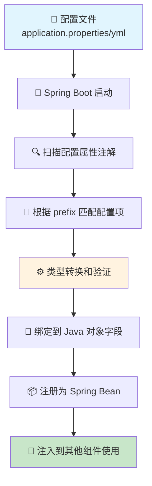

# @ConfigurationProperties(prefix = "") 注解完全指南 - Spring Boot 配置属性绑定神器 🚀

## 📋 摘要

`@ConfigurationProperties(prefix = "")` 是 Spring Boot 配置属性绑定的核心注解。通过 `prefix` 参数实现类型安全的配置管理，告别硬编码，拥抱灵活配置！🚀

---

## 🎯 @ConfigurationProperties(prefix = "") 核心解析

`@ConfigurationProperties(prefix = "")` 是 Spring Boot 的核心注解，用于将配置文件中的属性值绑定到 Java 对象。`prefix` 参数是核心，它指定了配置属性的前缀，实现精确的配置映射。

### 🔍 核心特性

- ✅ **类型安全**：自动进行类型转换和验证
- ✅ **灵活绑定**：支持多种命名格式的自动匹配
- ✅ **嵌套支持**：可以处理复杂的嵌套配置结构
- ✅ **验证集成**：与 JSR-303 验证框架无缝集成
- ✅ **IDE 支持**：提供完整的 IDE 智能提示

---

## 🚀 基本用法详解

### 1. 创建配置属性类

首先，我们需要创建一个普通的 Java 类，并使用 `@ConfigurationProperties` 注解：

```java
import org.springframework.boot.context.properties.ConfigurationProperties;
import org.springframework.stereotype.Component;

@Component
@ConfigurationProperties(prefix = "app.mail")
public class MailProperties {
    
    private String hostName;
    private int port;
    private String from;
    private boolean enableSsl;
    private String username;
    private String password;
    
    // 构造函数
    public MailProperties() {}
    
    // Getter 和 Setter 方法
    public String getHostName() {
        return hostName;
    }
    
    public void setHostName(String hostName) {
        this.hostName = hostName;
    }
    
    public int getPort() {
        return port;
    }
    
    public void setPort(int port) {
        this.port = port;
    }
    
    public String getFrom() {
        return from;
    }
    
    public void setFrom(String from) {
        this.from = from;
    }
    
    public boolean isEnableSsl() {
        return enableSsl;
    }
    
    public void setEnableSsl(boolean enableSsl) {
        this.enableSsl = enableSsl;
    }
    
    public String getUsername() {
        return username;
    }
    
    public void setUsername(String username) {
        this.username = username;
    }
    
    public String getPassword() {
        return password;
    }
    
    public void setPassword(String password) {
        this.password = password;
    }
}
```

### 2. 配置文件设置

在 `application.properties` 文件中添加相应的配置：

```properties
# 邮件服务器配置
app.mail.hostName=smtp.gmail.com
app.mail.port=587
app.mail.from=noreply@example.com
app.mail.enableSsl=true
app.mail.username=your-email@gmail.com
app.mail.password=your-app-password
```

或者在 `application.yml` 文件中：

```yaml
app:
  mail:
    hostName: smtp.gmail.com
    port: 587
    from: noreply@example.com
    enableSsl: true
    username: your-email@gmail.com
    password: your-app-password
```

### 3. 使用配置属性

在服务类中注入并使用配置属性：

```java
import org.springframework.beans.factory.annotation.Autowired;
import org.springframework.stereotype.Service;

@Service
public class EmailService {
    
    @Autowired
    private MailProperties mailProperties;
    
    public void sendEmail(String to, String subject, String content) {
        System.out.println("发送邮件配置：");
        System.out.println("服务器：" + mailProperties.getHostName());
        System.out.println("端口：" + mailProperties.getPort());
        System.out.println("发件人：" + mailProperties.getFrom());
        System.out.println("SSL 启用：" + mailProperties.isEnableSsl());
        
        // 实际的邮件发送逻辑
        // ...
    }
}
```

---

## 🎨 高级特性与技巧

### 1. 嵌套属性绑定

`@ConfigurationProperties` 支持复杂的嵌套结构：

```java
@Component
@ConfigurationProperties(prefix = "app")
public class AppProperties {
    
    private String name;
    private String version;
    private Database database;
    private Cache cache;
    private Security security;
    
    // 内部类定义
    public static class Database {
        private String url;
        private String username;
        private String password;
        private int maxConnections;
        
        // Getter 和 Setter
        public String getUrl() { return url; }
        public void setUrl(String url) { this.url = url; }
        
        public String getUsername() { return username; }
        public void setUsername(String username) { this.username = username; }
        
        public String getPassword() { return password; }
        public void setPassword(String password) { this.password = password; }
        
        public int getMaxConnections() { return maxConnections; }
        public void setMaxConnections(int maxConnections) { this.maxConnections = maxConnections; }
    }
    
    public static class Cache {
        private String type;
        private int ttl;
        private int maxSize;
        
        // Getter 和 Setter
        public String getType() { return type; }
        public void setType(String type) { this.type = type; }
        
        public int getTtl() { return ttl; }
        public void setTtl(int ttl) { this.ttl = ttl; }
        
        public int getMaxSize() { return maxSize; }
        public void setMaxSize(int maxSize) { this.maxSize = maxSize; }
    }
    
    public static class Security {
        private String jwtSecret;
        private int tokenExpiration;
        private boolean enableCors;
        
        // Getter 和 Setter
        public String getJwtSecret() { return jwtSecret; }
        public void setJwtSecret(String jwtSecret) { this.jwtSecret = jwtSecret; }
        
        public int getTokenExpiration() { return tokenExpiration; }
        public void setTokenExpiration(int tokenExpiration) { this.tokenExpiration = tokenExpiration; }
        
        public boolean isEnableCors() { return enableCors; }
        public void setEnableCors(boolean enableCors) { this.enableCors = enableCors; }
    }
    
    // 主类的 Getter 和 Setter
    public String getName() { return name; }
    public void setName(String name) { this.name = name; }
    
    public String getVersion() { return version; }
    public void setVersion(String version) { this.version = version; }
    
    public Database getDatabase() { return database; }
    public void setDatabase(Database database) { this.database = database; }
    
    public Cache getCache() { return cache; }
    public void setCache(Cache cache) { this.cache = cache; }
    
    public Security getSecurity() { return security; }
    public void setSecurity(Security security) { this.security = security; }
}
```

对应的配置文件：

```yaml
app:
  name: MyAwesomeApp
  version: 1.0.0
  database:
    url: jdbc:postgresql://localhost:5432/myapp
    username: admin
    password: secret123
    maxConnections: 20
  cache:
    type: redis
    ttl: 3600
    maxSize: 1000
  security:
    jwtSecret: my-super-secret-key
    tokenExpiration: 86400
    enableCors: true
```

### 2. 集合类型绑定

支持 List、Set、Map 等集合类型：

```java
@Component
@ConfigurationProperties(prefix = "app.servers")
public class ServerProperties {
    
    private List<String> hosts;
    private Map<String, Integer> ports;
    private Set<String> protocols;
    
    // Getter 和 Setter
    public List<String> getHosts() { return hosts; }
    public void setHosts(List<String> hosts) { this.hosts = hosts; }
    
    public Map<String, Integer> getPorts() { return ports; }
    public void setPorts(Map<String, Integer> ports) { this.ports = ports; }
    
    public Set<String> getProtocols() { return protocols; }
    public void setProtocols(Set<String> protocols) { this.protocols = protocols; }
}
```

配置文件：

```yaml
app:
  servers:
    hosts:
      - server1.example.com
      - server2.example.com
      - server3.example.com
    ports:
      http: 8080
      https: 8443
      admin: 9090
    protocols:
      - http
      - https
      - websocket
```

### 3. 使用 Java Record（Java 16+）

在 Java 16 及以上版本中，可以使用 Record 来简化不可变配置类：

```java
import org.springframework.boot.context.properties.ConfigurationProperties;
import org.springframework.boot.context.properties.ConstructorBinding;

@ConstructorBinding
@ConfigurationProperties(prefix = "app.api")
public record ApiProperties(
    String baseUrl,
    int timeout,
    boolean enableRetry,
    int maxRetries
) {
}
```

---

## 🔒 配置验证与转换

### 1. 使用 JSR-303 验证

```java
import org.springframework.boot.context.properties.ConfigurationProperties;
import org.springframework.stereotype.Component;
import org.springframework.validation.annotation.Validated;

import javax.validation.constraints.*;
import java.time.Duration;

@Component
@ConfigurationProperties(prefix = "app.validation")
@Validated
public class ValidationProperties {
    
    @NotBlank(message = "应用名称不能为空")
    @Size(min = 3, max = 50, message = "应用名称长度必须在 3-50 个字符之间")
    private String appName;
    
    @NotNull(message = "端口号不能为空")
    @Min(value = 1024, message = "端口号不能小于 1024")
    @Max(value = 65535, message = "端口号不能大于 65535")
    private Integer port;
    
    @Email(message = "邮箱格式不正确")
    private String adminEmail;
    
    @Pattern(regexp = "^https?://.*", message = "URL 必须以 http:// 或 https:// 开头")
    private String apiUrl;
    
    @DecimalMin(value = "0.0", message = "超时时间不能为负数")
    @DecimalMax(value = "300.0", message = "超时时间不能超过 300 秒")
    private Duration timeout;
    
    // Getter 和 Setter
    public String getAppName() { return appName; }
    public void setAppName(String appName) { this.appName = appName; }
    
    public Integer getPort() { return port; }
    public void setPort(Integer port) { this.port = port; }
    
    public String getAdminEmail() { return adminEmail; }
    public void setAdminEmail(String adminEmail) { this.adminEmail = adminEmail; }
    
    public String getApiUrl() { return apiUrl; }
    public void setApiUrl(String apiUrl) { this.apiUrl = apiUrl; }
    
    public Duration getTimeout() { return timeout; }
    public void setTimeout(Duration timeout) { this.timeout = timeout; }
}
```

### 2. 自定义类型转换

```java
import org.springframework.boot.context.properties.ConfigurationProperties;
import org.springframework.boot.context.properties.ConfigurationPropertiesBinding;
import org.springframework.core.convert.converter.Converter;
import org.springframework.stereotype.Component;

@Component
@ConfigurationProperties(prefix = "app.custom")
public class CustomTypeProperties {
    
    private CustomEnum status;
    private CustomObject customData;
    
    // Getter 和 Setter
    public CustomEnum getStatus() { return status; }
    public void setStatus(CustomEnum status) { this.status = status; }
    
    public CustomObject getCustomData() { return customData; }
    public void setCustomData(CustomObject customData) { this.customData = customData; }
    
    // 自定义枚举
    public enum CustomEnum {
        ACTIVE, INACTIVE, PENDING
    }
    
    // 自定义对象
    public static class CustomObject {
        private String value;
        private int count;
        
        public String getValue() { return value; }
        public void setValue(String value) { this.value = value; }
        
        public int getCount() { return count; }
        public void setCount(int count) { this.count = count; }
    }
}

// 自定义转换器
@Component
@ConfigurationPropertiesBinding
public class StringToCustomEnumConverter implements Converter<String, CustomTypeProperties.CustomEnum> {
    
    @Override
    public CustomTypeProperties.CustomEnum convert(String source) {
        try {
            return CustomTypeProperties.CustomEnum.valueOf(source.toUpperCase());
        } catch (IllegalArgumentException e) {
            throw new IllegalArgumentException("无效的枚举值: " + source);
        }
    }
}
```

---

## 🎯 注册方式详解

### 1. 使用 @Component 注解

```java
@Component
@ConfigurationProperties(prefix = "app.simple")
public class SimpleProperties {
    private String name;
    private String value;
    
    // Getter 和 Setter
    public String getName() { return name; }
    public void setName(String name) { this.name = name; }
    
    public String getValue() { return value; }
    public void setValue(String value) { this.value = value; }
}
```

### 2. 使用 @EnableConfigurationProperties

```java
import org.springframework.boot.context.properties.EnableConfigurationProperties;
import org.springframework.context.annotation.Configuration;

@Configuration
@EnableConfigurationProperties({MailProperties.class, AppProperties.class})
public class PropertiesConfig {
    // 配置类
}
```

### 3. 使用 @ConfigurationPropertiesScan

```java
import org.springframework.boot.SpringApplication;
import org.springframework.boot.autoconfigure.SpringBootApplication;
import org.springframework.boot.context.properties.ConfigurationPropertiesScan;

@SpringBootApplication
@ConfigurationPropertiesScan
public class Application {
    public static void main(String[] args) {
        SpringApplication.run(Application.class, args);
    }
}
```

---

## 📊 配置属性绑定流程图



---

## 🛠️ 最佳实践与注意事项

### 1. 命名规范

- **前缀命名**：使用 kebab-case（小写 + 连字符），如 `app.mail-server`
- **字段命名**：使用 camelCase，如 `hostName`、`enableSsl`
- **配置文件**：支持多种格式自动转换

### 2. 性能优化

```java
@Component
@ConfigurationProperties(prefix = "app.performance")
public class PerformanceProperties {
    
    // 使用基本类型而不是包装类型，避免空指针
    private int maxConnections = 10;  // 提供默认值
    private boolean enableCache = true;
    
    // 使用不可变集合
    private final List<String> servers = new ArrayList<>();
    
    // Getter 和 Setter
    public int getMaxConnections() { return maxConnections; }
    public void setMaxConnections(int maxConnections) { this.maxConnections = maxConnections; }
    
    public boolean isEnableCache() { return enableCache; }
    public void setEnableCache(boolean enableCache) { this.enableCache = enableCache; }
    
    public List<String> getServers() { return Collections.unmodifiableList(servers); }
    public void setServers(List<String> servers) { this.servers.clear(); this.servers.addAll(servers); }
}
```

### 3. 环境特定配置

```yaml
# application-dev.yml
app:
  database:
    url: jdbc:postgresql://localhost:5432/dev_db
    username: dev_user
    password: dev_password

# application-prod.yml
app:
  database:
    url: jdbc:postgresql://prod-server:5432/prod_db
    username: prod_user
    password: ${DB_PASSWORD}  # 使用环境变量
```

### 4. 配置元数据支持

在 `src/main/resources/META-INF/` 目录下创建 `additional-spring-configuration-metadata.json` 文件：

```json
{
  "properties": [
    {
      "name": "app.mail.hostName",
      "type": "java.lang.String",
      "description": "邮件服务器主机名",
      "defaultValue": "localhost"
    },
    {
      "name": "app.mail.port",
      "type": "java.lang.Integer",
      "description": "邮件服务器端口号",
      "defaultValue": 587
    }
  ]
}
```

---

## 🎉 实际应用示例

### 完整的邮件服务配置示例

```java
import org.springframework.boot.context.properties.ConfigurationProperties;
import org.springframework.stereotype.Component;
import org.springframework.validation.annotation.Validated;

import javax.validation.constraints.*;
import java.util.List;
import java.util.Map;

@Component
@ConfigurationProperties(prefix = "app.email")
@Validated
public class EmailConfigProperties {
    
    @NotBlank(message = "SMTP 服务器地址不能为空")
    private String smtpHost;
    
    @Min(value = 1, message = "端口号必须大于 0")
    @Max(value = 65535, message = "端口号不能超过 65535")
    private int smtpPort;
    
    @Email(message = "发件人邮箱格式不正确")
    private String fromAddress;
    
    @NotBlank(message = "发件人名称不能为空")
    private String fromName;
    
    private boolean enableSsl = true;
    private boolean enableTls = true;
    
    @Min(value = 1000, message = "连接超时时间不能小于 1000 毫秒")
    private int connectionTimeout = 5000;
    
    @Min(value = 1000, message = "读取超时时间不能小于 1000 毫秒")
    private int readTimeout = 10000;
    
    private String username;
    private String password;
    
    private List<String> ccAddresses;
    private Map<String, String> templates;
    
    // 构造函数
    public EmailConfigProperties() {
        this.ccAddresses = new ArrayList<>();
        this.templates = new HashMap<>();
    }
    
    // Getter 和 Setter 方法
    public String getSmtpHost() { return smtpHost; }
    public void setSmtpHost(String smtpHost) { this.smtpHost = smtpHost; }
    
    public int getSmtpPort() { return smtpPort; }
    public void setSmtpPort(int smtpPort) { this.smtpPort = smtpPort; }
    
    public String getFromAddress() { return fromAddress; }
    public void setFromAddress(String fromAddress) { this.fromAddress = fromAddress; }
    
    public String getFromName() { return fromName; }
    public void setFromName(String fromName) { this.fromName = fromName; }
    
    public boolean isEnableSsl() { return enableSsl; }
    public void setEnableSsl(boolean enableSsl) { this.enableSsl = enableSsl; }
    
    public boolean isEnableTls() { return enableTls; }
    public void setEnableTls(boolean enableTls) { this.enableTls = enableTls; }
    
    public int getConnectionTimeout() { return connectionTimeout; }
    public void setConnectionTimeout(int connectionTimeout) { this.connectionTimeout = connectionTimeout; }
    
    public int getReadTimeout() { return readTimeout; }
    public void setReadTimeout(int readTimeout) { this.readTimeout = readTimeout; }
    
    public String getUsername() { return username; }
    public void setUsername(String username) { this.username = username; }
    
    public String getPassword() { return password; }
    public void setPassword(String password) { this.password = password; }
    
    public List<String> getCcAddresses() { return ccAddresses; }
    public void setCcAddresses(List<String> ccAddresses) { this.ccAddresses = ccAddresses; }
    
    public Map<String, String> getTemplates() { return templates; }
    public void setTemplates(Map<String, String> templates) { this.templates = templates; }
}
```

对应的配置文件：

```yaml
app:
  email:
    smtpHost: smtp.gmail.com
    smtpPort: 587
    fromAddress: noreply@mycompany.com
    fromName: "我的公司"
    enableSsl: true
    enableTls: true
    connectionTimeout: 5000
    readTimeout: 10000
    username: ${EMAIL_USERNAME}
    password: ${EMAIL_PASSWORD}
    ccAddresses:
      - manager@mycompany.com
      - admin@mycompany.com
    templates:
      welcome: "欢迎加入我们的平台！"
      reset-password: "您的密码重置链接：{link}"
      notification: "您有新的通知：{message}"
```

---

## 🚨 常见问题与解决方案

### 1. 配置属性未生效

**问题**：配置属性类创建了，但值没有正确绑定。

**解决方案**：
- 确保类上有 `@Component` 注解或使用 `@EnableConfigurationProperties`
- 检查 `prefix` 是否与配置文件中的前缀匹配
- 确认配置文件路径正确（`src/main/resources/application.properties`）

### 2. 类型转换失败

**问题**：配置文件中的字符串无法转换为目标类型。

**解决方案**：
```java
// 使用 @Value 注解进行自定义转换
@Value("${app.custom.number}")
private int customNumber;

// 或者提供自定义转换器
@Component
@ConfigurationPropertiesBinding
public class StringToIntegerConverter implements Converter<String, Integer> {
    @Override
    public Integer convert(String source) {
        return Integer.parseInt(source.trim());
    }
}
```

### 3. 验证失败

**问题**：配置验证不通过，应用启动失败。

**解决方案**：
```java
// 在 application.properties 中添加验证配置
spring.config.validation.enabled=true

// 或者在代码中处理验证异常
@EventListener
public void handleValidationException(ValidationException event) {
    log.error("配置验证失败: {}", event.getMessage());
}
```

---

## 🎯 总结

`@ConfigurationProperties` 注解是 Spring Boot 中管理外部配置的核心工具，它提供了：

- 🔧 **类型安全**的配置绑定
- 🎨 **灵活**的属性映射机制  
- 🔒 **强大**的验证和转换功能
- 📦 **优雅**的嵌套结构支持
- ⚡ **高效**的性能表现

通过合理使用 `@ConfigurationProperties`，你可以构建出更加健壮、可维护的 Spring Boot 应用程序。记住，好的配置管理是优秀应用的基础！

## 🌟 开发者寄语

配置管理看似简单，实则是应用架构的重要基石。掌握 `@ConfigurationProperties` 不仅能让你的代码更加优雅，更能让你的应用具备强大的适应性和可维护性。继续探索 Spring Boot 的精彩世界，用代码创造更美好的未来！💪✨

---

**厦门工学院人工智能创作坊 -- 郑恩赐**  
**2025 年 10 月 7 日**
