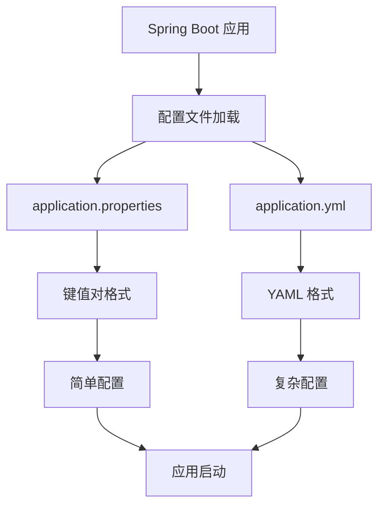
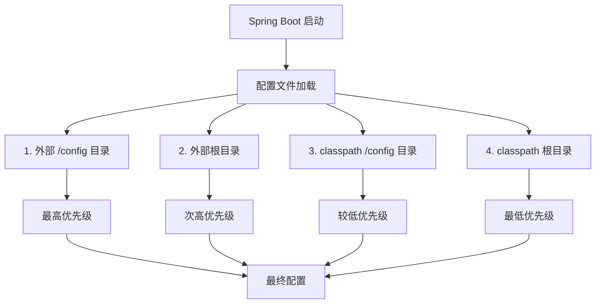

# 🚀 Spring Boot 配置文件完全指南 - 从入门到精通

## 📋 摘要

掌握 Spring Boot 配置文件 `application.properties` 和 `application.yml` 的使用技巧，让你的项目配置更加优雅、灵活和可维护，助你快速成为配置文件高手！

---

## 🎯 目录

- [1. 配置文件概述](#1-配置文件概述)
- [2. application.properties 详解](#2-applicationproperties-详解)
- [3. application.yml 详解](#3-applicationyml-详解)
- [4. 配置文件优先级](#4-配置文件优先级)
- [5. 多环境配置](#5-多环境配置)
- [6. 高级配置技巧](#6-高级配置技巧)
- [7. 最佳实践](#7-最佳实践)
- [8. 总结](#8-总结)

---

## 1. 配置文件概述

### 🔍 什么是配置文件？

Spring Boot 配置文件是存储应用程序配置信息的文件，它们告诉应用程序如何运行，包括数据库连接、服务器端口、日志级别等关键信息。

### 📁 配置文件类型

Spring Boot 支持两种主要的配置文件格式：

- **`application.properties`** - 键值对格式，简单直观
- **`application.yml`** - YAML 格式，层次清晰

### 🎨 配置文件结构图



---

## 2. application.properties 详解

### 📝 基础语法

`application.properties` 使用键值对格式，每行一个配置项：

```properties
# 服务器配置
server.port=8080
server.servlet.context-path=/api

# 数据库配置
spring.datasource.url=jdbc:mysql://localhost:3306/mydb
spring.datasource.username=root
spring.datasource.password=123456
spring.datasource.driver-class-name=com.mysql.cj.jdbc.Driver

# 日志配置
logging.level.com.example=DEBUG
logging.pattern.console=%d{yyyy-MM-dd HH:mm:ss} - %msg%n
```

### 🔧 常用配置示例

#### 数据库配置
```properties
# H2 内存数据库
spring.datasource.url=jdbc:h2:mem:testdb
spring.datasource.driver-class-name=org.h2.Driver
spring.h2.console.enabled=true

# PostgreSQL 配置
spring.datasource.url=jdbc:postgresql://localhost:5432/mydb
spring.datasource.username=postgres
spring.datasource.password=password
spring.datasource.driver-class-name=org.postgresql.Driver
```

#### JPA 配置
```properties
# JPA 配置
spring.jpa.hibernate.ddl-auto=update
spring.jpa.show-sql=true
spring.jpa.properties.hibernate.dialect=org.hibernate.dialect.MySQL8Dialect
spring.jpa.properties.hibernate.format_sql=true
```

#### 安全配置
```properties
# JWT 配置
jwt.secret=mySecretKey
jwt.expiration=86400000

# CORS 配置
spring.web.cors.allowed-origins=http://localhost:3000
spring.web.cors.allowed-methods=GET,POST,PUT,DELETE
spring.web.cors.allowed-headers=*
```

---

## 3. application.yml 详解

### 📝 基础语法

`application.yml` 使用 YAML 格式，通过缩进表示层次结构：

```yaml
# 服务器配置
server:
  port: 8080
  servlet:
    context-path: /api

# 数据库配置
spring:
  datasource:
    url: jdbc:mysql://localhost:3306/mydb
    username: root
    password: 123456
    driver-class-name: com.mysql.cj.jdbc.Driver
  
  # JPA 配置
  jpa:
    hibernate:
      ddl-auto: update
    show-sql: true
    properties:
      hibernate:
        dialect: org.hibernate.dialect.MySQL8Dialect
        format_sql: true

# 日志配置
logging:
  level:
    com.example: DEBUG
  pattern:
    console: "%d{yyyy-MM-dd HH:mm:ss} - %msg%n"
```

### 🎨 YAML 格式优势

#### 1. 层次结构清晰
```yaml
spring:
  datasource:
    url: jdbc:mysql://localhost:3306/mydb
    username: root
    password: 123456
  jpa:
    hibernate:
      ddl-auto: update
    show-sql: true
```

#### 2. 支持列表和数组
```yaml
spring:
  profiles:
    active: dev
  datasource:
    hikari:
      maximum-pool-size: 20
      minimum-idle: 5
      connection-timeout: 30000
      idle-timeout: 600000
      max-lifetime: 1800000
```

#### 3. 多行文本支持
```yaml
logging:
  pattern:
    console: |
      %d{yyyy-MM-dd HH:mm:ss.SSS} [%thread] %-5level %logger{36} - %msg%n
      %d{yyyy-MM-dd HH:mm:ss.SSS} [%thread] %-5level %logger{36} - %msg%n
```

---

## 4. 配置文件优先级

### 📊 加载顺序图



### 🔄 优先级规则

Spring Boot 按照以下顺序加载配置文件（优先级从高到低）：

1. **外部 `/config` 目录** - 项目根目录下的 `config` 文件夹
2. **外部根目录** - 项目根目录
3. **classpath `/config` 目录** - `src/main/resources/config`
4. **classpath 根目录** - `src/main/resources`

### ⚠️ 重要提示

- 如果同时存在 `application.properties` 和 `application.yml`，`application.properties` 优先级更高
- 相同配置项会被后加载的配置覆盖
- 外部配置可以覆盖内部配置

---

## 5. 多环境配置

### 🌍 环境配置文件

创建不同环境的配置文件：

```
src/main/resources/
├── application.yml          # 主配置文件
├── application-dev.yml      # 开发环境
├── application-test.yml     # 测试环境
├── application-prod.yml     # 生产环境
└── application-local.yml    # 本地环境
```

### 📝 环境配置示例

#### 主配置文件 (application.yml)
```yaml
spring:
  profiles:
    active: dev  # 默认激活开发环境

# 通用配置
server:
  servlet:
    context-path: /api

logging:
  level:
    root: INFO
```

#### 开发环境 (application-dev.yml)
```yaml
spring:
  datasource:
    url: jdbc:h2:mem:devdb
    username: sa
    password: 
    driver-class-name: org.h2.Driver
  h2:
    console:
      enabled: true

logging:
  level:
    com.example: DEBUG
    org.springframework.web: DEBUG
```

#### 生产环境 (application-prod.yml)
```yaml
spring:
  datasource:
    url: jdbc:mysql://prod-server:3306/proddb
    username: ${DB_USERNAME:prod_user}
    password: ${DB_PASSWORD:prod_pass}
    driver-class-name: com.mysql.cj.jdbc.Driver
    hikari:
      maximum-pool-size: 20
      minimum-idle: 5

logging:
  level:
    root: WARN
    com.example: INFO
  file:
    name: /var/log/app/application.log
```

### 🚀 环境激活方式

#### 1. 配置文件激活
```yaml
spring:
  profiles:
    active: prod
```

#### 2. 命令行激活
```bash
java -jar app.jar --spring.profiles.active=prod
```

#### 3. 环境变量激活
```bash
export SPRING_PROFILES_ACTIVE=prod
```

#### 4. JVM 参数激活
```bash
java -Dspring.profiles.active=prod -jar app.jar
```

---

## 6. 高级配置技巧

### 🔧 配置属性绑定

#### 使用 @Value 注解
```java
@Component
public class DatabaseConfig {
    
    @Value("${spring.datasource.url}")
    private String url;
    
    @Value("${spring.datasource.username}")
    private String username;
    
    @Value("${spring.datasource.password}")
    private String password;
    
    @Value("${app.timeout:30}")
    private int timeout;
    
    // getters and setters
}
```

#### 使用 @ConfigurationProperties
```java
@Component
@ConfigurationProperties(prefix = "app")
public class AppProperties {
    
    private String name;
    private String version;
    private Database database = new Database();
    private Security security = new Security();
    
    // 内部类
    public static class Database {
        private String url;
        private String username;
        private String password;
        private int maxConnections = 10;
        
        // getters and setters
    }
    
    public static class Security {
        private String jwtSecret;
        private long jwtExpiration = 86400000;
        private boolean corsEnabled = true;
        
        // getters and setters
    }
    
    // getters and setters
}
```

### 🔐 敏感信息处理

#### 1. 环境变量
```yaml
spring:
  datasource:
    username: ${DB_USERNAME:default_user}
    password: ${DB_PASSWORD:default_pass}
```

#### 2. 外部配置文件
```yaml
# application-secret.yml (不提交到版本控制)
spring:
  datasource:
    username: ${DB_USERNAME}
    password: ${DB_PASSWORD}
```

#### 3. 加密配置
```yaml
spring:
  datasource:
    username: ENC(encrypted_username)
    password: ENC(encrypted_password)
```

### 🎯 条件配置

#### 使用 @ConditionalOnProperty
```java
@Configuration
@ConditionalOnProperty(name = "app.feature.enabled", havingValue = "true")
public class FeatureConfig {
    
    @Bean
    public FeatureService featureService() {
        return new FeatureService();
    }
}
```

#### 使用 @Profile
```java
@Configuration
@Profile("dev")
public class DevConfig {
    
    @Bean
    public DataSource dataSource() {
        return new EmbeddedDatabaseBuilder()
            .setType(EmbeddedDatabaseType.H2)
            .build();
    }
}
```

---

## 7. 最佳实践

### 📋 配置文件组织

#### 1. 按功能分组
```yaml
# 服务器配置
server:
  port: 8080
  servlet:
    context-path: /api

# 数据库配置
spring:
  datasource:
    url: jdbc:mysql://localhost:3306/mydb
    username: root
    password: 123456

# 应用特定配置
app:
  name: My Application
  version: 1.0.0
  features:
    cache: true
    metrics: true
```

#### 2. 使用注释说明
```yaml
# 数据库连接配置
spring:
  datasource:
    # 数据库 URL
    url: jdbc:mysql://localhost:3306/mydb
    # 数据库用户名
    username: root
    # 数据库密码
    password: 123456
    # 连接池配置
    hikari:
      maximum-pool-size: 20
      minimum-idle: 5
```

### 🔒 安全建议

1. **敏感信息外部化** - 使用环境变量或外部配置文件
2. **配置文件加密** - 对敏感配置进行加密
3. **访问控制** - 限制配置文件的访问权限
4. **定期轮换** - 定期更换敏感配置

### 📊 性能优化

#### 1. 配置缓存
```yaml
spring:
  cache:
    type: caffeine
    caffeine:
      spec: maximumSize=1000,expireAfterWrite=1h
```

#### 2. 连接池优化
```yaml
spring:
  datasource:
    hikari:
      maximum-pool-size: 20
      minimum-idle: 5
      connection-timeout: 30000
      idle-timeout: 600000
      max-lifetime: 1800000
```

### 🧪 测试配置

#### 测试专用配置
```yaml
# application-test.yml
spring:
  datasource:
    url: jdbc:h2:mem:testdb
    username: sa
    password: 
  jpa:
    hibernate:
      ddl-auto: create-drop
    show-sql: true

logging:
  level:
    com.example: DEBUG
```

---

## 8. 总结

🎉 **恭喜你！** 你已经掌握了 Spring Boot 配置文件的精髓！

通过本指南，你学会了：

- ✅ **配置文件基础** - 掌握 `application.properties` 和 `application.yml` 的使用
- ✅ **优先级管理** - 理解配置文件的加载顺序和覆盖规则
- ✅ **多环境配置** - 实现开发、测试、生产环境的灵活切换
- ✅ **高级技巧** - 使用属性绑定、条件配置等高级特性
- ✅ **最佳实践** - 遵循安全、性能、可维护性的最佳实践

### 🚀 下一步行动

1. **实践出真知** - 在你的项目中尝试这些配置技巧
2. **持续学习** - 关注 Spring Boot 的最新特性和更新
3. **分享经验** - 与团队成员分享你的配置经验
4. **优化改进** - 根据项目需求不断优化配置结构

记住，好的配置是成功项目的基础！继续探索，让配置为你的应用插上腾飞的翅膀！ 🌟

---

**厦门工学院人工智能创作坊 -- 郑恩赐**  
**2025 年 10 月 12 日**
