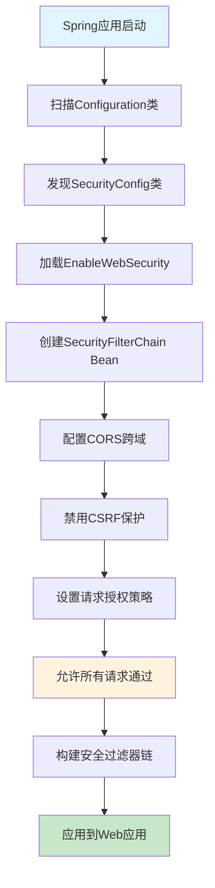

# Spring Security 最简配置完全指南 - 从入门到精通前后端分离安全配置

## 📋 摘要

在前后端分离架构中，Spring Security 的默认配置往往会阻止前端应用访问后端 API，导致跨域（CORS）和认证问题。本指南将深入解析 Spring Security 最简配置代码，帮助开发者快速解决前后端通信障碍，实现安全且高效的全栈开发。通过详细的代码解析、配置原理说明和最佳实践建议，让零基础开发者也能轻松掌握 Spring Security 核心配置，为项目搭建坚实的安全基础。

---

## 🎯 目录

- [1. 代码概览](#1-代码概览)
- [2. 核心注解详解](#2-核心注解详解)
- [3. 配置方法深度解析](#3-配置方法深度解析)
- [4. 安全策略配置](#4-安全策略配置)
- [5. 配置流程图](#5-配置流程图)
- [6. 实际应用场景](#6-实际应用场景)
- [7. 最佳实践建议](#7-最佳实践建议)
- [8. 常见问题解决](#8-常见问题解决)
- [9. 总结](#9-总结)

---

## 1. 代码概览

### 1.1 完整代码展示

```java
package com.ZhengEnCi.demo.config;

import org.springframework.context.annotation.Bean;
import org.springframework.context.annotation.Configuration;
import org.springframework.security.config.annotation.web.builders.HttpSecurity;
import org.springframework.security.config.annotation.web.configuration.EnableWebSecurity;
import org.springframework.security.web.SecurityFilterChain;

/**
 * Spring Security 最简配置
 * 允许前端访问后端接口
 *
 * @author ZhengEnCi
 * @since 2025-10-07
 */
@Configuration
@EnableWebSecurity
public class SecurityConfig {

    @Bean
    public SecurityFilterChain filterChain(HttpSecurity http) throws Exception {
        http
            .cors().and()                    // 启用CORS
            .csrf().disable()                // 禁用CSRF
            .authorizeHttpRequests(authz -> authz
                .anyRequest().permitAll()    // 允许所有请求
            );
        return http.build();
    }
}
```

### 1.2 配置目标

这个配置类的主要目标是：
- 🔓 **解决跨域问题**：让前端能够正常访问后端 API
- 🚫 **简化认证流程**：暂时允许所有请求无需认证
- ⚡ **快速开发**：为前后端分离项目提供最基础的安全配置

---

## 2. 核心注解详解

### 2.1 @Configuration 注解

```java
@Configuration
public class SecurityConfig {
    // 配置内容
}
```

**作用说明：**
- 📦 **标识配置类**：告诉 Spring 这是一个配置类
- 🔧 **Bean 定义**：允许在类中定义 Spring Bean（Bean 是 Spring 管理的对象）
- 🎯 **自动扫描**：Spring 会自动扫描并加载这个配置类

**类比理解：** 就像给一个房间贴上"配置室"的标签，Spring 知道这个房间里有重要的配置信息。

### 2.2 @EnableWebSecurity 注解

```java
@EnableWebSecurity
public class SecurityConfig {
    // 安全配置内容
}
```

**作用说明：**
- 🛡️ **启用安全功能**：激活 Spring Security 的 Web 安全特性
- 🔐 **安全过滤器**：自动配置安全相关的过滤器链（Filter Chain）
- 🌐 **Web 应用保护**：为 Web 应用提供基础的安全保护

**类比理解：** 就像给房子安装防盗系统，@EnableWebSecurity 就是"开启安全模式"的开关。

---

## 3. 配置方法深度解析

### 3.1 @Bean 注解

```java
@Bean
public SecurityFilterChain filterChain(HttpSecurity http) throws Exception {
    // 配置逻辑
    return http.build();
}
```

**核心作用：**
- 🏭 **Bean 工厂**：将方法返回的对象注册为 Spring 容器中的 Bean
- 🔄 **依赖注入**：Spring 会自动调用这个方法并管理返回的对象
- ⚙️ **配置中心**：这是 Spring Security 配置的核心方法

### 3.2 HttpSecurity 参数

```java
public SecurityFilterChain filterChain(HttpSecurity http) throws Exception {
    // http 参数用于配置安全策略
}
```

**参数说明：**
- 🔧 **配置工具**：HttpSecurity 是配置 HTTP 安全策略的工具类
- 🎛️ **链式调用**：支持链式调用，可以连续配置多个安全选项
- 🏗️ **构建器模式**：使用构建器模式，最后调用 build() 方法构建配置

---

## 4. 安全策略配置

### 4.1 CORS 跨域配置

```java
http.cors().and()
```

**详细解析：**
- 🌐 **CORS 启用**：启用跨域资源共享（Cross-Origin Resource Sharing）
- 🔗 **前后端连接**：允许前端应用（如 React、Vue）访问后端 API
- ⚙️ **默认配置**：使用 Spring Security 的默认 CORS 配置

**为什么需要 CORS？**
- 浏览器同源策略（Same-Origin Policy）会阻止跨域请求
- 前后端分离项目中，前端和后端通常运行在不同端口
- CORS 配置告诉浏览器"这个跨域请求是安全的"

### 4.2 CSRF 保护禁用

```java
http.csrf().disable()
```

**详细解析：**
- 🚫 **CSRF 禁用**：禁用跨站请求伪造（Cross-Site Request Forgery）保护
- ⚠️ **安全风险**：禁用 CSRF 会降低安全性，但简化了开发流程
- 🎯 **适用场景**：主要用于 API 服务，不涉及表单提交的场景

**CSRF 是什么？**
- 恶意网站利用用户已登录的身份发送请求
- 例如：用户登录了银行网站，然后访问恶意网站，恶意网站可能利用用户的身份进行转账

### 4.3 请求授权配置

```java
.authorizeHttpRequests(authz -> authz
    .anyRequest().permitAll()    // 允许所有请求
)
```

**详细解析：**
- 🔓 **permitAll()**：允许所有请求无需认证即可访问
- 🎯 **anyRequest()**：匹配所有 HTTP 请求
- ⚡ **开发友好**：适合开发和测试环境，生产环境需要更严格的配置

**Lambda 表达式说明：**
```java
authz -> authz.anyRequest().permitAll()
```
- `authz` 是参数名，代表授权配置对象
- `->` 是 Lambda 操作符
- 整个表达式表示"配置授权，让所有请求都允许通过"

---

## 5. 配置流程图



---

## 6. 实际应用场景

### 6.1 前后端分离项目

```java
// 典型的前后端分离架构
前端 (React/Vue/Angular) ←→ 后端 (Spring Boot + Spring Security)
    端口: 3000                   端口: 8080
```

**配置效果：**
- ✅ 前端可以正常调用后端 API
- ✅ 解决跨域访问问题
- ✅ 简化开发流程

### 6.2 微服务架构

```java
// 微服务间的 API 调用
服务A ←→ 服务B (Spring Security 配置)
```

**配置效果：**
- ✅ 服务间可以正常通信
- ✅ 避免认证复杂性
- ✅ 快速搭建服务架构

### 6.3 开发测试环境

**适用场景：**
- 🧪 **单元测试**：测试环境需要快速验证功能
- 🔧 **开发调试**：开发过程中避免认证干扰
- 📊 **API 测试**：使用 Postman 等工具测试 API

---

## 7. 最佳实践建议

### 7.1 生产环境安全配置

```java
@Bean
public SecurityFilterChain filterChain(HttpSecurity http) throws Exception {
    http
        .cors(cors -> cors.configurationSource(corsConfigurationSource()))
        .csrf(csrf -> csrf.disable())
        .authorizeHttpRequests(authz -> authz
            .requestMatchers("/api/public/**").permitAll()  // 公开接口
            .requestMatchers("/api/admin/**").hasRole("ADMIN")  // 管理员接口
            .anyRequest().authenticated()  // 其他请求需要认证
        )
        .sessionManagement(session -> session
            .sessionCreationPolicy(SessionCreationPolicy.STATELESS)  // 无状态会话
        );
    return http.build();
}
```

### 7.2 环境区分配置

```java
@Configuration
@EnableWebSecurity
@Profile("dev")  // 仅在开发环境生效
public class DevSecurityConfig {
    // 开发环境配置
}

@Configuration
@EnableWebSecurity
@Profile("prod")  // 仅在生产环境生效
public class ProdSecurityConfig {
    // 生产环境配置
}
```

### 7.3 自定义 CORS 配置

```java
@Bean
public CorsConfigurationSource corsConfigurationSource() {
    CorsConfiguration configuration = new CorsConfiguration();
    configuration.setAllowedOriginPatterns(Arrays.asList("*"));
    configuration.setAllowedMethods(Arrays.asList("GET", "POST", "PUT", "DELETE"));
    configuration.setAllowedHeaders(Arrays.asList("*"));
    configuration.setAllowCredentials(true);
    
    UrlBasedCorsConfigurationSource source = new UrlBasedCorsConfigurationSource();
    source.registerCorsConfiguration("/**", configuration);
    return source;
}
```

---

## 8. 常见问题解决

### 8.1 跨域问题

**问题现象：**
```
Access to XMLHttpRequest at 'http://localhost:8080/api/data' 
from origin 'http://localhost:3000' has been blocked by CORS policy
```

**解决方案：**
```java
// 确保启用了 CORS
http.cors().and()
```

### 8.2 403 Forbidden 错误

**问题现象：**
```
HTTP 403 Forbidden
```

**解决方案：**
```java
// 确保允许所有请求
.authorizeHttpRequests(authz -> authz
    .anyRequest().permitAll()
)
```

### 8.3 配置不生效

**问题排查：**
1. 检查类是否被 `@Configuration` 注解
2. 检查是否在正确的包路径下
3. 检查 Spring Boot 是否启用了自动配置

---

## 9. 总结

通过本指南的详细解析，我们深入了解了 Spring Security 最简配置的每个细节：

### 🎯 核心要点回顾

1. **@Configuration + @EnableWebSecurity**：激活 Spring Security 功能
2. **SecurityFilterChain Bean**：定义安全过滤器链的核心配置
3. **CORS 配置**：解决前后端跨域访问问题
4. **CSRF 禁用**：简化开发流程（生产环境需谨慎）
5. **permitAll()**：允许所有请求无需认证

### 🚀 学习建议

- 📚 **循序渐进**：从最简配置开始，逐步学习更复杂的安全策略
- 🔧 **实践为主**：在真实项目中应用这些配置，加深理解
- 🛡️ **安全意识**：理解每个配置的安全影响，为生产环境做好准备
- 📖 **持续学习**：关注 Spring Security 官方文档，了解最新特性

### 🎯 学习建议

Spring Security 作为企业级安全框架，看似复杂，但通过最简配置的学习，你已经迈出了重要的一步。每一个成功的全栈项目都离不开安全配置的支撑，通过不断的学习和实践，你将能够掌握更高级的安全配置技巧，构建出既安全又高效的应用系统。

---

**厦门工学院人工智能创作坊 -- 郑恩赐**  
**2025 年 10 月 8 日**
