# J0-Java学习路线-什么是Java学习路线？为什么大厂都在用Java？怎么从零基础到企业级开发？

## 📝 摘要

想学 Java 但不知道从哪里开始？本路线图为你规划清晰的三阶段学习路径，42-54 天系统掌握 Java 基础。从环境搭建到面向对象编程，再到核心 API，循序渐进打牢基础，快速进入企业级开发！

---

## 目录

- [1. Java 基础学习路线总览](#1-java-基础学习路线总览)
- [2. 第一阶段：环境搭建与基础语法](#2-第一阶段环境搭建与基础语法)
- [3. 第二阶段：面向对象编程](#3-第二阶段面向对象编程)
- [4. 第三阶段：Java 核心 API](#4-第三阶段java-核心-api)
- [5. 学习建议与时间规划](#5-学习建议与时间规划)
- [6. 后续学习建议](#6-后续学习建议)
- [7. 📚 参考资料与学习资源](#7-参考资料与学习资源)
- [8. 总结](#8-总结)

---

## 1. Java 基础学习路线总览

**Java 基础学习路线图**聚焦 Java 核心基础知识，通过三个阶段循序渐进，系统掌握 Java 基础语法和常用类库，为后续深入学习打下坚实基础。

**生活化比喻**：学习 Java 就像建房子，第一阶段是打地基（环境搭建和基础语法），第二阶段是建主体结构（面向对象编程），第三阶段是装修完善（核心 API）。只有地基牢固、结构稳定，后续的装修和扩建才能顺利进行。

### 1.1 学习路线流程图

```mermaid
graph TD
    Start["☕ Java 基础学习路线图<br/>从零基础到掌握核心语法"]
    
    P1["第一阶段：环境搭建与基础语法<br/>(14-18天)"]
    P1A["J1A: Java 语言特点和版本选择"]
    P1B["J1B: JDK 安装与环境配置<br/>(Java Development Kit)"]
    P1C["J1C: IDE 选择与使用<br/>(Integrated Development Environment)"]
    P1D["J1D: 数据类型与变量<br/>(8种基本类型+包装类)"]
    P1E["J1E: 运算符<br/>(算术、关系、逻辑、位运算)"]
    P1F["J1F: 控制结构<br/>(if-else、switch、for、while)"]
    P1G["J1G: 数组<br/>(一维、多维、Arrays工具类)"]
    P1H["J1H: 字符串处理<br/>(String、StringBuilder、StringBuffer)"]
    
    P2["第二阶段：面向对象编程<br/>(14-18天)"]
    P2A["J2A: 类与对象<br/>(类定义、对象创建、构造方法)"]
    P2B["J2B: 封装<br/>(访问修饰符、getter/setter)"]
    P2C["J2C: 继承<br/>(extends、super、方法重写)"]
    P2D["J2D: 多态<br/>(向上转型、动态绑定、方法重载)"]
    P2E["J2E: 抽象类与接口<br/>(abstract、interface、多接口实现)"]
    P2F["J2F: 内部类<br/>(成员内部类、静态内部类、匿名内部类)"]
    P2G["J2G: Object 类与常用方法<br/>(toString、equals、hashCode)"]
    P2H["J2H: 枚举类型<br/>(enum、枚举方法、枚举应用)"]
    
    P3["第三阶段：Java 核心 API<br/>(Application Programming Interface)"]
    P3A["J3A: 异常处理<br/>(try-catch-finally、自定义异常)"]
    P3B["J3B: 包装类与自动装箱拆箱"]
    P3C["J3C: 日期时间处理<br/>(java.time 包、LocalDate、LocalDateTime)"]
    P3D["J3D: 集合框架 List<br/>(ArrayList、LinkedList、Vector)"]
    P3E["J3E: 集合框架 Set<br/>(HashSet、TreeSet、LinkedHashSet)"]
    P3F["J3F: 集合框架 Map<br/>(HashMap、TreeMap、LinkedHashMap)"]
    P3G["J3G: 泛型<br/>(泛型类、泛型方法、通配符)"]
    P3H["J3H: 迭代器与增强 for 循环"]
    P3I["J3I: IO 流基础<br/>(File、字节流、字符流)"]
    
    Next["✅ 完成基础学习<br/>继续学习建议见第6章"]
    
    Start --> P1
    P1 --> P1A --> P1B --> P1C --> P1D --> P1E --> P1F --> P1G --> P1H
    P1H --> P2
    P2 --> P2A --> P2B --> P2C --> P2D --> P2E --> P2F --> P2G --> P2H
    P2H --> P3
    P3 --> P3A --> P3B --> P3C --> P3D --> P3E --> P3F --> P3G --> P3H --> P3I
    P3I --> Next
    
    style Start fill:#e3f2fd,stroke:#1976d2,stroke-width:3px
    style P1 fill:#e1f5fe,stroke:#0288d1
    style P2 fill:#e8f5e9,stroke:#388e3c
    style P3 fill:#fff3e0,stroke:#f57c00
    style Next fill:#f3e5f5,stroke:#7b1fa2,stroke-width:2px
```

### 1.2 学习路线说明

**Java 基础学习路线**采用三阶段递进式学习方式，每个阶段都有明确的学习目标和实践任务：

1. **第一阶段（环境搭建与基础语法）**：建立 Java 开发环境，掌握基础语法和程序结构
2. **第二阶段（面向对象编程）**：深入理解 Java 核心的面向对象特性
3. **第三阶段（Java 核心 API（Application Programming Interface（应用程序编程接口）））**：熟练使用 Java 标准库中的常用类和工具

完成这三个阶段的学习后，你已经掌握了 Java 的核心基础知识。接下来可以参考第 6 章的后续学习建议，继续深入学习 Java 高级特性和企业级开发技术。

---

## 2. 第一阶段：环境搭建与基础语法

✅ Must（必做实践）

**第一阶段**是 Java 学习的基础，需要完成开发环境搭建并掌握 Java 基础语法，为后续学习打下坚实基础。

### 2.1 阶段目标

- ✅ 能够独立搭建 Java 开发环境（JDK（Java Development Kit（Java 开发工具包）） + IDE（Integrated Development Environment（集成开发环境）））
- ✅ 掌握 Java 基本语法和程序结构
- ✅ 理解 Java 数据类型和变量使用
- ✅ 熟练使用控制结构和数组
- ✅ 掌握字符串处理的基本操作

### 2.2 知识点详解

| 编号 | 知识点 | 核心内容 | 学习时长 | 优先级 |
|------|--------|----------|----------|--------|
| **J1A** | Java 语言特点和版本选择 | Java 特点（跨平台、面向对象、自动内存管理）、JDK（Java Development Kit（Java 开发工具包））版本选择（推荐 JDK 17 LTS（Long Term Support（长期支持））） | 1-2 天 | ⭐⭐⭐ |
| **J1B** | JDK（Java Development Kit（Java 开发工具包））安装与环境配置 | 下载安装 JDK、配置 JAVA_HOME 和 PATH 环境变量、验证安装 | 1 天 | ⭐⭐⭐ |
| **J1C** | IDE（Integrated Development Environment（集成开发环境））选择与使用 | IntelliJ IDEA 或 Eclipse 的安装、基本配置、创建第一个 Java 程序 | 1-2 天 | ⭐⭐⭐ |
| **J1D** | 数据类型与变量 | 8 种基本数据类型、包装类、变量声明与命名规范、类型转换 | 2-3 天 | ⭐⭐⭐ |
| **J1E** | 运算符 | 算术运算符、关系运算符、逻辑运算符、位运算符、赋值运算符、三元运算符 | 1-2 天 | ⭐⭐ |
| **J1F** | 控制结构 | if-else、switch-case、for 循环、while 循环、do-while 循环、break/continue | 2-3 天 | ⭐⭐⭐ |
| **J1G** | 数组 | 一维数组、多维数组、数组初始化、数组遍历、Arrays 工具类 | 2-3 天 | ⭐⭐⭐ |
| **J1H** | 字符串处理 | String 类的常用方法、StringBuilder 和 StringBuffer 的使用场景 | 2-3 天 | ⭐⭐⭐ |

### 2.3 实践任务建议

**基础实践**（Must（必做实践））：
1. ✅ 完成 JDK（Java Development Kit（Java 开发工具包））安装和环境变量配置，在命令行中成功运行 `java -version`
2. ✅ 在 IDE（Integrated Development Environment（集成开发环境））中创建第一个 Java 程序，输出 "Hello, World!"
3. ✅ 编写程序练习各种数据类型的声明和使用
4. ✅ 完成控制结构综合练习（如：打印九九乘法表、判断素数等）
5. ✅ 实现数组的常见操作（查找、排序、反转等）

**进阶实践**（Should（建议实践））：
1. ⭐ 编写一个小型控制台应用程序（如：学生成绩管理系统）
2. ⭐ 练习字符串的各种操作方法（查找、替换、分割、拼接等）
3. ⭐ 使用数组实现简单的数据结构（如：栈、队列）

### 2.4 学习建议

- 💡 **循序渐进**：每个知识点都要通过实际编码练习，不要只停留在理论层面
- 💡 **多动手**：每学习一个语法特性，立即编写代码验证，加深理解
- 💡 **记录笔记**：遇到问题及时记录，建立自己的知识点库
- 💡 **版本选择**：初学者推荐使用 JDK（Java Development Kit（Java 开发工具包）） 17 LTS（Long Term Support（长期支持）），稳定性好且功能完善

---

## 3. 第二阶段：面向对象编程

✅ Must（必做实践）

**第二阶段**是 Java 学习的核心，面向对象编程（OOP（Object-Oriented Programming（面向对象编程）））是 Java 语言的灵魂。

**生活化比喻**：面向对象编程就像搭积木，类（Class）是积木的模具，对象（Object）是用模具做出来的具体积木。封装（Encapsulation）就像给积木装上保护壳，继承（Inheritance）就像小积木可以继承大积木的形状，多态（Polymorphism）就像同一个形状的积木可以有不同的颜色和用途。

### 3.1 阶段目标

- ✅ 深入理解类和对象的概念
- ✅ 掌握封装、继承、多态三大特性
- ✅ 理解抽象类和接口的区别与应用
- ✅ 熟悉 Object 类和常用方法
- ✅ 掌握枚举类型的定义和使用

### 3.2 知识点详解

| 编号 | 知识点 | 核心内容 | 学习时长 | 优先级 |
|------|--------|----------|----------|--------|
| **J2A** | 类与对象 | 类定义、对象创建、构造方法、this 关键字、方法重载 | 2-3 天 | ⭐⭐⭐ |
| **J2B** | 封装 | 访问修饰符（public、private、protected、默认）、getter/setter 方法 | 1-2 天 | ⭐⭐⭐ |
| **J2C** | 继承 | extends 关键字、super 关键字、方法重写（Override）、Object 类 | 2-3 天 | ⭐⭐⭐ |
| **J2D** | 多态 | 向上转型、向下转型、动态绑定、方法重载 vs 方法重写、instanceof | 2-3 天 | ⭐⭐⭐ |
| **J2E** | 抽象类与接口 | abstract 关键字、interface 接口、多接口实现、接口默认方法 | 2-3 天 | ⭐⭐⭐ |
| **J2F** | 内部类 | 成员内部类、静态内部类、局部内部类、匿名内部类 | 1-2 天 | ⭐⭐ |
| **J2G** | Object 类与常用方法 | toString()、equals()、hashCode()、getClass()、clone() | 2-3 天 | ⭐⭐⭐ |
| **J2H** | 枚举类型 | enum 关键字、枚举方法、枚举应用场景 | 1-2 天 | ⭐⭐ |

### 3.3 实践任务建议

**基础实践**（Must（必做实践））：
1. ✅ 设计并实现一个完整的类（包含属性、构造方法、getter/setter、业务方法）
2. ✅ 实现类的继承关系（父类、子类、方法重写）
3. ✅ 练习多态的应用（向上转型、向下转型、方法调用）
4. ✅ 实现接口并理解接口与抽象类的区别
5. ✅ 重写 equals() 和 hashCode() 方法

**进阶实践**（Should（建议实践））：
1. ⭐ 设计一个完整的面向对象系统（如：图书管理系统、员工管理系统）
2. ⭐ 理解并应用设计模式（如：单例模式、工厂模式）
3. ⭐ 使用枚举类型优化代码设计

---

## 4. 第三阶段：Java 核心 API

⭐ Should（建议实践）

**第三阶段**学习 Java 标准库中的核心 API（Application Programming Interface（应用程序编程接口）），这些是日常开发中必不可少的知识点。

**生活化比喻**：Java 核心 API 就像是工具箱里的常用工具，异常处理（Exception Handling）是工具箱里的安全措施，集合框架（Collection Framework）是存放物品的容器，IO 流（Input/Output Stream（输入/输出流））是传输数据的管道。掌握这些工具，才能高效地完成开发任务。

### 4.1 阶段目标

- ✅ 掌握异常处理机制
- ✅ 熟练使用集合框架（List、Set、Map）
- ✅ 理解泛型的应用
- ✅ 掌握日期时间处理
- ✅ 熟练使用 IO 流进行文件操作

### 4.2 知识点详解

| 编号 | 知识点 | 核心内容 | 学习时长 | 优先级 |
|------|--------|----------|----------|--------|
| **J3A** | 异常处理 | try-catch-finally、throws、throw、自定义异常、异常分类 | 2-3 天 | ⭐⭐⭐ |
| **J3B** | 包装类与自动装箱拆箱 | Integer、Double 等包装类、自动装箱/拆箱、缓存机制 | 1-2 天 | ⭐⭐ |
| **J3C** | 日期时间处理 | java.time 包（LocalDate、LocalTime、LocalDateTime、DateTimeFormatter） | 2-3 天 | ⭐⭐⭐ |
| **J3D** | 集合框架 List | ArrayList、LinkedList、Vector、List 接口常用方法 | 2-3 天 | ⭐⭐⭐ |
| **J3E** | 集合框架 Set | HashSet、TreeSet、LinkedHashSet、Set 特性与应用 | 2-3 天 | ⭐⭐⭐ |
| **J3F** | 集合框架 Map | HashMap、TreeMap、LinkedHashMap、Map 常用操作 | 2-3 天 | ⭐⭐⭐ |
| **J3G** | 泛型 | 泛型类、泛型方法、泛型接口、通配符（?、extends、super） | 2-3 天 | ⭐⭐⭐ |
| **J3H** | 迭代器与增强 for 循环 | Iterator、ListIterator、增强 for 循环（for-each）、forEach() | 1-2 天 | ⭐⭐ |
| **J3I** | IO 流基础 | File 类、字节流（InputStream/OutputStream）、字符流（Reader/Writer） | 2-3 天 | ⭐⭐⭐ |

### 4.3 实践任务建议

**基础实践**（Must（必做实践））：
1. ✅ 使用 try-catch 处理各种异常情况
2. ✅ 使用 ArrayList 和 HashMap 完成常见的数据操作
3. ✅ 编写泛型类和方法
4. ✅ 使用 java.time 包处理日期时间
5. ✅ 完成文件的读写操作（使用字节流和字符流）

**进阶实践**（Should（建议实践））：
1. ⭐ 实现一个完整的集合操作工具类
2. ⭐ 使用 IO 流实现文件复制、文本处理等功能
3. ⭐ 理解不同集合类的性能特点和使用场景

---

## 5. 学习建议与时间规划

### 5.1 总体时间规划

**Java 基础学习路线预计时间**：**42-54 天**（约 1.5-2 个月）

| 阶段 | 学习时长 | 累计时间 |
|------|----------|----------|
| 第一阶段：环境搭建与基础语法 | 14-18 天 | 14-18 天 |
| 第二阶段：面向对象编程 | 14-18 天 | 28-36 天 |
| 第三阶段：Java 核心 API | 14-18 天 | 42-54 天 |

### 5.2 学习方法建议

1. **理论与实践结合**：每学习一个知识点，立即编写代码验证，加深理解
2. **循序渐进**：按照学习路线顺序学习，不要跳跃式学习
3. **多做练习**：完成每个阶段的实践任务，巩固所学知识
4. **项目实战**：每完成一个阶段，尝试做一个综合项目
5. **查阅文档**：遇到问题及时查阅官方文档和资料

### 5.3 学习资源利用

- **官方文档**：Oracle Java 官方文档是最权威的学习资源
- **在线教程**：结合多个在线教程学习，取长补短
- **实践项目**：在 GitHub 上寻找开源项目，学习他人代码
- **社区交流**：加入 Java 学习社区，与其他学习者交流经验

---

## 6. 后续学习建议

完成 Java 基础学习后，建议按照以下路径继续深入学习，逐步掌握企业级开发技能。

### 6.1 Java 高级特性学习

**建议学习顺序**：

1. **Lambda 表达式与 Stream API**（14-18 天）
   - Lambda 表达式语法和函数式接口
   - Stream API 的创建、中间操作、终端操作
   - 方法引用（Method Reference）
   - 使用 Stream API 简化集合操作

2. **反射与注解**（5-7 天）
   - 反射机制（Class、Method、Field）
   - 元注解和自定义注解
   - 注解处理和框架中的应用

3. **多线程与并发编程**（14-18 天）
   - 多线程基础（Thread、Runnable）
   - 线程同步（synchronized、Lock、volatile）
   - 线程池（ExecutorService、ThreadPoolExecutor）
   - 并发工具类（CountDownLatch、Semaphore、ConcurrentHashMap）

4. **网络编程**（5-7 天）
   - Socket 编程（TCP/UDP）
   - HTTP 客户端编程
   - NIO（New I/O（新输入输出））非阻塞 IO

### 6.2 数据库与持久化技术

1. **JDBC（Java Database Connectivity（Java 数据库连接））数据库操作**（5-7 天）
   - JDBC 连接数据库
   - Statement 和 PreparedStatement
   - ResultSet 结果集处理
   - 事务管理

2. **数据库连接池**（2-3 天）
   - HikariCP、Druid 等连接池
   - 连接池配置和性能优化

3. **ORM（Object-Relational Mapping（对象关系映射））框架**（7-10 天）
   - MyBatis 框架基础
   - JPA（Java Persistence API（Java 持久化 API））和 Hibernate
   - SQL 映射和动态 SQL

### 6.3 开发工具与框架

1. **构建工具**（3-5 天）
   - Maven 项目构建和依赖管理
   - Gradle 构建工具（可选）

2. **版本控制**（3-5 天）
   - Git 基本命令和分支管理
   - GitHub/GitLab 协作开发

3. **测试框架**（3-5 天）
   - JUnit 单元测试
   - Mock 测试和测试覆盖率

4. **日志框架**（2-3 天）
   - Log4j、SLF4J、Logback
   - 日志级别和配置

### 6.4 Spring 生态学习

1. **Spring 框架基础**（7-10 天）
   - IoC（Inversion of Control（控制反转））和依赖注入（DI（Dependency Injection（依赖注入）））
   - AOP（Aspect-Oriented Programming（面向切面编程））
   - Spring MVC 框架

2. **Spring Boot**（10-14 天）
   - Spring Boot 自动配置
   - 起步依赖（Starter）
   - RESTful API（Application Programming Interface（应用程序编程接口））开发
   - 配置文件管理

3. **Spring Cloud 微服务**（14-20 天，可选）
   - 微服务架构
   - 服务注册与发现
   - 配置中心
   - 网关和负载均衡

### 6.5 学习路径建议

**初级进阶路径**（完成基础后）：
1. Lambda 表达式与 Stream API（Application Programming Interface（应用程序编程接口））
2. JDBC（Java Database Connectivity（Java 数据库连接））数据库操作
3. Maven 项目构建
4. Git 版本控制

**中级进阶路径**（掌握初级后）：
1. 多线程与并发编程
2. Spring 框架基础
3. Spring Boot 快速开发
4. 单元测试和日志框架

**高级进阶路径**（掌握中级后）：
1. 反射与注解深度应用
2. Spring Cloud 微服务架构
3. 分布式系统设计
4. 性能优化和 JVM 调优

### 6.6 学习资源推荐

**官方文档**：
- [Spring 官方文档](https://spring.io/projects/spring-framework)
- [Spring Boot 官方文档](https://spring.io/projects/spring-boot)
- [MyBatis 官方文档](https://mybatis.org/mybatis-3/zh/index.html)

**推荐书籍**：
- 《Spring 实战》- Craig Walls 著
- 《Spring Boot 实战》- 汪云飞 著
- 《Java 并发编程实战》- Brian Goetz 著

---

## 7. 📚 参考资料与学习资源

### 7.1 官方文档

**Java 官方文档**：
- [Oracle Java 官方文档](https://docs.oracle.com/javase/) - 最权威的 Java 学习资源
- [Java Platform Standard Edition Documentation](https://docs.oracle.com/javase/tutorial/) - Java SE 官方教程
- [Java API（Application Programming Interface（应用程序编程接口））文档](https://docs.oracle.com/javase/8/docs/api/) - Java 8 API 参考文档

### 7.2 在线教程

**中文教程**：
- [HackWay Java 学习路线](https://hackway.org/docs/java/intro/) - 详细的 Java 开发学习路线
- [廖雪峰 Java 教程](https://www.liaoxuefeng.com/wiki/1252599548343744) - 通俗易懂的 Java 入门教程
- [菜鸟教程 - Java](https://www.runoob.com/java/java-tutorial.html) - Java 基础教程
- [SegmentFault Java 学习指南](https://segmentfault.com/a/1190000046904422) - Java 从入门到精通学习路线

**英文教程**：
- [Oracle Java Tutorials](https://docs.oracle.com/javase/tutorial/) - Oracle 官方 Java 教程
- [Baeldung Java](https://www.baeldung.com/java-tutorial) - 高质量的 Java 技术文章
- [JavaTpoint](https://www.javatpoint.com/java-tutorial) - 详细的 Java 教程

### 7.3 推荐书籍

**入门书籍**：
- 《Java 核心技术》（Core Java）- Cay S. Horstmann 著
- 《Java 编程思想》（Thinking in Java）- Bruce Eckel 著

**进阶书籍**（完成基础后可学习）：
- 《Effective Java》- Joshua Bloch 著（Java 最佳实践）
- 《深入理解 Java 虚拟机》- 周志明 著（JVM 原理）

### 7.4 在线练习平台

- [LeetCode](https://leetcode.cn/) - 算法题练习平台，提升编程能力
- [HackerRank Java](https://www.hackerrank.com/domains/java) - Java 编程挑战
- [Codecademy Java](https://www.codecademy.com/learn/learn-java) - 交互式 Java 学习

### 7.5 开发工具推荐

**IDE（Integrated Development Environment（集成开发环境））**：
- [IntelliJ IDEA](https://www.jetbrains.com/idea/) - 功能强大的 Java IDE（Integrated Development Environment（集成开发环境））（推荐）
- [Eclipse](https://www.eclipse.org/) - 免费开源的 Java IDE（Integrated Development Environment（集成开发环境））
- [VS Code](https://code.visualstudio.com/) - 轻量级编辑器，支持 Java 扩展

---

## 8. 总结

**Java 基础学习路线**提供了从零基础到掌握 Java 核心语法的完整学习路径。通过三个阶段的循序渐进学习，你将系统掌握 Java 基础知识和常用类库。

### 8.1 核心要点回顾

1. **基础扎实**：第一阶段的环境搭建和基础语法是后续学习的基础，务必熟练掌握
2. **面向对象**：第二阶段的面向对象编程是 Java 的核心，理解 OOP 三大特性（封装、继承、多态）至关重要
3. **API（Application Programming Interface（应用程序编程接口））熟练**：第三阶段的集合框架和 IO 流是日常开发必备，需要反复练习，熟练使用

### 8.2 学习建议

- ✅ **循序渐进**：严格按照学习路线顺序学习，不要跳跃式学习
- ✅ **多动手实践**：每学习一个知识点，立即编写代码验证，加深理解
- ✅ **完成实践任务**：每个阶段的实践任务都要认真完成，这是检验学习效果的关键
- ✅ **项目实战**：每完成一个阶段，尝试做一个综合项目，整合所学知识
- ✅ **基础优先**：先扎实掌握基础，再根据第 6 章的后续学习建议继续深入学习

### 8.3 鼓励与展望

Java 作为一门成熟、稳定的编程语言，在企业级开发中占据重要地位。通过本学习路线，你已经掌握了 Java 的核心基础知识，这是进一步深入学习的基础。

**完成基础学习后**，你可以参考第 6 章的后续学习建议，继续学习 Java 高级特性（Lambda、Stream API（Application Programming Interface（应用程序编程接口））、多线程等）和企业级开发技术（Spring、Spring Boot 等），逐步成为一名优秀的 Java 开发者。

学习 Java 是一个循序渐进的过程，不要急于求成。遇到困难时，多查阅文档、多实践、多交流。相信通过系统的学习和持续的努力，你一定能够熟练掌握 Java，在编程的道路上越走越远！

**继续加油，你离成为一名优秀的 Java 开发者又近了一步！** 🚀

---

**厦门工学院人工智能创作坊 -- 郑恩赐**  
**2025 年 11 月 03 日**

