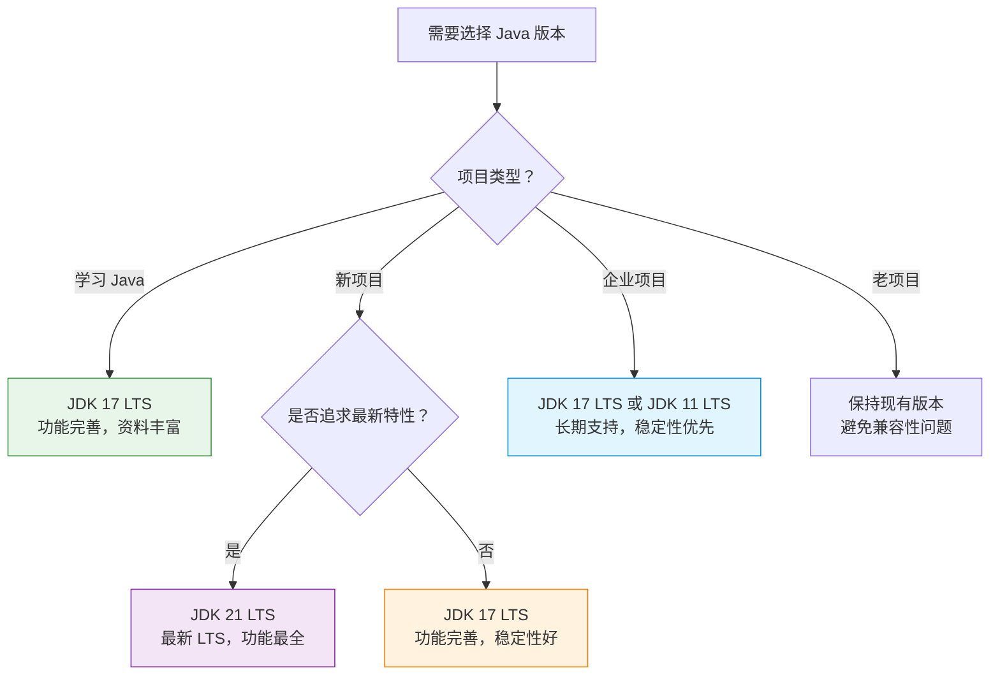

# J1A-Java版本选择踩坑指南-为什么99%的人选错JDK版本？大厂Java开发者的版本选择内幕大公开

## 📝 摘要

99% 的初学者选错 JDK 版本惨遭踩坑，而大厂 Java 开发者却有一套版本选择内幕！本文档揭露新手 vs 专家的选择差异，帮你避开非 LTS 版本陷阱，掌握 JDK 17 LTS 的正确方法。

---

## 目录

- [1. 前置知识点](#1-前置知识点)
- [2. 问题描述](#2-问题描述)
- [3. 问题考察点](#3-问题考察点)
- [4. 快速上手（3 分钟）](#4-快速上手3-分钟)
- [5. 什么是 Java？](#5-什么是-java)
- [6. 为什么选择 Java？](#6-为什么选择-java)
- [7. Java 核心特点详解](#7-java-核心特点详解)
  - [7.1 跨平台性（Write Once, Run Anywhere）](#71-跨平台性write-once-run-anywhere)
  - [7.2 面向对象编程（Object-Oriented Programming）](#72-面向对象编程object-oriented-programming)
  - [7.3 自动内存管理（Automatic Memory Management）](#73-自动内存管理automatic-memory-management)
  - [7.4 丰富的类库（Rich Class Library）](#74-丰富的类库rich-class-library)
  - [7.5 安全性（Security）](#75-安全性security)
  - [7.6 多线程支持（Multithreading）](#76-多线程支持multithreading)
- [8. Java 版本演进历史](#8-java-版本演进历史)
  - [8.1 Java 版本时间线](#81-java-版本时间线)
  - [8.2 主要版本特性对比](#82-主要版本特性对比)
- [9. JDK 版本选择指南](#9-jdk-版本选择指南)
  - [9.1 LTS（Long Term Support）版本说明](#91-ltslong-term-support版本说明)
  - [9.2 版本选择建议](#92-版本选择建议)
  - [9.3 版本选择流程图](#93-版本选择流程图)
- [10. 对比示例：选择错误版本的问题](#10-对比示例选择错误版本的问题)
- [11. 常见问题与解答](#11-常见问题与解答)
- [12. 总结与展望](#12-总结与展望)
- [13. 📚 参考资料与学习资源](#13-参考资料与学习资源)

---

## 1. 前置知识点

### 基础知识点（必须掌握）

在学习 Java 语言特点和版本选择之前，你需要了解以下知识点：

- **编程基础概念**：了解什么是编程语言、编译型语言和解释型语言的区别
- **计算机基础**：了解操作系统的基本概念（Windows、Linux、macOS）

### 🎯 **学习建议**

- **零基础小白**：可以先了解编程语言的基本概念，再学习 Java 的特点
- **有基础读者**：可以直接学习 Java 的特点和版本选择原则

---

## 2. 问题描述

### 实际场景

**面试官**：为什么选择 Java 而不是其他编程语言？Java 有哪些特点？我们应该选择哪个 JDK 版本？

**我（新手）**：随便选一个 JDK 8 吧，网上资料多，应该没问题！

**面试官**：❌ 选错了！JDK 8 虽然稳定，但已经 10 年了，为什么不用 JDK 17 LTS？

---

**真实踩坑案例**：

**案例 1：选择非 LTS 版本踩坑**
- ❌ **新手选择**：选择 JDK 14（非 LTS 版本）
- ❌ **踩坑结果**：6 个月后停止支持，项目需要频繁升级，维护成本暴增
- ✅ **大厂选择**：选择 JDK 17 LTS，支持到 2029 年，长期稳定

**案例 2：选择过老版本踩坑**
- ❌ **新手选择**：选择 JDK 8（虽然稳定，但已经过时）
- ❌ **踩坑结果**：无法使用新特性，代码冗长，开发效率低
- ✅ **大厂选择**：选择 JDK 17 LTS 或 JDK 21 LTS，功能完善，开发效率高

**案例 3：过于追求新版本踩坑**
- ❌ **新手选择**：选择最新非 LTS 版本（如 JDK 22）
- ❌ **踩坑结果**：6 个月后停止支持，可能存在兼容性问题
- ✅ **大厂选择**：选择 LTS 版本，长期支持，稳定性优先

**实际开发场景**：
- 公司要开发跨平台应用，不知道选择什么语言
- 项目需要选择 Java 版本，JDK 8、11、17、21 该选哪个？
- 新项目应该用最新版本还是稳定版本？
- 老项目需要升级 Java 版本，风险如何评估？

**常见问题**：
- 不了解 Java 的核心特点，不知道它的优势在哪里
- 不知道 LTS 版本和普通版本的区别
- 版本选择不当，导致兼容性问题或性能问题
- 过于追求新版本，忽略了稳定性和兼容性
- **99% 的初学者都踩过这些坑！**

---

## 3. 问题考察点

学习 Java 语言特点和版本选择时，需要考察以下能力：

- **语言特点理解**：能否理解 Java 的核心特点？跨平台性、面向对象、自动内存管理的优势是什么？
- **版本认知**：是否了解 Java 版本演进历史？能否区分 LTS 版本和普通版本？
- **选择判断能力**：能否根据项目需求选择合适的 Java 版本？是否考虑稳定性、兼容性、性能等因素？
- **实际应用能力**：能否在实际项目中做出正确的版本选择决策？
- **学习意识**：是否理解选择合适版本对学习 Java 的重要性？

---

## 4. 快速上手（3 分钟）

<p align="right"><span style="background:#e53935;color:#fff;padding:2px 6px;border-radius:4px">🔥 Must（必做实践）</span></p>

### 4.1 Java 快速概览

**Java**是一门面向对象的编程语言，具有**跨平台**、**自动内存管理**、**丰富的类库**等特点。

**Java 核心特点快速了解**：

| 特点 | 说明 | 优势 |
|------|------|------|
| **跨平台性** | 一次编写，到处运行 | 无需为不同操作系统单独开发 |
| **面向对象** | 完全面向对象编程 | 代码结构清晰，易于维护 |
| **自动内存管理** | 自动垃圾回收 | 无需手动管理内存，降低开发难度 |
| **丰富的类库** | 标准库功能强大 | 开发效率高，无需重复造轮子 |

### 4.2 JDK 版本选择快速建议

**原理**：选择 Java 版本需要考虑项目需求、稳定性、兼容性等因素，推荐使用 LTS（长期支持）版本。

**快速选择建议**：

| 场景 | 推荐版本 | 理由 |
|------|---------|------|
| **新项目开发** | JDK 17 LTS | 功能完善，长期支持，稳定性好 |
| **企业级项目** | JDK 17 LTS 或 JDK 11 LTS | 长期支持，稳定性优先 |
| **学习 Java** | JDK 17 LTS | 功能完整，资料丰富，适合学习 |
| **老项目维护** | 保持现有版本 | 避免兼容性问题 |
| **追求最新特性** | JDK 21 LTS | 最新 LTS 版本，功能最全 |

**关键要点**：对于初学者，推荐使用 **JDK 17 LTS**，它功能完善、稳定性好、资料丰富，是学习 Java 的最佳选择。

---

## 5. 什么是 Java？

### 5.1 Java 的基本定义

**Java**是由 Sun Microsystems（现已被 Oracle 收购）于 1995 年发布的一门面向对象的编程语言。Java 的设计目标是"一次编写，到处运行"（Write Once, Run Anywhere），通过 Java 虚拟机（JVM（Java Virtual Machine（Java 虚拟机）））实现跨平台运行。

**Java 的命名来源**：
- Java 最初命名为 **Oak**（橡树），但后来发现这个名称已经被注册
- 团队在咖啡店讨论时，想到了 **Java**（爪哇岛，盛产咖啡的地方）
- 这个名字简洁、易记，符合 Java 语言的特点

### 5.2 生活化比喻

**生活化比喻**：Java 就像**万能翻译官**。

想象一下：
- **其他编程语言** = 只会一种语言的翻译官（需要为每种语言单独培训）
- **Java** = 万能翻译官（学会 Java，可以在任何平台上运行）

**另一个比喻**：
- **Java** = 通用电源适配器
  - 你的代码（电器）只需要一个适配器（JVM）
  - 无论插在哪个国家的插座（操作系统）上，都能正常工作
  - 这就是"一次编写，到处运行"的含义

---

## 6. 为什么选择 Java？

### 6.1 Java 的优势

**不使用 Java（或选择错误版本）的问题**：

```java
// ❌ 问题：选择错误的编程语言或版本
// 
// 场景 1：使用 C++ 开发跨平台应用
// 问题：需要为 Windows、Linux、macOS 分别编译不同的程序
// 影响：
// 1. 开发成本高：需要维护多套代码
// 2. 维护困难：修改功能需要同步修改多个版本
// 3. 测试成本高：需要在多个平台上测试

// 场景 2：选择非 LTS 版本的 Java
// 示例：选择 JDK 12、13、14 等非 LTS 版本
// 问题：6 个月后停止支持，需要频繁升级
// 影响：
// 1. 项目不稳定：频繁升级可能导致兼容性问题
// 2. 维护成本高：需要频繁升级，增加维护工作量
// 3. 安全风险：停止支持后不再提供安全更新
```

**使用 Java 的优势**：

```java
// ✅ 优势：Java 跨平台性
// 原理：一次编写，到处运行（Write Once, Run Anywhere）
// 下面这段代码可以在 Windows、Linux、macOS 上运行
// 无需修改代码，只需安装对应平台的 JVM（Java 虚拟机）

// public class：定义一个公共类，类名是 HelloWorld
// 类名必须与文件名一致（HelloWorld.java）
public class HelloWorld {
    // public static void main(String[] args)：程序的入口方法
    // public：公共方法，可以被外部调用
    // static：静态方法，不需要创建对象就能调用
    // void：方法没有返回值
    // main：方法名，Java 程序的入口方法名必须是 main
    // String[] args：命令行参数数组，可以接收命令行传入的参数
    public static void main(String[] args) {
        // System.out.println()：输出一行文本到控制台
        // System：系统类，提供系统相关的功能
        // out：标准输出流，用于向控制台输出
        // println()：打印一行文本并换行
        System.out.println("Hello, World!");
    }
}
// 说明：这段代码编译后生成 HelloWorld.class 字节码文件
// 字节码可以在任何安装了 JVM 的平台上运行，无需重新编译

// ✅ 优势：选择 LTS 版本
// JDK 17 LTS：长期支持版本，支持到 2029 年
// 优势：
// 1. 长期支持：定期安全更新，降低安全风险
// 2. 稳定性好：经过充分测试，适合企业级项目
// 3. 减少升级风险：长期支持，减少频繁升级的需要
```

**优势总结**：

| 优势 | 说明 | 实际收益 |
|------|------|---------|
| **跨平台性** | 一次编写，到处运行 | 降低开发成本，提高开发效率 |
| **面向对象** | 代码结构清晰，易于维护 | 提高代码质量，降低维护成本 |
| **自动内存管理** | 自动垃圾回收，无需手动管理 | 降低开发难度，减少内存泄漏风险 |
| **丰富的类库** | 标准库功能强大 | 开发效率高，无需重复造轮子 |
| **生态完善** | 大量框架和工具 | 快速开发，社区支持好 |
| **企业级应用** | 大厂广泛使用 | 就业机会多，职业发展好 |

---

## 7. Java 核心特点详解

### 7.1 跨平台性（Write Once, Run Anywhere） [📖官方文档](https://docs.oracle.com/javase/tutorial/getStarted/intro/definition.html) [📚教程](https://www.w3schools.com/java/java_intro.asp) [💡示例](https://www.tutorialspoint.com/java/java_overview.htm)

**原理**：Java 通过 Java 虚拟机（JVM（Java Virtual Machine（Java 虚拟机）））实现跨平台运行。Java 代码编译成字节码（.class 文件），字节码可以在任何安装了 JVM 的平台上运行，无需重新编译。

**跨平台性的工作原理**：

```
Java 源代码 (.java)
    ↓ 编译
Java 字节码 (.class)
    ↓
JVM（Java 虚拟机）
    ↓
Windows / Linux / macOS
```

**生活化比喻**：
- **其他语言** = 需要翻译成不同语言的书籍（每种语言都需要单独翻译）
- **Java** = 用世界语写的书籍（只需要一个翻译器，就能在任何国家阅读）

**跨平台性的优势**：
- ✅ **开发效率高**：一次编写，多处运行
- ✅ **维护成本低**：只需维护一套代码
- ✅ **部署灵活**：可以在任何支持 JVM 的平台上部署

### 7.2 面向对象编程（Object-Oriented Programming） [📖官方文档](https://docs.oracle.com/javase/tutorial/java/concepts/) [📚教程](https://www.w3schools.com/java/java_oop.asp)

**原理**：Java 是完全面向对象的编程语言，所有代码都必须写在类（Class）中。面向对象编程通过封装、继承、多态等特性，使代码结构更清晰、更易维护。

**面向对象的特点**：
- **封装（Encapsulation）**：将数据和方法封装在类中，隐藏内部实现细节
- **继承（Inheritance）**：子类可以继承父类的属性和方法，实现代码复用
- **多态（Polymorphism）**：同一个接口可以有不同的实现方式

**生活化比喻**：
- **面向对象** = 积木搭建
  - 类（Class） = 积木的模具
  - 对象（Object） = 用模具做出来的具体积木
  - 封装 = 给积木装上保护壳
  - 继承 = 小积木可以继承大积木的形状
  - 多态 = 同一个形状的积木可以有不同的颜色

**面向对象的优势**：
- ✅ **代码复用**：通过继承实现代码复用
- ✅ **易于维护**：代码结构清晰，易于理解和修改
- ✅ **扩展性强**：通过多态实现灵活扩展

### 7.3 自动内存管理（Automatic Memory Management） [📖官方文档](https://docs.oracle.com/javase/tutorial/essential/environment/gctuning.html) [📚教程](https://www.baeldung.com/java-garbage-collection)

**原理**：Java 通过垃圾回收器（GC（Garbage Collector（垃圾回收器）））自动管理内存。当对象不再被引用时，垃圾回收器会自动回收这些对象占用的内存，无需程序员手动释放。

**自动内存管理的工作流程**：

```
创建对象 → 使用对象 → 对象不再被引用 → 垃圾回收器自动回收
```

**对比示例**：

```java
// ❌ C++ 需要手动管理内存
// 问题：必须手动分配和释放内存，容易出现内存泄漏
// 
// C++ 代码示例：
// int* ptr：声明一个整型指针变量 ptr
// new int[100]：在堆内存中分配 100 个整数的空间，返回首地址
// 将返回的地址赋值给 ptr 指针
int* ptr = new int[100];  // 分配内存：在堆内存中分配 400 字节（100 * 4 字节）

// ... 使用内存：可以像普通数组一样使用 ptr 指向的内存 ...
// 例如：ptr[0] = 10; ptr[1] = 20; 等等

// delete[] ptr：必须手动释放内存
// 如果忘记释放，会导致内存泄漏（内存无法回收，程序运行时间越长，内存占用越大）
// 如果释放了还在使用的内存，会导致程序崩溃
delete[] ptr;  // 必须手动释放内存，否则会内存泄漏

// ✅ Java 自动管理内存
// 优势：垃圾回收器自动管理内存，无需手动释放
// 
// Java 代码示例：
// int[] array：声明一个整型数组引用变量 array
// new int[100]：在堆内存中分配 100 个整数的空间，返回数组对象
// 将数组对象的引用赋值给 array
int[] array = new int[100];  // 分配内存：在堆内存中分配 400 字节（100 * 4 字节）

// ... 使用数组：可以像普通数组一样使用 ...
// 例如：array[0] = 10; array[1] = 20; 等等

// 当 array 不再被引用时（例如：array = null; 或方法执行完毕）
// 垃圾回收器会自动检测并回收这块内存，无需手动释放
// 说明：Java 的垃圾回收器会在合适的时机自动回收不再使用的对象
// 程序员无需关心内存释放的细节，专注于业务逻辑开发
```

**自动内存管理的优势**：
- ✅ **降低开发难度**：无需手动管理内存
- ✅ **减少内存泄漏**：自动回收不再使用的对象
- ✅ **提高开发效率**：专注于业务逻辑，而不是内存管理

### 7.4 丰富的类库（Rich Class Library） [📖官方文档](https://docs.oracle.com/javase/8/docs/api/) [📚教程](https://www.w3schools.com/java/java_arraylist.asp)

**原理**：Java 提供了丰富的标准类库（Java Standard Library），包含大量常用的类和方法，涵盖了字符串处理、集合操作、文件 IO、网络编程、多线程等各个方面。

**Java 标准类库的主要包**：

| 包名 | 功能 | 常用类 |
|------|------|--------|
| **java.lang** | 核心类库 | String、Object、Integer、Math |
| **java.util** | 工具类库 | ArrayList、HashMap、Date、Calendar |
| **java.io** | 输入输出 | File、InputStream、OutputStream |
| **java.net** | 网络编程 | Socket、URL、HttpURLConnection |
| **java.sql** | 数据库操作 | Connection、Statement、ResultSet |

**生活化比喻**：
- **Java 类库** = 工具箱
  - 其他语言 = 需要自己制作工具
  - Java = 工具箱里已经有了各种常用工具，直接使用即可

**丰富类库的优势**：
- ✅ **开发效率高**：无需重复造轮子
- ✅ **代码质量高**：标准库经过充分测试，稳定可靠
- ✅ **学习成本低**：文档完善，易于学习

### 7.5 安全性（Security） [📖官方文档](https://docs.oracle.com/javase/tutorial/essential/environment/security.html) [📚教程](https://www.baeldung.com/java-security)

**原理**：Java 从设计之初就考虑了安全性，通过沙箱（Sandbox）机制、字节码验证、安全管理器等机制，确保 Java 程序不会对系统造成损害。

**Java 安全性机制**：
- **字节码验证**：确保字节码符合 Java 规范
- **沙箱机制**：限制 Java 程序的权限
- **安全管理器**：控制程序对系统资源的访问

**安全性的优势**：
- ✅ **防止恶意代码**：沙箱机制防止恶意代码执行
- ✅ **系统安全**：限制程序对系统资源的访问
- ✅ **网络安全**：支持数字签名、加密等安全机制

### 7.6 多线程支持（Multithreading） [📖官方文档](https://docs.oracle.com/javase/tutorial/essential/concurrency/) [📚教程](https://www.w3schools.com/java/java_threads.asp)

**原理**：Java 内置多线程支持，可以轻松创建和管理多个线程，实现并发编程。Java 提供了 Thread 类、Runnable 接口、线程池等机制，简化了多线程编程。

**多线程的优势**：
- ✅ **提高性能**：充分利用多核 CPU
- ✅ **响应性好**：避免长时间任务阻塞主线程
- ✅ **资源利用**：提高系统资源利用率

---

## 8. Java 版本演进历史

### 8.1 Java 版本时间线 [📖官方文档](https://www.oracle.com/java/technologies/java-se-support-roadmap.html) [📚教程](https://www.baeldung.com/java-version-history)

**原理**：Java 版本按照时间顺序演进，每个版本都会引入新特性和改进。LTS（长期支持）版本会获得长期支持和维护，普通版本只支持 6 个月。

**Java 主要版本时间线**：

| 版本 | 发布时间 | 类型 | 主要特性 |
|------|---------|------|---------|
| **JDK 1.0** | 1996 年 | - | Java 语言首次发布 |
| **JDK 1.2** | 1998 年 | - | 引入集合框架（Collection Framework） |
| **JDK 1.5** | 2004 年 | - | 引入泛型（Generics）、自动装箱拆箱 |
| **JDK 8** | 2014 年 | **LTS** | Lambda 表达式、Stream API、方法引用 |
| **JDK 11** | 2018 年 | **LTS** | 局部变量类型推断（var）、HTTP 客户端 |
| **JDK 17** | 2021 年 | **LTS** | 密封类（Sealed Classes）、模式匹配 |
| **JDK 21** | 2023 年 | **LTS** | 虚拟线程（Virtual Threads）、记录类（Record Classes） |

**关键里程碑**：
- **JDK 8**：引入了 Lambda 表达式和 Stream API，是 Java 函数式编程的里程碑
- **JDK 11**：第二个 LTS 版本，引入了局部变量类型推断
- **JDK 17**：第三个 LTS 版本，功能完善，稳定性好
- **JDK 21**：最新的 LTS 版本，引入了虚拟线程等新特性

### 8.2 主要版本特性对比

<p align="right"><span style="background:#e53935;color:#fff;padding:2px 6px;border-radius:4px">🔥 Must（必做实践）</span></p>

**LTS 版本特性对比**：

| 版本 | LTS 支持期 | 主要特性 | 适用场景 |
|------|-----------|---------|---------|
| **JDK 8** [📖](https://www.oracle.com/java/technologies/javase/javase8-archive-downloads.html) | 2014-2030 | Lambda 表达式、Stream API、方法引用、默认方法 | 企业级项目（稳定，但较老） |
| **JDK 11** [📖](https://www.oracle.com/java/technologies/javase/jdk11-archive-downloads.html) | 2018-2026 | 局部变量类型推断（var）、HTTP 客户端、字符串增强 | 企业级项目（稳定，功能较新） |
| **JDK 17** [📖](https://www.oracle.com/java/technologies/javase/jdk17-archive-downloads.html) | 2021-2029 | 密封类、模式匹配、记录类、文本块 | **推荐学习版本**（功能完善，稳定性好） |
| **JDK 21** [📖](https://www.oracle.com/java/technologies/javase/jdk21-archive-downloads.html) | 2023-2031 | 虚拟线程、记录类、模式匹配增强 | 新项目开发（最新 LTS，功能最全） |

**版本选择建议**：
- **学习 Java**：推荐 **JDK 17 LTS**（功能完善，资料丰富）
- **企业级项目**：推荐 **JDK 17 LTS** 或 **JDK 11 LTS**（长期支持，稳定性好）
- **新项目开发**：可以考虑 **JDK 21 LTS**（最新 LTS，功能最全）

---

## 9. JDK 版本选择指南

### 9.1 LTS（Long Term Support）版本说明 [📖官方文档](https://www.oracle.com/java/technologies/java-se-support-roadmap.html) [📚教程](https://www.baeldung.com/java-lts-versions)

**原理**：LTS（长期支持）版本会获得长期支持和维护，通常支持 8 年以上。普通版本只支持 6 个月，之后需要升级到新版本。

**LTS vs 普通版本对比**：

| 特性 | LTS 版本 | 普通版本 |
|------|---------|---------|
| **支持期限** | 8 年以上 | 6 个月 |
| **更新频率** | 定期安全更新 | 6 个月后停止更新 |
| **稳定性** | 高（经过充分测试） | 中（新特性可能不稳定） |
| **适用场景** | 企业级项目、学习 | 实验性项目、尝试新特性 |

**生活化比喻**：
- **LTS 版本** = 长期保修的家电（可以放心使用多年）
- **普通版本** = 短期保修的家电（需要频繁更换）

### 9.2 版本选择建议

<p align="right"><span style="background:#e53935;color:#fff;padding:2px 6px;border-radius:4px">🔥 Must（必做实践）</span></p>

**版本选择原则**：

1. **学习 Java**：
   - ✅ **推荐**：JDK 17 LTS
   - **理由**：功能完善，资料丰富，稳定性好，适合学习

2. **新项目开发**：
   - ✅ **推荐**：JDK 17 LTS 或 JDK 21 LTS
   - **理由**：长期支持，功能完善，适合长期维护

3. **企业级项目**：
   - ✅ **推荐**：JDK 17 LTS 或 JDK 11 LTS
   - **理由**：长期支持，稳定性优先，降低升级风险

4. **老项目维护**：
   - ✅ **推荐**：保持现有版本
   - **理由**：避免兼容性问题，降低升级风险

5. **追求最新特性**：
   - ✅ **推荐**：JDK 21 LTS
   - **理由**：最新 LTS 版本，功能最全

**版本选择决策表**：

| 场景 | 推荐版本 | 优先级 | 理由 |
|------|---------|--------|------|
| **初学者学习** | JDK 17 LTS | ⭐⭐⭐ | 功能完善，资料丰富，稳定性好 |
| **新项目开发** | JDK 17 LTS 或 JDK 21 LTS | ⭐⭐⭐ | 长期支持，功能完善 |
| **企业级项目** | JDK 17 LTS 或 JDK 11 LTS | ⭐⭐⭐ | 长期支持，稳定性优先 |
| **老项目维护** | 保持现有版本 | ⭐⭐ | 避免兼容性问题 |
| **实验性项目** | JDK 21 LTS | ⭐⭐ | 最新特性，功能最全 |

### 9.3 版本选择流程图

<p align="right"><span style="background:#fb8c00;color:#fff;padding:2px 6px;border-radius:4px">💡 Should（建议实践）</span></p>

**版本选择流程图**：下面的流程图帮助你根据实际需求选择合适的 JDK 版本。



**快速选择指南**：

1. **学习 Java**：直接选择 JDK 17 LTS
2. **新项目**：优先选择 JDK 17 LTS，追求新特性可选择 JDK 21 LTS
3. **企业项目**：选择 JDK 17 LTS 或 JDK 11 LTS，稳定性优先
4. **老项目**：保持现有版本，避免不必要的升级

---

## 10. 对比示例：选择错误版本的问题

### 10.1 选择非 LTS 版本的问题

**问题场景 1：选择非 LTS 版本开发企业级项目**

```java
// ❌ 问题：选择 JDK 14（非 LTS 版本）
// 项目开发周期：6 个月
// 问题：JDK 14 在 6 个月后停止支持
// 结果：需要频繁升级，可能导致项目不稳定

// 实际影响：
// 1. 6 个月后停止安全更新，存在安全风险
// 2. 需要频繁升级，增加维护成本
// 3. 新版本可能引入不兼容的变更

// ✅ 解决方案：选择 JDK 17 LTS（长期支持版本）
// 优势：
// 1. 支持到 2029 年，长期稳定
// 2. 定期安全更新，降低安全风险
// 3. 减少升级频率，降低维护成本
```

**问题场景 2：选择过老版本的问题**

```java
// ❌ 问题：选择 JDK 8（虽然稳定，但较老）
// 项目需求：需要使用最新的 Java 特性
// 问题：JDK 8 不支持新特性（如记录类、模式匹配等）
// 结果：开发效率低，代码冗长

// 实际影响：
// 1. 无法使用新特性，代码冗长
// 2. 开发效率低，维护成本高
// 3. 技术栈落后，影响团队技术能力

// ✅ 解决方案：选择 JDK 17 LTS 或 JDK 21 LTS
// 优势：
// 1. 支持最新特性，代码简洁
// 2. 开发效率高，维护成本低
// 3. 技术栈先进，提升团队技术能力
```

**对比总结**：

| 错误选择 | 正确选择 | 问题 | 影响 |
|---------|---------|------|------|
| 非 LTS 版本 | LTS 版本 | 支持期限短 | 需要频繁升级，增加维护成本 |
| 过老版本 | 合适的 LTS 版本 | 功能落后 | 开发效率低，代码冗长 |
| 最新非 LTS | 最新 LTS | 稳定性差 | 可能存在兼容性问题 |

---

## 11. 常见问题与解答

### 11.1 版本相关问题

**问题 1：JDK 8、11、17、21 有什么区别？**

**回答**：
- **JDK 8**：第一个 LTS 版本，引入了 Lambda 表达式和 Stream API，企业级应用广泛使用
- **JDK 11**：第二个 LTS 版本，引入了局部变量类型推断（var），功能较新
- **JDK 17**：第三个 LTS 版本，功能完善，稳定性好，**推荐学习版本**
- **JDK 21**：最新的 LTS 版本，引入了虚拟线程等新特性，功能最全

**问题 2：我应该选择哪个版本学习 Java？**

**回答**：
- ✅ **推荐**：JDK 17 LTS
- **理由**：
  1. 功能完善，包含所有核心特性
  2. 资料丰富，学习资源多
  3. 长期支持，稳定性好
  4. 企业广泛使用，就业机会多

**问题 3：LTS 版本和普通版本有什么区别？**

**回答**：
- **LTS 版本**：长期支持，通常支持 8 年以上，适合企业级项目和学习
- **普通版本**：只支持 6 个月，适合实验性项目或尝试新特性
- **建议**：学习 Java 或开发企业级项目，选择 LTS 版本

**问题 4：老项目需要升级 Java 版本吗？**

**回答**：
- **不是必须的**：如果项目运行稳定，可以保持现有版本
- **建议升级的情况**：
  1. 当前版本停止支持（安全风险）
  2. 需要使用新特性（提高开发效率）
  3. 性能要求提升（新版本性能更好）
- **升级注意事项**：
  1. 充分测试，确保兼容性
  2. 逐步升级，不要一次性升级多个大版本
  3. 关注兼容性变更，及时调整代码

---

## 12. 总结与展望

### 12.1 核心要点回顾

通过本指南的学习，你已经掌握了 Java 语言特点和版本选择的核心知识：

1. **Java 核心特点**：
   - 跨平台性：一次编写，到处运行
   - 面向对象：代码结构清晰，易于维护
   - 自动内存管理：无需手动管理内存，降低开发难度
   - 丰富的类库：开发效率高，无需重复造轮子

2. **版本选择原则**：
   - 学习 Java：推荐 JDK 17 LTS
   - 新项目开发：推荐 JDK 17 LTS 或 JDK 21 LTS
   - 企业级项目：推荐 JDK 17 LTS 或 JDK 11 LTS
   - 优先选择 LTS 版本，确保长期支持和稳定性

**核心原则**：
- ✅ **跨平台优先**：Java 的跨平台性是核心优势
- ✅ **LTS 优先**：选择 LTS 版本，确保长期支持
- ✅ **稳定性优先**：企业级项目优先考虑稳定性
- ✅ **学习推荐**：初学者推荐 JDK 17 LTS

### 12.2 下一步学习方向

完成本阶段的学习后，建议按照以下顺序继续学习：

1. **继续学习 Java 基础**（J1B）：掌握 JDK 安装与环境配置
2. **学习 IDE 使用**（J1C）：掌握 IntelliJ IDEA 或 Eclipse 的使用
3. **学习数据类型**（J1D）：掌握 Java 数据类型和变量

**学习建议**：
- ✅ **多实践**：了解 Java 特点后，立即安装 JDK 开始实践
- ✅ **多思考**：理解为什么 Java 适合企业级开发
- ✅ **多对比**：对比 Java 与其他编程语言的特点

### 12.3 鼓励与展望

Java 作为一门成熟、稳定的编程语言，在企业级开发中占据重要地位。了解 Java 的核心特点和版本选择原则，是学习 Java 的第一步。

**记住**：
- Java = 万能翻译官，一次编写，到处运行
- JDK 17 LTS = 学习 Java 的最佳选择
- LTS 版本 = 长期支持，稳定性优先

继续加油，你已经了解了 Java 的核心特点和版本选择原则！接下来，你将学习 JDK 安装和环境配置，正式开始 Java 学习之旅！

**继续加油，你离成为一名优秀的 Java 开发者又近了一步！** 🚀

---

## 13. 📚 参考资料与学习资源

### 13.1 官方文档

**Java 官方文档**：
- [Oracle Java 官方文档](https://docs.oracle.com/javase/) - 最权威的 Java 学习资源
- [Java Platform Standard Edition Documentation](https://docs.oracle.com/javase/tutorial/) - Java SE 官方教程
- [Java 版本支持路线图](https://www.oracle.com/java/technologies/java-se-support-roadmap.html) - Java 版本支持计划

### 13.2 在线教程

**中文教程**：
- [廖雪峰 Java 教程](https://www.liaoxuefeng.com/wiki/1252599548343744) - 通俗易懂的 Java 入门教程
- [菜鸟教程 - Java](https://www.runoob.com/java/java-tutorial.html) - Java 基础教程
- [Java 语言特点详解](https://www.w3schools.com/java/java_intro.asp) - Java 语言特点介绍

**英文教程**：
- [Oracle Java Tutorials](https://docs.oracle.com/javase/tutorial/) - Oracle 官方 Java 教程
- [Baeldung Java](https://www.baeldung.com/java-tutorial) - 高质量的 Java 技术文章
- [JavaTpoint](https://www.javatpoint.com/java-tutorial) - 详细的 Java 教程

### 13.3 推荐书籍

**入门书籍**：
- 《Java 核心技术》（Core Java）- Cay S. Horstmann 著
- 《Java 编程思想》（Thinking in Java）- Bruce Eckel 著

**进阶书籍**：
- 《Effective Java》- Joshua Bloch 著（Java 最佳实践）
- 《深入理解 Java 虚拟机》- 周志明 著（JVM 原理）

### 13.4 JDK 下载资源

**官方下载**：
- [Oracle JDK 下载](https://www.oracle.com/java/technologies/downloads/) - Oracle 官方 JDK 下载
- [OpenJDK 下载](https://adoptium.net/) - OpenJDK 发行版下载（推荐）

---

**作者**：郑恩赐  
**机构**：厦门工学院人工智能创作坊  
**日期**：2025 年 11 月 04 日

