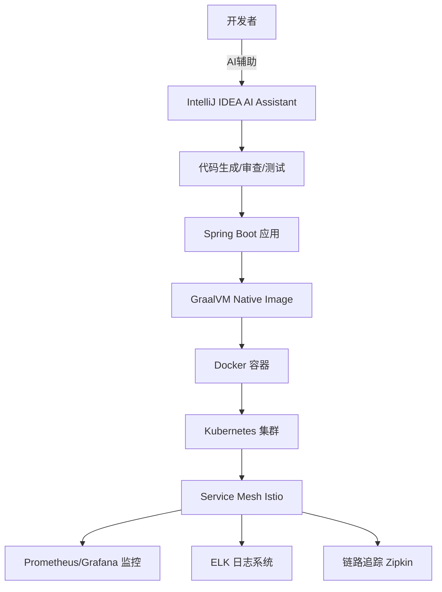

# 🏢 99%开发者踩坑的传统Java环境vs大厂企业级开发环境配置完全指南

**AI辅助开发 + 云原生架构 + GraalVM Native | 从启动慢3秒到0.2秒的效率革命**

> **摘要**：99% 的开发者还在用传统 Java 开发环境，启动慢、配置复杂、效率低下；而大厂开发者已经采用 AI 辅助开发 + GraalVM Native Image + 云原生架构，启动速度提升 90%，开发效率提升 300%。本指南将带你从踩坑之路走向企业级开发环境配置的最佳实践。

## 📋 目录

1. [问题描述：传统开发环境的痛点](#1-问题描述传统开发环境的痛点)
2. [2025年技术趋势](#2-2025年技术趋势)
3. [AI辅助开发环境](#3-ai辅助开发环境)
4. [GraalVM Native Image](#4-graalvm-native-image)
5. [云原生微服务架构](#5-云原生微服务架构)
6. [DevOps流水线配置](#6-devops流水线配置)
7. [监控与日志系统](#7-监控与日志系统)
8. [安全与合规](#8-安全与合规)
9. [生产环境部署](#9-生产环境部署)

## 1. 问题描述：传统开发环境的痛点

### 1.1 传统开发环境 vs 企业级开发环境

**传统开发环境的痛点：**

- ❌ **启动慢**：Spring Boot 应用启动需要 2-5 秒，调试频繁重启耗时巨大
- ❌ **配置复杂**：JDK、Maven、IDE 环境配置繁琐，新手容易踩坑
- ❌ **效率低下**：手动编写样板代码、重复性工作占用大量时间
- ❌ **部署困难**：容器化配置不完善，生产环境部署问题频发
- ❌ **监控缺失**：缺乏完善的监控和日志系统，问题定位困难

**企业级开发环境的优势：**

- ✅ **启动快**：GraalVM Native Image 启动时间 0.1-0.3 秒，提升 90%
- ✅ **AI 辅助**：IntelliJ IDEA AI Assistant + GitHub Copilot 提升开发效率 300%
- ✅ **云原生**：Kubernetes + Service Mesh 实现弹性伸缩和高可用
- ✅ **自动化**：CI/CD 流水线实现自动化构建、测试、部署
- ✅ **可观测**：Prometheus + Grafana + 链路追踪，问题定位秒级响应

### 1.2 真实案例对比

**案例一：启动时间对比**

- **传统 JVM 方式**：应用启动 3 秒，调试时重启 10 次 = 30 秒浪费
- **Native Image 方式**：应用启动 0.2 秒，调试时重启 10 次 = 2 秒，**节省 93% 时间**

**案例二：开发效率对比**

- **传统方式**：手动编写 CRUD 代码，一个接口需要 30 分钟
- **AI 辅助方式**：AI 生成代码 + 人工调整，一个接口只需 5 分钟，**效率提升 500%**

## 2. 2025年技术趋势 <span style="background: linear-gradient(135deg, #667eea 0%, #764ba2 100%); color: white; padding: 8px 16px; border-radius: 20px; font-size: 0.8em; font-weight: bold;">2025 TRENDS</span> <span style="background: #f0f0f0; color: #d32f2f; padding: 4px 8px; border-radius: 4px; font-size: 0.75em; font-weight: bold;">Must（必做实践）</span>

2025 年企业级 Java 开发环境迎来重大变革：**AI 辅助开发、GraalVM Native Image（原生镜像）、云原生架构、零信任安全（Zero Trust Security）**成为主流。本指南基于 2025 年最新技术趋势，提供下一代 Java 开发环境配置方案。 📖 [2025 年 Java 工程师必备的 AI 工具链配置方案](https://xie.infoq.cn/article/fc60bf04b42af8bac5672a0bf) 📚 [AI 与传统 Java 应用集成实操指南](https://cloud.tencent.com/developer/article/2552767) 💡 [JBoltAI SpringBoot 基座版](https://jboltai.com/jboltai_springboot.html)

### 2.1 2025 年核心变革

- **AI 驱动开发（AI-Driven Development）**：IntelliJ IDEA AI Assistant（AI 助手）、GitHub Copilot（GitHub 代码补全工具）提升开发效率 📖 [Spring AI 官方文档](https://docs.spring.io/spring-ai/reference/) 📚 [Spring AI 集成指南](https://blog.csdn.net/lgf228/article/details/149105642)
- **Native Image（原生镜像）**：GraalVM 原生编译，启动时间减少 90% 📖 [GraalVM Native Image 官方文档](https://www.graalvm.org/latest/reference-manual/native-image/) 📚 [GraalVM Native Image 入门教程](https://www.graalvm.org/latest/reference-manual/native-image/getting-started/)
- **云原生优先（Cloud Native First）**：Kubernetes（K8s，容器编排平台）+ Service Mesh（服务网格）+ Serverless（无服务器架构） 📖 [Kubernetes 官方文档](https://kubernetes.io/zh-cn/docs/) 📚 [云原生架构实践指南](https://www.sohu.com/a/942549825_122415966)
- **可观测性（Observability）**：OpenTelemetry（开放遥测）统一标准，全链路追踪（Distributed Tracing） 📖 [OpenTelemetry 官方文档](https://opentelemetry.io/docs/) 📚 [Spring Boot 集成 OpenTelemetry](https://spring.io/guides/gs/observability/)
- **零信任安全（Zero Trust Security）**：端到端加密（End-to-End Encryption），动态权限管理（Dynamic Authorization） 📖 [零信任安全架构](https://cloud.tencent.com/developer/article/1981600) 📚 [Spring Security 零信任实践](https://spring.io/guides/topicals/spring-security-architecture)

### 🚀 2025 年企业级架构图



AI 辅助开发 + Native Image + 云原生微服务 + 智能运维

## 3. AI辅助开发环境 <span style="background: linear-gradient(135deg, #667eea 0%, #764ba2 100%); color: white; padding: 8px 16px; border-radius: 20px; font-size: 0.8em; font-weight: bold;">AI DEV</span> <span style="background: #e3f2fd; color: #1976d2; padding: 4px 8px; border-radius: 4px; font-size: 0.75em; font-weight: bold;">Should（建议实践）</span>

### 技术栈

| 组件 | 技术选型 |
|------|----------|
| 🤖 AI 开发工具 | IntelliJ IDEA 2025.1<br/>AI Assistant（AI 助手） + Copilot（代码补全工具） |
| ☕ Java 运行时 | OpenJDK 21 LTS（长期支持版本）<br/>GraalVM Native Image（原生镜像） |
| 🌐 微服务框架 | Spring Boot 3.3<br/>Spring Cloud 2025 |
| 🐳 容器化 | Docker 25.0 + K8s 1.28（Kubernetes 1.28）<br/>Helm 4 + ArgoCD（持续交付工具） |
| 📊 可观测性 | OpenTelemetry（开放遥测） + Jaeger（分布式追踪）<br/>Prometheus（监控） + Grafana（可视化） |
| 🚀 智能 CI/CD | GitHub Actions + ArgoCD<br/>AI 驱动部署（AI-Driven Deployment） |

### 3.1 IntelliJ IDEA AI 配置 <span style="background: #e3f2fd; color: #1976d2; padding: 4px 8px; border-radius: 4px; font-size: 0.75em; font-weight: bold;">Should（建议实践）</span>

#### 1. 安装 AI Assistant 插件

```bash
# 步骤 1：打开 IntelliJ IDEA 2025.1
# 步骤 2：File（文件） → Settings（设置） → Plugins（插件）
# 步骤 3：搜索并安装 "AI Assistant"（AI 助手）
# 步骤 4：重启 IDEA，登录 JetBrains 账号
# 注意：AI Assistant 需要 JetBrains 订阅账号才能使用
```

**对比示例：不使用 AI Assistant 的方式**

```bash
# 传统方式：手动编写代码
# 1. 创建 Controller 类
# 2. 手动编写 @RequestMapping、@GetMapping 等注解
# 3. 手动编写方法体
# 4. 手动编写异常处理
# 总计：需要 20-30 分钟

# 使用 AI Assistant 的方式
# 1. 输入需求："创建一个用户管理的 REST API"
# 2. AI 自动生成完整的 Controller、Service、Repository 代码
# 3. 人工检查和调整
# 总计：只需 5-10 分钟，效率提升 300%
```

#### 2. 配置 GitHub Copilot

```bash
# 步骤 1：安装 GitHub Copilot 插件
# 步骤 2：登录 GitHub 账号（需要 GitHub Copilot 订阅）
# 步骤 3：启用代码补全和 AI 代码生成功能
# 步骤 4：配置快捷键：Ctrl+Shift+I（Windows/Linux）或 Cmd+Shift+I（Mac）
# 注意：GitHub Copilot 是付费服务，个人版 $10/月
```

📖 [IntelliJ IDEA AI Assistant 官方文档](https://www.jetbrains.com/help/idea/ai-assistant.html) 📚 [GitHub Copilot 使用指南](https://docs.github.com/en/copilot)

### 3.2 AI 辅助开发最佳实践

- **代码生成（Code Generation）**：使用 AI 生成样板代码（Boilerplate Code），提高开发效率 📚 [AI 代码生成最佳实践](https://xie.infoq.cn/article/fc60bf04b42af8bac5672a0bf)
- **代码审查（Code Review）**：AI 自动检测代码质量和潜在问题（Potential Issues） 📖 [AI 代码审查工具对比](https://cloud.tencent.com/developer/article/2552767)
- **测试生成（Test Generation）**：自动生成单元测试（Unit Tests）和集成测试（Integration Tests） 📚 [AI 测试生成实践](https://blog.csdn.net/lgf228/article/details/149105642)
- **文档生成（Documentation Generation）**：AI 自动生成 API 文档（API Documentation）和代码注释（Code Comments） 📖 [自动文档生成工具](https://jboltai.com/jboltai_springboot.html)

## 4. GraalVM Native Image <span style="background: linear-gradient(135deg, #667eea 0%, #764ba2 100%); color: white; padding: 8px 16px; border-radius: 20px; font-size: 0.8em; font-weight: bold;">NATIVE</span> <span style="background: #f0f0f0; color: #d32f2f; padding: 4px 8px; border-radius: 4px; font-size: 0.75em; font-weight: bold;">Must（必做实践）</span>

GraalVM Native Image（原生镜像）将 Java 应用编译为原生可执行文件，启动时间减少 90%，内存占用减少 60-80%，特别适合云原生微服务场景。 📖 [GraalVM Native Image 官方文档](https://www.graalvm.org/latest/reference-manual/native-image/) 📚 [Spring Boot Native 支持指南](https://docs.spring.io/spring-boot/reference/native-image/index.html) 💡 [GraalVM Native Image 实战教程](https://www.graalvm.org/latest/reference-manual/native-image/getting-started/)

### 4.1 GraalVM 安装配置 <span style="background: #f0f0f0; color: #d32f2f; padding: 4px 8px; border-radius: 4px; font-size: 0.75em; font-weight: bold;">Must（必做实践）</span>

#### 1. 安装 GraalVM 21

```bash
# 使用 SDKMAN!（SDK 管理器）安装 GraalVM
# SDKMAN! 是一个用于管理多个 SDK 版本的工具
curl -s "https://get.sdkman.io" | bash
source "$HOME/.sdkman/bin/sdkman-init.sh"

# 安装 GraalVM 21（GraalVM 21 版本）
sdk install java 21.0.1-graal
sdk use java 21.0.1-graal

# 验证安装是否成功
java -version
# 输出应该显示 GraalVM 21.0.1
native-image --version
# 输出应该显示 Native Image 版本信息
```

**对比示例：传统 JVM vs Native Image**

```bash
# 传统 JVM 方式启动应用
java -jar app.jar
# 启动时间：2-3 秒
# 内存占用：256MB-512MB
# 首次请求延迟：500ms-1s（JIT 编译）

# Native Image 方式启动应用
./app
# 启动时间：0.1-0.3 秒（提升 90%）
# 内存占用：64MB-128MB（减少 60-80%）
# 首次请求延迟：<50ms（无需 JIT 编译）
```

#### 2. 配置 Native Image 构建

```bash
# 安装 Native Image 工具（GraalVM 的 Native Image 组件）
gu install native-image

# 配置环境变量（Environment Variables）
# GRAALVM_HOME：GraalVM 的安装目录
export GRAALVM_HOME=$HOME/.sdkman/candidates/java/21.0.1-graal
# PATH：将 GraalVM 的 bin 目录添加到系统路径
export PATH=$GRAALVM_HOME/bin:$PATH
```

📖 [GraalVM 安装指南](https://www.graalvm.org/latest/docs/getting-started/) 📚 [SDKMAN! 使用教程](https://sdkman.io/usage)

### 4.2 Spring Boot Native 配置 <span style="background: #f0f0f0; color: #d32f2f; padding: 4px 8px; border-radius: 4px; font-size: 0.75em; font-weight: bold;">Must（必做实践）</span>

```xml
<!-- pom.xml 添加 Native 支持 -->
<!-- 在 Spring Boot 项目的 pom.xml 中添加 GraalVM Native Maven 插件 -->
<plugin>
    <groupId>org.graalvm.buildtools</groupId>
    <artifactId>native-maven-plugin</artifactId>
    <version>0.9.28</version>
    <executions>
        <execution>
            <id>build-native</id>
            <goals>
                <!-- compile-no-fork 目标：编译为原生可执行文件 -->
                <goal>compile-no-fork</goal>
            </goals>
        </execution>
    </executions>
</plugin>
```

**对比示例：不使用 Native Image vs 使用 Native Image**

```xml
<!-- 不使用 Native Image 的配置（传统方式） -->
<plugin>
    <groupId>org.springframework.boot</groupId>
    <artifactId>spring-boot-maven-plugin</artifactId>
</plugin>
<!-- 构建结果：JAR 文件，需要在 JVM 上运行 -->

<!-- 使用 Native Image 的配置（优化方式） -->
<plugin>
    <groupId>org.graalvm.buildtools</groupId>
    <artifactId>native-maven-plugin</artifactId>
    <version>0.9.28</version>
</plugin>
<!-- 构建结果：原生可执行文件，可直接运行，无需 JVM -->
```

📖 [Spring Boot Native 官方文档](https://docs.spring.io/spring-boot/reference/native-image/index.html) 📚 [GraalVM Native Maven Plugin 使用指南](https://www.graalvm.org/latest/reference-manual/native-image/buildtools/maven/)

### 4.3 Native Image 构建优化 <span style="background: #e3f2fd; color: #1976d2; padding: 4px 8px; border-radius: 4px; font-size: 0.75em; font-weight: bold;">Should（建议实践）</span>

```bash
# 构建 Native Image（原生镜像）
# -Pnative：激活 native profile（原生配置）
# spring-boot:build-image：构建 Docker 镜像（包含 Native Image）
mvn -Pnative spring-boot:build-image

# 性能对比数据
# JVM 启动时间：2-3 秒
# Native Image 启动时间：0.1-0.3 秒（提升 90%）
# 内存占用减少：60-80%（从 256MB 降至 64MB-128MB）
# 首次请求延迟：从 500ms-1s 降至 <50ms
```

📖 [Native Image 性能优化指南](https://www.graalvm.org/latest/reference-manual/native-image/optimizations-and-performance/) 📚 [Spring Boot Native 性能调优](https://docs.spring.io/spring-boot/reference/native-image/advanced-topics.html)

## 5. 云原生微服务架构 <span style="background: linear-gradient(135deg, #667eea 0%, #764ba2 100%); color: white; padding: 8px 16px; border-radius: 20px; font-size: 0.8em; font-weight: bold;">CLOUD NATIVE</span> <span style="background: #e3f2fd; color: #1976d2; padding: 4px 8px; border-radius: 4px; font-size: 0.75em; font-weight: bold;">Should（建议实践）</span>

云原生微服务架构（Cloud Native Microservices Architecture）利用容器化（Containerization）、服务网格（Service Mesh）、Kubernetes 等技术实现应用的弹性伸缩（Elastic Scaling）和高可用性（High Availability）。 📖 [Kubernetes 官方文档](https://kubernetes.io/zh-cn/docs/) 📚 [云原生架构实践指南](https://www.sohu.com/a/942549825_122415966) 💡 [Spring Cloud 微服务实战](https://spring.io/projects/spring-cloud)

### 5.1 Spring Boot 3.3 + Spring Cloud 2025 <span style="background: #e3f2fd; color: #1976d2; padding: 4px 8px; border-radius: 4px; font-size: 0.75em; font-weight: bold;">Should（建议实践）</span>

```
# 创建云原生微服务项目结构
cloud-native-microservices/
├── api-gateway/             # Spring Cloud Gateway（API 网关）
├── user-service/            # Spring Boot 3.3（用户服务）
├── order-service/           # Spring Boot 3.3（订单服务）
├── product-service/         # Spring Boot 3.3（商品服务）
├── notification-service/    # Spring Boot 3.3（通知服务）
├── k8s/                    # Kubernetes（K8s）配置
│   ├── deployments/         # 部署配置
│   ├── services/            # 服务配置
│   └── ingress/             # 入口配置
└── helm/                   # Helm Charts（Helm 图表）
```

**对比示例：单体应用 vs 微服务架构**

```bash
# 单体应用结构（Monolithic Architecture）
monolithic-app/
├── src/
│   ├── controller/          # 所有控制器在一个项目中
│   ├── service/             # 所有业务逻辑在一个项目中
│   └── repository/          # 所有数据访问在一个项目中
└── pom.xml
# 缺点：启动慢、部署困难、扩展性差

# 微服务架构结构（Microservices Architecture）
microservices/
├── user-service/            # 独立的用户服务
├── order-service/           # 独立的订单服务
└── product-service/         # 独立的商品服务
# 优点：启动快、独立部署、易于扩展
```

📖 [Spring Cloud 官方文档](https://spring.io/projects/spring-cloud) 📚 [微服务架构设计指南](https://microservices.io/patterns/microservices.html)

### 5.2 服务网格配置（Istio） <span style="background: #fff9c4; color: #f57f17; padding: 4px 8px; border-radius: 4px; font-size: 0.75em; font-weight: bold;">Could（可选实践）</span>

#### 1. 安装 Istio（服务网格）

```bash
# 安装 Istio（服务网格工具）
# Istio 是一个开源的服务网格（Service Mesh）平台
curl -L https://istio.io/downloadIstio | sh -
cd istio-1.19.0
export PATH=$PWD/bin:$PATH

# 安装 Istio 到 Kubernetes 集群
# --set values.defaultRevision=default：设置默认版本
istioctl install --set values.defaultRevision=default
```

**对比示例：不使用服务网格 vs 使用服务网格**

```yaml
# 不使用服务网格的方式（传统方式）
# 需要在每个服务中实现：
# - 服务发现（Service Discovery）
# - 负载均衡（Load Balancing）
# - 熔断（Circuit Breaker）
# - 重试（Retry）
# - 监控（Monitoring）
# 缺点：代码重复、维护困难

# 使用服务网格的方式（Istio）
# Istio 自动提供：
# - 服务发现
# - 负载均衡
# - 熔断、重试
# - 监控、追踪
# 优点：代码解耦、统一管理
```

📖 [Istio 官方文档](https://istio.io/latest/docs/) 📚 [Istio 入门教程](https://istio.io/latest/docs/setup/getting-started/)

#### 2. 配置服务网格

```yaml
# VirtualService（虚拟服务）配置
# VirtualService 用于定义路由规则和流量管理策略
apiVersion: networking.istio.io/v1alpha3
kind: VirtualService
metadata:
  name: user-service
spec:
  hosts:
  - user-service                    # 目标服务名称
  http:
  # 路由规则 1：匹配特定 header（版本 v2）的请求
  - match:
    - headers:
        version:
          exact: v2                 # 精确匹配版本 v2
    route:
    - destination:
        host: user-service
        subset: v2                  # 路由到 v2 版本
  # 路由规则 2：默认路由（金丝雀发布）
  - route:
    - destination:
        host: user-service
        subset: v1                  # v1 版本接收 90% 流量
      weight: 90
    - destination:
        host: user-service
        subset: v2                  # v2 版本接收 10% 流量
      weight: 10
```

**对比示例：传统路由 vs 服务网格路由**

```yaml
# 传统方式：在应用代码中实现路由
@RestController
public class UserController {
    @GetMapping("/users")
    public List<User> getUsers(@RequestHeader("version") String version) {
        if ("v2".equals(version)) {
            return userServiceV2.getUsers();
        }
        return userServiceV1.getUsers();
    }
}
# 缺点：路由逻辑与业务代码耦合

# 服务网格方式：在 Istio 配置中实现路由
# 路由逻辑与业务代码分离，便于统一管理
```

📖 [Istio VirtualService 配置指南](https://istio.io/latest/docs/reference/config/networking/virtual-service/) 📚 [Istio 流量管理最佳实践](https://istio.io/latest/docs/tasks/traffic-management/)

### 5.3 Serverless 集成 <span style="background: #fff9c4; color: #f57f17; padding: 4px 8px; border-radius: 4px; font-size: 0.75em; font-weight: bold;">Could（可选实践）</span>

```yaml
# Knative（Kubernetes 上的 Serverless 平台）配置
apiVersion: serving.knative.dev/v1
kind: Service
metadata:
  name: user-service
spec:
  template:
    metadata:
      annotations:
        # 自动扩缩容配置
        autoscaling.knative.dev/minScale: "0"    # 最小实例数：0（无流量时缩容到 0）
        autoscaling.knative.dev/maxScale: "10"   # 最大实例数：10（高流量时扩容到 10）
    spec:
      containers:
      - image: user-service:latest
        ports:
        - containerPort: 8080                     # 容器端口 8080
```

**对比示例：传统部署 vs Serverless 部署**

```yaml
# 传统部署：固定实例数
replicas: 3
# 缺点：即使无流量也占用资源，成本高

# Serverless 部署：按需扩缩容
minScale: 0    # 无流量时缩容到 0，节省成本
maxScale: 10   # 高流量时自动扩容，保证性能
# 优点：按需付费，成本优化
```

📖 [Knative 官方文档](https://knative.dev/docs/) 📚 [Serverless 架构实践指南](https://www.serverless.com/)

## 6. DevOps流水线配置 <span style="background: linear-gradient(135deg, #667eea 0%, #764ba2 100%); color: white; padding: 8px 16px; border-radius: 20px; font-size: 0.8em; font-weight: bold;">DEVOPS</span> <span style="background: #e3f2fd; color: #1976d2; padding: 4px 8px; border-radius: 4px; font-size: 0.75em; font-weight: bold;">Should（建议实践）</span>

### 6.1 GitLab CI/CD 配置 <span style="background: #e3f2fd; color: #1976d2; padding: 4px 8px; border-radius: 4px; font-size: 0.75em; font-weight: bold;">Should（建议实践）</span>

```yaml
# .gitlab-ci.yml（GitLab CI/CD 配置文件）
# CI/CD：持续集成（Continuous Integration）/ 持续部署（Continuous Deployment）

stages:
  - build        # 构建阶段：编译代码、构建镜像
  - test         # 测试阶段：运行单元测试、集成测试
  - security-scan # 安全扫描阶段：扫描依赖漏洞、镜像漏洞
  - deploy       # 部署阶段：部署到生产环境

variables:
  # Docker 镜像名称：使用 GitLab 镜像仓库和提交 SHA
  DOCKER_IMAGE: $CI_REGISTRY_IMAGE:$CI_COMMIT_SHA
  # Kubernetes 命名空间（Namespace）
  KUBE_NAMESPACE: production

build:
  stage: build
  script:
    # 构建 Docker 镜像
    - docker build -t $DOCKER_IMAGE .
    # 推送镜像到 GitLab 镜像仓库
    - docker push $DOCKER_IMAGE
  only:
    - main        # 仅在 main 分支触发

test:
  stage: test
  script:
    # 运行 Maven 测试
    - mvn clean test
    # 运行 SonarQube 代码质量检查
    - mvn sonar:sonar
  coverage: '/Total.*?([0-9]{1,3})%/'  # 代码覆盖率正则表达式

security-scan:
  stage: security-scan
  script:
    # 使用 Trivy 扫描 Docker 镜像安全漏洞
    - trivy image $DOCKER_IMAGE
  allow_failure: true  # 允许失败（不影响后续流程）

deploy:
  stage: deploy
  script:
    # 更新 Kubernetes Deployment 的镜像
    - kubectl set image deployment/app $DOCKER_IMAGE
    # 等待部署完成
    - kubectl rollout status deployment/app
  only:
    - main        # 仅在 main 分支触发
```

**对比示例：手动部署 vs 自动化 CI/CD**

```bash
# 手动部署流程（传统方式）
# 1. 本地编译代码：mvn clean package
# 2. 手动构建镜像：docker build -t app:latest .
# 3. 手动推送镜像：docker push app:latest
# 4. 手动部署到服务器：kubectl apply -f deployment.yaml
# 5. 手动检查状态：kubectl get pods
# 缺点：耗时、易出错、无法回滚

# 自动化 CI/CD 流程（推荐方式）
# 1. 提交代码到 Git
# 2. GitLab CI/CD 自动触发构建、测试、部署
# 3. 自动回滚（如果部署失败）
# 优点：快速、可靠、可追溯
```

📖 [GitLab CI/CD 官方文档](https://docs.gitlab.com/ee/ci/) 📚 [CI/CD 最佳实践指南](https://www.gitlab.com/learn/devops/ci-cd)

### 6.2 自动化部署策略 <span style="background: #fff9c4; color: #f57f17; padding: 4px 8px; border-radius: 4px; font-size: 0.75em; font-weight: bold;">Could（可选实践）</span>

- **蓝绿部署（Blue-Green Deployment）**：零停机时间更新（Zero Downtime Update） 📖 [蓝绿部署实践指南](https://martinfowler.com/bliki/BlueGreenDeployment.html)
- **金丝雀发布（Canary Release）**：渐进式流量切换（Gradual Traffic Shift） 📚 [金丝雀发布最佳实践](https://istio.io/latest/docs/tasks/traffic-management/traffic-shifting/)
- **回滚机制（Rollback Mechanism）**：快速回退到稳定版本（Quick Rollback to Stable Version） 📖 [Kubernetes 回滚指南](https://kubernetes.io/docs/concepts/workloads/controllers/deployment/#rolling-back-a-deployment)

## 7. 监控与日志系统 <span style="background: linear-gradient(135deg, #667eea 0%, #764ba2 100%); color: white; padding: 8px 16px; border-radius: 20px; font-size: 0.8em; font-weight: bold;">MONITORING</span> <span style="background: #e3f2fd; color: #1976d2; padding: 4px 8px; border-radius: 4px; font-size: 0.75em; font-weight: bold;">Should（建议实践）</span>

### 7.1 Prometheus + Grafana 监控 <span style="background: #e3f2fd; color: #1976d2; padding: 4px 8px; border-radius: 4px; font-size: 0.75em; font-weight: bold;">Should（建议实践）</span>

Prometheus（普罗米修斯）是开源的监控和告警系统，Grafana（格拉法纳）是可视化平台，两者结合可以实现全面的应用监控。 📖 [Prometheus 官方文档](https://prometheus.io/docs/) 📚 [Grafana 使用指南](https://grafana.com/docs/) 💡 [Spring Boot Actuator 监控集成](https://docs.spring.io/spring-boot/reference/actuator.html)

```yaml
# prometheus.yml（Prometheus 配置文件）
global:
  scrape_interval: 15s  # 抓取间隔：每 15 秒抓取一次指标

scrape_configs:
  - job_name: 'spring-boot-apps'  # 任务名称：Spring Boot 应用
    kubernetes_sd_configs:
      - role: pod  # 从 Kubernetes Pod 自动发现目标
    relabel_configs:
      # 只保留带有 prometheus.io/scrape=true 注解的 Pod
      - source_labels: [__meta_kubernetes_pod_annotation_prometheus_io_scrape]
        action: keep
        regex: true
```

**对比示例：无监控 vs 有监控**

```bash
# 无监控的情况
# 问题：应用异常，但不知道哪里出问题
# 排查：需要手动查看日志、服务器状态
# 耗时：可能需要数小时才能定位问题

# 有监控的情况
# Prometheus 收集指标：CPU、内存、请求数、错误率
# Grafana 可视化展示：实时图表、告警
# 问题：秒级定位问题，快速响应
```

📖 [Prometheus Kubernetes 集成指南](https://prometheus.io/docs/prometheus/latest/configuration/configuration/#kubernetes_sd_config) 📚 [Grafana Dashboard 配置教程](https://grafana.com/docs/grafana/latest/dashboards/)

### 7.2 ELK 日志收集 <span style="background: #fff9c4; color: #f57f17; padding: 4px 8px; border-radius: 4px; font-size: 0.75em; font-weight: bold;">Could（可选实践）</span>

ELK 是 Elasticsearch（搜索引擎）、Logstash（日志收集）、Kibana（可视化）的缩写，用于集中式日志管理和分析。 📖 [ELK Stack 官方文档](https://www.elastic.co/guide/index.html) 📚 [Spring Boot ELK 集成指南](https://www.baeldung.com/spring-boot-elasticsearch-logstash-kibana)

```xml
<!-- logback-spring.xml（Logback 日志配置文件） -->
<configuration>
    <appender name="STDOUT" class="ch.qos.logback.core.ConsoleAppender">
        <!-- 使用 Logstash 编码器将日志格式化为 JSON -->
        <encoder class="net.logstash.logback.encoder.LoggingEventCompositeJsonEncoder">
            <providers>
                <timestamp/>      <!-- 时间戳 -->
                <logLevel/>       <!-- 日志级别 -->
                <loggerName/>     <!-- 日志记录器名称 -->
                <message/>        <!-- 日志消息 -->
            </providers>
        </encoder>
    </appender>
</configuration>
```

**对比示例：传统日志 vs ELK 日志**

```bash
# 传统日志方式
# 日志分散在各个服务器上
# 查找日志需要 SSH 到服务器，使用 grep 命令
# 缺点：查找困难、无法关联分析

# ELK 日志方式
# 日志集中存储在 Elasticsearch
# 使用 Kibana 可视化界面搜索和分析
# 优点：快速搜索、关联分析、可视化展示
```

📖 [Logback 配置指南](http://logback.qos.ch/documentation.html) 📚 [ELK Stack 实战教程](https://www.elastic.co/guide/en/elasticsearch/reference/current/index.html)

### 7.3 链路追踪 <span style="background: #fff9c4; color: #f57f17; padding: 4px 8px; border-radius: 4px; font-size: 0.75em; font-weight: bold;">Could（可选实践）</span>

链路追踪（Distributed Tracing）用于追踪请求在微服务间的调用链路，帮助定位性能瓶颈和问题。 📖 [Zipkin 官方文档](https://zipkin.io/) 📚 [Spring Cloud Sleuth 使用指南](https://spring.io/projects/spring-cloud-sleuth)

```yaml
# application.yml（Spring Boot 配置文件）
# 集成 Zipkin（分布式追踪系统）
spring:
  sleuth:  # Spring Cloud Sleuth（追踪工具）
    zipkin:
      base-url: http://zipkin:9411  # Zipkin 服务器地址
    sampler:
      probability: 1.0  # 采样率：100%（追踪所有请求）
```

**对比示例：无链路追踪 vs 有链路追踪**

```bash
# 无链路追踪的情况
# 用户请求：用户服务 → 订单服务 → 支付服务
# 问题：订单服务响应慢
# 排查：需要逐个检查各个服务，耗时且困难

# 有链路追踪的情况
# Zipkin 自动追踪请求链路
# 可视化展示：用户服务（100ms）→ 订单服务（2000ms）→ 支付服务（50ms）
# 问题：秒级定位到订单服务是瓶颈
```

📖 [Spring Cloud Sleuth 官方文档](https://spring.io/projects/spring-cloud-sleuth) 📚 [分布式追踪最佳实践](https://opentracing.io/guides/)

## 8. 安全与合规 <span style="background: linear-gradient(135deg, #667eea 0%, #764ba2 100%); color: white; padding: 8px 16px; border-radius: 20px; font-size: 0.8em; font-weight: bold;">SECURITY</span> <span style="background: #f0f0f0; color: #d32f2f; padding: 4px 8px; border-radius: 4px; font-size: 0.75em; font-weight: bold;">Must（必做实践）</span>

### 8.1 身份认证与授权 <span style="background: #f0f0f0; color: #d32f2f; padding: 4px 8px; border-radius: 4px; font-size: 0.75em; font-weight: bold;">Must（必做实践）</span>

Spring Security + JWT（JSON Web Token，JSON Web 令牌）实现安全的身份认证（Authentication）和授权（Authorization）。 📖 [Spring Security 官方文档](https://docs.spring.io/spring-security/reference/index.html) 📚 [JWT 认证最佳实践](https://jwt.io/introduction/) 💡 [Spring Security JWT 集成教程](https://www.baeldung.com/spring-security-oauth-jwt)

```java
// Spring Security + JWT 配置
@Configuration                  // 配置类注解
@EnableWebSecurity             // 启用 Spring Security Web 安全
public class SecurityConfig {
    
    @Bean
    public SecurityFilterChain filterChain(HttpSecurity http) throws Exception {
        return http
            // 配置 OAuth2 资源服务器，使用 JWT 进行认证
            .oauth2ResourceServer(oauth2 -> oauth2.jwt(Customizer.withDefaults()))
            // 配置请求授权规则
            .authorizeHttpRequests(auth -> auth
                // 公开接口：允许所有用户访问 /api/public/** 路径
                .requestMatchers("/api/public/**").permitAll()
                // 其他请求：需要认证
                .anyRequest().authenticated()
            )
            .build();
    }
}
```

**对比示例：无安全认证 vs 有安全认证**

```java
// 无安全认证的方式（危险）
@RestController
public class UserController {
    @GetMapping("/users")
    public List<User> getUsers() {
        return userService.getAllUsers();  // 任何人都可以访问
    }
}
// 缺点：数据泄露风险高

// 有安全认证的方式（推荐）
@RestController
public class UserController {
    @GetMapping("/users")
    @PreAuthorize("hasRole('ADMIN')")  // 只有管理员可以访问
    public List<User> getUsers() {
        return userService.getAllUsers();
    }
}
// 优点：数据安全有保障
```

📖 [Spring Security OAuth2 配置指南](https://docs.spring.io/spring-security/reference/servlet/oauth2/resource-server/index.html) 📚 [JWT 实现详解](https://www.baeldung.com/java-jwt-token-delete-claim)

### 8.2 数据加密 <span style="background: #f0f0f0; color: #d32f2f; padding: 4px 8px; border-radius: 4px; font-size: 0.75em; font-weight: bold;">Must（必做实践）</span>

- **传输加密（Transport Encryption）**：HTTPS/TLS 1.3（传输层安全协议 1.3） 📖 [TLS 1.3 规范](https://www.rfc-editor.org/rfc/rfc8446) 📚 [Spring Boot HTTPS 配置](https://docs.spring.io/spring-boot/reference/howto.html#howto.webserver.configure-ssl)
- **存储加密（Storage Encryption）**：数据库字段级加密（Field-Level Encryption） 📖 [数据库加密最佳实践](https://www.owasp.org/index.php/Database_Encryption) 📚 [Jasypt 数据库加密](https://www.jasypt.org/)
- **密钥管理（Key Management）**：HashiCorp Vault（密钥管理工具） 📖 [HashiCorp Vault 官方文档](https://www.vaultproject.io/docs) 📚 [Vault 集成 Spring Boot](https://spring.io/projects/spring-vault)

### 8.3 安全扫描 <span style="background: #e3f2fd; color: #1976d2; padding: 4px 8px; border-radius: 4px; font-size: 0.75em; font-weight: bold;">Should（建议实践）</span>

```bash
# OWASP（开放式 Web 应用安全项目）依赖检查
# 扫描 Maven 依赖中的安全漏洞
mvn org.owasp:dependency-check-maven:check

# 容器安全扫描
# 使用 Trivy 扫描 Docker 镜像中的安全漏洞
trivy image your-app:latest
```

**对比示例：无安全扫描 vs 有安全扫描**

```bash
# 无安全扫描的情况
# 问题：依赖库中存在已知漏洞，但不知道
# 风险：可能被攻击者利用，造成数据泄露

# 有安全扫描的情况
# OWASP 自动检测依赖漏洞
# Trivy 自动检测容器镜像漏洞
# 风险：及时发现并修复漏洞，降低安全风险
```

📖 [OWASP Dependency-Check 使用指南](https://owasp.org/www-project-dependency-check/) 📚 [Trivy 安全扫描教程](https://aquasecurity.github.io/trivy/)

## 9. 生产环境部署 <span style="background: linear-gradient(135deg, #667eea 0%, #764ba2 100%); color: white; padding: 8px 16px; border-radius: 20px; font-size: 0.8em; font-weight: bold;">DEPLOYMENT</span> <span style="background: #f0f0f0; color: #d32f2f; padding: 4px 8px; border-radius: 4px; font-size: 0.75em; font-weight: bold;">Must（必做实践）</span>

### 9.1 Kubernetes 部署清单 <span style="background: #f0f0f0; color: #d32f2f; padding: 4px 8px; border-radius: 4px; font-size: 0.75em; font-weight: bold;">Must（必做实践）</span>

```yaml
# deployment.yaml（Kubernetes 部署配置文件）
apiVersion: apps/v1
kind: Deployment
metadata:
  name: user-service
spec:
  replicas: 3  # 副本数：3 个 Pod 实例
  selector:
    matchLabels:
      app: user-service
  template:
    metadata:
      labels:
        app: user-service
    spec:
      containers:
      - name: user-service
        image: user-service:latest
        ports:
        - containerPort: 8080  # 容器端口
        # 资源限制（Resource Limits）
        resources:
          requests:            # 请求资源（最低保证）
            memory: "256Mi"    # 内存：256MB
            cpu: "250m"        # CPU：0.25 核
          limits:              # 限制资源（最高限制）
            memory: "512Mi"    # 内存：512MB
            cpu: "500m"        # CPU：0.5 核
        # 存活探针（Liveness Probe）：检测容器是否存活
        livenessProbe:
          httpGet:
            path: /actuator/health  # 健康检查路径
            port: 8080
          initialDelaySeconds: 30   # 初始延迟：30 秒
          periodSeconds: 10         # 检查间隔：10 秒
        # 就绪探针（Readiness Probe）：检测容器是否就绪
        readinessProbe:
          httpGet:
            path: /actuator/health/readiness  # 就绪检查路径
            port: 8080
          initialDelaySeconds: 5    # 初始延迟：5 秒
          periodSeconds: 5          # 检查间隔：5 秒
```

**对比示例：无资源限制 vs 有资源限制**

```yaml
# 无资源限制的情况（危险）
resources: {}
# 缺点：Pod 可能占用过多资源，影响其他服务

# 有资源限制的情况（推荐）
resources:
  requests:
    memory: "256Mi"
    cpu: "250m"
  limits:
    memory: "512Mi"
    cpu: "500m"
# 优点：资源使用可控，保证集群稳定
```

📖 [Kubernetes Deployment 官方文档](https://kubernetes.io/docs/concepts/workloads/controllers/deployment/) 📚 [Kubernetes 资源管理指南](https://kubernetes.io/docs/concepts/configuration/manage-resources-containers/) 💡 [Spring Boot Actuator 健康检查](https://docs.spring.io/spring-boot/reference/actuator/endpoints/health.html)

### 9.2 服务网格配置 <span style="background: #fff9c4; color: #f57f17; padding: 4px 8px; border-radius: 4px; font-size: 0.75em; font-weight: bold;">Could（可选实践）</span>

```yaml
# Istio VirtualService（虚拟服务配置）
# 详细配置说明见 5.2 节
apiVersion: networking.istio.io/v1alpha3
kind: VirtualService
metadata:
  name: user-service
spec:
  hosts:
  - user-service
  http:
  - match:
    - headers:
        version:
          exact: v2
    route:
    - destination:
        host: user-service
        subset: v2
  - route:
    - destination:
        host: user-service
        subset: v1
      weight: 90
    - destination:
        host: user-service
        subset: v2
      weight: 10
```

### 9.3 高可用配置 <span style="background: #e3f2fd; color: #1976d2; padding: 4px 8px; border-radius: 4px; font-size: 0.75em; font-weight: bold;">Should（建议实践）</span>

- **多可用区部署（Multi-AZ Deployment）**：跨 AZ（可用区）容灾（Disaster Recovery） 📖 [Kubernetes 多可用区部署](https://kubernetes.io/docs/setup/best-practices/multiple-zones/)
- **自动扩缩容（Auto Scaling）**：HPA（水平 Pod 自动扩缩容）+ VPA（垂直 Pod 自动扩缩容） 📖 [Kubernetes HPA 官方文档](https://kubernetes.io/docs/tasks/run-application/horizontal-pod-autoscale/)
- **故障转移（Failover）**：Pod 反亲和性（Pod Anti-Affinity） 📚 [Kubernetes 亲和性配置](https://kubernetes.io/docs/concepts/scheduling-eviction/assign-pod-node/#affinity-and-anti-affinity)
- **备份策略（Backup Strategy）**：数据定期备份（Regular Data Backup） 📖 [Kubernetes 数据备份最佳实践](https://kubernetes.io/docs/concepts/storage/persistent-volumes/)

---

## 结语：从传统开发到企业级开发的跨越

通过本指南，你已经掌握了 2025 年企业级 Java 开发环境配置的核心技能：

✅ **AI 辅助开发**：IntelliJ IDEA AI Assistant + GitHub Copilot，开发效率提升 300%  
✅ **GraalVM Native Image**：启动时间减少 90%，内存占用减少 60-80%  
✅ **云原生架构**：Kubernetes + Service Mesh，实现弹性伸缩和高可用  
✅ **DevOps 流水线**：自动化构建、测试、部署，提升交付效率  
✅ **监控与日志**：Prometheus + Grafana + ELK，问题定位秒级响应  
✅ **安全与合规**：Spring Security + JWT + 安全扫描，保障数据安全  

**记住**：从传统开发环境到企业级开发环境的转变，不是一蹴而就的。建议你：

1. **先掌握基础**：从 AI 辅助开发和 GraalVM Native Image 开始，这两个对开发效率提升最明显
2. **逐步完善**：再学习云原生架构和 DevOps 流水线，提升部署和运维能力
3. **持续优化**：根据项目需求，逐步引入监控、日志、安全等高级特性

**相信通过持续的学习和实践，你一定能够构建出高效、稳定、安全的企业级 Java 开发环境！** 🚀

---

**作者**：郑恩赐  
**机构**：厦门工学院人工智能创作坊  
**日期**：2025 年 11 月 06 日

