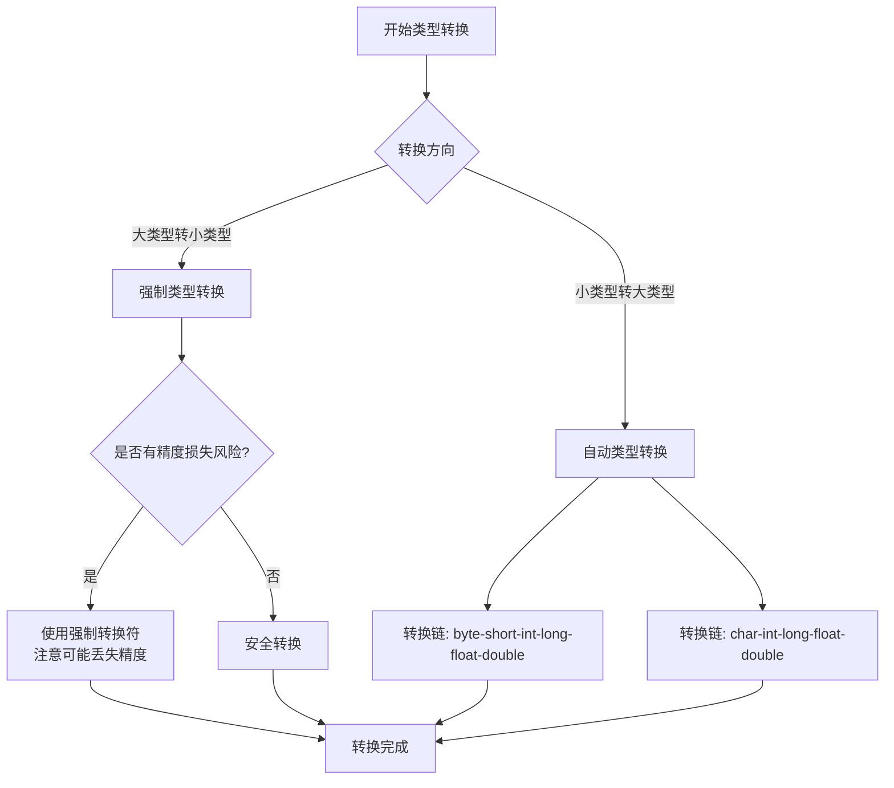

# J1D-90%初学者踩坑的Java数据类型vs大厂开发者的类型选择完全指南

## 📋 摘要

90% 的 Java 初学者在面试时连 8 种基本数据类型都说不全，而大厂开发者能够精准选择数据类型、熟练使用包装类、避免类型转换陷阱。本文从零基础出发，系统讲解 Java 数据类型和变量，让你彻底掌握类型选择、包装类机制和转换规则，告别类型相关的 bug。

## 🎬 开头

> **面试官问**："Java 中有哪些基本数据类型？"  
> **错误回答**："有 int、String、double、boolean..."  
> **面试官摇摇头**："String 不是基本数据类型。Java 有 8 种基本数据类型，分别是..."  
> 
> 这样的错误，90% 的求职者都犯过。更可怕的是，很多人工作多年后，仍然分不清基本类型和包装类的区别，在类型转换时频频踩坑 —— 明明代码逻辑没问题，但程序运行就是报错；明明数值很小，却因为类型选择不当导致内存浪费...
> 
> 今天这份指南，让你彻底告别类型相关的困扰。从基本数据类型的精准选择，到包装类的自动装箱拆箱机制，再到类型转换的陷阱规避，我们一步步带你掌握数据类型和变量的精髓，让你在面试中游刃有余，在实际开发中写出高效代码。

## 📑 目录

- [数据类型概述](#数据类型概述)
- [基本数据类型](#基本数据类型)
- [引用数据类型](#引用数据类型)
- [包装类详解](#包装类详解)
- [变量声明和初始化](#变量声明和初始化)
- [类型转换](#类型转换)
- [变量作用域](#变量作用域)
- [最佳实践](#最佳实践)
- [写在最后](#写在最后)

## 🎯 数据类型概述

Java 是一种**强类型（Strongly Typed）**语言，这意味着每个变量都必须声明其数据类型。**可以把数据类型想象成各种容器**：基本数据类型就像一个个小盒子，直接存储数据值；引用数据类型就像标签，存储的是对象的引用地址（就像快递单号，告诉你物品在哪里）。

Java 的数据类型分为两大类：

- **基本数据类型（Primitive Types）**：8 种基本类型，直接存储数据值（详见下方"基本数据类型"章节）
- **引用数据类型（Reference Types）**：类（Class）、接口（Interface）、数组（Array）等，存储对象的引用地址（详见下方"引用数据类型"章节）

📖 [Java 数据类型详解 - 菜鸟教程](https://www.runoob.com/java/java-basic-datatypes.html) 📚 [Java 数据类型（八种基本数据类型 + 四种引用类型） - 腾讯云开发者社区](https://cloud.tencent.com/developer/article/2391467) 💡 [Java 中的数据类型详细解读和指南 - lsbin](https://www.lsbin.com/2626.html) 🔗 [Java 基础知识：Java 中的基本数据类型有哪些？ - 阿里云开发者社区](https://developer.aliyun.com/article/1398830)

## 📊 基本数据类型

Java 提供了 8 种基本数据类型（Primitive Data Types），每种类型都有固定的内存占用和取值范围。

| 数据类型 | 关键字 | 占用内存 | 默认值 | 取值范围 | 示例 |
|---------|--------|----------|--------|----------|------|
| 字节型 | `byte` | 1 字节 (8 位) | `0` | -128 到 127 | `byte age = 25;` |
| 短整型 | `short` | 2 字节 (16 位) | `0` | -32,768 到 32,767 | `short year = 2024;` |
| 整型 | `int` | 4 字节 (32 位) | `0` | -2,147,483,648 到 2,147,483,647 | `int count = 1000;` |
| 长整型 | `long` | 8 字节 (64 位) | `0L` | -9,223,372,036,854,775,808 到 9,223,372,036,854,775,807 | `long population = 1000000L;` |
| 单精度浮点型 | `float` | 4 字节 (32 位) | `0.0f` | 约 ±3.4E-38 到 ±3.4E+38 | `float price = 19.99f;` |
| 双精度浮点型 | `double` | 8 字节 (64 位) | `0.0d` | 约 ±1.7E-308 到 ±1.7E+308 | `double pi = 3.14159265359;` |
| 字符型 | `char` | 2 字节 (16 位) | `'\u0000'` | `'\u0000'` 到 `'\uffff'` (0 到 65,535) | `char grade = 'A';` |
| 布尔型 | `boolean` | 1 位 | `false` | `true` 或 `false` | `boolean isActive = true;` |

> **💡 重要提示：**
> - `long` 类型字面量需要加 `L` 或 `l` 后缀：`long num = 123456789L;`
> - `float` 类型字面量需要加 `F` 或 `f` 后缀：`float value = 3.14f;`
> - `char` 类型使用单引号：`char ch = 'A';`
> - `boolean` 类型只有 `true` 和 `false` 两个值

📖 [Java 基本数据类型详解 - 菜鸟教程](https://www.runoob.com/java/java-basic-datatypes.html) 📚 [Java 数据类型详解：基础概念、特性、使用场景与性能优化 - 博客园](https://www.cnblogs.com/java-note/p/18816531) 💡 [深入探讨 Java 数据类型：解密数据类型的奥秘 - PHP 中文网](https://www.php.cn/zh/faq/680320.html) 🔗 [Java 中的数据类型详细解读和指南 - lsbin](https://www.lsbin.com/2626.html)

## 🔗 引用数据类型

引用数据类型（Reference Data Types）包括类（Class）、接口（Interface）、数组（Array）等，它们存储的是对象的引用地址，而不是对象本身。

### 常用引用类型

- **String（字符串）**：字符串类型，最常用的引用类型
- **数组（Array）**：`int[]`、`String[]` 等
- **集合（Collection）**：`ArrayList`、`HashMap` 等
- **自定义类（Custom Class）**：用户定义的类

```java
// 引用类型示例
String name = "张三";                    // String 类型，字符串
int[] numbers = {1, 2, 3, 4, 5};        // 整型数组
ArrayList<String> list = new ArrayList<>(); // 字符串列表（List）
```

📖 [Java 引用类型详解 - 菜鸟教程](https://www.runoob.com/java/java-basic-datatypes.html) 📚 [Java 数据类型（八种基本数据类型 + 四种引用类型） - 腾讯云开发者社区](https://cloud.tencent.com/developer/article/2391467)

## 📦 包装类详解

包装类（Wrapper Class）是 Java 为每种基本数据类型提供的对应类，使得基本类型可以像对象一样使用。**可以把包装类想象成基本类型的"盒子"**：基本类型是"裸体"的数据，包装类给它们穿上"衣服"（对象的外衣），让它们可以在需要对象的地方使用（比如泛型、集合等）。包装类位于 `java.lang` 包中。

包装类的主要应用场景包括：
- 在集合（Collection）中使用（如 `List<Integer>`、`Map<String, Integer>`）
- 需要 `null` 值的地方（基本类型不能为 `null`，但包装类可以）
- 调用对象方法（如 `Integer.parseInt()`、`Double.toString()`）

📖 [Java 包装类详解 - 菜鸟教程](https://www.runoob.com/java/java-basic-datatypes.html) 📚 [Java 包装类详解：基本数据类型与类类型的区别与转换 - 51CTO](https://edu.51cto.com/article/note/14897.html)

### 基本类型与包装类的对应关系

| 基本类型 | 包装类 | 包装类全名 |
|---------|--------|-----------|
| `byte` | `Byte` | `java.lang.Byte` |
| `short` | `Short` | `java.lang.Short` |
| `int` | `Integer` | `java.lang.Integer` |
| `long` | `Long` | `java.lang.Long` |
| `float` | `Float` | `java.lang.Float` |
| `double` | `Double` | `java.lang.Double` |
| `char` | `Character` | `java.lang.Character` |
| `boolean` | `Boolean` | `java.lang.Boolean` |

### 包装类的主要作用

1. **对象化（Objectification）**：将基本类型封装成对象，使其具有对象的特性，例如可以调用方法、进行比较和使用泛型（Generic）等
2. **提供实用方法（Utility Methods）**：包装类提供了许多实用方法，如将字符串转换为基本类型、基本类型与字符串之间的转换等
3. **支持 null 值**：包装类可以是 `null`，而基本类型不能

### 自动装箱与拆箱

从 Java 5 开始，支持自动装箱（Autoboxing）和自动拆箱（Unboxing）机制，即基本类型和对应的包装类之间的自动转换。**可以把自动装箱拆箱想象成自动包装和拆包**：自动装箱就是把基本类型的数据自动装进"盒子"（包装类对象），自动拆箱就是把"盒子"里的数据自动取出来（基本类型）。

**自动装箱（Autoboxing）**：将基本类型自动转换为对应的包装类对象（就像把水果自动装进盒子）

**自动拆箱（Unboxing）**：将包装类对象自动转换为对应的基本类型（就像把盒子里的水果自动取出来）

```java
// 自动装箱示例（Java 5 之后的简化写法）
Integer numObj = 100;              // 自动装箱：int 100 自动转换为 Integer 对象
Double doubleObj = 3.14;           // 自动装箱：double 3.14 自动转换为 Double 对象

// 自动拆箱示例
int num = numObj;                  // 自动拆箱：Integer 对象自动转换为 int
double d = doubleObj;              // 自动拆箱：Double 对象自动转换为 double

// 手动装箱和拆箱（Java 5 之前的方式，现在也可以使用）
Integer numObj2 = Integer.valueOf(100);  // 手动装箱：显式调用方法
int num2 = numObj2.intValue();           // 手动拆箱：显式调用方法
```

### 对比示例：基本类型 vs 包装类

**场景 1：在集合中使用**

```java
// ❌ 错误：集合不能直接存储基本类型
// List<int> list = new ArrayList<>();  // 编译错误：类型参数不能是基本类型

// ✅ 正确：使用包装类
List<Integer> list = new ArrayList<>();  // 可以存储 Integer 对象
list.add(100);                           // 自动装箱：int 100 自动转换为 Integer
int value = list.get(0);                 // 自动拆箱：Integer 自动转换为 int
```

**场景 2：需要 null 值的情况**

```java
// ❌ 限制：基本类型不能为 null
int age;                                // 局部变量未初始化，使用会报错
// Integer ageObj = null;               // 包装类可以为 null

// ✅ 正确：使用包装类可以表示"未知"或"未设置"
Integer ageObj = null;                  // 包装类可以为 null，表示年龄未知
if (ageObj != null) {
    System.out.println("年龄：" + ageObj);
} else {
    System.out.println("年龄未设置");
}
```

### 包装类缓存机制

为了提高性能，Java 对部分包装类实现了缓存池（Cache Pool）机制，即对于特定范围内的值，会缓存对应的包装类对象，以减少对象创建的开销。

**Integer 缓存范围**：-128 到 127

```java
// 缓存范围内的值，引用同一个对象
Integer a = Integer.valueOf(100);
Integer b = Integer.valueOf(100);
System.out.println(a == b);        // 输出：true（引用同一个对象）

// 缓存范围外的值，创建不同的对象
Integer c = Integer.valueOf(200);
Integer d = Integer.valueOf(200);
System.out.println(c == d);        // 输出：false（引用不同的对象）

// 使用 equals 方法比较包装类的值
System.out.println(c.equals(d));   // 输出：true（值相等）
```

> **⚠️ 重要提示**：
> - 包装类比较时，应使用 `equals()` 方法比较值，而不是使用 `==` 比较引用
> - 自动装箱和拆箱可能会引入性能开销，特别是在大量使用时，应注意其对性能的影响

📖 [Java 包装类 - 菜鸟教程](https://www.runoob.com/java/java-basic-datatypes.html) 📚 [Java 包装类详解：基本数据类型与类类型的区别与转换 - 51CTO](https://edu.51cto.com/article/note/14897.html) 💡 [Java 基本数据类型、包装类及拆装箱详解 - 腾讯云开发者社区](https://cloud.tencent.com/developer/article/2367845) 🔗 [Java 中的基本类型和包装类 - 阿里云开发者社区](https://developer.aliyun.com/article/1398830)

## 📝 变量声明和初始化

<p align="right"><span style="background:#e53935;color:#fff;padding:2px 6px;border-radius:4px">🔥 Must（必做实践）</span></p>

**可以把变量想象成带标签的容器**：变量名就是标签（告诉别人里面装的是什么），变量值就是容器里的内容，数据类型就是容器的规格（决定了能装什么类型、多大容量的东西）。

### 变量声明语法

```java
数据类型 变量名;                    // 只声明，不初始化
数据类型 变量名 = 初始值;           // 声明并初始化
```

### 变量命名规则

- 必须以字母、下划线（`_`）或美元符号（`$`）开头
- 后续字符可以是字母、数字、下划线或美元符号
- 不能使用 Java 关键字（Keyword）作为变量名
- 区分大小写（Case-sensitive）
- 建议使用驼峰命名法（CamelCase）：`firstName`、`maxValue`

```java
// 正确的变量声明
int age = 25;                      // 整数类型，年龄
String firstName = "张";           // 字符串类型，名字
double salary = 5000.50;          // 双精度浮点数，薪水
boolean isMarried = false;        // 布尔类型，是否结婚

// 错误的变量声明
// int 2age = 25;                 // 错误：不能以数字开头
// String class = "Java";         // 错误：class 是关键字（Keyword）
```

### 对比示例：有意义的命名 vs 无意义的命名

**场景：计算学生总成绩**

```java
// ❌ 错误示例：使用无意义的变量名
int a = 90;
int b = 85;
int c = 92;
int d = a + b + c;                // 无法理解代码含义

// ✅ 正确示例：使用有意义的变量名
int mathScore = 90;               // 数学成绩
int englishScore = 85;            // 英语成绩
int scienceScore = 92;            // 科学成绩
int totalScore = mathScore + englishScore + scienceScore;  // 总成绩，清晰易懂
```

📖 [Java 变量 - 菜鸟教程](https://www.runoob.com/java/java-variables.html) 📚 [Java 变量命名规范 - 腾讯云开发者社区](https://cloud.tencent.com/developer/article/2391467) 💡 [Java 变量命名最佳实践 - 掘金](https://juejin.cn)

## 🔄 类型转换

<p align="right"><span style="background:#e53935;color:#fff;padding:2px 6px;border-radius:4px">🔥 Must（必做实践）</span></p>

类型转换（Type Conversion）是 Java 中常见且重要的操作，分为自动类型转换和强制类型转换两种。**可以把类型转换想象成换容器**：自动类型转换就像把小杯子里的水倒进大杯子（不会溢出），强制类型转换就像把大杯子里的水倒进小杯子（可能溢出或洒掉）。

### 类型转换流程图



### 自动类型转换（隐式转换）

将取值范围小的类型自动转换为取值范围大的类型，无需显式转换（Implicit Conversion）。

**转换规则**：小范围类型 → 大范围类型（`byte` → `short` → `int` → `long` → `float` → `double`）

```java
// 示例 1：int 自动转换为 long
int intValue = 100;
long longValue = intValue;        // int 自动转换为 long，无需强制转换

// 示例 2：int 自动转换为 double
double doubleValue = intValue;    // int 自动转换为 double

// 示例 3：byte 自动转换为 int
byte b = 10;
int i = b;                        // byte 自动转换为 int
```

### 强制类型转换（显式转换）

将取值范围大的类型强制转换为取值范围小的类型，需要使用强制转换符（Cast Operator）`(类型)`。

**⚠️ 注意事项**：
- 强制类型转换可能导致数据丢失或精度损失
- 大数值转换为小类型时可能发生溢出（Overflow）
- 浮点数转换为整数时会截断小数部分

```java
// 示例 1：double 强制转换为 int（精度损失）
double doubleValue = 3.14159;
int intValue = (int) doubleValue;  // 强制转换，结果为 3（小数部分被截断）

// 示例 2：long 强制转换为 int（可能溢出）
long longValue = 1000000L;
int intValue2 = (int) longValue;   // 强制转换，如果值超出 int 范围会发生溢出

// 示例 3：字符和数字的转换
char ch = 'A';
int asciiValue = (int) ch;         // 字符转 ASCII 码，结果为 65
char newChar = (char) 65;          // ASCII 码转字符，结果为 'A'
```

### 对比示例：自动转换 vs 强制转换

**场景 1：小类型转大类型（自动转换）**

```java
// ✅ 推荐：使用自动转换，安全且简洁
int age = 25;
long ageLong = age;              // 自动转换，无需强制转换符

// ❌ 不推荐：虽然可以强制转换，但没必要
long ageLong2 = (long) age;      // 多余的强制转换
```

**场景 2：大类型转小类型（必须强制转换）**

```java
// ❌ 错误：编译错误，无法自动转换
double price = 19.99;
// int priceInt = price;         // 编译错误：可能损失精度

// ✅ 正确：使用强制转换，但要注意精度损失
int priceInt = (int) price;      // 强制转换，结果为 19（小数部分丢失）
```

📖 [Java 类型转换 - 菜鸟教程](https://www.runoob.com/java/java-basic-datatypes.html) 📚 [Java 数据类型转换详解 - 腾讯云开发者社区](https://cloud.tencent.com/developer/article/2391467) 💡 [Java 数据类型转换规则 - 阿里云开发者社区](https://developer.aliyun.com/article/1398830) 🔗 [Java 类型转换最佳实践 - CSDN](https://blog.csdn.net)

## 🎯 变量作用域

变量作用域（Variable Scope）决定了变量在程序中可被访问的范围。**可以把作用域想象成不同大小的房间**：局部变量就像房间里的私人用品，只有房间内的人能使用；成员变量就像家里的公共物品，家里所有人都能使用；静态变量就像小区里的公共设施，所有人都能使用。

Java 中的变量根据声明位置的不同，分为局部变量、成员变量和静态变量三种（详见下方各小节说明）。

### 局部变量（Local Variable）

在方法（Method）、构造方法（Constructor）或代码块（Code Block）中声明的变量，作用范围仅限于声明它的代码块内。

```java
public void method() {
    int localVar = 10;              // 局部变量，作用域为整个方法
    if (true) {
        int blockVar = 20;          // 代码块变量，作用域仅为 if 代码块
        System.out.println(localVar);  // ✅ 可以访问：局部变量在代码块内可见
    }
    // System.out.println(blockVar);  // ❌ 错误：blockVar 超出作用域，无法访问
}
```

### 成员变量（实例变量，Instance Variable）

在类（Class）中声明，但在方法、构造方法或代码块之外的变量，作用范围为整个类。每个实例（Instance）都拥有自己独立的成员变量。

```java
public class Student {
    String name;                    // 成员变量，作用域为整个类
    int age;                        // 成员变量，作用域为整个类
    
    public void setInfo() {
        name = "张三";               // ✅ 可以访问成员变量
        age = 20;
    }
    
    public void printInfo() {
        System.out.println(name);   // ✅ 可以访问成员变量
        System.out.println(age);
    }
}
```

### 静态变量（类变量，Class Variable）

使用 `static` 关键字声明的变量，属于类而不是实例，所有实例共享同一个静态变量。静态变量在类加载时初始化，程序结束时销毁。

```java
public class Counter {
    static int count = 0;           // 静态变量，所有实例共享
    int instanceCount = 0;          // 成员变量，每个实例独立
    
    public void increment() {
        count++;                    // 所有实例共享同一个 count
        instanceCount++;            // 每个实例的 instanceCount 独立
    }
    
    public static void printCount() {
        System.out.println(count);  // ✅ 静态方法可以访问静态变量
        // System.out.println(instanceCount);  // ❌ 错误：静态方法不能访问非静态变量
    }
}
```

### 变量作用域对比

| 变量类型 | 声明位置 | 作用域 | 生命周期 | 默认值 |
|---------|---------|--------|----------|--------|
| 局部变量 | 方法/代码块内 | 声明它的代码块 | 方法执行时 | 无默认值，必须初始化 |
| 成员变量 | 类内，方法外 | 整个类 | 对象存在时 | 有默认值（如 int 为 0） |
| 静态变量 | 类内，用 `static` 修饰 | 整个类 | 程序运行时 | 有默认值 |

📖 [Java 变量作用域 - 菜鸟教程](https://www.runoob.com/java/java-variables.html) 📚 [Java 变量作用域详解 - 腾讯云开发者社区](https://cloud.tencent.com/developer/article/2391467)

## 💡 最佳实践

<p align="right"><span style="background:#fb8c00;color:#fff;padding:2px 6px;border-radius:4px">⭐ Should（建议实践）</span></p>

### 变量命名规范

- **使用有意义的名称**：避免使用单字母变量名（除了循环变量 `i`、`j`、`k`）
- **遵循驼峰命名法（CamelCase）**：`firstName`、`maxValue`、`studentAge`
- **布尔类型使用 `is`、`has`、`can` 前缀**：`isActive`、`hasPermission`、`canEdit`

### 变量初始化

- **尽量在声明时初始化变量**：避免使用未初始化的变量
- **局部变量必须初始化**：局部变量没有默认值，使用前必须初始化
- **成员变量有默认值**：但建议显式初始化，提高代码可读性

### 类型选择

- **根据实际需要选择合适的数据类型**：避免浪费内存，也不要在精度不足时选择过小的类型
- **整数类型选择**：优先使用 `int`，超过范围使用 `long`
- **浮点类型选择**：优先使用 `double`，除非有特殊需求使用 `float`
- **基本类型 vs 包装类**：性能敏感场景使用基本类型，需要 `null` 值或泛型时使用包装类

### 常量定义

- **使用 `final` 关键字声明常量**：对于不会改变的值，使用 `final` 关键字声明为常量
- **常量命名使用全大写**：多个单词用下划线分隔，如 `MAX_SIZE`、`PI_VALUE`

### 代码示例

```java
// 最佳实践示例
public class Example {
    // 类常量：使用 static final，全大写命名
    private static final int MAX_SIZE = 100;
    private static final double PI = 3.14159;
    
    // 成员变量：使用有意义的名称，显式初始化
    private String studentName = "";
    private int studentAge = 0;
    
    public void processData() {
        // 局部变量：有意义的名称，声明时初始化
        int count = 0;
        double totalScore = 0.0;
        
        // 局部常量：使用 final，提高代码可读性
        final double DISCOUNT_RATE = 0.9;
        
        // 循环变量：可以使用单字母，但作用域要小
        for (int i = 0; i < MAX_SIZE; i++) {
            count++;
        }
    }
}
```

### 类型转换建议

- **避免不必要的强制转换**：优先使用自动类型转换
- **注意精度损失**：强制转换时要注意数据丢失和溢出问题
- **使用包装类时要谨慎**：注意自动装箱拆箱的性能开销，以及 `null` 值的处理

📖 [Java 编程最佳实践 - 菜鸟教程](https://www.runoob.com/java/java-basic-datatypes.html) 📚 [Java 代码规范 - 腾讯云开发者社区](https://cloud.tencent.com/developer/article/2391467)

## 📝 写在最后

掌握 Java 数据类型和变量是学习 Java 的基础，也是写出高质量代码的前提。通过本文的学习，你应该已经：

- ✅ 掌握了 Java 的 8 种基本数据类型及其特点
- ✅ 理解了基本类型与包装类的区别和转换机制
- ✅ 学会了变量的声明、初始化和作用域管理
- ✅ 熟悉了类型转换的规则和注意事项
- ✅ 了解了最佳实践和常见陷阱

**记住**：数据类型的选择直接影响程序的性能和正确性，在实际开发中要根据具体场景做出合理的选择。类型转换时要特别注意精度损失和溢出问题，使用包装类时要了解自动装箱拆箱的机制。

**下一步学习建议**：
- 多练习变量声明、初始化和类型转换，加深理解
- 尝试在实际项目中应用这些知识，积累经验
- 继续学习面向对象编程，为后续学习打下坚实基础

相信通过不断练习和实践，你一定能熟练掌握 Java 数据类型和变量，写出高效、可靠的代码！

---

**作者**：郑恩赐  
**机构**：厦门工学院人工智能创作坊  
**日期**：2025 年 11 月 06 日

