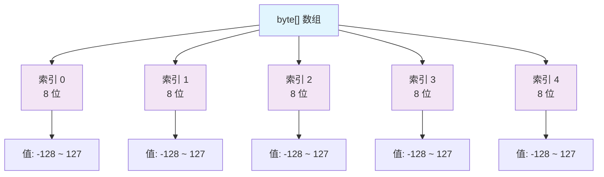

# Java byte[] 完全指南：从入门到精通二进制数据处理 🚀

## 📋 摘要

掌握 Java byte[] 核心技能！从基础概念到高级应用，涵盖文件操作、网络通信、数据加密等实战场景。让二进制数据处理变得简单高效，成为技术高手！

---

## 🎯 目录

- [1. byte[] 基础概念](#1-byte-基础概念)
- [2. 创建与初始化](#2-创建与初始化)
- [3. 核心操作方法](#3-核心操作方法)
- [4. 数据类型转换](#4-数据类型转换)
- [5. 实际应用场景](#5-实际应用场景)
- [6. 性能优化技巧](#6-性能优化技巧)
- [7. 常见问题与解决方案](#7-常见问题与解决方案)
- [8. 最佳实践](#8-最佳实践)

---

## 1. byte[] 基础概念 🔍

### 1.1 什么是 byte[]？

`byte[]` 是 Java 中最基础的数据结构之一，用于存储和处理二进制数据。每个 `byte` 占用 8 位（1 字节），取值范围为 -128 到 127。

```java
// byte[] 的基本结构
byte[] data = new byte[5];
// 内存布局：[byte][byte][byte][byte][byte]
//          8位   8位   8位   8位   8位
```

### 1.2 byte[] 的内存结构



### 1.3 byte[] 的特点

- ✅ **高效存储**：每个元素只占用 1 字节内存
- ✅ **二进制友好**：直接处理原始二进制数据
- ✅ **跨平台兼容**：字节序统一，无平台差异
- ✅ **性能优异**：底层操作，速度极快

---

## 2. 创建与初始化 🛠️

### 2.1 基本创建方式

```java
// 方式 1：声明后初始化
byte[] array1;
array1 = new byte[10]; // 创建长度为 10 的数组，默认值为 0

// 方式 2：声明时初始化
byte[] array2 = new byte[5];

// 方式 3：直接赋值
byte[] array3 = {1, 2, 3, 4, 5};

// 方式 4：从字符串创建
String text = "Hello";
byte[] array4 = text.getBytes(StandardCharsets.UTF_8);
```

### 2.2 高级初始化技巧

```java
// 使用 Arrays.fill() 填充相同值
byte[] array = new byte[100];
Arrays.fill(array, (byte) 0xFF); // 填充为 -1

// 使用 Random 生成随机字节
Random random = new Random();
byte[] randomBytes = new byte[16];
random.nextBytes(randomBytes);

// 从十六进制字符串创建
String hexString = "48656C6C6F"; // "Hello"
byte[] hexBytes = hexStringToByteArray(hexString);
```

### 2.3 实用工具方法

```java
/**
 * 十六进制字符串转 byte[]
 */
public static byte[] hexStringToByteArray(String hexString) {
    int len = hexString.length();
    byte[] data = new byte[len / 2];
    for (int i = 0; i < len; i += 2) {
        data[i / 2] = (byte) ((Character.digit(hexString.charAt(i), 16) << 4)
                             + Character.digit(hexString.charAt(i + 1), 16));
    }
    return data;
}

/**
 * byte[] 转十六进制字符串
 */
public static String byteArrayToHexString(byte[] bytes) {
    StringBuilder sb = new StringBuilder();
    for (byte b : bytes) {
        sb.append(String.format("%02X", b));
    }
    return sb.toString();
}
```

---

## 3. 核心操作方法 ⚡

### 3.1 基本操作

```java
byte[] data = {1, 2, 3, 4, 5};

// 获取长度
int length = data.length; // 5

// 访问元素
byte first = data[0];  // 1
byte last = data[data.length - 1]; // 5

// 修改元素
data[0] = 10; // 数组变为 {10, 2, 3, 4, 5}

// 遍历数组
for (int i = 0; i < data.length; i++) {
    System.out.println("索引 " + i + ": " + data[i]);
}

// 增强 for 循环
for (byte b : data) {
    System.out.println("值: " + b);
}
```

### 3.2 数组操作

```java
// 数组复制
byte[] original = {1, 2, 3, 4, 5};
byte[] copy = Arrays.copyOf(original, original.length);

// 部分复制
byte[] partial = Arrays.copyOfRange(original, 1, 4); // {2, 3, 4}

// 数组比较
boolean isEqual = Arrays.equals(original, copy); // true

// 数组排序
byte[] unsorted = {5, 2, 8, 1, 9};
Arrays.sort(unsorted); // {1, 2, 5, 8, 9}

// 数组填充
byte[] filled = new byte[5];
Arrays.fill(filled, (byte) 42); // {42, 42, 42, 42, 42}
```

### 3.3 数组合并与分割

```java
/**
 * 合并多个 byte[]
 */
public static byte[] mergeByteArrays(byte[]... arrays) {
    int totalLength = 0;
    for (byte[] array : arrays) {
        totalLength += array.length;
    }
    
    byte[] result = new byte[totalLength];
    int currentPos = 0;
    
    for (byte[] array : arrays) {
        System.arraycopy(array, 0, result, currentPos, array.length);
        currentPos += array.length;
    }
    
    return result;
}

/**
 * 分割 byte[]
 */
public static byte[][] splitByteArray(byte[] array, int chunkSize) {
    int numChunks = (array.length + chunkSize - 1) / chunkSize;
    byte[][] chunks = new byte[numChunks][];
    
    for (int i = 0; i < numChunks; i++) {
        int start = i * chunkSize;
        int end = Math.min(start + chunkSize, array.length);
        chunks[i] = Arrays.copyOfRange(array, start, end);
    }
    
    return chunks;
}
```

---

## 4. 数据类型转换 🔄

### 4.1 与字符串的转换

```java
// 字符串转 byte[]
String text = "Hello World";
byte[] bytes = text.getBytes(StandardCharsets.UTF_8);

// byte[] 转字符串
String decoded = new String(bytes, StandardCharsets.UTF_8);

// 处理不同字符集
byte[] gbkBytes = text.getBytes("GBK");
String gbkText = new String(gbkBytes, "GBK");
```

### 4.2 与基本数据类型的转换

```java
/**
 * int 转 byte[]
 */
public static byte[] intToByteArray(int value) {
    return ByteBuffer.allocate(4)
            .order(ByteOrder.BIG_ENDIAN)
            .putInt(value)
            .array();
}

/**
 * byte[] 转 int
 */
public static int byteArrayToInt(byte[] bytes) {
    return ByteBuffer.wrap(bytes)
            .order(ByteOrder.BIG_ENDIAN)
            .getInt();
}

/**
 * long 转 byte[]
 */
public static byte[] longToByteArray(long value) {
    return ByteBuffer.allocate(8)
            .order(ByteOrder.BIG_ENDIAN)
            .putLong(value)
            .array();
}

/**
 * byte[] 转 long
 */
public static long byteArrayToLong(byte[] bytes) {
    return ByteBuffer.wrap(bytes)
            .order(ByteOrder.BIG_ENDIAN)
            .getLong();
}
```

### 4.3 字节序处理

```java
// 大端序（Big Endian）- 网络字节序
ByteBuffer bigEndian = ByteBuffer.allocate(4)
        .order(ByteOrder.BIG_ENDIAN)
        .putInt(0x12345678);

// 小端序（Little Endian）- 主机字节序
ByteBuffer littleEndian = ByteBuffer.allocate(4)
        .order(ByteOrder.LITTLE_ENDIAN)
        .putInt(0x12345678);

// 获取字节序
ByteOrder order = ByteOrder.nativeOrder();
System.out.println("系统字节序: " + order);
```

---

## 5. 实际应用场景 🌟

### 5.1 文件操作

```java
/**
 * 读取文件到 byte[]
 */
public static byte[] readFileToByteArray(String filePath) throws IOException {
    Path path = Paths.get(filePath);
    return Files.readAllBytes(path);
}

/**
 * 将 byte[] 写入文件
 */
public static void writeByteArrayToFile(byte[] data, String filePath) throws IOException {
    Path path = Paths.get(filePath);
    Files.write(path, data);
}

/**
 * 大文件分块读取
 */
public static void readLargeFileInChunks(String filePath, int chunkSize) throws IOException {
    try (FileInputStream fis = new FileInputStream(filePath)) {
        byte[] buffer = new byte[chunkSize];
        int bytesRead;
        
        while ((bytesRead = fis.read(buffer)) != -1) {
            // 处理读取的数据
            processChunk(buffer, bytesRead);
        }
    }
}

private static void processChunk(byte[] chunk, int length) {
    // 处理数据块的逻辑
    System.out.println("处理了 " + length + " 字节的数据");
}
```

### 5.2 网络通信

```java
/**
 * Socket 数据发送
 */
public static void sendData(Socket socket, byte[] data) throws IOException {
    try (OutputStream os = socket.getOutputStream()) {
        os.write(data);
        os.flush();
    }
}

/**
 * Socket 数据接收
 */
public static byte[] receiveData(Socket socket) throws IOException {
    try (InputStream is = socket.getInputStream()) {
        ByteArrayOutputStream baos = new ByteArrayOutputStream();
        byte[] buffer = new byte[1024];
        int bytesRead;
        
        while ((bytesRead = is.read(buffer)) != -1) {
            baos.write(buffer, 0, bytesRead);
        }
        
        return baos.toByteArray();
    }
}
```

### 5.3 数据加密

```java
/**
 * AES 加密
 */
public static byte[] encryptAES(byte[] data, String key) throws Exception {
    SecretKeySpec secretKey = new SecretKeySpec(key.getBytes(), "AES");
    Cipher cipher = Cipher.getInstance("AES/ECB/PKCS5Padding");
    cipher.init(Cipher.ENCRYPT_MODE, secretKey);
    return cipher.doFinal(data);
}

/**
 * AES 解密
 */
public static byte[] decryptAES(byte[] encryptedData, String key) throws Exception {
    SecretKeySpec secretKey = new SecretKeySpec(key.getBytes(), "AES");
    Cipher cipher = Cipher.getInstance("AES/ECB/PKCS5Padding");
    cipher.init(Cipher.DECRYPT_MODE, secretKey);
    return cipher.doFinal(encryptedData);
}
```

### 5.4 图像处理

```java
/**
 * 读取图像文件
 */
public static byte[] readImageFile(String imagePath) throws IOException {
    BufferedImage image = ImageIO.read(new File(imagePath));
    ByteArrayOutputStream baos = new ByteArrayOutputStream();
    ImageIO.write(image, "png", baos);
    return baos.toByteArray();
}

/**
 * 图像缩放
 */
public static byte[] resizeImage(byte[] imageData, int width, int height) throws IOException {
    BufferedImage originalImage = ImageIO.read(new ByteArrayInputStream(imageData));
    BufferedImage resizedImage = new BufferedImage(width, height, BufferedImage.TYPE_INT_RGB);
    
    Graphics2D g2d = resizedImage.createGraphics();
    g2d.setRenderingHint(RenderingHints.KEY_INTERPOLATION, RenderingHints.VALUE_INTERPOLATION_BILINEAR);
    g2d.drawImage(originalImage, 0, 0, width, height, null);
    g2d.dispose();
    
    ByteArrayOutputStream baos = new ByteArrayOutputStream();
    ImageIO.write(resizedImage, "png", baos);
    return baos.toByteArray();
}
```

---

## 6. 性能优化技巧 🚀

### 6.1 内存优化

```java
// ❌ 低效：频繁创建新数组
public static byte[] inefficientMerge(byte[] a, byte[] b) {
    byte[] result = new byte[a.length + b.length];
    // ... 合并逻辑
    return result;
}

// ✅ 高效：使用 ByteBuffer
public static ByteBuffer efficientMerge(byte[] a, byte[] b) {
    ByteBuffer buffer = ByteBuffer.allocate(a.length + b.length);
    buffer.put(a);
    buffer.put(b);
    buffer.flip();
    return buffer;
}

// ✅ 更高效：使用 ByteArrayOutputStream
public static byte[] streamBasedMerge(byte[] a, byte[] b) throws IOException {
    try (ByteArrayOutputStream baos = new ByteArrayOutputStream()) {
        baos.write(a);
        baos.write(b);
        return baos.toByteArray();
    }
}
```

### 6.2 批量操作优化

```java
/**
 * 批量处理 byte[] 数组
 */
public static void batchProcess(byte[][] arrays) {
    // 使用并行流处理
    Arrays.stream(arrays)
            .parallel()
            .forEach(array -> {
                // 处理每个数组
                processArray(array);
            });
}

/**
 * 使用 NIO 进行高效 I/O
 */
public static byte[] readFileWithNIO(String filePath) throws IOException {
    Path path = Paths.get(filePath);
    return Files.readAllBytes(path);
}

public static void writeFileWithNIO(byte[] data, String filePath) throws IOException {
    Path path = Paths.get(filePath);
    Files.write(path, data);
}
```

### 6.3 缓存优化

```java
/**
 * 使用缓存避免重复计算
 */
public class ByteArrayCache {
    private final Map<String, byte[]> cache = new ConcurrentHashMap<>();
    
    public byte[] getOrCompute(String key, Supplier<byte[]> supplier) {
        return cache.computeIfAbsent(key, k -> supplier.get());
    }
    
    public void clearCache() {
        cache.clear();
    }
}
```

---

## 7. 常见问题与解决方案 🔧

### 7.1 字符编码问题

```java
// ❌ 问题：不同平台字符集不一致
String text = "你好";
byte[] bytes = text.getBytes(); // 可能在不同平台产生不同结果

// ✅ 解决：明确指定字符集
byte[] bytes = text.getBytes(StandardCharsets.UTF_8);
String decoded = new String(bytes, StandardCharsets.UTF_8);
```

### 7.2 字节序问题

```java
// ❌ 问题：字节序不匹配
int value = 0x12345678;
byte[] bytes = intToByteArray(value); // 大端序
int decoded = byteArrayToInt(bytes);   // 如果系统是小端序，结果错误

// ✅ 解决：统一字节序
public static byte[] intToByteArrayLE(int value) {
    return ByteBuffer.allocate(4)
            .order(ByteOrder.LITTLE_ENDIAN)
            .putInt(value)
            .array();
}
```

### 7.3 内存溢出问题

```java
// ❌ 问题：大数组可能导致内存溢出
byte[] hugeArray = new byte[Integer.MAX_VALUE]; // 可能抛出 OutOfMemoryError

// ✅ 解决：分块处理
public static void processLargeData(byte[] data, int chunkSize) {
    for (int i = 0; i < data.length; i += chunkSize) {
        int end = Math.min(i + chunkSize, data.length);
        byte[] chunk = Arrays.copyOfRange(data, i, end);
        processChunk(chunk);
    }
}
```

### 7.4 数组越界问题

```java
// ❌ 问题：数组越界访问
byte[] array = {1, 2, 3};
byte value = array[5]; // ArrayIndexOutOfBoundsException

// ✅ 解决：边界检查
public static byte safeGet(byte[] array, int index) {
    if (index < 0 || index >= array.length) {
        throw new IndexOutOfBoundsException("索引超出范围: " + index);
    }
    return array[index];
}
```

---

## 8. 最佳实践 💡

### 8.1 代码规范

```java
/**
 * ✅ 良好的命名规范
 */
public class ByteArrayUtils {
    
    // 常量使用大写
    private static final int DEFAULT_BUFFER_SIZE = 1024;
    private static final String DEFAULT_CHARSET = "UTF-8";
    
    /**
     * 方法名清晰表达意图
     */
    public static byte[] convertStringToBytes(String input) {
        return input.getBytes(StandardCharsets.UTF_8);
    }
    
    /**
     * 参数验证
     */
    public static void validateByteArray(byte[] data) {
        if (data == null) {
            throw new IllegalArgumentException("字节数组不能为空");
        }
        if (data.length == 0) {
            throw new IllegalArgumentException("字节数组不能为空数组");
        }
    }
}
```

### 8.2 异常处理

```java
/**
 * ✅ 完善的异常处理
 */
public static byte[] safeReadFile(String filePath) {
    try {
        Path path = Paths.get(filePath);
        if (!Files.exists(path)) {
            throw new FileNotFoundException("文件不存在: " + filePath);
        }
        return Files.readAllBytes(path);
    } catch (IOException e) {
        logger.error("读取文件失败: " + filePath, e);
        throw new RuntimeException("文件读取异常", e);
    }
}
```

### 8.3 资源管理

```java
/**
 * ✅ 使用 try-with-resources 管理资源
 */
public static byte[] readFromStream(InputStream inputStream) throws IOException {
    try (ByteArrayOutputStream baos = new ByteArrayOutputStream()) {
        byte[] buffer = new byte[1024];
        int bytesRead;
        
        while ((bytesRead = inputStream.read(buffer)) != -1) {
            baos.write(buffer, 0, bytesRead);
        }
        
        return baos.toByteArray();
    }
}
```

### 8.4 性能监控

```java
/**
 * ✅ 添加性能监控
 */
public static byte[] monitoredOperation(byte[] input) {
    long startTime = System.currentTimeMillis();
    
    try {
        // 执行操作
        byte[] result = performOperation(input);
        
        long duration = System.currentTimeMillis() - startTime;
        logger.info("操作完成，耗时: {} ms, 数据大小: {} bytes", 
                   duration, input.length);
        
        return result;
    } catch (Exception e) {
        long duration = System.currentTimeMillis() - startTime;
        logger.error("操作失败，耗时: {} ms", duration, e);
        throw e;
    }
}
```

---

## 🎉 总结

恭喜你！通过这篇完整的指南，你已经掌握了 Java byte[] 的核心知识和实践技巧。从基础概念到高级应用，从性能优化到最佳实践，byte[] 这个看似简单的数据结构其实蕴含着丰富的技术内涵。

记住，掌握 byte[] 不仅仅是学会语法，更重要的是理解二进制数据处理的本质。在实际开发中，要时刻注意字符编码、字节序、内存管理等关键问题，这样才能写出健壮、高效的代码。

继续探索，继续实践，让 byte[] 成为你编程路上的得力助手！每一个字节都承载着无限的可能，每一次操作都离技术大师更近一步。加油，未来的 Java 专家！🚀✨

---

**厦门工学院人工智能创作坊 -- 郑恩赐**  
**2025 年 10 月 7 日**