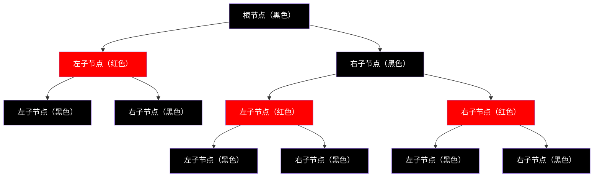

# Java Map 技术解析 - 从键值对存储到高效查找的编程利器

## 📋 摘要

Java Map 是存储键值对的数据结构，像电话簿通过键快速找值。用生活化比喻解析 HashMap、TreeMap、LinkedHashMap 三大实现类，提供应用场景和解决方案，帮零基础开发者掌握。

## 🎯 适用开发者水平

- **小白（零基础）**：基础概念和简单操作
- **初级开发者**：常用方法和基本应用
- **中级开发者**：性能优化和高级特性
- **高级开发者**：并发安全和最佳实践

## 📚 目录

1. [🔍 Map 接口概览](#map-接口概览)
2. [🏗️ 三大实现类详解](#三大实现类详解)
3. [⚡ 核心方法深度解析](#核心方法深度解析)
4. [🔄 遍历方式对比](#遍历方式对比)
5. [🎯 实际应用场景](#实际应用场景)
6. [❓ 常见问题与解决方案](#常见问题与解决方案)
7. [🎉 总结](#总结)

## 🔍 Map 接口概览

### 什么是 Map？

Map（映射）是 Java 集合框架中的核心接口，用于存储 **键值对（Key-Value）** 数据。想象一下电话簿：

- **键（Key）**：人名（如"张三"）
- **值（Value）**：电话号码（如"13800138000"）

每个键对应唯一的值，就像每个人对应唯一的电话号码。

### Map 的核心特性

| 特性 | 说明 | 生活比喻 |
|------|------|----------|
| **键的唯一性** | 每个键只能出现一次 | 每个人只能有一个身份证号 |
| **值的可重复性** | 值可以重复 | 多个人可以有相同的电话号码 |
| **快速查找** | 通过键快速找到值 | 通过姓名快速找到电话号码 |

## 🏗️ 三大实现类详解

### 1. HashMap（哈希表实现）

**比喻**：像图书馆的索引系统，通过书名快速找到书籍位置。

```java
// 示例命令：创建 HashMap
Map<String, Integer> studentScores = new HashMap<>();

// 添加数据
studentScores.put("张三", 95);  // 键：学生姓名，值：分数
studentScores.put("李四", 87);
studentScores.put("王五", 92);

// 获取数据
int score = studentScores.get("张三");  // 输出：95
System.out.println("张三的分数：" + score);
```

**特点**：
- ✅ **查找速度快**：平均时间复杂度 O(1)
- ✅ **允许 null 键和值**
- ❌ **不保证顺序**：元素顺序可能变化

### 2. TreeMap（红黑树实现）

**比喻**：像字典，按字母顺序排列，便于查找。

```java
// 示例命令：创建 TreeMap
Map<String, String> dictionary = new TreeMap<>();

// 添加数据（会自动排序）
dictionary.put("apple", "苹果");
dictionary.put("banana", "香蕉");
dictionary.put("cherry", "樱桃");

// 遍历（按字母顺序）
for (Map.Entry<String, String> entry : dictionary.entrySet()) {
    System.out.println(entry.getKey() + " -> " + entry.getValue());
}
// 输出：
// apple -> 苹果
// banana -> 香蕉
// cherry -> 樱桃
```

**特点**：
- ✅ **自动排序**：键按自然顺序排列
- ✅ **范围查询**：支持 headMap、tailMap 等操作
- ❌ **不允许 null 键**

#### 红黑树（Red-Black Tree）是什么？

**比喻**：红黑树就像一棵会自动调整的“平衡树”，每个节点都有颜色（红色或黑色），通过颜色规则保持树的平衡，就像跷跷板一样，一边重了会自动调整到平衡状态。

**核心规则**：
1. **根节点是黑色**：树的顶端必须是黑色
2. **红色节点不能相邻**：红色节点的子节点必须是黑色
3. **黑色平衡**：从任意节点到叶子节点的路径上，黑色节点数量相同



**为什么用红黑树？**
- **自平衡**：插入或删除数据时，树会自动调整保持平衡
- **高效查找**：查找时间复杂度 O(log n)，比普通树更稳定
- **有序存储**：数据按顺序排列，支持范围查询

### 3. LinkedHashMap（链表 + 哈希表）

**比喻**：像排队系统，既快速查找又保持排队顺序。

```java
// 示例命令：创建 LinkedHashMap
Map<String, String> recentFiles = new LinkedHashMap<>();

// 添加数据（保持插入顺序）
recentFiles.put("file1.txt", "文档1");
recentFiles.put("file2.txt", "文档2");
recentFiles.put("file3.txt", "文档3");

// 遍历（按插入顺序）
for (String fileName : recentFiles.keySet()) {
    System.out.println("最近打开：" + fileName);
}
// 输出：
// 最近打开：file1.txt
// 最近打开：file2.txt
// 最近打开：file3.txt
```

**特点**：
- ✅ **保持插入顺序**
- ✅ **查找速度快**
- ✅ **适合 LRU 缓存**

## ⚡ 核心方法深度解析

### 基础操作方法

```java
Map<String, Integer> scores = new HashMap<>();

// 1. 添加数据
scores.put("张三", 95);        // 添加键值对
scores.put("李四", 87);        // 添加键值对

// 2. 获取数据
Integer score = scores.get("张三");           // 获取值：95
Integer notFound = scores.get("王五");        // 键不存在：null

// 3. 检查存在性
boolean hasKey = scores.containsKey("张三");   // 检查键：true
boolean hasValue = scores.containsValue(95);  // 检查值：true

// 4. 删除数据
Integer removed = scores.remove("张三");      // 删除并返回值：95

// 5. 获取大小
int size = scores.size();                     // 获取键值对数量：1

// 6. 清空数据
scores.clear();                               // 清空所有数据
```

### 高级操作方法

```java
Map<String, Integer> scores = new HashMap<>();
scores.put("张三", 95);
scores.put("李四", 87);

// 1. 获取默认值
Integer score = scores.getOrDefault("王五", 0);  // 键不存在时返回默认值：0

// 2. 条件添加
scores.putIfAbsent("王五", 90);  // 只有键不存在时才添加

// 3. 条件替换
scores.replace("张三", 95, 98);  // 只有键值都匹配时才替换

// 4. 批量操作
Map<String, Integer> newScores = new HashMap<>();
newScores.put("赵六", 88);
newScores.put("孙七", 92);
scores.putAll(newScores);  // 批量添加
```

## 🔄 遍历方式对比

### 1. 使用 entrySet() 遍历（推荐）

```java
Map<String, Integer> scores = new HashMap<>();
scores.put("张三", 95);
scores.put("李四", 87);

// 示例命令：遍历键值对
for (Map.Entry<String, Integer> entry : scores.entrySet()) {
    String name = entry.getKey();    // 获取键
    Integer score = entry.getValue(); // 获取值
    System.out.println(name + "：" + score + "分");
}
```

**优势**：性能最好，一次遍历获取键值对

### 2. 使用 keySet() 遍历

```java
// 示例命令：遍历键
for (String name : scores.keySet()) {
    Integer score = scores.get(name);  // 需要额外查找
    System.out.println(name + "：" + score + "分");
}
```

**劣势**：需要额外调用 get() 方法，性能较差

### 3. 使用 values() 遍历

```java
// 示例命令：遍历值
for (Integer score : scores.values()) {
    System.out.println("分数：" + score);
}
```

**适用场景**：只需要值，不需要键

### 4. 使用 Lambda 表达式遍历（Java 8+）

```java
// 示例命令：Lambda 遍历
scores.forEach((name, score) -> {
    System.out.println(name + "：" + score + "分");
});
```

**优势**：代码简洁，可读性好

## 🎯 实际应用场景

### 场景 1：用户信息管理（初级）

```java
// 示例命令：用户信息存储
Map<String, UserInfo> userMap = new HashMap<>();

// 用户信息类
class UserInfo {
    private String name;
    private int age;
    private String email;
    
    // 构造函数和 getter/setter 省略
}

// 添加用户
userMap.put("user001", new UserInfo("张三", 25, "zhangsan@email.com"));
userMap.put("user002", new UserInfo("李四", 30, "lisi@email.com"));

// 查找用户
UserInfo user = userMap.get("user001");
if (user != null) {
    System.out.println("用户姓名：" + user.getName());
}
```

### 场景 2：缓存系统（中级）

```java
// 示例命令：LRU 缓存实现
public class LRUCache<K, V> {
    private final int capacity;
    private final LinkedHashMap<K, V> cache;
    
    public LRUCache(int capacity) {
        this.capacity = capacity;
        this.cache = new LinkedHashMap<K, V>(capacity, 0.75f, true) {
            @Override
            protected boolean removeEldestEntry(Map.Entry<K, V> eldest) {
                return size() > capacity;  // 超过容量时删除最旧的元素
            }
        };
    }
    
    public V get(K key) {
        return cache.get(key);
    }
    
    public void put(K key, V value) {
        cache.put(key, value);
    }
}
```

### 场景 3：数据统计（中级）

```java
// 示例命令：统计单词出现次数
public Map<String, Integer> countWords(String text) {
    Map<String, Integer> wordCount = new HashMap<>();
    String[] words = text.split("\\s+");
    
    for (String word : words) {
        wordCount.put(word, wordCount.getOrDefault(word, 0) + 1);
    }
    
    return wordCount;
}

// 使用示例
String text = "hello world hello java world java";
Map<String, Integer> result = countWords(text);
// 结果：{hello=2, world=2, java=2}
```

### 场景 4：配置管理（高级）

```java
// 示例命令：配置管理系统
public class ConfigManager {
    private final Map<String, Object> configs = new ConcurrentHashMap<>();
    
    public void setConfig(String key, Object value) {
        configs.put(key, value);
    }
    
    public <T> T getConfig(String key, Class<T> type) {
        Object value = configs.get(key);
        if (value != null && type.isInstance(value)) {
            return type.cast(value);
        }
        return null;
    }
    
    public void loadFromProperties(Properties props) {
        for (String key : props.stringPropertyNames()) {
            configs.put(key, props.getProperty(key));
        }
    }
}
```

## ❓ 常见问题与解决方案

### 问题 1：HashMap 线程安全问题

**问题描述**：多线程环境下 HashMap 可能出现数据不一致

```java
// ❌ 错误示例：多线程不安全
Map<String, Integer> unsafeMap = new HashMap<>();

// ✅ 正确示例：使用 ConcurrentHashMap
Map<String, Integer> safeMap = new ConcurrentHashMap<>();

// 示例命令：线程安全的操作
safeMap.put("key1", 100);
safeMap.putIfAbsent("key2", 200);  // 原子操作
```

**解决方案**：
- 使用 `ConcurrentHashMap`（推荐）
- 使用 `Collections.synchronizedMap()`
- 使用 `Hashtable`（性能较差）

### 问题 2：null 值处理

**问题描述**：get() 方法返回 null 时无法区分是键不存在还是值为 null

```java
Map<String, String> map = new HashMap<>();
map.put("key1", null);  // 值为 null

// ❌ 错误判断
if (map.get("key1") == null) {
    // 无法区分是键不存在还是值为 null
}

// ✅ 正确判断
if (map.containsKey("key1")) {
    String value = map.get("key1");
    if (value == null) {
        System.out.println("键存在，值为 null");
    }
} else {
    System.out.println("键不存在");
}
```

### 问题 3：性能优化建议

| 场景 | 推荐实现 | 原因 |
|------|----------|------|
| **快速查找** | HashMap | O(1) 平均时间复杂度 |
| **需要排序** | TreeMap | 自动排序，支持范围查询 |
| **保持顺序** | LinkedHashMap | 维护插入顺序 |
| **多线程环境** | ConcurrentHashMap | 线程安全，性能好 |
| **小数据量** | HashMap | 简单高效 |
| **大数据量** | 根据需求选择 | 考虑内存和性能 |

## 🎉 总结

Java Map 是处理键值对数据的强大工具，就像生活中的电话簿、字典和索引系统。通过合理选择 HashMap、TreeMap、LinkedHashMap 等实现类，可以高效解决各种数据存储和查找问题。

**核心要点**：
- **HashMap**：快速查找，适合大多数场景
- **TreeMap**：自动排序，适合需要顺序的场景
- **LinkedHashMap**：保持顺序，适合缓存场景
- **遍历方式**：优先使用 entrySet() 方法
- **线程安全**：多线程环境使用 ConcurrentHashMap

掌握 Map 的使用技巧，让你的 Java 编程更加高效！记住，选择合适的数据结构是写出优秀代码的关键。继续深入学习，你一定能成为 Java 开发的高手！🚀

---

**厦门工学院人工智能创作坊 -- 郑恩赐**  
**2025 年 10 月 14 日**
