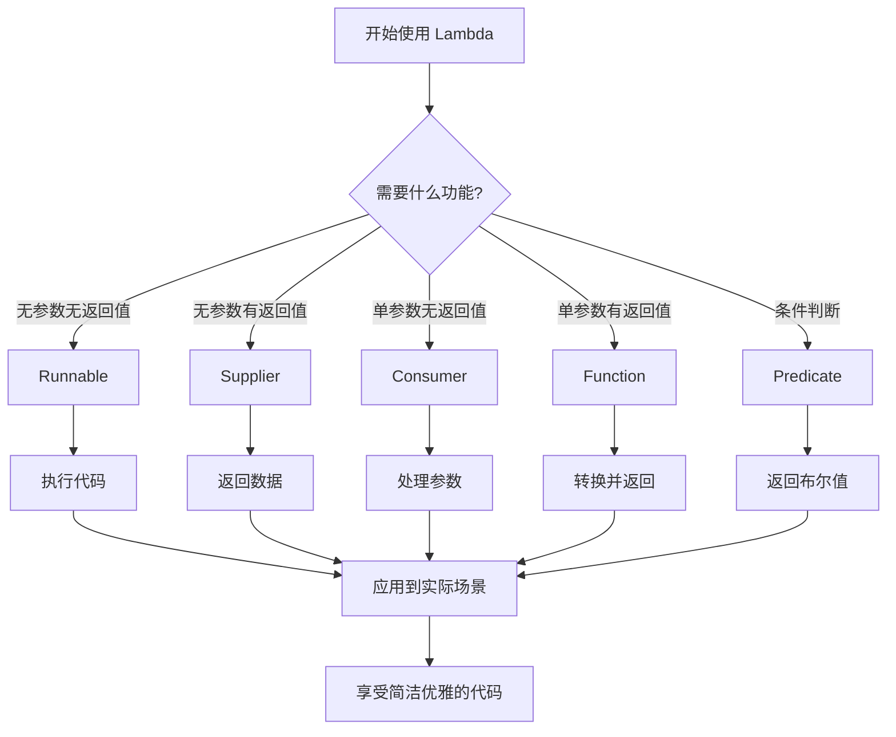

# Java Lambda 表达式入门指南 - 让代码更简洁优雅的编程利器

## 📋 摘要

你是否厌倦了写冗长的匿名内部类？是否希望代码更加简洁易读？Java Lambda 表达式（λ 表达式）正是解决这些痛点的利器！它能让你的代码从繁琐的样板代码中解脱出来，用更少的代码实现相同的功能。本指南将带你从零开始掌握 Lambda 表达式的核心概念、基本语法和实用技巧，让你在 10 分钟内就能写出更优雅的 Java 代码。无论你是编程新手还是有一定基础的开发者，都能快速上手并立即应用到实际项目中。

---

## 🎯 什么是 Lambda 表达式？

**Lambda 表达式**（Lambda Expression）是 Java 8 引入的一项重要特性，它本质上是一个**匿名函数**（anonymous function）。想象一下，如果你需要临时写一个函数，但又不想给它起名字，Lambda 表达式就是你的最佳选择！

### 🔍 核心概念理解

把 Lambda 表达式比作**快餐店的临时工**：
- **传统方式**：需要先招聘正式员工（定义类和方法），然后分配工作
- **Lambda 方式**：直接找临时工（匿名函数），用完就走，简单高效

## 📝 Lambda 表达式的基本语法

### 语法结构

```java
(参数列表) -> 表达式或代码块
```

### 语法规则

1. **参数列表**：可以包含零个或多个参数
2. **箭头符号**：`->` 是 Lambda 表达式的标志
3. **表达式/代码块**：要执行的具体逻辑

## 💡 基础示例演示

### 示例 1：无参数 Lambda

```java
// 传统写法：使用匿名内部类
Runnable oldWay = new Runnable() {
    @Override
    public void run() {
        System.out.println("Hello World!");
    }
};

// Lambda 写法：简洁明了
Runnable newWay = () -> System.out.println("Hello World!");
```

### 示例 2：单参数 Lambda

```java
// 传统写法
List<String> names = Arrays.asList("张三", "李四", "王五");
names.forEach(new Consumer<String>() {
    @Override
    public void accept(String name) {
        System.out.println("姓名：" + name);
    }
});

// Lambda 写法
names.forEach(name -> System.out.println("姓名：" + name));
```

### 示例 3：多参数 Lambda

```java
// 传统写法
Comparator<Integer> oldComparator = new Comparator<Integer>() {
    @Override
    public int compare(Integer a, Integer b) {
        return a.compareTo(b);
    }
};

// Lambda 写法
Comparator<Integer> newComparator = (a, b) -> a.compareTo(b);
```

## 🎨 Lambda 表达式的不同写法

### 1. 单行表达式

```java
// 计算平方
Function<Integer, Integer> square = x -> x * x;
System.out.println(square.apply(5)); // 输出：25
```

### 2. 多行代码块

```java
// 复杂逻辑处理
Function<String, String> processName = name -> {
    String trimmed = name.trim();
    String upperCase = trimmed.toUpperCase();
    return "处理后的姓名：" + upperCase;
};
```

### 3. 无参数情况

```java
// 无参数 Lambda
Supplier<String> getMessage = () -> "欢迎使用 Lambda！";
System.out.println(getMessage.get());
```

## 🔧 常用函数式接口

Java 提供了许多内置的**函数式接口**（Functional Interface），让 Lambda 表达式使用更加方便：

### 核心函数式接口

| 接口名称 | 参数数量 | 返回值 | 用途说明 |
|---------|---------|--------|----------|
| `Runnable` | 0 | void | 无参数无返回值的任务 |
| `Supplier<T>` | 0 | T | 无参数有返回值的提供者 |
| `Consumer<T>` | 1 | void | 单参数无返回值的消费者 |
| `Function<T,R>` | 1 | R | 单参数有返回值的函数 |
| `Predicate<T>` | 1 | boolean | 单参数返回布尔值的判断器 |

### 实际应用示例

```java
import java.util.function.*;

public class LambdaExamples {
    public static void main(String[] args) {
        // Supplier：数据提供者
        Supplier<String> dataProvider = () -> "Hello Lambda!";
        
        // Consumer：数据消费者
        Consumer<String> dataConsumer = message -> System.out.println("收到：" + message);
        
        // Function：数据转换器
        Function<String, Integer> lengthCalculator = text -> text.length();
        
        // Predicate：条件判断器
        Predicate<String> isEmpty = text -> text.isEmpty();
        
        // 使用示例
        String message = dataProvider.get();
        dataConsumer.accept(message);
        int length = lengthCalculator.apply(message);
        boolean empty = isEmpty.test(message);
        
        System.out.println("长度：" + length + "，是否为空：" + empty);
    }
}
```

## 🚀 Lambda 表达式的优势

### 1. **代码简洁性** ✨
- 减少样板代码（boilerplate code）
- 提高代码可读性
- 降低维护成本

### 2. **函数式编程支持** 🔄
- 支持将函数作为参数传递
- 便于实现函数式编程范式
- 提高代码的灵活性

### 3. **集合操作优化** 📊
- 与 Stream API 完美结合
- 简化集合的过滤、映射、归约操作
- 提高数据处理效率

## ⚠️ 注意事项

### 1. 变量捕获规则
```java
int externalVar = 10;
// Lambda 可以访问外部变量，但外部变量必须是 final 或 effectively final
Runnable task = () -> System.out.println(externalVar); // ✅ 正确
```

### 2. 类型推断
```java
// Java 编译器可以自动推断类型
Function<String, Integer> func1 = s -> s.length(); // ✅ 推荐
Function<String, Integer> func2 = (String s) -> s.length(); // ✅ 也可以
```

### 3. 方法引用
```java
// 当 Lambda 只是调用现有方法时，可以使用方法引用
List<String> names = Arrays.asList("张三", "李四");
names.forEach(System.out::println); // 方法引用，比 Lambda 更简洁
```

## 🎯 实际应用场景

### 场景 1：集合遍历
```java
List<String> fruits = Arrays.asList("苹果", "香蕉", "橙子");
// 传统方式
for (String fruit : fruits) {
    System.out.println(fruit);
}
// Lambda 方式
fruits.forEach(fruit -> System.out.println(fruit));
```

### 场景 2：条件过滤
```java
List<Integer> numbers = Arrays.asList(1, 2, 3, 4, 5, 6);
// 过滤偶数
List<Integer> evenNumbers = numbers.stream()
    .filter(n -> n % 2 == 0)
    .collect(Collectors.toList());
```

### 场景 3：事件处理
```java
// GUI 事件处理
button.addActionListener(e -> {
    System.out.println("按钮被点击了！");
    // 处理点击事件
});
```

## 📊 Lambda 表达式流程图



## 🎉 总结

Java Lambda 表达式是现代 Java 开发中不可或缺的工具，它让代码变得更加简洁、优雅和易读。通过本指南的学习，你已经掌握了：

- ✅ **核心概念**：Lambda 表达式是匿名函数的简洁写法
- ✅ **基本语法**：`(参数) -> 表达式` 的简单结构
- ✅ **常用接口**：Runnable、Supplier、Consumer、Function、Predicate
- ✅ **实际应用**：集合操作、事件处理、条件过滤等场景
- ✅ **最佳实践**：类型推断、方法引用、变量捕获等技巧

记住，**好的代码不是写给自己看的，而是写给别人看的**。Lambda 表达式正是帮助我们写出更易读、更易维护代码的利器。现在就开始在你的项目中尝试使用 Lambda 表达式吧，相信你会发现编程的乐趣！

---

**厦门工学院人工智能创作坊 -- 郑恩赐**  
**2025 年 10 月 8 日**
