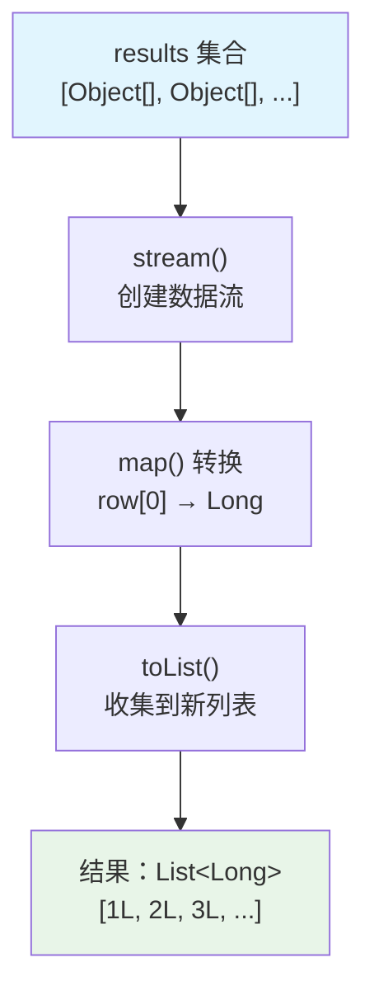

# Java Stream API 代码解析 - 从数据转换到集合收集的编程利器

## 📋 摘要

解析 `results.stream().map(row -> Long.valueOf((Integer) row[0])).toList()` 代码，用比喻理解 Stream API 数据转换与收集。

## 🎯 适用开发者水平

- **小白（零基础）**：✅ 基础概念理解
- **初级开发者**：✅ 代码逻辑分析  
- **中级开发者**：✅ 性能优化建议
- **高级开发者**：✅ 最佳实践应用

## 📚 目录

1. [🔍 代码概览](#代码概览)
2. [🏭 生活化比喻理解](#生活化比喻理解)
3. [🔧 逐行代码解析](#逐行代码解析)
4. [⚡ 执行流程详解](#执行流程详解)
5. [🎯 实际应用场景](#实际应用场景)
6. [❓ 常见问题与解决方案](#常见问题与解决方案)
7. [🚀 性能优化建议](#性能优化建议)
   - [🔄 并行流详解](#并行流详解parallel-stream)
   - [📦 装箱与拆箱详解](#装箱与拆箱详解boxing--unboxing)
8. [🎉 总结](#总结)

## 🔍 代码概览

```java
// 示例命令：根据实际环境调整变量名和数据类型
results.stream()
       .map(row -> Long.valueOf((Integer) row[0]))
       .toList();
```

**核心功能**：将 `results` 集合中每个元素的第一个字段从 `Integer`（整数）类型转换为 `Long`（长整数）类型，并收集到新的列表中。

## 🏭 生活化比喻理解

### 🏭 工厂流水线比喻

想象你在一家**数据加工厂**工作：

1. **原料仓库**（`results`）：存放着各种原料盒子，每个盒子里装着不同类型的物品
2. **传送带**（`.stream()`）：将原料盒子一个个送到加工车间
3. **加工机器**（`.map()`）：专门负责从每个盒子里取出第一个物品，并改变它的包装
4. **包装车间**（`.toList()`）：将加工好的物品重新包装成新的盒子

### 📦 具体加工过程

```java
// 假设 results 包含以下数据：
// [1, "张三"], [2, "李四"], [3, "王五"]
results.stream()                    // 🏭 启动传送带
       .map(row -> Long.valueOf((Integer) row[0]))  // 🔧 加工机器：取出第一个数字，改变包装
       .toList();                   // 📦 包装车间：装成新盒子
```

**结果**：`[1L, 2L, 3L]`（注意数字后面多了 `L`，表示长整数类型）

## 🔧 逐行代码解析

### 第 1 行：启动数据流
```java
results.stream()
```
- **`results`**：原始数据集合（如 `List<Object[]>`）
- **`.stream()`**：创建 Stream（流）对象，开启数据流式处理
- **作用**：将集合转换为可进行链式操作的数据流

### 第 2 行：数据转换处理
```java
.map(row -> Long.valueOf((Integer) row[0]))
```

**详细分解**：
- **`row`**：流中的每个元素（假设是 `Object[]` 数组）
- **`row[0]`**：数组的第一个元素
- **`(Integer)`**：强制类型转换（cast），告诉编译器这是 `Integer` 类型
- **`Long.valueOf()`**：将 `Integer` 转换为 `Long` 类型
- **`->`**：Lambda 表达式（λ表达式）语法，表示"输入什么，输出什么"

### 第 3 行：收集结果
```java
.toList()
```
- **`.toList()`**：将流中的所有元素收集到一个新的 `List` 中
- **注意**：这是 Java 16+ 的新方法，返回**不可变列表**（immutable list）

## ⚡ 执行流程详解



### 🔄 逐步执行示例

```java
// 假设输入数据
List<Object[]> results = Arrays.asList(
    new Object[]{1, "张三"},
    new Object[]{2, "李四"}, 
    new Object[]{3, "王五"}
);

// 执行过程
results.stream()                    // 步骤1：创建流
       .map(row -> Long.valueOf((Integer) row[0]))  // 步骤2：转换每个元素
       .toList();                   // 步骤3：收集结果

// 详细执行过程：
// 第1次：row = [1, "张三"] → row[0] = 1 → Long.valueOf(1) → 1L
// 第2次：row = [2, "李四"] → row[0] = 2 → Long.valueOf(2) → 2L  
// 第3次：row = [3, "王五"] → row[0] = 3 → Long.valueOf(3) → 3L
// 最终结果：[1L, 2L, 3L]
```

## 🎯 实际应用场景

### 场景 1：数据库查询结果处理
```java
// 适用水平：初级开发者
// 从数据库查询用户 ID 列表
List<Object[]> queryResults = userRepository.findUserIds();
List<Long> userIds = queryResults.stream()
                                .map(row -> Long.valueOf((Integer) row[0]))
                                .toList();
```

### 场景 2：Excel 数据处理
```java
// 适用水平：中级开发者
// 处理 Excel 导入的数值数据
List<Object[]> excelData = excelReader.readData();
List<Long> processedNumbers = excelData.stream()
                                       .map(row -> Long.valueOf((Integer) row[0]))
                                       .toList();
```

### 场景 3：API 响应数据转换
```java
// 适用水平：高级开发者
// 将第三方 API 返回的数据转换为内部格式
List<Object[]> apiResponse = externalApi.getData();
List<Long> internalIds = apiResponse.stream()
                                   .map(row -> Long.valueOf((Integer) row[0]))
                                   .toList();
```

## ❓ 常见问题与解决方案

### 问题 1：ClassCastException（类型转换异常）
```java
// ❌ 错误示例
Object[] row = {1, "张三"};
Integer value = (Integer) row[0];  // 如果 row[0] 不是 Integer，会抛出异常

// ✅ 正确做法
Object[] row = {1, "张三"};
if (row[0] instanceof Integer) {
    Long result = Long.valueOf((Integer) row[0]);
}
```

### 问题 2：Java 版本兼容性
```java
// Java 16+ 版本
List<Long> result = results.stream()
                           .map(row -> Long.valueOf((Integer) row[0]))
                           .toList();

// Java 8-15 版本
List<Long> result = results.stream()
                           .map(row -> Long.valueOf((Integer) row[0]))
                           .collect(Collectors.toList());
```

### 问题 3：空值处理
```java
// ✅ 安全的空值处理
List<Long> result = results.stream()
                           .filter(row -> row[0] != null)  // 过滤空值
                           .map(row -> Long.valueOf((Integer) row[0]))
                           .toList();
```

## 🚀 性能优化建议

### 🔄 并行流详解（Parallel Stream）

#### 什么是并行流？
**并行流**（Parallel Stream）是 Java 8 引入的多线程数据处理机制，能够自动将数据分割成多个块，在不同线程中并行处理，最后合并结果。

#### 🏭 生活化比喻：多工人协作
想象你有一个**大型工厂**：
- **普通流**：1 个工人按顺序处理所有产品
- **并行流**：多个工人同时处理不同批次的产品，最后汇总

```java
// 普通流：单线程顺序处理
List<Long> result1 = results.stream()
                           .map(row -> Long.valueOf((Integer) row[0]))
                           .toList();

// 并行流：多线程并行处理
List<Long> result2 = results.parallelStream()
                           .map(row -> Long.valueOf((Integer) row[0]))
                           .toList();
```

#### ⚡ 并行流适用场景
| 场景 | 数据量 | 处理复杂度 | 是否推荐 |
|------|--------|------------|----------|
| **小数据量** | < 1000 | 简单 | ❌ 不推荐（线程开销大） |
| **中等数据量** | 1000-10000 | 中等 | ⚠️ 谨慎使用 |
| **大数据量** | > 10000 | 复杂 | ✅ 强烈推荐 |

#### 🎯 实际应用示例
```java
// 适用水平：高级开发者
// 处理大量用户数据
List<User> users = userRepository.findAll(); // 假设有 50000 条记录

// 使用并行流提升性能
List<Long> userIds = users.parallelStream()
                         .map(User::getId)
                         .toList();
```

### 📦 装箱与拆箱详解（Boxing & Unboxing）

#### 什么是装箱操作？
**装箱**（Boxing）：将基本数据类型（如 `int`）自动转换为包装类对象（如 `Integer`）
**拆箱**（Unboxing）：将包装类对象自动转换为基本数据类型

#### 🏭 生活化比喻：包装盒
想象你买了一个苹果：
- **装箱**：把苹果装进精美的包装盒（基本类型 → 包装类）
- **拆箱**：从包装盒里取出苹果（包装类 → 基本类型）

```java
// 装箱操作示例
int primitiveInt = 42;           // 基本类型
Integer wrapperInt = primitiveInt; // 自动装箱：int → Integer

// 拆箱操作示例  
Integer wrapperInt2 = 100;       // 包装类
int primitiveInt2 = wrapperInt2; // 自动拆箱：Integer → int
```

#### 💰 装箱操作的成本
| 操作 | 内存开销 | 性能开销 | 说明 |
|------|----------|----------|------|
| **基本类型** | 4 字节 | 无 | 直接存储在栈中 |
| **包装类** | 16+ 字节 | 有 | 对象存储在堆中，需要 GC |

#### 🚀 避免装箱的优化方案

##### 方案 1：使用 mapToLong（推荐）
```java
// ❌ 原始代码：会产生装箱操作
List<Long> result = results.stream()
                           .map(row -> Long.valueOf((Integer) row[0])) // 装箱：int → Integer → Long
                           .toList();

// ✅ 优化代码：避免装箱操作
long[] result = results.stream()
                       .mapToLong(row -> (Integer) row[0]) // 直接转换：int → long
                       .toArray();
```

##### 方案 2：使用 mapToInt
```java
// 如果只需要 int 类型
int[] result = results.stream()
                      .mapToInt(row -> (Integer) row[0]) // 直接转换：int → int
                      .toArray();
```

#### 📊 性能对比测试
```java
// 适用水平：高级开发者
// 性能测试示例
List<Object[]> testData = generateTestData(100000); // 10万条数据

// 测试装箱版本
long start1 = System.currentTimeMillis();
List<Long> boxedResult = testData.stream()
                                .map(row -> Long.valueOf((Integer) row[0]))
                                .toList();
long time1 = System.currentTimeMillis() - start1;

// 测试无装箱版本
long start2 = System.currentTimeMillis();
long[] unboxedResult = testData.stream()
                               .mapToLong(row -> (Integer) row[0])
                               .toArray();
long time2 = System.currentTimeMillis() - start2;

System.out.println("装箱版本耗时：" + time1 + "ms");
System.out.println("无装箱版本耗时：" + time2 + "ms");
```

### 优化方案对比

| 方案 | 代码行数 | 性能 | 可读性 | 适用场景 |
|------|----------|------|--------|----------|
| **原始代码** | 3 行 | ⭐⭐⭐ | ⭐⭐⭐⭐ | 简单转换 |
| **传统循环** | 6-8 行 | ⭐⭐⭐⭐ | ⭐⭐⭐ | 复杂逻辑 |
| **并行流** | 4 行 | ⭐⭐⭐⭐⭐ | ⭐⭐⭐ | 大数据量 |

### 并行流优化（适用水平：高级开发者）
```java
// 大数据量时使用并行流
List<Long> result = results.parallelStream()
                           .map(row -> Long.valueOf((Integer) row[0]))
                           .toList();
```

### 内存优化建议
```java
// 使用 mapToLong 避免装箱操作
long[] result = results.stream()
                       .mapToLong(row -> (Integer) row[0])
                       .toArray();
```

## 🎉 总结

通过深入解析这段 Stream API 代码，我们掌握了：

### 🎯 核心知识点
- **Stream API**：Java 8+ 的函数式编程接口，提供链式数据处理能力
- **map() 方法**：数据转换的核心方法，支持 Lambda 表达式
- **toList() 方法**：Java 16+ 的便捷收集方法，返回不可变列表
- **类型转换**：安全的类型转换技巧和异常处理
- **并行流**：多线程数据处理机制，适用于大数据量场景
- **装箱/拆箱**：基本类型与包装类的自动转换，影响性能的重要因素

### 💡 最佳实践
1. **类型安全**：使用 `instanceof` 检查类型，避免 `ClassCastException`
2. **版本兼容**：根据 Java 版本选择合适的收集方法
3. **性能考虑**：大数据量时考虑使用并行流或 `mapToLong`
4. **避免装箱**：使用 `mapToLong`、`mapToInt` 等方法避免不必要的装箱操作
5. **并行流选择**：数据量 > 10000 时考虑使用 `parallelStream()`
6. **代码可读性**：合理使用 Lambda 表达式，保持代码简洁

### 🚀 学习建议
- **小白**：先理解基本概念，多练习简单的 map 操作
- **初级**：掌握 Lambda 表达式语法，理解函数式编程思想
- **中级**：学习性能优化技巧，了解装箱/拆箱对性能的影响
- **高级**：深入研究 Stream API 源码，掌握并行流和自定义收集器

**记住**：Stream API 是 Java 函数式编程的精华，掌握它能让你的代码更加简洁优雅！继续加油，你一定能成为 Stream API 的高手！ 💪

---

**厦门工学院人工智能创作坊 -- 郑恩赐**  
**2025 年 10 月 14 日**
