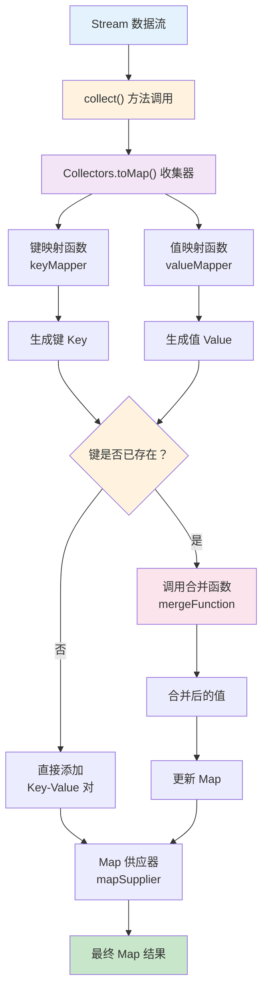

# Java Collectors.toMap 技术解析 - 从流数据到 Map 集合的转换利器

## 📋 摘要

`Collectors.toMap()` 是 Java 8 Stream API 核心收集器，将流数据转换为 Map 集合。支持键值映射、冲突处理和自定义 Map 类型。用比喻解析原理，提供场景和方案。

## 🎯 适用开发者水平

- **小白（零基础）**：了解基本概念和简单用法
- **初级开发者**：掌握基本用法和常见场景
- **中级开发者**：理解冲突处理和自定义 Map 类型
- **高级开发者**：掌握性能优化和最佳实践

## 📚 目录

1. [🔍 核心概念解析](#核心概念解析)
2. [🔧 语法结构详解](#语法结构详解)
3. [⚡ 执行流程可视化](#执行流程可视化)
4. [🎯 实际应用场景](#实际应用场景)
5. [❓ 常见问题与解决方案](#常见问题与解决方案)
6. [🎉 总结](#总结)

## 🔍 核心概念解析

### 什么是 collect() 方法

`collect()` 是 Stream API 中的**终端操作**（Terminal Operation），用于将流中的元素收集到指定的容器中。它就像一个**万能收集器**，能够将流动的数据"打包"成你需要的任何形式。

### 什么是 Collectors.toMap()

`Collectors.toMap()` 是 Java 8 引入的收集器（Collector），专门用于将流（Stream）中的元素收集到一个 `Map` 集合中。它就像一个**智能分类器**，能够根据你指定的规则，将数据自动分类整理。

### 生活化比喻理解

想象你是一个**图书管理员**，需要将一堆书籍按照书名和作者进行分类整理：

- **collect() 方法**：就像你手中的**收集工具**，能够将散乱的书籍整理成有序的集合
- **Collectors.toMap()**：就像**专门的分类器**，能够将书籍按照特定规则分类到不同的书架上
- **键映射函数**：就像给每本书贴标签，决定它属于哪个分类
- **值映射函数**：就像决定每个分类里放什么信息（书名、作者、价格等）
- **合并函数**：当两本书要放在同一个分类时，决定如何处理
- **Map 供应器**：决定使用什么样的书架（HashMap、TreeMap 等）

## 🔧 语法结构详解

### collect() 方法基础

`collect()` 方法是 Stream API 的终端操作，它的基本语法是：

```java
// 示例命令：根据实际环境调整参数
<R, A> R collect(Collector<? super T, A, R> collector)
```

**参数说明**：
- `collector`：收集器（Collector），定义了如何收集流中的元素
- `R`：返回结果的类型
- `A`：中间累积容器的类型

### Collectors.toMap() 详解

`Collectors.toMap()` 是专门用于创建 Map 的收集器，它有四种重载形式：

#### 1. 基础版本（两个参数）

```java
// 示例命令：将字符串列表转换为长度映射
List<String> fruits = List.of("apple", "banana", "cherry");
Map<String, Integer> fruitLengthMap = fruits.stream()
    .collect(Collectors.toMap(
        fruit -> fruit,        // 键：水果名称
        String::length         // 值：字符串长度
    ));
// 结果：{apple=5, banana=6, cherry=6}
```

#### 2. 带冲突处理版本（三个参数）

```java
// 示例命令：处理长度相同的字符串冲突
List<String> words = List.of("cat", "dog", "bat", "rat");
Map<Integer, String> lengthToWordMap = words.stream()
    .collect(Collectors.toMap(
        String::length,                    // 键：字符串长度
        word -> word,                      // 值：字符串本身
        (existing, replacement) -> existing // 冲突时保留现有值
    ));
// 结果：{3=cat} （只保留第一个长度为3的单词）
```

#### 3. 完整版本（四个参数）

```java
// 示例命令：创建有序的 TreeMap
List<String> names = List.of("Alice", "Bob", "Charlie");
Map<String, Integer> sortedNameMap = names.stream()
    .collect(Collectors.toMap(
        name -> name,                      // 键：姓名
        String::length,                    // 值：长度
        (existing, replacement) -> existing, // 合并函数
        TreeMap::new                       // 使用 TreeMap 保持有序
    ));
// 结果：按字母顺序排序的 Map
```

## ⚡ 执行流程可视化

### collect() 方法执行流程



## 🎯 实际应用场景

### 场景一：用户信息管理（初级开发者适用）

```java
// 示例命令：将用户列表转换为 ID-姓名映射
public class UserService {
    public Map<Long, String> getUserNameMap(List<User> users) {
        return users.stream()
            .collect(Collectors.toMap(
                User::getId,           // 键：用户 ID
                User::getName,         // 值：用户姓名
                (existing, replacement) -> existing // 处理重复 ID
            ));
    }
}

// 使用示例
List<User> users = List.of(
    new User(1L, "张三"),
    new User(2L, "李四"),
    new User(3L, "王五")
);
Map<Long, String> nameMap = userService.getUserNameMap(users);
// 结果：{1=张三, 2=李四, 3=王五}
```

### 场景二：数据统计转换（中级开发者适用）

```java
// 示例命令：统计每个部门的员工数量
public class DepartmentService {
    public Map<String, Long> getDepartmentEmployeeCount(List<Employee> employees) {
        return employees.stream()
            .collect(Collectors.toMap(
                Employee::getDepartment,    // 键：部门名称
                emp -> 1L,                 // 值：计数（每个员工计为1）
                Long::sum,                  // 合并：累加计数
                LinkedHashMap::new         // 保持插入顺序
            ));
    }
}

// 使用示例
List<Employee> employees = List.of(
    new Employee("张三", "技术部"),
    new Employee("李四", "技术部"),
    new Employee("王五", "销售部")
);
Map<String, Long> countMap = departmentService.getDepartmentEmployeeCount(employees);
// 结果：{技术部=2, 销售部=1}
```

### 场景三：配置属性转换（高级开发者适用）

```java
// 示例命令：将配置列表转换为属性映射
public class ConfigService {
    public Map<String, Object> buildConfigMap(List<ConfigItem> configs) {
        return configs.stream()
            .collect(Collectors.toMap(
                ConfigItem::getKey,         // 键：配置键
                ConfigItem::getValue,       // 值：配置值
                (existing, replacement) -> {
                    // 高级合并逻辑：记录冲突并选择最新值
                    log.warn("配置键冲突: {}, 使用最新值: {}", 
                            existing, replacement);
                    return replacement;
                },
                ConcurrentHashMap::new      // 线程安全的 Map
            ));
    }
}
```

## ❓ 常见问题与解决方案

### 问题一：collect() 方法理解困难

**问题描述**：初学者对 `collect()` 方法的作用和用法不理解。

**解决方案**：理解 `collect()` 的本质作用。

```java
// 示例命令：collect() 方法的基本作用
List<String> fruits = List.of("apple", "banana", "cherry");

// collect() 的作用：将流转换为其他数据结构
Map<String, Integer> map = fruits.stream()
    .collect(Collectors.toMap(
        fruit -> fruit,        // 收集规则：键映射
        String::length         // 收集规则：值映射
    ));

// 等价于传统写法
Map<String, Integer> traditionalMap = new HashMap<>();
for (String fruit : fruits) {
    traditionalMap.put(fruit, fruit.length());
}
```

### 问题二：IllegalStateException 异常

**问题描述**：当流中存在重复键时，默认会抛出 `IllegalStateException`。

```java
// 错误示例：会抛出异常
List<String> words = List.of("cat", "dog", "cat");
Map<String, Integer> map = words.stream()
    .collect(Collectors.toMap(
        word -> word,
        String::length
    )); // 抛出 IllegalStateException: Duplicate key cat
```

**解决方案**：提供合并函数处理冲突。

```java
// 正确示例：处理键冲突
Map<String, Integer> map = words.stream()
    .collect(Collectors.toMap(
        word -> word,
        String::length,
        (existing, replacement) -> existing // 保留现有值
    ));
```

### 问题二：空值处理

**问题描述**：当键或值为 null 时可能出现问题。

```java
// 示例命令：安全的空值处理
public Map<String, String> safeToMap(List<DataItem> items) {
    return items.stream()
        .filter(item -> item.getKey() != null && item.getValue() != null)
        .collect(Collectors.toMap(
            DataItem::getKey,
            DataItem::getValue,
            (existing, replacement) -> replacement,
            HashMap::new
        ));
}
```

### 问题三：性能优化建议

**性能对比表格**：

| 方法 | 时间复杂度 | 空间复杂度 | 适用场景 |
|------|------------|------------|----------|
| 基础 toMap | O(n) | O(n) | 无冲突场景 |
| 带合并 toMap | O(n) | O(n) | 有冲突场景 |
| 传统循环 | O(n) | O(n) | 简单转换 |

**优化建议**：
1. **预过滤**：使用 `filter()` 提前过滤无效数据
2. **并行流**：大数据量时考虑使用 `parallelStream()`
3. **合适 Map 类型**：根据需求选择合适的 Map 实现

```java
// 示例命令：性能优化示例
public Map<String, Long> optimizedToMap(List<Data> dataList) {
    return dataList.parallelStream()  // 并行处理
        .filter(data -> data.isValid()) // 预过滤
        .collect(Collectors.toMap(
            Data::getId,
            Data::getValue,
            Long::max,                // 取最大值
            ConcurrentHashMap::new    // 线程安全
        ));
}
```

## 🎉 总结

`Collectors.toMap()` 是 Java Stream API 中不可或缺的数据转换工具，它通过简洁的语法实现了强大的功能。从基础的键值映射到复杂的冲突处理，再到自定义 Map 类型选择，每一个特性都体现了 Java 函数式编程的优雅。

**核心要点回顾**：
- **键值映射**：灵活定义数据的分类和存储规则
- **冲突处理**：通过合并函数优雅解决重复键问题
- **类型选择**：根据需求选择合适的 Map 实现
- **性能优化**：合理使用并行流和预过滤提升效率

掌握 `Collectors.toMap()` 不仅能提升代码的简洁性和可读性，更能让你在数据处理场景中游刃有余。继续探索 Java Stream API 的更多可能性，让函数式编程成为你开发路上的得力助手！

---

**厦门工学院人工智能创作坊 -- 郑恩赐**  
**2025 年 10 月 14 日**
