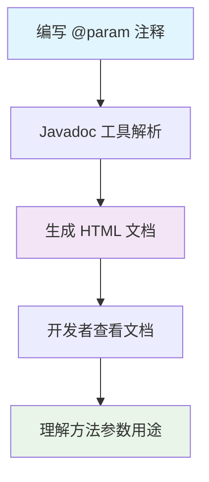
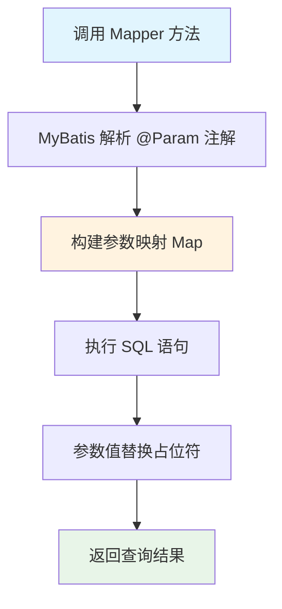
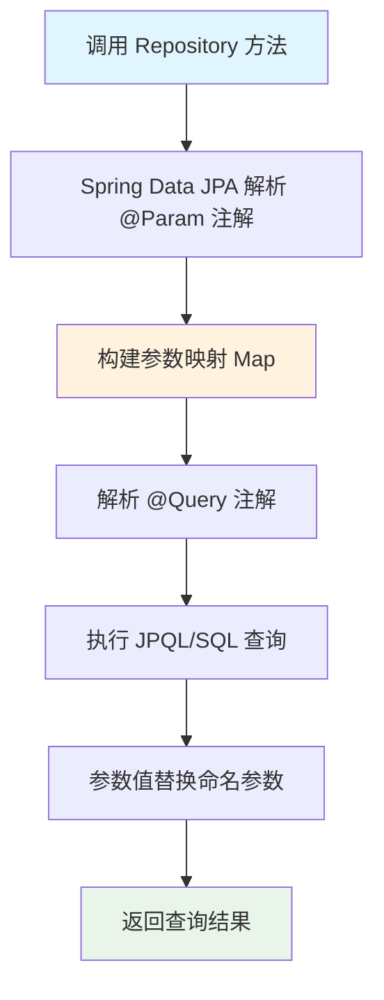

# @Param 注解完全指南 - 从 Javadoc 到 MyBatis 和 JPA 参数绑定的 Java 开发利器

## 📋 摘要

@Param 注解是 Java 开发中的三重利器：在 Javadoc 中提供参数文档说明，在 MyBatis 和 JPA 中实现精确参数绑定。掌握它能让你写出更规范、更易维护的代码。

## 🎯 适用开发者水平

- **小白（零基础）**：✅ 完全适用，提供详细解释和比喻
- **刚入门不久（初级）**：✅ 完全适用，快速掌握核心用法
- **入门一段时间（中级）**：✅ 完全适用，深入理解最佳实践
- **资深开发者（高级）**：✅ 完全适用，优化代码质量

## 📚 目录

1. [🔍 @Param 注解概览](#-param-注解概览)
2. [📝 Javadoc 中的 @param 标签](#-javadoc-中的-param-标签)
3. [🗄️ MyBatis 中的 @Param 注解](#️-mybatis-中的-param-注解)
4. [🏛️ JPA 中的 @Param 注解](#️-jpa-中的-param-注解)
5. [⚡ 执行流程详解](#-执行流程详解)
6. [🎯 实际应用场景](#-实际应用场景)
7. [❓ 常见问题与解决方案](#-常见问题与解决方案)
8. [🎉 总结](#-总结)

## 🔍 @Param 注解概览

@Param 注解在 Java 开发中有三种不同的用途，就像一把万能钥匙可以打开三扇不同的门：

### 🏷️ 三种用途对比

| 用途类型 | 作用范围 | 主要功能 | 使用场景 |
|---------|---------|---------|---------|
| **Javadoc @param** | 文档注释 | 参数说明文档 | 代码文档生成 |
| **MyBatis @Param** | 方法参数 | 参数名称绑定 | 数据库操作 |
| **JPA @Param** | 方法参数 | 参数名称绑定 | JPA 查询操作 |

### 🔧 核心区别

- **Javadoc @param**：仅用于生成文档，不影响代码运行
- **MyBatis @Param**：直接影响代码执行，用于参数映射
- **JPA @Param**：直接影响代码执行，用于 JPA 查询参数绑定

## 📝 Javadoc 中的 @param 标签

### 🎯 基本概念

Javadoc 中的 `@param` 标签就像给方法参数贴标签，告诉其他开发者这个参数是做什么用的。它不会影响代码运行，但能让代码更容易理解。

### 📋 基本语法

```java
/**
 * 方法描述
 * 
 * @param 参数名 参数描述
 * @return 返回值描述
 */
```

### 💡 实际示例

```java
/**
 * 计算两个整数的和
 * 
 * @param a 第一个加数（int 类型）
 * @param b 第二个加数（int 类型）
 * @return 两个整数的和
 */
public int add(int a, int b) {
    return a + b;
}
```

### 🎨 高级用法技巧

#### 1. 提供参数类型信息

```java
/**
 * 设置用户音量级别
 * 
 * @param volume int 类型，音量级别，范围从 0（静音）到 100（最大音量）
 * @param userId String 类型，用户唯一标识符
 */
public void setVolume(int volume, String userId) {
    // 示例命令：设置音量
    if (volume < 0 || volume > 100) {
        throw new IllegalArgumentException("音量必须在 0-100 之间");
    }
    // 实际业务逻辑...
}
```

#### 2. 描述参数值范围

```java
/**
 * 处理用户订单
 * 
 * @param orderId Long 类型，订单 ID，必须大于 0
 * @param status String 类型，订单状态，可选值：PENDING、CONFIRMED、SHIPPED、DELIVERED
 * @param amount BigDecimal 类型，订单金额，必须大于 0
 */
public void processOrder(Long orderId, String status, BigDecimal amount) {
    // 示例命令：处理订单
    // 实际业务逻辑...
}
```

#### 3. 解释复杂参数含义

```java
/**
 * 批量处理用户数据
 * 
 * @param users List<User> 类型，待处理的用户列表，不能为空
 * @param processor Function<User, String> 类型，用户数据处理函数
 * @param batchSize int 类型，批处理大小，建议值 100-1000
 * @return 处理结果统计信息
 */
public Map<String, Integer> batchProcessUsers(
    List<User> users, 
    Function<User, String> processor, 
    int batchSize) {
    // 示例命令：批量处理用户
    // 实际业务逻辑...
    return new HashMap<>();
}
```

## 🗄️ MyBatis 中的 @Param 注解

### 🎯 基本概念

MyBatis 中的 `@Param` 注解就像给方法参数起外号，让 SQL 语句能够准确找到对应的参数值。想象一下，如果老师叫"那个穿红衣服的同学"，可能有好几个人站起来，但如果叫"张三"，就只有一个同学会回应。

### 📋 基本语法

```java
@Param("参数名") 参数类型 参数变量名
```

### 💡 实际示例

#### 基础用法

```java
// Mapper 接口
public interface UserMapper {
    /**
     * 根据用户名和年龄查询用户
     * 
     * @param username 用户名
     * @param age 年龄
     * @return 用户信息
     */
    User selectUserByNameAndAge(
        @Param("username") String username, 
        @Param("age") Integer age
    );
}
```

```xml
<!-- UserMapper.xml -->
<select id="selectUserByNameAndAge" resultType="User">
    SELECT * FROM users 
    WHERE name = #{username} AND age = #{age}
</select>
```

#### 多参数复杂查询

```java
// Mapper 接口
public interface ProductMapper {
    /**
     * 分页查询产品信息
     * 
     * @param category 产品分类
     * @param minPrice 最低价格
     * @param maxPrice 最高价格
     * @param offset 偏移量
     * @param limit 限制数量
     * @return 产品列表
     */
    List<Product> selectProductsByCondition(
        @Param("category") String category,
        @Param("minPrice") BigDecimal minPrice,
        @Param("maxPrice") BigDecimal maxPrice,
        @Param("offset") Integer offset,
        @Param("limit") Integer limit
    );
}
```

```xml
<!-- ProductMapper.xml -->
<select id="selectProductsByCondition" resultType="Product">
    SELECT * FROM products 
    WHERE 1=1
    <if test="category != null and category != ''">
        AND category = #{category}
    </if>
    <if test="minPrice != null">
        AND price >= #{minPrice}
    </if>
    <if test="maxPrice != null">
        AND price <= #{maxPrice}
    </if>
    ORDER BY create_time DESC
    LIMIT #{offset}, #{limit}
</select>
```

### 🎨 高级用法技巧

#### 1. 动态 SQL 中的参数使用

```java
// Mapper 接口
public interface OrderMapper {
    /**
     * 动态查询订单
     * 
     * @param userId 用户 ID
     * @param statusList 状态列表
     * @param startDate 开始日期
     * @param endDate 结束日期
     * @return 订单列表
     */
    List<Order> selectOrdersDynamic(
        @Param("userId") Long userId,
        @Param("statusList") List<String> statusList,
        @Param("startDate") LocalDateTime startDate,
        @Param("endDate") LocalDateTime endDate
    );
}
```

```xml
<!-- OrderMapper.xml -->
<select id="selectOrdersDynamic" resultType="Order">
    SELECT * FROM orders 
    WHERE user_id = #{userId}
    <if test="statusList != null and statusList.size() > 0">
        AND status IN
        <foreach collection="statusList" item="status" open="(" separator="," close=")">
            #{status}
        </foreach>
    </if>
    <if test="startDate != null">
        AND create_time >= #{startDate}
    </if>
    <if test="endDate != null">
        AND create_time <= #{endDate}
    </if>
</select>
```

#### 2. 批量操作中的参数使用

```java
// Mapper 接口
public interface UserMapper {
    /**
     * 批量插入用户
     * 
     * @param users 用户列表
     * @return 插入成功的记录数
     */
    int batchInsertUsers(@Param("users") List<User> users);
}
```

```xml
<!-- UserMapper.xml -->
<insert id="batchInsertUsers">
    INSERT INTO users (name, email, age, create_time) VALUES
    <foreach collection="users" item="user" separator=",">
        (#{user.name}, #{user.email}, #{user.age}, #{user.createTime})
    </foreach>
</insert>
```

## 🏛️ JPA 中的 @Param 注解

### 🎯 基本概念

JPA 中的 `@Param` 注解就像给查询参数贴标签，让 Spring Data JPA 能够准确识别参数。想象一下，如果老师问"那个同学"，可能有好几个人回应，但如果问"张三同学"，就只有一个人会回答。

### 📋 基本语法

```java
@Query("JPQL 查询语句")
方法返回类型 方法名(@Param("参数名") 参数类型 参数变量名);
```

### 💡 实际示例

#### 基础用法

```java
// Repository 接口
public interface UserRepository extends JpaRepository<User, Long> {
    /**
     * 根据姓名和年龄查询用户
     * 
     * @param firstName 名字
     * @param lastName 姓氏
     * @return 用户列表
     */
    @Query("SELECT u FROM User u WHERE u.firstName = :firstName AND u.lastName = :lastName")
    List<User> findByFirstAndLastName(
        @Param("firstName") String firstName, 
        @Param("lastName") String lastName
    );
}
```

#### 复杂查询示例

```java
// Repository 接口
public interface ProductRepository extends JpaRepository<Product, Long> {
    /**
     * 根据分类和价格范围查询产品
     * 
     * @param category 产品分类
     * @param minPrice 最低价格
     * @param maxPrice 最高价格
     * @param status 产品状态
     * @return 产品列表
     */
    @Query("SELECT p FROM Product p WHERE p.category = :category " +
           "AND p.price BETWEEN :minPrice AND :maxPrice " +
           "AND p.status = :status")
    List<Product> findProductsByCategoryAndPriceRange(
        @Param("category") String category,
        @Param("minPrice") BigDecimal minPrice,
        @Param("maxPrice") BigDecimal maxPrice,
        @Param("status") String status
    );
}
```

### 🎨 高级用法技巧

#### 1. 原生 SQL 查询

```java
// Repository 接口
public interface OrderRepository extends JpaRepository<Order, Long> {
    /**
     * 使用原生 SQL 查询订单统计信息
     * 
     * @param startDate 开始日期
     * @param endDate 结束日期
     * @param statusList 状态列表
     * @return 订单统计结果
     */
    @Query(value = "SELECT COUNT(*) as total_count, " +
                   "SUM(amount) as total_amount " +
                   "FROM orders " +
                   "WHERE create_time BETWEEN :startDate AND :endDate " +
                   "AND status IN :statusList", 
           nativeQuery = true)
    Map<String, Object> getOrderStatistics(
        @Param("startDate") LocalDateTime startDate,
        @Param("endDate") LocalDateTime endDate,
        @Param("statusList") List<String> statusList
    );
}
```

#### 2. 动态查询条件

```java
// Repository 接口
public interface UserRepository extends JpaRepository<User, Long> {
    /**
     * 动态查询用户信息
     * 
     * @param name 用户姓名（可选）
     * @param email 邮箱（可选）
     * @param age 年龄（可选）
     * @param department 部门（可选）
     * @return 用户列表
     */
    @Query("SELECT u FROM User u WHERE " +
           "(:name IS NULL OR u.name LIKE %:name%) AND " +
           "(:email IS NULL OR u.email = :email) AND " +
           "(:age IS NULL OR u.age = :age) AND " +
           "(:department IS NULL OR u.department = :department)")
    List<User> findUsersDynamic(
        @Param("name") String name,
        @Param("email") String email,
        @Param("age") Integer age,
        @Param("department") String department
    );
}
```

#### 3. 分页查询

```java
// Repository 接口
public interface ProductRepository extends JpaRepository<Product, Long> {
    /**
     * 分页查询产品
     * 
     * @param category 产品分类
     * @param keyword 关键词
     * @param pageable 分页信息
     * @return 分页产品列表
     */
    @Query("SELECT p FROM Product p WHERE " +
           "(:category IS NULL OR p.category = :category) AND " +
           "(:keyword IS NULL OR p.name LIKE %:keyword% OR p.description LIKE %:keyword%)")
    Page<Product> findProductsWithPagination(
        @Param("category") String category,
        @Param("keyword") String keyword,
        Pageable pageable
    );
}
```

### 🔄 与位置参数的对比

#### 使用 @Param 注解（推荐）

```java
@Query("SELECT u FROM User u WHERE u.name = :name AND u.age > :age")
List<User> findByNameAndAge(@Param("name") String name, @Param("age") int age);
```

#### 使用位置参数（不推荐）

```java
@Query("SELECT u FROM User u WHERE u.name = ?1 AND u.age > ?2")
List<User> findByNameAndAge(String name, int age);
```

### 🎯 使用场景

1. **多参数查询**：当查询方法有多个参数时
2. **复杂查询**：使用 JPQL 或原生 SQL 的复杂查询
3. **动态查询**：查询条件可能为空的动态查询
4. **可读性要求**：需要提高代码可读性和可维护性

## ⚡ 执行流程详解

### 🔄 Javadoc @param 执行流程



### 🔄 MyBatis @Param 执行流程



### 🔄 JPA @Param 执行流程



## 🎯 实际应用场景

### 📊 场景一：用户管理系统

```java
// 用户查询服务
@Service
public class UserService {
    
    @Autowired
    private UserMapper userMapper;
    
    /**
     * 根据条件查询用户
     * 
     * @param name 用户姓名（模糊查询）
     * @param department 部门名称
     * @param minAge 最小年龄
     * @param maxAge 最大年龄
     * @return 用户列表
     */
    public List<User> searchUsers(String name, String department, Integer minAge, Integer maxAge) {
        // 示例命令：查询用户
        return userMapper.selectUsersByCondition(name, department, minAge, maxAge);
    }
}

// Mapper 接口
public interface UserMapper {
    List<User> selectUsersByCondition(
        @Param("name") String name,
        @Param("department") String department,
        @Param("minAge") Integer minAge,
        @Param("maxAge") Integer maxAge
    );
}
```

### 📦 场景二：订单管理系统（MyBatis）

```java
// 订单统计服务
@Service
public class OrderService {
    
    @Autowired
    private OrderMapper orderMapper;
    
    /**
     * 统计订单数据
     * 
     * @param startDate 开始日期
     * @param endDate 结束日期
     * @param statusList 订单状态列表
     * @return 统计结果
     */
    public OrderStatistics getOrderStatistics(
        LocalDate startDate, 
        LocalDate endDate, 
        List<String> statusList) {
        // 示例命令：统计订单
        return orderMapper.selectOrderStatistics(startDate, endDate, statusList);
    }
}

// Mapper 接口
public interface OrderMapper {
    OrderStatistics selectOrderStatistics(
        @Param("startDate") LocalDate startDate,
        @Param("endDate") LocalDate endDate,
        @Param("statusList") List<String> statusList
    );
}
```

### 🏛️ 场景三：产品管理系统（JPA）

```java
// 产品查询服务
@Service
public class ProductService {
    
    @Autowired
    private ProductRepository productRepository;
    
    /**
     * 根据条件查询产品
     * 
     * @param category 产品分类
     * @param keyword 关键词
     * @param minPrice 最低价格
     * @param maxPrice 最高价格
     * @return 产品列表
     */
    public List<Product> searchProducts(
        String category, 
        String keyword, 
        BigDecimal minPrice, 
        BigDecimal maxPrice) {
        // 示例命令：查询产品
        return productRepository.findProductsByCondition(category, keyword, minPrice, maxPrice);
    }
}

// Repository 接口
public interface ProductRepository extends JpaRepository<Product, Long> {
    /**
     * 根据条件查询产品
     * 
     * @param category 产品分类
     * @param keyword 关键词
     * @param minPrice 最低价格
     * @param maxPrice 最高价格
     * @return 产品列表
     */
    @Query("SELECT p FROM Product p WHERE " +
           "(:category IS NULL OR p.category = :category) AND " +
           "(:keyword IS NULL OR p.name LIKE %:keyword% OR p.description LIKE %:keyword%) AND " +
           "(:minPrice IS NULL OR p.price >= :minPrice) AND " +
           "(:maxPrice IS NULL OR p.price <= :maxPrice)")
    List<Product> findProductsByCondition(
        @Param("category") String category,
        @Param("keyword") String keyword,
        @Param("minPrice") BigDecimal minPrice,
        @Param("maxPrice") BigDecimal maxPrice
    );
}
```

## ❓ 常见问题与解决方案

### ❓ 问题 1：@Param 注解什么时候必须使用？

**答案**：在 MyBatis 和 JPA 中，以下情况必须使用 @Param 注解：

#### MyBatis 中使用场景：
1. **多参数方法**：方法有 2 个或以上参数时
2. **动态 SQL**：在 `<if>`、`<foreach>` 等标签中使用参数时
3. **参数名称映射**：需要明确指定参数名称时

```java
// ✅ 正确：多参数必须使用 @Param
User selectUser(@Param("id") Long id, @Param("name") String name);

// ❌ 错误：多参数不使用 @Param 会导致参数映射错误
User selectUser(Long id, String name);
```

#### JPA 中使用场景：
1. **命名参数查询**：在 @Query 中使用 `:参数名` 时
2. **多参数方法**：方法有多个参数时
3. **复杂查询**：使用 JPQL 或原生 SQL 的复杂查询

```java
// ✅ 正确：使用命名参数必须使用 @Param
@Query("SELECT u FROM User u WHERE u.name = :name AND u.age > :age")
List<User> findByNameAndAge(@Param("name") String name, @Param("age") int age);

// ❌ 错误：命名参数不使用 @Param 会导致参数绑定错误
@Query("SELECT u FROM User u WHERE u.name = :name AND u.age > :age")
List<User> findByNameAndAge(String name, int age);
```

### ❓ 问题 2：@Param 注解的参数名有什么要求？

**答案**：@Param 注解的参数名有以下要求：

1. **不能为空**：参数名不能是空字符串
2. **不能重复**：同一方法中的参数名不能重复
3. **建议规范**：使用有意义的名称，避免使用 `a`、`b` 等无意义名称

```java
// ✅ 正确：使用有意义的参数名
User selectUser(@Param("userId") Long id, @Param("userName") String name);

// ❌ 错误：使用无意义的参数名
User selectUser(@Param("a") Long id, @Param("b") String name);
```

### ❓ 问题 3：@Param 注解和 JavaBean 参数有什么区别？

**答案**：

#### MyBatis 中的区别：

| 参数类型 | 使用 @Param | SQL 引用方式 | 适用场景 |
|---------|------------|-------------|---------|
| **基本类型** | ✅ 必须使用 | `#{参数名}` | 简单参数 |
| **JavaBean** | ❌ 不能使用 | `#{属性名}` | 复杂对象 |

```java
// ✅ 正确：基本类型使用 @Param
User selectUser(@Param("id") Long id, @Param("name") String name);

// ✅ 正确：JavaBean 不使用 @Param
User selectUser(User user);

// ❌ 错误：JavaBean 使用 @Param
User selectUser(@Param("user") User user);
```

#### JPA 中的区别：

| 参数类型 | 使用 @Param | JPQL 引用方式 | 适用场景 |
|---------|------------|-------------|---------|
| **基本类型** | ✅ 必须使用 | `:参数名` | 简单参数 |
| **JavaBean** | ✅ 可以使用 | `:参数名.属性名` | 复杂对象 |

```java
// ✅ 正确：基本类型使用 @Param
@Query("SELECT u FROM User u WHERE u.name = :name AND u.age > :age")
List<User> findByNameAndAge(@Param("name") String name, @Param("age") int age);

// ✅ 正确：JavaBean 使用 @Param
@Query("SELECT u FROM User u WHERE u.name = :user.name AND u.age > :user.age")
List<User> findByUser(@Param("user") User user);
```

## 🎉 总结

@Param 注解是 Java 开发中的重要工具，掌握它的三种用法能让你写出更规范、更易维护的代码：

### 🎯 核心要点

1. **Javadoc @param**：提升代码文档质量，让团队协作更高效
2. **MyBatis @Param**：确保参数映射准确，避免 SQL 执行错误
3. **JPA @Param**：实现精确参数绑定，提高 JPA 查询的可读性
4. **规范使用**：遵循最佳实践，提高代码可读性和可维护性

### 💪 学习建议

- **多练习**：在实际项目中多使用 @Param 注解
- **多思考**：理解参数映射的原理和机制
- **多总结**：记录使用过程中的经验和教训

相信通过本文的学习，你已经掌握了 @Param 注解的核心用法。继续加油，你一定能成为更优秀的 Java 开发者！🚀

---

**厦门工学院人工智能创作坊 -- 郑恩赐**  
**2025 年 10 月 13 日**
