# 为什么学习Java-怎么从零基础到精通Java的编程技能养成计划

## 📝 摘要

Java 完整学习路线聚焦 Java 语言本身，通过三阶段循序渐进：基础语法、高级用法、高级特性。系统掌握 Java 核心语言技能，从基础语法到并发编程和 JVM 原理，全面提升 Java 编程能力。

## 🗺️ Java 完整学习路线图

```mermaid
graph TD
    Start["Java 学习路线图"]
    
    P1["第一阶段：Java 基础<br/>(4-6周)"]
    P1A["了解 Java 语言特点和版本（JVM、字节码）"]
    P1B["安装 JDK 和开发环境<br/>IDE（IntelliJ IDEA/Eclipse）"]
    P1C["基本语法：变量、数据类型、运算符"]
    P1D["控制流：if/else、switch、for、while"]
    P1E["面向对象：类、对象、封装"]
    P1F["面向对象：继承、多态、抽象类、接口"]
    P1G["常用 API：String、StringBuilder、StringBuffer"]
    P1H["集合框架基础：List、Set、Map"]
    P1I["异常处理：try/catch/finally、自定义异常"]
    P1J["I/O 流：字节流、字符流、缓冲流"]
    
    P2["第二阶段：Java 语言高级用法<br/>(6-8周)"]
    P2A["泛型：泛型类、泛型方法、通配符"]
    P2B["泛型：类型擦除、有界泛型"]
    P2C["反射机制：Class、Method、Field"]
    P2D["反射机制：动态创建对象、调用方法"]
    P2E["注解：自定义注解、元注解"]
    P2F["注解：注解处理器、运行时注解"]
    P2G["Lambda 表达式：语法、函数式接口"]
    P2H["Lambda 表达式：方法引用、变量捕获"]
    P2I["Stream API：流创建、中间操作"]
    P2J["Stream API：终端操作、收集器"]
    P2K["集合框架进阶：ArrayList、HashMap 源码"]
    P2L["集合框架进阶：ConcurrentHashMap、线程安全集合"]
    
    P3["第三阶段：Java 高级特性<br/>(8-10周)"]
    P3A["多线程编程：Thread、Runnable"]
    P3B["线程同步：synchronized、Lock、volatile"]
    P3C["并发工具类：CountDownLatch、CyclicBarrier"]
    P3D["线程池：ExecutorService、ThreadPoolExecutor"]
    P3E["并发集合：BlockingQueue、ConcurrentHashMap"]
    P3F["NIO：Channel、Buffer、Selector"]
    P3G["NIO：非阻塞 I/O、文件通道"]
    P3H["网络编程：Socket、TCP/IP 协议"]
    P3I["JVM 内存模型：堆、栈、方法区、程序计数器"]
    P3J["垃圾回收：GC 算法、GC 调优"]
    P3K["类加载机制：类加载器、双亲委派模型"]
    P3L["性能优化：代码级别优化技巧"]
    
    Start --> P1
    P1 --> P1A --> P1B --> P1C --> P1D --> P1E --> P1F --> P1G --> P1H --> P1I --> P1J
    P1J --> P2
    P2 --> P2A --> P2B --> P2C --> P2D --> P2E --> P2F --> P2G --> P2H --> P2I --> P2J --> P2K --> P2L
    P2L --> P3
    P3 --> P3A --> P3B --> P3C --> P3D --> P3E --> P3F --> P3G --> P3H --> P3I --> P3J --> P3K --> P3L
    
    style Start fill:#e3f2fd,stroke:#1976d2,stroke-width:3px
    style P1 fill:#e1f5fe,stroke:#0288d1
    style P2 fill:#e8f5e9,stroke:#388e3c
    style P3 fill:#fff3e0,stroke:#f57c00
```

### 📌 实践优先级说明

- **第一阶段：Java 基础** - **Must（必做实践）**：这是后续所有学习的基础，必须熟练掌握
- **第二阶段：Java 语言高级用法** - **Should（建议实践）**：核心语言特性，对深入理解 Java 至关重要
- **第三阶段：Java 高级特性** - **Could（可选实践）**：高级内容，可根据学习目标选择性深入学习

## 📚 参考资料

### 第一阶段：Java 基础

**官方文档**：
- Java 官方文档：https://docs.oracle.com/javase/
- Java 教程 - 官方中文版：https://docs.oracle.com/javase/tutorial/
- JVM 规范：https://docs.oracle.com/javase/specs/

**在线教程**：
- Java 教程 - 廖雪峰：https://www.liaoxuefeng.com/wiki/1252599548343744
- Java 基础教程 - 菜鸟教程：https://www.runoob.com/java/java-tutorial.html
- Java 入门教程 - 尚硅谷：https://www.bilibili.com/video/BV1PY411e7J6

**在线练习**：
- LeetCode Java 题目：https://leetcode.cn/problemset/all/
- 牛客网 Java 专项练习：https://www.nowcoder.com/
- HackerRank Java：https://www.hackerrank.com/domains/java

**推荐书籍**：
- 《Java 核心技术》- Cay S. Horstmann（适合零基础）
- 《Java 编程思想》- Bruce Eckel
- 《Effective Java》- Joshua Bloch

---

### 第二阶段：Java 语言高级用法

**官方文档**：
- 泛型教程：https://docs.oracle.com/javase/tutorial/java/generics/
- 反射 API：https://docs.oracle.com/javase/8/docs/api/java/lang/reflect/package-summary.html
- Lambda 表达式：https://docs.oracle.com/javase/tutorial/java/javaOO/lambdaexpressions.html
- Stream API：https://docs.oracle.com/javase/8/docs/api/java/util/stream/package-summary.html

**推荐书籍**：
- 《Effective Java》- Joshua Bloch（深入讲解泛型、反射等高级特性）
- 《Java 并发编程实战》- Brian Goetz（并发相关内容）
- 《Java 编程思想》- Bruce Eckel（全面深入）

**在线教程**：
- Java 泛型详解：https://docs.oracle.com/javase/tutorial/java/generics/index.html
- Java 反射机制：https://www.baeldung.com/java-reflection
- Stream API 教程：https://www.baeldung.com/java-8-streams

---

### 第三阶段：Java 高级特性

**官方文档**：
- Java 并发编程：https://docs.oracle.com/javase/tutorial/essential/concurrency/
- Java NIO 文档：https://docs.oracle.com/javase/8/docs/api/java/nio/package-summary.html
- JVM 调优指南：https://docs.oracle.com/javase/8/docs/technotes/guides/vm/

**推荐书籍**：
- 《Java 并发编程实战》- Brian Goetz（并发编程经典）
- 《深入理解 Java 虚拟机》- 周志明（JVM 原理详解）
- 《Java 性能优化权威指南》- Charlie Hunt（性能优化）

**在线教程**：
- Java 并发编程 - 并发编程网：http://ifeve.com/
- Java NIO 教程：https://jenkov.com/tutorials/java-nio/index.html
- JVM 调优实战：https://www.oracle.com/java/technologies/javase/vmoptions-jsp.html

---

## 🎯 学习建议

### 学习策略

1. **循序渐进**：严格按照路线图顺序学习，每个阶段都要扎实掌握
2. **理论实践结合**：每学习一个知识点，都要动手编写代码验证
3. **深入理解原理**：不仅要会用，更要理解底层实现原理
4. **持续学习**：Java 技术更新快，需要持续关注新版本特性

### 实践优先级说明

- **Must（必做实践）**：第一阶段的 Java 基础，这是后续所有学习的基础，必须熟练掌握
- **Should（建议实践）**：第二阶段的语言高级用法，核心语言特性，强烈建议动手实践
- **Could（可选实践）**：第三阶段的高级特性，可根据学习目标和兴趣选择性深入学习

### 常见学习误区

1. **急于求成**：跳过基础知识直接学习高级特性，导致基础不牢
2. **只看不练**：只阅读教程不编写代码，无法真正掌握知识
3. **忽略原理**：只关注如何使用，不深入理解底层原理
4. **缺乏系统性**：零散学习，没有形成完整的知识体系

---

## 🏆 学习路径总结

Java 学习是一个循序渐进的过程，需要从基础语法开始，逐步掌握面向对象编程、语言高级特性，最终深入理解并发编程和 JVM 原理。每个阶段都有其重要性，建议学习者：

1. **打好基础**：Java 基础和面向对象编程是重中之重，需要投入足够时间
2. **注重实践**：多写代码、多做练习，在实践中巩固知识
3. **深入理解**：不仅要会用，更要理解背后的原理和设计思想
4. **持续学习**：技术更新快，需要保持学习的热情和动力

希望这份学习路线图能够帮助您系统地学习 Java，从零基础逐步成长为熟练掌握 Java 语言的开发者。记住，编程是一个实践性很强的技能，多动手、多思考、多总结，相信您一定能够掌握 Java 这门强大的编程语言！

---

**厦门工学院人工智能创作坊 --郑恩赐**  
**2025 年 01 月 15 日**

