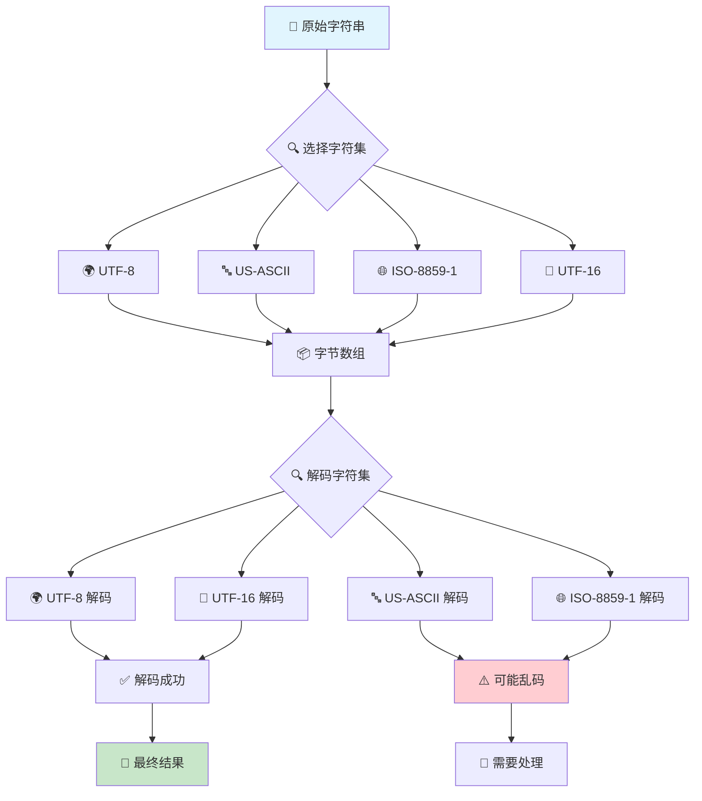
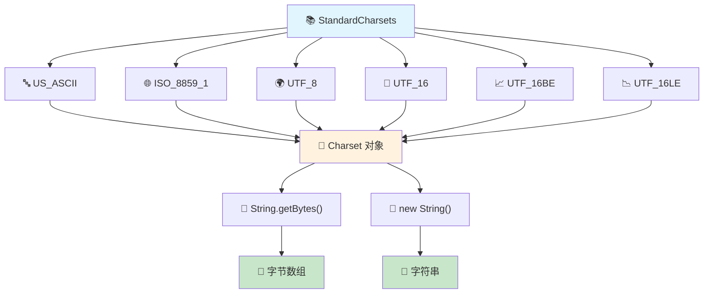

# 📝 StandardCharsets 完全指南 - 从入门到精通 Java 字符编码技术

## 📋 摘要

🚀 **掌握 Java 字符编码的核心技术！** 本指南深入解析 Java 字符编码技术，从基础概念到高级应用，涵盖性能优化、最佳实践、问题解决等核心内容，助你成为字符编码专家！

---

## 🎯 目录导航

- [📖 什么是 StandardCharsets](#什么是-standardcharsets)
- [🔧 核心字符集详解](#核心字符集详解)
- [💻 实战代码示例](#实战代码示例)
- [⚡ 性能优化技巧](#性能优化技巧)
- [🛡️ 最佳实践指南](#最佳实践指南)
- [🚨 常见问题解决](#常见问题解决)
- [📊 字符编码流程图](#字符编码流程图)
- [🎉 总结与展望](#总结与展望)

---

## 📖 什么是 StandardCharsets

### 🌟 核心概念

`StandardCharsets` 是 Java 7 引入的一个实用工具类，位于 `java.nio.charset` 包中。它提供了一组预定义的标准字符集常量，这些字符集在所有 Java 平台实现中都保证可用。

### 🎯 为什么使用 StandardCharsets？

| 优势 | 传统方式 | StandardCharsets |
|------|----------|------------------|
| **安全性** | ❌ 可能抛出 `UnsupportedCharsetException` | ✅ 保证可用，无异常风险 |
| **性能** | ❌ 每次调用 `Charset.forName()` 都有开销 | ✅ 缓存对象，性能更优 |
| **可读性** | ❌ 字符串硬编码，易出错 | ✅ 常量引用，代码清晰 |
| **维护性** | ❌ 拼写错误难以发现 | ✅ 编译时检查，IDE 支持 |

---

## 🔧 核心字符集详解

### 📚 标准字符集常量

`StandardCharsets` 类定义了以下 6 个核心字符集常量：

#### 1. 🌍 **UTF_8** - 万国码
```java
StandardCharsets.UTF_8
```
- **用途**：现代 Web 开发的标准字符集
- **特点**：变长编码，兼容 ASCII，支持所有 Unicode 字符
- **应用场景**：JSON、XML、HTTP 协议、数据库存储

#### 2. 🔤 **US_ASCII** - 美式标准
```java
StandardCharsets.US_ASCII
```
- **用途**：7 位 ASCII 字符集
- **特点**：固定 7 位编码，只支持英文字符
- **应用场景**：纯英文文本、协议头、配置文件

#### 3. 🌐 **ISO_8859_1** - 拉丁字符集
```java
StandardCharsets.ISO_8859_1
```
- **用途**：ISO 拉丁字母表第 1 部分
- **特点**：8 位编码，支持西欧字符
- **应用场景**：传统系统、邮件协议

#### 4. 🔄 **UTF_16** - 统一码 16 位
```java
StandardCharsets.UTF_16
```
- **用途**：16 位 Unicode 转换格式
- **特点**：变长编码，支持 BOM（字节顺序标记）
- **应用场景**：Windows 系统、Java 内部字符串

#### 5. 📈 **UTF_16BE** - 大端序
```java
StandardCharsets.UTF_16BE
```
- **用途**：16 位 UCS，大端字节顺序
- **特点**：高位字节在前
- **应用场景**：网络传输、跨平台数据交换

#### 6. 📉 **UTF_16LE** - 小端序
```java
StandardCharsets.UTF_16LE
```
- **用途**：16 位 UCS，小端字节顺序
- **特点**：低位字节在前
- **应用场景**：Windows 系统、x86 架构

---

## 💻 实战代码示例

### 🚀 基础用法示例

```java
import java.nio.charset.StandardCharsets;

public class StandardCharsetsDemo {
    public static void main(String[] args) {
        // 📝 原始字符串
        String originalText = "Hello, 世界！🚀";
        
        // 🔄 UTF-8 编码
        byte[] utf8Bytes = originalText.getBytes(StandardCharsets.UTF_8);
        System.out.println("UTF-8 字节数组长度: " + utf8Bytes.length);
        
        // 🔄 UTF-8 解码
        String decodedText = new String(utf8Bytes, StandardCharsets.UTF_8);
        System.out.println("解码结果: " + decodedText);
        
        // ✅ 验证一致性
        System.out.println("编码解码一致性: " + originalText.equals(decodedText));
    }
}
```

### 🌐 多字符集对比示例

```java
import java.nio.charset.StandardCharsets;

public class CharsetComparison {
    public static void main(String[] args) {
        String text = "Hello, 世界！";
        
        // 📊 不同字符集的字节长度对比
        System.out.println("原始文本: " + text);
        System.out.println("UTF-8 长度: " + text.getBytes(StandardCharsets.UTF_8).length);
        System.out.println("UTF-16 长度: " + text.getBytes(StandardCharsets.UTF_16).length);
        System.out.println("UTF-16BE 长度: " + text.getBytes(StandardCharsets.UTF_16BE).length);
        System.out.println("UTF-16LE 长度: " + text.getBytes(StandardCharsets.UTF_16LE).length);
        System.out.println("ISO-8859-1 长度: " + text.getBytes(StandardCharsets.ISO_8859_1).length);
    }
}
```

### 🔧 文件读写示例

```java
import java.io.*;
import java.nio.charset.StandardCharsets;
import java.nio.file.*;

public class FileCharsetDemo {
    public static void main(String[] args) throws IOException {
        String content = "这是 UTF-8 编码的中文内容 🎉";
        
        // 📝 写入文件
        Path filePath = Paths.get("test.txt");
        Files.write(filePath, content.getBytes(StandardCharsets.UTF_8));
        
        // 📖 读取文件
        byte[] fileBytes = Files.readAllBytes(filePath);
        String readContent = new String(fileBytes, StandardCharsets.UTF_8);
        
        System.out.println("文件内容: " + readContent);
    }
}
```

### 🌐 HTTP 请求示例

```java
import java.net.http.*;
import java.nio.charset.StandardCharsets;
import java.net.URI;

public class HttpCharsetDemo {
    public static void main(String[] args) throws Exception {
        // 🌐 创建 HTTP 客户端
        HttpClient client = HttpClient.newHttpClient();
        
        // 📤 发送 POST 请求
        String jsonData = "{\"message\": \"Hello, 世界！\"}";
        HttpRequest request = HttpRequest.newBuilder()
            .uri(URI.create("https://httpbin.org/post"))
            .header("Content-Type", "application/json; charset=UTF-8")
            .POST(HttpRequest.BodyPublishers.ofString(jsonData, StandardCharsets.UTF_8))
            .build();
        
        // 📥 发送请求并获取响应
        HttpResponse<String> response = client.send(request, 
            HttpResponse.BodyHandlers.ofString(StandardCharsets.UTF_8));
        
        System.out.println("响应状态: " + response.statusCode());
        System.out.println("响应内容: " + response.body());
    }
}
```

---

## ⚡ 性能优化技巧

### 🚀 性能对比测试

```java
import java.nio.charset.Charset;
import java.nio.charset.StandardCharsets;

public class PerformanceTest {
    private static final int ITERATIONS = 1000000;
    
    public static void main(String[] args) {
        String testString = "Performance Test String 性能测试字符串";
        
        // ⏱️ 测试 StandardCharsets 性能
        long startTime = System.nanoTime();
        for (int i = 0; i < ITERATIONS; i++) {
            byte[] bytes = testString.getBytes(StandardCharsets.UTF_8);
            String result = new String(bytes, StandardCharsets.UTF_8);
        }
        long standardCharsetsTime = System.nanoTime() - startTime;
        
        // ⏱️ 测试 Charset.forName 性能
        startTime = System.nanoTime();
        for (int i = 0; i < ITERATIONS; i++) {
            Charset charset = Charset.forName("UTF-8");
            byte[] bytes = testString.getBytes(charset);
            String result = new String(bytes, charset);
        }
        long forNameTime = System.nanoTime() - startTime;
        
        // 📊 输出性能对比
        System.out.println("StandardCharsets 耗时: " + standardCharsetsTime / 1_000_000 + " ms");
        System.out.println("Charset.forName 耗时: " + forNameTime / 1_000_000 + " ms");
        System.out.println("性能提升: " + (forNameTime / standardCharsetsTime) + " 倍");
    }
}
```

### 💡 优化建议

1. **🎯 优先使用 StandardCharsets**
   ```java
   // ✅ 推荐
   byte[] bytes = text.getBytes(StandardCharsets.UTF_8);
   
   // ❌ 不推荐
   byte[] bytes = text.getBytes(Charset.forName("UTF-8"));
   ```

2. **🔄 缓存字符集对象**
   ```java
   // ✅ 推荐 - 类级别缓存
   private static final Charset UTF8 = StandardCharsets.UTF_8;
   
   public void processText(String text) {
       byte[] bytes = text.getBytes(UTF8);
       // 处理逻辑...
   }
   ```

3. **📦 批量处理优化**
   ```java
   // ✅ 推荐 - 批量处理
   public List<String> processBatch(List<String> texts) {
       return texts.stream()
           .map(text -> new String(text.getBytes(StandardCharsets.UTF_8), StandardCharsets.UTF_8))
           .collect(Collectors.toList());
   }
   ```

---

## 🛡️ 最佳实践指南

### ✅ 推荐做法

#### 1. **🌍 Web 开发标准**
```java
// HTTP 响应设置
response.setContentType("application/json; charset=UTF-8");
response.setCharacterEncoding("UTF-8");

// JSON 处理
ObjectMapper mapper = new ObjectMapper();
mapper.configure(JsonGenerator.Feature.ESCAPE_NON_ASCII, true);
```

#### 2. **💾 数据库连接配置**
```java
// Spring Boot 配置
spring:
  datasource:
    url: jdbc:postgresql://localhost:5432/mydb?useUnicode=true&characterEncoding=UTF-8
    username: user
    password: password
```

#### 3. **📁 文件处理规范**
```java
// 文件读写
public void writeFile(String content, Path path) throws IOException {
    Files.write(path, content.getBytes(StandardCharsets.UTF_8));
}

public String readFile(Path path) throws IOException {
    byte[] bytes = Files.readAllBytes(path);
    return new String(bytes, StandardCharsets.UTF_8);
}
```

### ❌ 避免的陷阱

#### 1. **🚨 字符集不匹配**
```java
// ❌ 错误示例
String text = "Hello, 世界！";
byte[] bytes = text.getBytes(StandardCharsets.ISO_8859_1); // 会丢失中文字符
String result = new String(bytes, StandardCharsets.UTF_8); // 乱码

// ✅ 正确做法
byte[] bytes = text.getBytes(StandardCharsets.UTF_8);
String result = new String(bytes, StandardCharsets.UTF_8);
```

#### 2. **🔄 编码解码不一致**
```java
// ❌ 错误示例
byte[] bytes = text.getBytes(StandardCharsets.UTF_8);
String result = new String(bytes, StandardCharsets.ISO_8859_1); // 乱码

// ✅ 正确做法
byte[] bytes = text.getBytes(StandardCharsets.UTF_8);
String result = new String(bytes, StandardCharsets.UTF_8);
```

---

## 🚨 常见问题解决

### ❓ 问题 1：中文乱码问题

**🔍 问题描述**：处理中文文本时出现乱码

**💡 解决方案**：
```java
// 🎯 确保使用 UTF-8 编码
public class ChineseTextHandler {
    public static String processChineseText(String input) {
        try {
            // 确保输入是 UTF-8 编码
            byte[] bytes = input.getBytes(StandardCharsets.UTF_8);
            return new String(bytes, StandardCharsets.UTF_8);
        } catch (Exception e) {
            throw new RuntimeException("字符编码处理失败", e);
        }
    }
}
```

### ❓ 问题 2：文件编码不一致

**🔍 问题描述**：读取文件时出现编码问题

**💡 解决方案**：
```java
// 🎯 自动检测文件编码
public class FileEncodingDetector {
    public static String readFileWithAutoDetection(Path filePath) throws IOException {
        byte[] bytes = Files.readAllBytes(filePath);
        
        // 尝试 UTF-8 编码
        try {
            return new String(bytes, StandardCharsets.UTF_8);
        } catch (Exception e) {
            // 回退到系统默认编码
            return new String(bytes, Charset.defaultCharset());
        }
    }
}
```

### ❓ 问题 3：网络传输编码问题

**🔍 问题描述**：HTTP 请求响应中的编码问题

**💡 解决方案**：
```java
// 🎯 HTTP 客户端编码处理
public class HttpEncodingHandler {
    public static String sendRequest(String url, String data) throws Exception {
        HttpClient client = HttpClient.newHttpClient();
        
        HttpRequest request = HttpRequest.newBuilder()
            .uri(URI.create(url))
            .header("Content-Type", "application/json; charset=UTF-8")
            .header("Accept-Charset", "UTF-8")
            .POST(HttpRequest.BodyPublishers.ofString(data, StandardCharsets.UTF_8))
            .build();
        
        HttpResponse<String> response = client.send(request,
            HttpResponse.BodyHandlers.ofString(StandardCharsets.UTF_8));
        
        return response.body();
    }
}
```

---

## 📊 字符编码流程图

### 🔄 字符编码转换流程



### 🏗️ StandardCharsets 架构图



---

## 🎉 总结与展望

### 🌟 核心要点回顾

通过本指南的学习，你已经掌握了：

- ✅ **StandardCharsets 的核心概念**：Java 7 引入的标准字符集工具类
- ✅ **6 大字符集常量**：UTF-8、US-ASCII、ISO-8859-1、UTF-16 系列
- ✅ **实战编码技能**：文件处理、HTTP 通信、数据库操作
- ✅ **性能优化技巧**：缓存策略、批量处理、性能对比
- ✅ **最佳实践规范**：Web 开发、文件处理、错误处理
- ✅ **问题解决方案**：乱码处理、编码检测、网络传输

### 🚀 未来发展方向

随着 Java 技术的不断发展，字符编码技术也在持续演进：

- **🌐 Unicode 支持增强**：Java 17+ 对 Unicode 13.0+ 的完整支持
- **⚡ 性能持续优化**：JVM 对字符编码的底层优化
- **🔧 工具链完善**：更多 IDE 和构建工具对字符编码的支持
- **🌍 国际化趋势**：多语言、多文化应用的字符编码需求

### 💪 开发者激励

🎯 **亲爱的开发者，字符编码是现代软件开发的基础技能！** 掌握 StandardCharsets 不仅能让你的代码更加健壮和高效，更能让你在全球化应用开发中游刃有余。

🌟 **记住**：每一个字符的背后都有其独特的编码故事，每一次正确的编码处理都是对用户体验的精心呵护。继续深入学习，让字符编码成为你技术栈中的利器！

🚀 **加油！** 在 Java 的世界里，让 StandardCharsets 为你的应用保驾护航，创造更加美好的数字化体验！

---

**📅 文档创建时间**：2025 年 10 月 7 日  
**👨‍💻 作者**：厦门工学院人工智能创作坊 -- 郑恩赐
