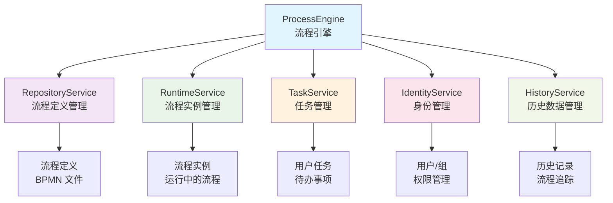
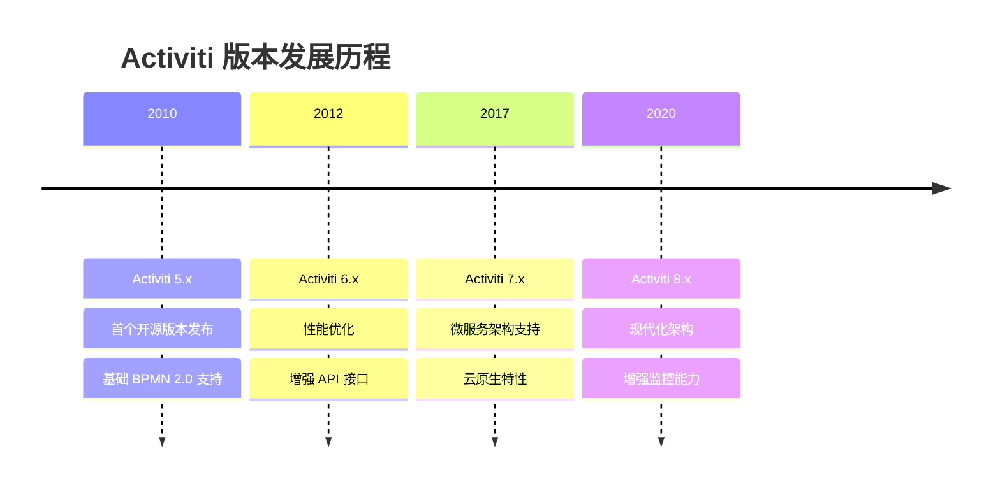

# Activiti 工作流引擎简要介绍 - 让业务流程自动化变得简单高效

## 📋 摘要

Activiti 是强大的开源工作流引擎（workflow engine），基于 Java 开发，遵循 BPMN 2.0 标准。让复杂业务流程可视化、可管理，实现自动化，提升效率。无论是审批、订单处理还是项目管理，都能让业务逻辑清晰可控。

## 🎯 什么是 Activiti？

Activiti 是由 Alfresco 公司于 2010 年发布的开源业务流程管理（BPM - Business Process Management）框架。它就像一个**智能的流程管家**，能够帮助企业将复杂的业务流程数字化、自动化。

### 🔍 核心特点

- **轻量级设计**：可以轻松嵌入到任何 Java 应用程序中
- **BPMN 2.0 标准**：完全遵循国际标准，确保流程设计的规范性
- **图形化设计**：通过拖拽方式设计流程，无需编写复杂代码
- **丰富的 API**：提供完整的编程接口，支持二次开发

## 🏗️ Activiti 核心架构



## 🛠️ 主要组件详解

### 1. **ProcessEngine（流程引擎）**
- **作用**：Activiti 的核心组件，负责管理整个流程生命周期
- **比喻**：就像汽车的发动机，驱动整个流程系统运转

### 2. **RepositoryService（仓库服务）**
- **功能**：管理流程定义（process definition）的部署和存储
- **操作**：部署 BPMN 文件、查询流程定义、删除流程等

### 3. **RuntimeService（运行时服务）**
- **功能**：管理流程实例（process instance）的启动和运行
- **操作**：启动流程、暂停流程、查询运行状态等

### 4. **TaskService（任务服务）**
- **功能**：管理用户任务（user task）的分配和完成
- **操作**：查询待办任务、分配任务、完成任务等

### 5. **IdentityService（身份服务）**
- **功能**：管理用户（user）和组（group）信息
- **操作**：用户认证、权限管理、组织架构维护

### 6. **HistoryService（历史服务）**
- **功能**：查询历史流程数据和统计信息
- **操作**：流程历史查询、性能分析、审计追踪

## 💡 典型应用场景

### 📝 办公审批流程
- **请假申请**：员工提交 → 部门经理审批 → HR 备案
- **采购申请**：需求申请 → 预算审核 → 采购执行 → 验收确认

### 🛒 电商订单处理
- **订单流程**：下单 → 支付 → 发货 → 收货 → 评价
- **售后流程**：申请退款 → 审核 → 处理 → 完成

### 🏢 项目管理
- **项目立项**：需求分析 → 可行性评估 → 资源分配 → 项目启动
- **变更管理**：变更申请 → 影响评估 → 审批 → 实施

## 🚀 快速入门示例

### 基础流程定义（BPMN 2.0）

```xml
<?xml version="1.0" encoding="UTF-8"?>
<definitions xmlns="http://www.omg.org/spec/BPMN/20100524/MODEL">
  <process id="simpleApproval" name="简单审批流程">
    
    <!-- 开始事件 -->
    <startEvent id="start" name="开始"/>
    
    <!-- 用户任务 -->
    <userTask id="apply" name="提交申请" 
              assignee="${applicant}"/>
    
    <userTask id="approve" name="审批" 
              assignee="${manager}"/>
    
    <!-- 结束事件 -->
    <endEvent id="end" name="结束"/>
    
    <!-- 流程连线 -->
    <sequenceFlow sourceRef="start" targetRef="apply"/>
    <sequenceFlow sourceRef="apply" targetRef="approve"/>
    <sequenceFlow sourceRef="approve" targetRef="end"/>
    
  </process>
</definitions>
```

### Java 代码示例

```java
// 1. 获取流程引擎
ProcessEngine processEngine = ProcessEngines.getDefaultProcessEngine();

// 2. 部署流程定义
RepositoryService repositoryService = processEngine.getRepositoryService();
Deployment deployment = repositoryService.createDeployment()
    .addClasspathResource("simple-approval.bpmn20.xml")
    .deploy();

// 3. 启动流程实例
RuntimeService runtimeService = processEngine.getRuntimeService();
ProcessInstance processInstance = runtimeService.startProcessInstanceByKey("simpleApproval");

// 4. 查询并完成任务
TaskService taskService = processEngine.getTaskService();
List<Task> tasks = taskService.createTaskQuery()
    .taskAssignee("张三")
    .list();

for (Task task : tasks) {
    // 完成任务
    taskService.complete(task.getId());
}
```

## 🎨 Activiti 的优势

### ✅ **开发效率高**
- 图形化设计界面，降低学习成本
- 丰富的 API 接口，支持快速集成

### ✅ **标准化程度高**
- 遵循 BPMN 2.0 国际标准
- 确保流程设计的规范性和可移植性

### ✅ **扩展性强**
- 支持自定义监听器（listener）
- 提供事件机制，支持业务扩展

### ✅ **监控能力强**
- 实时流程监控
- 详细的历史数据追踪

## 🔧 技术栈支持

### **数据库支持**
- MySQL、Oracle、PostgreSQL
- SQL Server、DB2、H2（测试环境）

### **集成框架**
- Spring Boot、Spring Framework
- JPA、MyBatis 等持久化框架

### **部署方式**
- 独立部署
- 嵌入式集成
- 微服务架构

## 📊 版本发展历程



## 🎯 总结

Activiti 作为一款成熟的开源工作流引擎，为企业提供了完整的业务流程管理解决方案。它通过**可视化设计**、**标准化流程**、**丰富 API** 等特性，让复杂的业务流程变得简单可控。

无论是初创公司还是大型企业，Activiti 都能帮助您：
- 🚀 **提升效率**：自动化业务流程，减少人工干预
- 📈 **规范管理**：标准化流程设计，确保执行一致性  
- 🔍 **增强监控**：实时追踪流程状态，优化业务表现
- 💰 **降低成本**：减少重复工作，提高资源利用率

**开始您的 Activiti 之旅吧！** 让业务流程自动化成为您企业数字化转型的强大助力！

---

**厦门工学院人工智能创作坊 -- 郑恩赐**  
**2025 年 10 月 8 日**
