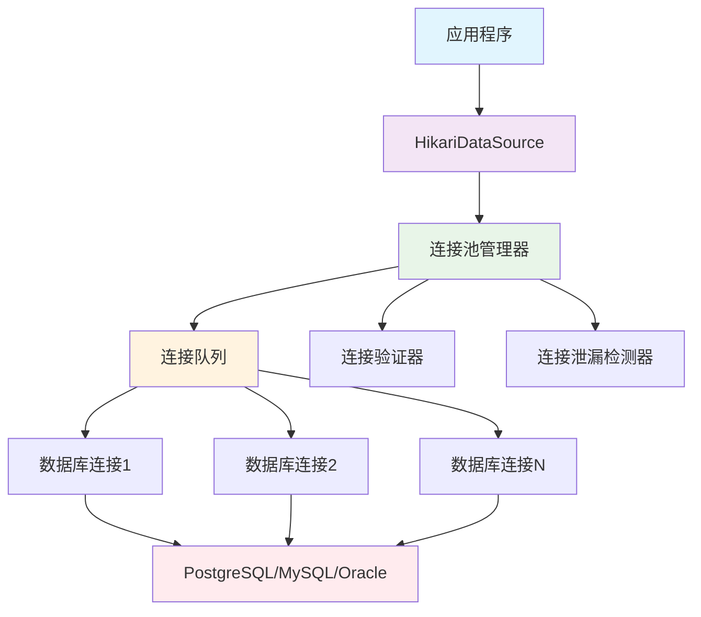

# 🚀 HikariCP 连接池完全指南：让数据库连接飞起来！

## 📋 摘要

HikariCP 是当今 Java 生态中最快、最轻量的数据库连接池，其名称源自日语"光"，寓意着极致的性能与速度。作为 Spring Boot 2.0+ 的默认连接池，HikariCP 通过精心优化的代码路径、零开销的字节码生成技术，以及智能的连接管理策略，为现代 Java 应用提供了卓越的数据库连接性能。本指南将带你深入了解 HikariCP 的核心原理、配置技巧、性能优化策略，以及在实际项目中的最佳实践，让你轻松掌握这个"光速"连接池的精髓！

---

## 🌟 什么是 HikariCP？

HikariCP 是一个高性能的 JDBC 连接池，由 Brett Wooldridge 开发。它以其卓越的性能、轻量级设计和简单易用的特性而闻名于 Java 开发社区。

### 🎯 核心特点

- **⚡ 极致性能**：通过字节码优化和零开销设计，提供业界领先的连接池性能
- **📦 轻量级**：仅 130KB 的库大小，对应用体积影响极小
- **🛡️ 高可靠性**：内置连接泄漏检测、故障恢复等机制
- **🔧 易于配置**：丰富的配置选项，满足各种应用场景需求
- **📊 完善监控**：支持 JMX 监控和详细的性能指标

---

## 🏗️ HikariCP 架构原理

### 连接池工作原理

HikariCP 采用先进的设计理念，通过以下核心组件实现高性能连接管理：



### 🔍 核心优化技术

1. **字节码优化**：使用 Javassist 在运行时生成优化的代理类
2. **无锁设计**：减少锁竞争，提高并发性能
3. **智能连接管理**：动态调整连接池大小，优化资源利用
4. **快速路径优化**：优化常见操作的代码路径

---

## ⚙️ 详细配置指南

### 基础配置参数

| 参数名称 | 默认值 | 说明 | 推荐值 |
|---------|--------|------|--------|
| `maximumPoolSize` | 10 | 连接池最大连接数 | 根据 CPU 核心数 × 2 |
| `minimumIdle` | 与 maximumPoolSize 相同 | 最小空闲连接数 | 2-5 |
| `connectionTimeout` | 30000ms | 获取连接超时时间 | 30000ms |
| `idleTimeout` | 600000ms | 空闲连接超时时间 | 600000ms |
| `maxLifetime` | 1800000ms | 连接最大生命周期 | 1800000ms |
| `autoCommit` | true | 自动提交事务 | true |

### 🚀 高级配置参数

```properties
# 性能优化配置
spring.datasource.hikari.connection-timeout=30000
spring.datasource.hikari.maximum-pool-size=20
spring.datasource.hikari.minimum-idle=5
spring.datasource.hikari.idle-timeout=600000
spring.datasource.hikari.max-lifetime=1800000
spring.datasource.hikari.auto-commit=true

# 连接验证配置
spring.datasource.hikari.connection-test-query=SELECT 1
spring.datasource.hikari.validation-timeout=5000
spring.datasource.hikari.leak-detection-threshold=60000

# 性能调优配置
spring.datasource.hikari.pool-name=MyHikariCP
spring.datasource.hikari.register-mbeans=true
spring.datasource.hikari.allow-pool-suspension=false
```

### 🔧 Java 代码配置

```java
@Configuration
public class HikariCPConfig {
    
    @Bean
    @ConfigurationProperties("spring.datasource.hikari")
    public HikariConfig hikariConfig() {
        return new HikariConfig();
    }
    
    @Bean
    public HikariDataSource dataSource(HikariConfig config) {
        return new HikariDataSource(config);
    }
}
```

---

## 🎯 Spring Boot 集成实践

### 1. 添加依赖

```xml
<dependency>
    <groupId>org.springframework.boot</groupId>
    <artifactId>spring-boot-starter-data-jpa</artifactId>
</dependency>
<dependency>
    <groupId>org.postgresql</groupId>
    <artifactId>postgresql</artifactId>
    <scope>runtime</scope>
</dependency>
```

### 2. 配置文件设置

```yaml
spring:
  datasource:
    url: jdbc:postgresql://localhost:5432/mydatabase
    username: myuser
    password: mypassword
    driver-class-name: org.postgresql.Driver
    hikari:
      maximum-pool-size: 20
      minimum-idle: 5
      connection-timeout: 30000
      idle-timeout: 600000
      max-lifetime: 1800000
      auto-commit: true
      pool-name: MyHikariCP
      leak-detection-threshold: 60000
```

### 3. 自定义配置类

```java
@Configuration
@EnableConfigurationProperties
public class DatabaseConfig {
    
    @Bean
    @Primary
    @ConfigurationProperties("spring.datasource.hikari")
    public HikariConfig hikariConfig() {
        HikariConfig config = new HikariConfig();
        config.setPoolName("MyHikariCP");
        config.setRegisterMbeans(true);
        config.setLeakDetectionThreshold(60000);
        return config;
    }
    
    @Bean
    @Primary
    public DataSource dataSource(HikariConfig hikariConfig) {
        return new HikariDataSource(hikariConfig);
    }
}
```

---

## 📊 性能监控与调优

### JMX 监控配置

```java
@Component
public class HikariCPMonitor {
    
    @Autowired
    private HikariDataSource dataSource;
    
    @PostConstruct
    public void setupMonitoring() {
        HikariPoolMXBean poolBean = dataSource.getHikariPoolMXBean();
        
        // 定期输出连接池状态
        ScheduledExecutorService scheduler = Executors.newScheduledThreadPool(1);
        scheduler.scheduleAtFixedRate(() -> {
            System.out.println("活跃连接数: " + poolBean.getActiveConnections());
            System.out.println("空闲连接数: " + poolBean.getIdleConnections());
            System.out.println("总连接数: " + poolBean.getTotalConnections());
            System.out.println("等待线程数: " + poolBean.getThreadsAwaitingConnection());
        }, 0, 30, TimeUnit.SECONDS);
    }
}
```

### 📈 性能指标监控

```java
@RestController
@RequestMapping("/api/monitor")
public class DatabaseMonitorController {
    
    @Autowired
    private HikariDataSource dataSource;
    
    @GetMapping("/hikari")
    public Map<String, Object> getHikariMetrics() {
        HikariPoolMXBean poolBean = dataSource.getHikariPoolMXBean();
        
        Map<String, Object> metrics = new HashMap<>();
        metrics.put("activeConnections", poolBean.getActiveConnections());
        metrics.put("idleConnections", poolBean.getIdleConnections());
        metrics.put("totalConnections", poolBean.getTotalConnections());
        metrics.put("threadsAwaitingConnection", poolBean.getThreadsAwaitingConnection());
        metrics.put("maxPoolSize", dataSource.getMaximumPoolSize());
        metrics.put("minIdle", dataSource.getMinimumIdle());
        
        return metrics;
    }
}
```

---

## 🚀 性能优化最佳实践

### 1. 连接池大小调优

```java
// 根据应用特性调整连接池大小
public class ConnectionPoolOptimizer {
    
    public static int calculateOptimalPoolSize() {
        // CPU 密集型应用：CPU 核心数 × 2
        int cpuCores = Runtime.getRuntime().availableProcessors();
        int optimalSize = cpuCores * 2;
        
        // 数据库密集型应用：CPU 核心数 × 4-8
        // int optimalSize = cpuCores * 6;
        
        return Math.max(optimalSize, 10); // 最小 10 个连接
    }
}
```

### 2. 连接泄漏检测

```properties
# 启用连接泄漏检测（生产环境建议 60 秒）
spring.datasource.hikari.leak-detection-threshold=60000

# 连接验证查询
spring.datasource.hikari.connection-test-query=SELECT 1
spring.datasource.hikari.validation-timeout=5000
```

### 3. 事务管理优化

```java
@Service
@Transactional
public class OptimizedService {
    
    @Autowired
    private UserRepository userRepository;
    
    // 使用只读事务减少连接占用时间
    @Transactional(readOnly = true)
    public List<User> findAllUsers() {
        return userRepository.findAll();
    }
    
    // 批量操作减少数据库往返次数
    @Transactional
    public void batchInsertUsers(List<User> users) {
        userRepository.saveAll(users);
    }
}
```

---

## 🔧 故障排查与问题解决

### 常见问题及解决方案

#### 1. 连接超时问题

```properties
# 增加连接超时时间
spring.datasource.hikari.connection-timeout=60000

# 检查数据库连接数限制
# 检查网络延迟
# 检查数据库性能
```

#### 2. 连接泄漏问题

```java
// 确保正确关闭资源
@Service
public class ResourceManagementService {
    
    @Autowired
    private JdbcTemplate jdbcTemplate;
    
    public void processData() {
        // 使用 try-with-resources 确保连接正确关闭
        try (Connection conn = jdbcTemplate.getDataSource().getConnection()) {
            // 处理数据
        } catch (SQLException e) {
            log.error("数据库操作失败", e);
        }
    }
}
```

#### 3. 性能问题诊断

```java
@Component
public class PerformanceDiagnostic {
    
    @EventListener
    public void handleConnectionPoolEvent(HikariPoolMXBean poolBean) {
        if (poolBean.getThreadsAwaitingConnection() > 0) {
            log.warn("检测到连接池等待线程: {}", poolBean.getThreadsAwaitingConnection());
            // 可能需要增加连接池大小
        }
    }
}
```

---

## 🎨 实际项目案例

### 电商系统连接池配置

```yaml
# 电商系统高并发场景配置
spring:
  datasource:
    hikari:
      maximum-pool-size: 50
      minimum-idle: 10
      connection-timeout: 20000
      idle-timeout: 300000
      max-lifetime: 1200000
      leak-detection-threshold: 30000
      pool-name: EcommerceHikariCP
      register-mbeans: true
      allow-pool-suspension: false
      connection-test-query: SELECT 1
      validation-timeout: 3000
```

### 微服务架构配置

```java
@Configuration
public class MicroserviceDatabaseConfig {
    
    @Bean
    @Primary
    public DataSource primaryDataSource() {
        HikariConfig config = new HikariConfig();
        config.setJdbcUrl("jdbc:postgresql://primary-db:5432/mydb");
        config.setUsername("primary_user");
        config.setPassword("primary_pass");
        config.setMaximumPoolSize(20);
        config.setMinimumIdle(5);
        config.setPoolName("PrimaryHikariCP");
        return new HikariDataSource(config);
    }
    
    @Bean
    @Qualifier("readOnlyDataSource")
    public DataSource readOnlyDataSource() {
        HikariConfig config = new HikariConfig();
        config.setJdbcUrl("jdbc:postgresql://readonly-db:5432/mydb");
        config.setUsername("readonly_user");
        config.setPassword("readonly_pass");
        config.setMaximumPoolSize(10);
        config.setMinimumIdle(2);
        config.setPoolName("ReadOnlyHikariCP");
        return new HikariDataSource(config);
    }
}
```

---

## 📚 进阶主题

### 1. 自定义连接池配置

```java
@Configuration
public class CustomHikariCPConfig {
    
    @Bean
    public HikariDataSource customDataSource() {
        HikariConfig config = new HikariConfig();
        
        // 基础配置
        config.setJdbcUrl("jdbc:postgresql://localhost:5432/mydb");
        config.setUsername("user");
        config.setPassword("password");
        
        // 性能优化配置
        config.setMaximumPoolSize(30);
        config.setMinimumIdle(5);
        config.setConnectionTimeout(30000);
        config.setIdleTimeout(600000);
        config.setMaxLifetime(1800000);
        
        // 高级配置
        config.setPoolName("CustomHikariCP");
        config.setRegisterMbeans(true);
        config.setLeakDetectionThreshold(60000);
        config.setConnectionTestQuery("SELECT 1");
        config.setValidationTimeout(5000);
        
        // 连接初始化配置
        config.addDataSourceProperty("cachePrepStmts", "true");
        config.addDataSourceProperty("prepStmtCacheSize", "250");
        config.addDataSourceProperty("prepStmtCacheSqlLimit", "2048");
        
        return new HikariDataSource(config);
    }
}
```

### 2. 多数据源配置

```java
@Configuration
@EnableTransactionManagement
public class MultiDataSourceConfig {
    
    @Bean
    @Primary
    @ConfigurationProperties("app.datasource.primary")
    public DataSource primaryDataSource() {
        return DataSourceBuilder.create().type(HikariDataSource.class).build();
    }
    
    @Bean
    @ConfigurationProperties("app.datasource.secondary")
    public DataSource secondaryDataSource() {
        return DataSourceBuilder.create().type(HikariDataSource.class).build();
    }
    
    @Bean
    @Primary
    public PlatformTransactionManager primaryTransactionManager() {
        return new DataSourceTransactionManager(primaryDataSource());
    }
    
    @Bean
    public PlatformTransactionManager secondaryTransactionManager() {
        return new DataSourceTransactionManager(secondaryDataSource());
    }
}
```

---

## 🎯 总结

HikariCP 作为现代 Java 应用的首选连接池，以其卓越的性能、简洁的配置和强大的功能，为开发者提供了完美的数据库连接管理解决方案。通过本指南的学习，你已经掌握了：

- ✨ HikariCP 的核心原理和架构设计
- ⚙️ 详细的配置参数和最佳实践
- 🚀 性能优化和监控技巧
- 🔧 故障排查和问题解决方法
- 🎨 实际项目中的应用案例

现在，你已经具备了使用 HikariCP 构建高性能 Java 应用的完整技能！无论是微服务架构、高并发系统，还是企业级应用，HikariCP 都能为你的项目提供稳定、高效的数据库连接管理。

**🚀 让我们一起用 HikariCP 的"光速"性能，点亮你的 Java 应用之路！每一个连接都是性能的体现，每一次优化都是技术的升华！**

---

*厦门工学院人工智能创作坊 -- 郑恩赐*  
*2025 年 10 月 7 日*
