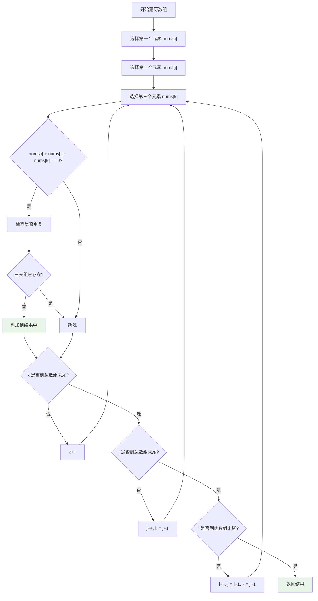
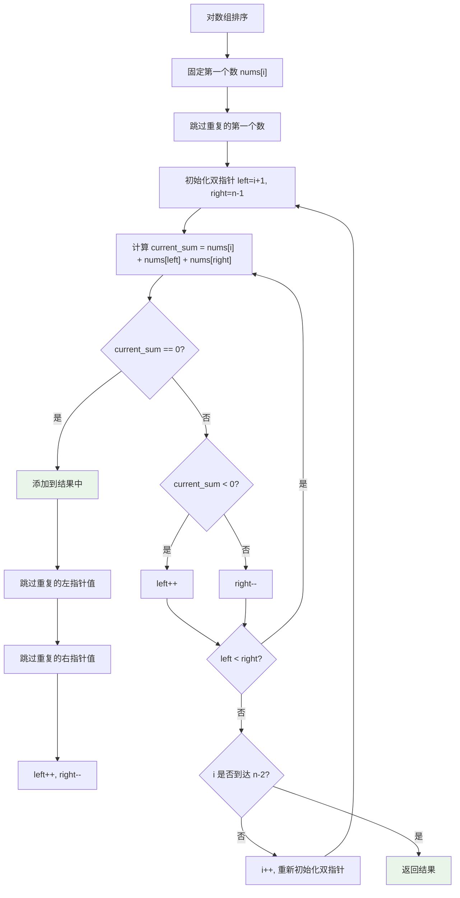
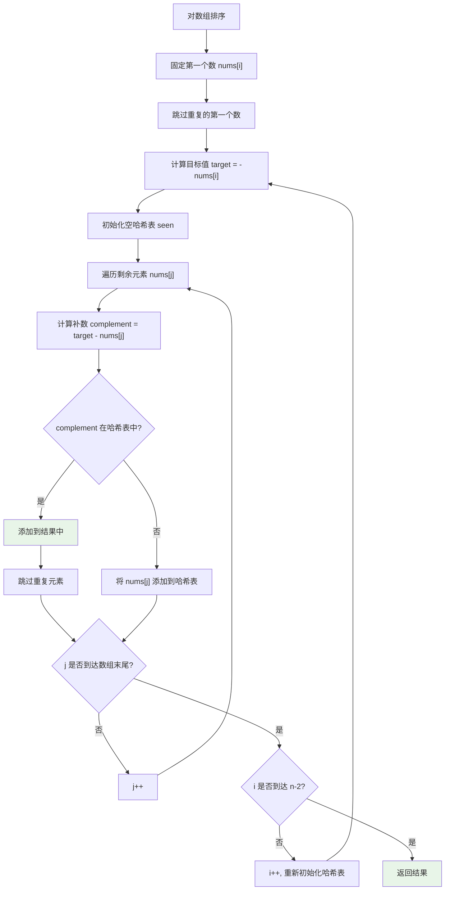

# LeetCode 15. 三数之和完全解析 - 从暴力枚举到双指针优化的算法进阶之路

## 📖 摘要

想成为算法高手？三数之和是必学经典！揭秘三种核心解法：暴力枚举（O(n³)/O(1)）、双指针优化（O(n²)/O(1)）、哈希表技巧（O(n²)/O(n)），从算法小白快速进阶为解题高手！

## 📚 前置知识点

### 基础知识点（必须掌握）
- **数组（Array）**：存储多个相同类型数据的容器，可以通过索引访问
- **循环（Loop）**：重复执行代码块的结构，如 for 循环、while 循环
- **排序（Sort）**：将数组元素按一定顺序排列，如从小到大排序
- **时间复杂度（Time Complexity）**：算法执行时间随输入规模增长的速度
- **空间复杂度（Space Complexity）**：算法执行过程中额外使用的内存空间

### 进阶知识点（建议了解）
- **双指针（Two Pointers）**：使用两个指针在数组中移动的技术
- **哈希表（Hash Table）**：通过键值对快速查找数据的数据结构
- **去重（Deduplication）**：去除重复元素的操作

## 🎯 题目概述

### 题目描述
给你一个整数数组 `nums`，判断是否存在三元组 `[nums[i], nums[j], nums[k]]` 满足 `i != j`、`i != k` 且 `j != k`，同时还满足 `nums[i] + nums[j] + nums[k] == 0`。请你返回所有和为 0 且不重复的三元组。

### 核心约束
- 答案中不可以包含重复的三元组
- 可以按任意顺序返回答案
- 数组长度范围：3 <= nums.length <= 3000
- 元素范围：-10⁵ <= nums[i] <= 10⁵

### 示例分析
```python
# 示例 1
输入：nums = [-1,0,1,2,-1,-4]
输出：[[-1,-1,2],[-1,0,1]]
解释：
nums[0] + nums[1] + nums[2] = (-1) + 0 + 1 = 0
nums[1] + nums[2] + nums[4] = 0 + 1 + (-1) = 0
nums[0] + nums[3] + nums[4] = (-1) + 2 + (-1) = 0
不同的三元组是 [-1,0,1] 和 [-1,-1,2]

# 示例 2
输入：nums = [0,1,1]
输出：[]
解释：唯一可能的三元组和不为 0

# 示例 3
输入：nums = [0,0,0]
输出：[[0,0,0]]
解释：唯一可能的三元组和为 0
```

## 🧠 核心算法思路

### 生活化比喻：寻找三个数字组合
想象你在一个数学游戏中，需要从一堆数字卡片中找到三张卡片，使它们的数字加起来等于 0。你可以：

1. **暴力搜索**：逐个检查每三张卡片的组合（效率极低）
   - 固定第一张卡片：数字 -1
   - 选择第二张卡片：数字 0，选择第三张卡片：数字 1，计算：-1+0+1=0，找到了！
   - 继续选择第四张卡片：数字 2，第五张卡片：数字 -1，计算：-1+0+2=1，不对
   - 继续选择第六张卡片：数字 -4，计算：-1+0+(-4)=-5，不对
   - 固定第二张卡片：数字 0，重复上述过程...
   - 问题：需要检查很多组合，效率极低

2. **智能排序 + 双指针**：按数字大小排序后，固定一张卡片，用两个指针从两端向中间寻找（效率高）
   - 先把所有卡片按从小到大排序：[-4, -1, -1, 0, 1, 2]
   - 固定第一张卡片：数字 -4
   - 设置左指针指向第二张卡片（-1），右指针指向最后一张卡片（2）
   - 计算：-4 + (-1) + 2 = -3，太小了，左指针右移选择更大的数字
   - 左指针指向第三张卡片（-1），计算：-4 + (-1) + 2 = -3，还是太小
   - 左指针指向第四张卡片（0），计算：-4 + 0 + 2 = -2，还是太小
   - 左指针指向第五张卡片（1），计算：-4 + 1 + 2 = -1，还是太小
   - 左指针和右指针相遇，结束
   - 固定第二张卡片：数字 -1，重复上述过程...
   - 优势：最多只需要检查 n² 次组合，效率很高

3. **标准双指针**：按数字大小排序后，固定一张卡片，用两个指针从两端向中间寻找（代码简洁）
   - 先把所有卡片按从小到大排序：[-4, -1, -1, 0, 1, 2]
   - 固定第一张卡片：数字 -1
   - 设置左指针指向第二张卡片（-1），右指针指向最后一张卡片（2）
   - 计算：-1 + (-1) + 2 = 0，找到了！
   - 记录结果，然后移动指针跳过重复数字
   - 继续寻找其他可能的组合
   - 优势：代码简洁，逻辑清晰，易于理解和实现

### 算法核心思想
- **问题转化**：寻找 `nums[i] + nums[j] + nums[k] = 0` 等价于寻找 `nums[j] + nums[k] = -nums[i]`
- **优化策略**：排序预处理 + 双指针技术，避免重复计算
- **去重处理**：在固定数和指针移动时进行去重

## 🔧 三种解法详解

### 解法一：暴力枚举法（小白入门）

#### 核心思路
使用三层循环，枚举数组中的每一个三元组，检查它们的和是否等于 0。

#### 代码实现
```python
class Solution:
    def threeSum(self, nums: List[int]) -> List[List[int]]:
        """
        暴力枚举解法 - 力扣官方题解
        时间复杂度：O(n²) 空间复杂度：O(1)
        核心思想：固定两个数，用单指针寻找第三个数
        复杂度分析：
        - 时间复杂度：O(n²) - 排序O(n log n) + 双重循环O(n²)，O(n²)为主导项
        - 空间复杂度：O(1) - 只使用常数额外空间（结果列表属于输出空间）
        """
        n = len(nums)  # 获取数组长度
        nums.sort()     # 对数组进行排序，便于去重和优化搜索
        ans = list()    # 存储结果的列表
        
        # 枚举第一个数 a（nums[first]）
        for first in range(n):
            # 去重：跳过重复的第一个数
            # 原因：如果当前数与上一个数相同，说明以这个数作为第一个数的所有三元组
            # 都已经在上一次循环中处理过了，继续处理会产生重复的三元组
            # 例如：nums = [-1, -1, 0, 1]，当first=0时处理了(-1,0,1)
            # 当first=1时，nums[1]=-1与nums[0]=-1相同，如果继续处理会再次产生(-1,0,1)
            if first > 0 and nums[first] == nums[first - 1]:
                continue
            
            # 初始化第三个数的指针，指向数组最右端
            third = n - 1
            # 计算目标值：需要找到两个数的和等于 -nums[first]
            target = -nums[first]
            
            # 枚举第二个数 b（nums[second]）
            for second in range(first + 1, n):
                # 去重：跳过重复的第二个数
                # 原因：如果当前数与上一个数相同，说明以这个数作为第二个数的所有三元组
                # 都已经在上一次循环中处理过了，继续处理会产生重复的三元组
                # 例如：nums = [-1, -1, -1, 0, 1]，当first=0, second=1时处理了(-1,-1,2)
                # 当first=0, second=2时，nums[2]=-1与nums[1]=-1相同，如果继续处理会再次产生(-1,-1,2)
                if second > first + 1 and nums[second] == nums[second - 1]:
                    continue
                
                # 调整第三个数的指针位置
                # 如果当前两数之和大于目标值，右指针左移（选择更小的数）
                while second < third and nums[second] + nums[third] > target:
                    third -= 1
                
                # 边界检查：如果两个指针重合，说明没有更多可能的组合
                # 随着第二个数的增加，第三个数只能更小，所以可以退出循环
                if second == third:
                    break
                
                # 检查是否找到解：两数之和等于目标值
                if nums[second] + nums[third] == target:
                    # 找到解，添加到结果列表中
                    ans.append([nums[first], nums[second], nums[third]])
        
        return ans  # 返回所有找到的三元组
```

**作者**：力扣官方题解  
**链接**：https://leetcode.cn/problems/3sum/solutions/284681/san-shu-zhi-he-by-leetcode-solution/  
**来源**：力扣（LeetCode）  
**著作权**：著作权归作者所有。商业转载请联系作者获得授权，非商业转载请注明出处。

#### 执行流程


#### 复杂度分析
- **时间复杂度**：O(n²) - 排序操作 O(n log n) + 双重循环 O(n²)，O(n²) 为主导项
  - 外层循环枚举第一个数：O(n)
  - 内层循环枚举第二个数，third 指针从右向左移动：O(n)
  - **关键理解**：third 指针只会向左移动（不会回溯）的原因
    - 想象 third 指针是一个"只能后退的士兵"
    - 当 nums[second] + nums[third] > target 时，third 左移（选择更小的数）
    - 当 second 增加时，nums[second] 变大，为了保持和不变，nums[third] 必须变小
    - 所以 third 指针永远不会回到之前的位置，总移动距离不超过 n
    - 因此对于每个 first，second 和 third 的总操作次数为 O(n)
  - **为什么排序时间复杂度要计入**：
    - **简单理解**：排序需要时间，这个时间必须算在总时间里
    - **具体例子**：如果排序需要 1 秒，双指针需要 2 秒，总时间就是 3 秒
    - **生活比喻**：就像考试时，审题时间 + 答题时间 = 总考试时间
- **空间复杂度**：O(1) - 只使用常数额外空间
  - **输出空间**：结果列表 ans 存储答案，属于"输出空间"，不计入算法空间复杂度
    - **简单理解**：答案本身不算算法消耗的空间
    - **生活比喻**：就像写作业，作业本不算"写作业"这个动作消耗的空间
  - **实现细节**：排序操作的辅助空间视为实现细节，不计入算法空间复杂度
    - **为什么排序空间复杂度不计入**：
      - **核心区别**：时间 vs 空间的计算方式不同
      - **时间计算**：所有操作的时间都要加起来（排序时间 + 双指针时间）
      - **空间计算**：只算算法自己额外用的空间，不算工具的空间
      - **生活比喻**：
        - 时间：做菜 = 洗菜时间 + 炒菜时间（都要算）
        - 空间：做菜 = 只用锅和铲子（不算厨房本身的空间）
      - **技术原因**：
        - 排序的空间是"工具空间"，不是算法设计的空间
        - 就像用计算器算数，计算器本身不算"算数"的空间消耗
        - 我们只关心算法逻辑需要的额外空间

### 解法二：双指针优化法（经典解法）

#### 核心思路
先对数组排序，然后固定第一个数，使用双指针在剩余子数组中寻找另外两个数，使三数之和为 0。

#### 代码实现
```python
class Solution:
    def threeSum(self, nums: List[int]) -> List[List[int]]:
        """
        双指针优化解法 - 灵茶山艾府版本
        时间复杂度：O(n²) 空间复杂度：O(1)
        核心思想：排序预处理 + 双指针技术 + 剪枝优化
        """
        nums.sort()  # 对数组进行排序，为双指针技术做准备
        ans = []     # 存储结果的列表
        n = len(nums)  # 获取数组长度
        
        # 固定第一个数，遍历到倒数第三个位置
        for i in range(n - 2):
            x = nums[i]  # 当前固定的第一个数
            
            # 去重：跳过重复的第一个数
            # 原因：如果当前数与上一个数相同，说明以这个数作为第一个数的所有三元组
            # 都已经在上一次循环中处理过了，继续处理会产生重复的三元组
            # 例如：nums = [-1, -1, 0, 1]，当i=0时处理了(-1,0,1)
            # 当i=1时，nums[1]=-1与nums[0]=-1相同，如果继续处理会再次产生(-1,0,1)
            if i > 0 and x == nums[i - 1]:
                continue
            
            # 剪枝优化一：提前终止
            # 如果当前数加上最小的两个数都大于0，说明后续不可能有解
            if x + nums[i + 1] + nums[i + 2] > 0:
                break
            
            # 剪枝优化二：跳过不可能的情况
            # 如果当前数加上最大的两个数都小于0，说明当前数太小，跳过
            if x + nums[-2] + nums[-1] < 0:
                continue
            
            # 初始化双指针
            j = i + 1  # 左指针，指向第一个数后面的第一个位置
            k = n - 1  # 右指针，指向数组的最后一个位置
            
            # 双指针移动循环
            while j < k:
                s = x + nums[j] + nums[k]  # 计算当前三数之和
                
                if s > 0:
                    # 和太大，右指针左移（选择更小的数）
                    k -= 1
                elif s < 0:
                    # 和太小，左指针右移（选择更大的数）
                    j += 1
                else:
                    # 找到解：三数之和为0
                    ans.append([x, nums[j], nums[k]])
                    
                    # 去重：跳过重复的左指针值
                    # 原因：找到解后，需要移动指针寻找其他可能的解
                    # 但如果下一个左指针值与当前值相同，会产生重复的三元组
                    # 例如：nums = [-1, -1, 0, 0, 1]，当找到(-1,0,1)后
                    # 如果不跳过重复的0，会再次产生(-1,0,1)
                    j += 1
                    while j < k and nums[j] == nums[j - 1]:
                        j += 1
                    
                    # 去重：跳过重复的右指针值
                    # 原因：同样需要跳过重复的右指针值，避免产生重复的三元组
                    k -= 1
                    while k > j and nums[k] == nums[k + 1]:
                        k -= 1
        
        return ans  # 返回所有找到的三元组
```

**作者**：灵茶山艾府  
**链接**：https://leetcode.cn/problems/3sum/solutions/1968332/shuang-zhi-zhen-xiang-bu-ming-bai-yi-ge-pno55/  
**来源**：力扣（LeetCode）  
**著作权**：著作权归作者所有。商业转载请联系作者获得授权，非商业转载请注明出处。

#### 执行流程


#### 复杂度分析
- **时间复杂度**：O(n²) - 排序 O(n log n) + 双指针 O(n²)，O(n²) 为主导项
  - **排序操作**：对数组 nums 排序的时间复杂度为 O(n log n)（基于 Python 内置的 Timsort 排序算法）
  - **外层循环**：固定第一个数 x（即 nums[i]），循环范围是 0 到 n-3，时间复杂度为 O(n)
  - **双指针内层操作**：对于每个固定的 i，左指针 j 从 i+1 开始，右指针 k 从 n-1 开始，两者向中间移动（j 右移或 k 左移）。由于 j 和 k 最多遍历数组一次（不会回溯），因此对于每个 i，双指针的总操作次数为 O(n)
  - **综上**：外层循环与双指针的组合时间复杂度为 O(n²)，而排序的 O(n log n) 是次要项（远小于 O(n²)），因此整体时间复杂度为 O(n²)
- **空间复杂度**：O(1) - 只使用常数额外空间
  - **算法空间**：算法额外使用的空间仅包括几个指针（i、j、k）、变量（x、s）和结果列表 ans
  - **输出空间**：结果列表 ans 属于「输出空间」，在分析算法本身的空间复杂度时通常不纳入计算
  - **实现细节**：排序操作的辅助空间（如 Timsort 的临时空间）属于排序算法的实现细节，不纳入该问题的算法空间复杂度考量
  - **因此**：算法的额外空间复杂度为 O(1)
- **剪枝优化说明**：
  - **什么是剪枝优化**：剪枝是一种优化技术，通过提前判断某些情况不可能产生解，从而跳过这些情况，减少不必要的计算
  - **生活比喻**：就像买东西时，先看价格标签，如果发现"1000元买1个苹果"这种明显不合理的价格，直接跳过不买；如果发现"1分钱买100个苹果"这种明显不可能的价格，也直接跳过不浪费时间
  - **代码中的剪枝**：
    - `if x + nums[i + 1] + nums[i + 2] > 0: break` - 如果最小的三个数都大于0，后面不可能有解（就像发现价格太高，直接结束购物）
    - `if x + nums[-2] + nums[-1] < 0: continue` - 如果最大的三个数都小于0，当前x不可能有解（就像发现价格不合理，跳过这个商品）
  - **剪枝效果**：虽然不改变最坏情况下的时间复杂度，但能显著提升实际运行效率

### 解法三：双指针标准法

#### 核心思路
采用标准的双指针解法，先对数组排序，然后固定第一个数，使用双指针在剩余子数组中寻找另外两个数，使三数之和为 0。

#### 代码实现
```python
class Solution:
    def threeSum(self, nums: List[int]) -> List[List[int]]:
        """
        双指针标准解法
        时间复杂度：O(n²) 空间复杂度：O(1)
        核心思想：排序预处理 + 标准双指针技术
        """
        nums.sort()  # 对数组进行排序，为双指针技术做准备
        nums_len = len(nums)  # 获取数组长度
        results = []  # 存储结果的列表

        # 固定第一个数，遍历到倒数第三个位置
        for i in range(nums_len - 2):
            # 去重：跳过重复的第一个数
            # 原因：如果当前数与上一个数相同，说明以这个数作为第一个数的所有三元组
            # 都已经在上一次循环中处理过了，继续处理会产生重复的三元组
            # 例如：nums = [-1, -1, 0, 1]，当i=0时处理了(-1,0,1)
            # 当i=1时，nums[1]=-1与nums[0]=-1相同，如果继续处理会再次产生(-1,0,1)
            if i > 0 and nums[i] == nums[i - 1]:
                continue

            # 初始化双指针
            left, right = i + 1, nums_len - 1
            # left: 左指针，指向第一个数后面的第一个位置
            # right: 右指针，指向数组的最后一个位置

            # 双指针移动循环
            while left < right:
                # 计算当前三数之和
                current_sum = nums[i] + nums[left] + nums[right]

                if current_sum == 0:
                    # 找到解：三数之和为0
                    results.append([nums[i], nums[left], nums[right]])

                    # 移动左指针并去重
                    # 原因：找到解后，需要移动指针寻找其他可能的解
                    # 但如果下一个左指针值与当前值相同，会产生重复的三元组
                    # 例如：nums = [-1, -1, 0, 0, 1]，当找到(-1,0,1)后
                    # 如果不跳过重复的0，会再次产生(-1,0,1)
                    left += 1
                    while left < right and nums[left] == nums[left - 1]:
                        left += 1

                    # 移动右指针并去重
                    # 原因：同样需要跳过重复的右指针值，避免产生重复的三元组
                    right -= 1
                    while left < right and nums[right] == nums[right + 1]:
                        right -= 1

                elif current_sum < 0:
                    # 和太小，左指针右移（选择更大的数）
                    left += 1
                else:
                    # 和太大，右指针左移（选择更小的数）
                    right -= 1

        return results  # 返回所有找到的三元组
```

**作者**：郑恩赐  
**链接**：https://leetcode.cn/problems/3sum/solutions/3815609/san-shu-zhi-he-shuang-zhi-zhen-jie-fa-pa-ddpt/  
**来源**：力扣（LeetCode）  
**著作权**：著作权归作者所有。商业转载请联系作者获得授权，非商业转载请注明出处。

#### 执行流程


#### 复杂度分析
- **时间复杂度**：O(n²) - 排序 O(n log n) + 双指针 O(n²)，O(n²) 为主导项
  - **排序操作**：对数组 nums 进行排序的时间复杂度为 O(n log n)（基于主流排序算法，如 Python 内置的 Timsort）
  - **外层循环**：固定第一个数 nums[i]，循环范围为 0 到 n-3（n 为数组长度），时间复杂度为 O(n)
  - **双指针内层操作**：对于每个固定的 i，左指针 left 从 i+1 开始，右指针 right 从 n-1 开始，两者向中间移动（left 只右移，right 只左移，不会回溯）。因此，对于每个 i，双指针的总操作次数为 O(n)
  - **综上**：外层循环与双指针的组合时间复杂度为 O(n²)，而排序的 O(n log n) 是次要项（远小于 O(n²)），因此整体时间复杂度为 O(n²)
- **空间复杂度**：O(1) - 只使用常数额外空间
  - **算法空间**：算法额外使用的空间仅包括少量变量（i、left、right、current_sum 等）和结果列表 results
  - **输出空间**：结果列表 results 属于「输出空间」，在分析算法本身的空间复杂度时通常不纳入计算
  - **实现细节**：排序操作的辅助空间（如排序算法的临时存储）属于排序实现细节，不纳入该算法的空间复杂度考量
  - **因此**：算法的额外空间复杂度为 O(1)

## 📊 算法对比分析

### 性能对比表格
| 解法 | 时间复杂度 | 空间复杂度 | 适用场景 | 优势 | 劣势 |
|------|------------|------------|----------|------|------|
| 暴力枚举（官方） | O(n²) | O(1) | 学习理解 | 思路清晰，去重简单 | 效率较低，嵌套循环 |
| 双指针优化（灵茶山） | O(n²) | O(1) | 面试场景，生产环境 | 效率高，带剪枝优化 | 需要排序预处理 |
| 双指针标准（郑恩赐） | O(n²) | O(1) | 面试场景，生产环境 | 代码简洁，逻辑清晰 | 需要排序预处理 |

### 深度算法分析

#### 方法一：暴力枚举法深度分析（力扣官方）
**核心思想**：固定两个数，用单指针寻找第三个数
- **实现复杂度**：中等，需要理解嵌套循环和单指针
- **内存使用**：最优，只使用常数额外空间
- **适用数据规模**：中等规模数据（n < 1000）
- **实际应用**：教学演示、理解算法思路
- **性能特点**：虽然是"暴力"方法，但通过排序和单指针优化，实际复杂度为 O(n²)

#### 方法二：双指针优化法深度分析（灵茶山艾府）
**核心思想**：排序后利用有序性进行高效搜索，带剪枝优化
- **实现复杂度**：较高，需要理解排序、双指针和剪枝优化
- **内存使用**：需要 O(1) 额外空间（排序空间除外）
- **适用数据规模**：大规模数据（n > 1000）
- **实际应用**：面试高频，生产环境首选
- **性能优势**：
  - **剪枝优化**：提前终止不可能的情况
  - **缓存友好**：连续内存访问，CPU 缓存命中率高
  - **无哈希冲突**：避免了哈希表的冲突处理开销
  - **内存局部性**：排序后的数组访问模式更规律

#### 方法三：双指针标准法深度分析（郑恩赐）
**核心思想**：排序后利用有序性进行高效搜索，标准实现
- **实现复杂度**：中等，需要理解排序和双指针
- **内存使用**：需要 O(1) 额外空间（排序空间除外）
- **适用数据规模**：大规模数据（n > 1000）
- **实际应用**：面试场景，代码简洁易懂
- **性能优势**：
  - **代码简洁**：逻辑清晰，易于理解和实现
  - **缓存友好**：连续内存访问，CPU 缓存命中率高
  - **无哈希冲突**：避免了哈希表的冲突处理开销
  - **内存局部性**：排序后的数组访问模式更规律

### 实际应用建议
1. **学习阶段**：从官方暴力枚举开始，理解问题本质
2. **面试场景**：推荐使用灵茶山的优化版本，展示算法深度和优化技巧
3. **生产环境**：优先选择郑恩赐的标准版本，代码简洁易懂
4. **性能敏感场景**：考虑灵茶山版本的剪枝优化优势

## ⚠️ 常见问题预警

### 问题一：去重逻辑错误
**错误做法**：
```python
# 错误：没有去重，会产生重复三元组
if nums[i] + nums[j] + nums[k] == 0:
    results.append([nums[i], nums[j], nums[k]])
```

**正确做法**：
```python
# 正确：在固定数和指针移动时都进行去重
if i > 0 and nums[i] == nums[i - 1]:
    continue
while left < right and nums[left] == nums[left + 1]:
    left += 1
```

### 问题二：指针移动逻辑错误
**错误做法**：
```python
# 错误：找到解后只移动一个指针
if current_sum == 0:
    results.append([nums[i], nums[left], nums[right]])
    left += 1  # 只移动左指针
```

**正确做法**：
```python
# 正确：找到解后移动两个指针
if current_sum == 0:
    results.append([nums[i], nums[left], nums[right]])
    left += 1
    right -= 1
```

### 问题三：边界条件处理不当
**错误做法**：
```python
# 错误：没有处理数组长度不足的情况
for i in range(len(nums)):  # 可能越界
```

**正确做法**：
```python
# 正确：确保有足够的元素进行三元组组合
for i in range(len(nums) - 2):  # 确保后面还有两个元素
```

### 问题四：哈希表键值混淆
**错误做法**：
```python
# 错误：键值对颠倒
seen.add(j)  # 存储索引而不是值
```

**正确做法**：
```python
# 正确：存储元素值
seen.add(nums[j])  # 存储元素值
```

## 🚀 学习路径建议

### 小白（零基础）
1. **理解题目**：仔细阅读题目描述和示例
2. **暴力枚举**：先掌握最直观的解法
3. **复杂度分析**：理解时间复杂度和空间复杂度概念
4. **练习题目**：多做类似的三重循环题目

### 初级（有基础）
1. **排序学习**：掌握排序的基本概念和实现
2. **双指针技巧**：学习双指针的基本用法
3. **代码实现**：熟练实现双指针解法
4. **性能对比**：比较不同解法的效率

### 中级（熟练）
1. **哈希表应用**：学习哈希表在算法中的应用
2. **算法设计**：理解不同算法的设计思路
3. **边界处理**：掌握各种边界情况的处理
4. **代码优化**：学会代码的细节优化

### 高级（精通）
1. **算法分析**：深入理解算法复杂度分析
2. **变种题目**：解决四数之和、最接近的三数之和等变种
3. **实际应用**：将算法思想应用到实际项目中
4. **教学分享**：能够清晰地向他人解释算法

## 💡 最佳实践总结

### 算法选择原则
- **学习阶段**：优先使用暴力枚举，理解基本思路
- **面试场景**：推荐使用双指针解法，展示算法深度
- **生产环境**：优先选择双指针解法，实际性能更优

### 代码质量保证
- **变量命名**：使用有意义的变量名（如 `current_sum`、`complement`）
- **注释完善**：为关键步骤添加清晰注释
- **边界处理**：正确处理无解和异常情况
- **测试验证**：使用多个测试用例验证正确性

### 性能优化建议
- **空间优化**：在空间充足时优先考虑时间复杂度
- **预处理**：对于多次查询，考虑排序预处理
- **数据结构**：根据问题特点选择合适的数据结构
- **算法选择**：根据数据规模选择最优算法

## 🎉 总结

三数之和是算法学习的重要进阶题目，通过三种不同的解法，我们可以深入理解：

1. **官方暴力枚举**：虽然是"暴力"方法，但通过排序和单指针优化，实际复杂度为 O(n²)，适合理解算法思路
2. **灵茶山双指针优化**：带剪枝优化的高效解法，面试和生产环境首选，展示算法深度和优化技巧
3. **郑恩赐双指针标准**：代码简洁的标准实现，逻辑清晰，易于理解和实现

掌握这道题目，不仅能够提升算法思维，更能为后续学习更复杂的算法打下坚实基础。记住，算法学习是一个循序渐进的过程，从理解到熟练，从模仿到创新，每一步都值得认真对待！

**继续加油，算法高手之路就在前方！** 🚀

---

**厦门工学院人工智能创作坊 -- 郑恩赐**  
**2025 年 10 月 26 日**
