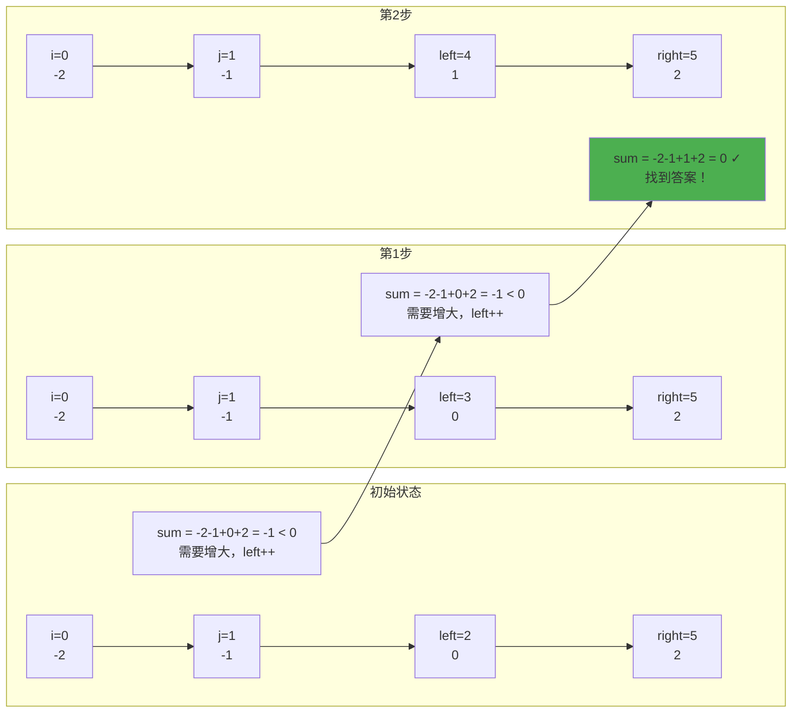
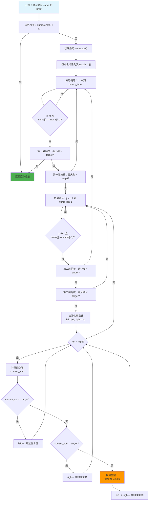

# LeetCode 18. 四数之和完全解析
## 排序 + 双指针 + 剪枝优化的 O(n³) 去重解法

**摘要**：深入解析四数之和的排序+双指针解法，通过两层剪枝优化跳过无解分支，三处去重保证结果不重复。涵盖生活化比喻、完整Python/Java双语言实现、复杂度分析、常见问题预警，适合小白到高级开发者。

---

## 📋 前置知识点

### 基础知识点（必须掌握）
- **数组排序**：将数组元素按大小排列，如 `[3,1,2]` 排序后为 `[1,2,3]`
- **双重循环**：嵌套使用两个循环，外层控制第一个数，内层控制第二个数
- **双指针技巧**：用两个指针从两端向中间移动，高效寻找目标值
- **列表添加元素**：向结果列表中添加找到的四元组

### 进阶知识点（建议了解）
- **时间复杂度**：衡量算法运行快慢的指标，如 O(n³) 表示三层循环嵌套
- **空间复杂度**：衡量算法占用内存的指标，如 O(1) 表示只占用固定内存
- **剪枝优化**：提前判断无解情况并跳过，减少不必要的计算
- **去重技巧**：在固定位置和移动指针时跳过相同值，避免重复解

---

## 🎯 题目概述

### 问题描述
给你一个由 n 个整数组成的数组 nums，和一个目标值 target。请你找出并返回满足下述全部条件且**不重复**的四元组 `[nums[a], nums[b], nums[c], nums[d]]`：
- `0 <= a, b, c, d < n`
- `a、b、c 和 d 互不相同`
- `nums[a] + nums[b] + nums[c] + nums[d] == target`

### 示例说明

**示例 1：**
- 输入：`nums = [1,0,-1,0,-2,2]`, `target = 0`
- 输出：`[[-2,-1,1,2],[-2,0,0,2],[-1,0,0,1]]`
- 解释：排序后 `[-2,-1,0,0,1,2]`，找到三个四元组，每个四元组的和都是 0

**示例 2：**
- 输入：`nums = [2,2,2,2,2]`, `target = 8`
- 输出：`[[2,2,2,2]]`
- 解释：四个 2 的和等于 8，只有一种组合

### 关键要点
1. **去重要求**：结果中的四元组必须不重复，即使元素相同但位置不同也视为重复
2. **任意顺序**：返回结果的顺序可以任意
3. **剪枝优化**：通过提前判断最小/最大可能和，跳过无解分支

---

## 💡 算法思路：生活化比喻

### 核心思想（详细说明）

想象你在商店里选择 4 件商品，要求总价正好是 target：

**第一步：排序商品（排序数组）**
把所有商品按价格从低到高排列，这样可以方便快速判断：
- 如果最便宜的 4 件商品加起来都比 target 贵，那后面的商品（位置靠后，价格更高）只会更贵，所有组合都不可能等于 target，可以直接放弃整个搜索
- 如果最贵的 4 件商品加起来都比 target 便宜，那么任何其他组合（因为包含比这 4 件更便宜的商品）总和只会更小，也不可能等于 target，可以直接放弃整个搜索

**第二步：固定前两件商品（固定 i 和 j）**
- 先选择第一件商品 i（从最便宜的开始），价格是 nums[i]
- 再选择第二件商品 j（从 i 后面的商品中选择），价格是 nums[j]
- 现在前两件商品的总价是 nums[i] + nums[j]
- 还需要找后两件商品 left 和 right，使得四件商品的总价 = target

**第三步：双指针搜索后两件商品（双指针技巧）**
由于商品已经按价格排序，我们使用双指针从剩余商品的两端开始搜索：
- left 指针指向剩余商品中最便宜的（j+1 位置）
- right 指针指向剩余商品中最贵的（末尾位置）
- 计算当前四件商品的总价：nums[i] + nums[j] + nums[left] + nums[right]
- 如果总价 < target，说明便宜的商品太少了，left 向右移动（选择更贵的商品）
- 如果总价 > target，说明贵的商品太多了，right 向左移动（选择更便宜的商品）
- 如果总价 = target，找到答案！记录这四件商品的组合

**第四步：避免重复选择（去重技巧）**

为什么需要去重？因为数组中可能有重复的商品，如果不跳过，会产生重复的四元组。

**场景 1：不去重 i 导致重复**
- 假设数组 `[2, 2, 2, 2]`，`target=8`
- 如果不去重：
  - `i=0`（第一个2）时，可能找到 `[2, 2, 2, 2]`
  - `i=1`（第二个2）时，又会找到 `[2, 2, 2, 2]`（相同的四元组！）
- 原因：虽然 i 的位置不同，但选择的商品值相同，组成的四元组相同
- 解决：如果 `nums[i] == nums[i-1]`，跳过当前 i

**场景 2：不去重 j 导致重复**
- 假设数组 `[1, 2, 2, 3, 4]`，`target=10`，已固定 `i=0`（值为1）
- 如果不去重：
  - `j=1`（第一个2）时，可能找到 `[1, 2, 3, 4]`
  - `j=2`（第二个2）时，又会找到 `[1, 2, 3, 4]`（相同的四元组！）
- 原因：在相同的 i 下，选择不同位置的相同值的 j，最终组成的四元组相同
- 解决：如果 `nums[j] == nums[j-1]`，跳过当前 j

**场景 3：不去重双指针导致重复**
- 假设数组 `[1, 2, 3, 3, 4]`，`target=10`，已固定 `i=0`（值为1），`j=1`（值为2）
- 如果不去重：
  - `left=2, right=4` 时，找到 `[1, 2, 3, 4]`（left指向第一个3）
  - `left=3, right=4` 时，又会找到 `[1, 2, 3, 4]`（left指向第二个3，相同的四元组！）
- 原因：在相同的 i 和 j 下，选择不同位置的相同值的 left 或 right，最终组成的四元组相同
- 解决：移动指针后，跳过所有与之前位置相同的值

**总结：去重的三个位置**
- 在固定第一件商品 i 时，如果当前商品和前一个商品价格相同，跳过（避免重复组合）
- 在固定第二件商品 j 时，如果当前商品和前一个商品价格相同，跳过（避免重复组合）
- 在移动 left 或 right 指针时，如果遇到相同价格的商品，也要跳过（避免重复组合）

**第五步：提前放弃无解情况（剪枝优化）**
在固定 i 和 j 后，如果：
- 最便宜的 4 件商品（包括 i 和 j）加起来都比 target 贵 → 后续只会更贵，直接放弃
- 最贵的 4 件商品（包括 i 和 j）加起来都比 target 便宜 → 后续只会更便宜，直接放弃

### 问题本质
在有序数组中，通过**固定前两个数 + 双指针寻找后两个数**的方式，找到所有不重复的四元组，使它们的和等于 target。通过排序可以利用数组的有序性进行剪枝和双指针优化，避免暴力枚举的 O(n⁴) 复杂度，降低到 O(n³)。
 برانيه<｜tool▁calls▁begin｜><｜tool▁call▁begin｜>
read_file

---

## 🚀 算法实现

### 算法思路（分点详细说明）

#### 1. 排序预处理
- **目的**：将无序数组变为有序数组，为后续的剪枝和双指针优化做准备
- **时间复杂度**：O(n log n)
- **重要性**：只有排序后，我们才能利用数组的有序性进行高效搜索

#### 2. 外层循环：固定第一个数 i
- **范围**：`i` 从 0 遍历到 `nums_len - 4`（因为至少需要 4 个数）
- **去重处理**：如果 `i > 0` 且 `nums[i] == nums[i-1]`，跳过当前 i（避免重复四元组）
- **第一层剪枝 - 最小和判断**：
  - 计算：`nums[i] + nums[i+1] + nums[i+2] + nums[i+3]`
  - 如果这个最小和 > target，说明后续 i 只会更大，所有组合都不可能等于 target，直接 `break` 退出外层循环
- **第一层剪枝 - 最大和判断**：
  - 计算：`nums[i] + nums[-1] + nums[-2] + nums[-3]`
  - 如果这个最大和 < target，说明当前 i 无论如何都不可能组成等于 target 的四元组，`continue` 跳过当前 i，继续下一个

#### 3. 内层循环：固定第二个数 j
- **范围**：`j` 从 `i+1` 遍历到 `nums_len - 3`（固定了 i 和 j，还需要 2 个数）
- **去重处理**：如果 `j > i+1` 且 `nums[j] == nums[j-1]`，跳过当前 j（避免重复四元组）
- **第二层剪枝 - 最小和判断**：
  - 计算：`nums[i] + nums[j] + nums[j+1] + nums[j+2]`
  - 如果这个最小和 > target，说明后续 j 只会更大，所有组合都不可能等于 target，直接 `break` 退出内层循环
- **第二层剪枝 - 最大和判断**：
  - 计算：`nums[i] + nums[j] + nums[-1] + nums[-2]`
  - 如果这个最大和 < target，说明当前 j 无论如何都不可能组成等于 target 的四元组，`continue` 跳过当前 j，继续下一个

#### 4. 双指针搜索：寻找后两个数
- **初始化**：
  - `left = j + 1`（剩余元素中最小的位置）
  - `right = nums_len - 1`（剩余元素中最大的位置）
- **搜索过程**：在 `left < right` 的条件下循环
  - **计算当前四数和**：`current_sum = nums[i] + nums[j] + nums[left] + nums[right]`
  - **情况 1：current_sum < target**
    - 说明总和太小，需要增大
    - `left++`（选择更大的数）
    - 跳过所有重复值：`while left < right and nums[left] == nums[left-1]: left++`
  - **情况 2：current_sum > target**
    - 说明总和太大，需要减小
    - `right--`（选择更小的数）
    - 跳过所有重复值：`while left < right and nums[right] == nums[right+1]: right--`
  - **情况 3：current_sum == target**
    - 找到答案！将四元组添加到结果中
    - 同时移动两个指针：`left++` 和 `right--`
    - 跳过重复值，继续搜索其他可能的解

#### 5. 去重策略（三处去重）
- **第一处：外层循环 i**
  - 如果 `nums[i] == nums[i-1]`，跳过（避免选择相同的第一个数）
- **第二处：内层循环 j**
  - 如果 `nums[j] == nums[j-1]`，跳过（避免选择相同的第二个数）
- **第三处：双指针移动时**
  - 在移动 `left` 后，跳过所有 `nums[left] == nums[left-1]` 的值
  - 在移动 `right` 后，跳过所有 `nums[right] == nums[right+1]` 的值

#### 6. 复杂度分析
- **时间复杂度**：O(n³)
  - 排序：O(n log n)
  - 外层循环 i：O(n)
  - 内层循环 j：O(n)
  - 双指针搜索：O(n)
  - 总时间：O(n log n) + O(n³) = O(n³)
- **空间复杂度**：O(1)
  - 只使用了几个指针变量
  - 不计输出数组和排序栈空间

### 双指针搜索过程示例

假设已经固定了 `i=0`，`j=1`，数组为 `[-2, -1, 0, 0, 1, 2]`，`target=0`：



### 算法执行流程图



### Python 代码实现

```python
from typing import List

class Solution:
    def fourSum(self, nums: List[int], target: int) -> List[List[int]]:
        """
        力扣官方题解：排序 + 双指针 + 剪枝优化（Python 版）
        作者：郑恩赐
        链接：https://leetcode.cn/problems/4sum/solutions/
        来源：力扣（LeetCode）
        著作权归作者所有。商业转载请联系作者获得授权，非商业转载请注明出处。
        """
        nums_len = len(nums)  # 获取数组长度，用于后续判断和循环
        
        # 🔥 重要！边界检查：至少需要 4 个数才能组成四元组
        # 如果数组长度小于 4，直接返回空列表，无法组成四元组
        if nums_len < 4:
            return []
        
        # 🔥 重要！排序是双指针和剪枝优化的基础
        # 排序后数组有序，才能利用有序性进行高效搜索和提前判断
        # 时间复杂度：O(n log n)，但这是后续优化的基础
        nums.sort()
        
        results = []  # 存储所有满足条件的四元组结果，初始化为空列表
        
        # 外层循环：固定第一个数 i（四元组中的第一个元素）
        # 范围：i 从 0 到 nums_len - 4（因为后面还需要 3 个数：j, left, right）
        for i in range(nums_len - 3):
            # 🔥 去重处理：如果当前 i 位置的数和前一个位置的数相同
            # 说明我们已经处理过以这个数作为第一个数的所有情况
            # 跳过重复的 i，避免产生重复的四元组
            # 注意：i > 0 确保 nums[i-1] 不会越界
            if i > 0 and nums[i] == nums[i - 1]:
                continue  # 跳过当前 i，继续下一个

            # 🔥 第一层剪枝 - 最小可能和判断
            # 计算：以当前 i 为第一个数，选择最小的 4 个数（i, i+1, i+2, i+3）相加
            # 如果这个最小和 > target，说明后续所有的 i 都只会更大
            # 不可能找到等于 target 的组合，直接退出整个外层循环，节省时间
            if nums[i] + nums[i + 1] + nums[i + 2] + nums[i + 3] > target:
                break  # 退出外层循环，后续所有情况都不可能

            # 🔥 第一层剪枝 - 最大可能和判断
            # 计算：以当前 i 为第一个数，选择最大的 4 个数（i, -1, -2, -3）相加
            # 如果这个最大和 < target，说明当前 i 无论如何都不可能组成等于 target 的四元组
            # 跳过当前 i，继续尝试下一个 i（因为下一个 i 更大，有可能组成更大的和）
            if nums[i] + nums[-1] + nums[-2] + nums[-3] < target:
                continue  # 跳过当前 i，继续下一个
           
            # 内层循环：固定第二个数 j（四元组中的第二个元素）
            # 范围：j 从 i+1 到 nums_len - 3（因为后面还需要 2 个数：left, right）
            # 注意：j 必须从 i+1 开始，确保 j 在 i 之后，避免重复选择同一个位置
            for j in range(i + 1, nums_len - 2):
                # 🔥 去重处理：如果当前 j 位置的数和前一个位置的数相同
                # 说明我们已经处理过以这个数作为第二个数的所有情况（在相同的 i 下）
                # 跳过重复的 j，避免产生重复的四元组
                # 注意：j > i+1 确保 nums[j-1] 在 i 之后，不会越界
                if j > i + 1 and nums[j] == nums[j - 1]:
                    continue  # 跳过当前 j，继续下一个
                
                # 初始化双指针：left 从 j+1 开始，right 从末尾开始
                # left 指向剩余元素中最小的位置（j+1）
                # right 指向剩余元素中最大的位置（nums_len - 1）
                # 这样可以利用有序性进行高效的搜索
                left, right = j + 1, nums_len - 1
                
                # 🔥 第二层剪枝 - 最小可能和判断
                # 计算：在固定 i 和 j 的情况下，选择最小的 4 个数（i, j, j+1, j+2）相加
                # 如果这个最小和 > target，说明后续所有的 j 都只会更大
                # 不可能找到等于 target 的组合，直接退出内层循环
                if nums[i] + nums[j] + nums[j + 1] + nums[j + 2] > target:
                    break  # 退出内层循环，继续下一个 i
                
                # 🔥 第二层剪枝 - 最大可能和判断
                # 计算：在固定 i 和 j 的情况下，选择最大的 4 个数（i, j, -1, -2）相加
                # 如果这个最大和 < target，说明当前 j 无论如何都不可能组成等于 target 的四元组
                # 跳过当前 j，继续尝试下一个 j（因为下一个 j 更大，有可能组成更大的和）
                if nums[i] + nums[j] + nums[-1] + nums[-2] < target:
                    continue  # 跳过当前 j，继续下一个

                # 双指针搜索：在 left 和 right 之间寻找满足条件的后两个数
                # left 和 right 从两端向中间移动，利用数组有序性进行高效搜索
                while left < right:
                    # 计算当前四数和：nums[i] + nums[j] + nums[left] + nums[right]
                    # 这是以 i 和 j 为前两个数时，所有可能组合中的一个
                    current_sum = nums[i] + nums[j] + nums[left] + nums[right]

                    if current_sum < target:
                        # 情况 1：当前四数和 < target，说明总和太小，需要增大
                        # 由于数组已排序，left 指向的是较小的数，right 指向的是较大的数
                        # 增大总和的方法：left 向右移动，选择更大的数
                        left += 1
                        
                        # 🔥 去重处理：跳过所有与 nums[left-1] 相同的值
                        # 这些相同的值已经在上一次循环中处理过，避免产生重复的四元组
                        while left < right and nums[left] == nums[left - 1]:
                            left += 1
                    
                    elif current_sum > target:
                        # 情况 2：当前四数和 > target，说明总和太大，需要减小
                        # 减小总和的方法：right 向左移动，选择更小的数
                        right -= 1
                        
                        # 🔥 去重处理：跳过所有与 nums[right+1] 相同的值
                        # 这些相同的值已经在上一次循环中处理过，避免产生重复的四元组
                        while left < right and nums[right] == nums[right + 1]:
                            right -= 1

                    else:
                        # 情况 3：当前四数和 == target，找到答案！
                        # 将当前四元组 [nums[i], nums[j], nums[left], nums[right]] 添加到结果列表
                        results.append([nums[i], nums[j], nums[left], nums[right]])
                        
                        # 继续搜索其他可能的解：同时移动 left 和 right
                        # left 向右移动，寻找下一个可能的 left
                        left += 1
                        # 🔥 去重处理：跳过所有与 nums[left-1] 相同的值
                        while left < right and nums[left] == nums[left - 1]:
                            left += 1

                        # right 向左移动，寻找下一个可能的 right
                        right -= 1
                        # 🔥 去重处理：跳过所有与 nums[right+1] 相同的值
                        while left < right and nums[right] == nums[right + 1]:
                            right -= 1

        return results
```

### Java 代码实现

```java
import java.util.ArrayList;
import java.util.Arrays;
import java.util.List;

class Solution {
    /**
     * 力扣官方题解：排序 + 双指针 + 剪枝优化（Java 版）
     * 作者：郑恩赐
     * 链接：https://leetcode.cn/problems/4sum/solutions/
     * 来源：力扣（LeetCode）
     * 著作权归作者所有。商业转载请联系作者获得授权，非商业转载请注明出处。
     */
    public List<List<Integer>> fourSum(int[] nums, int target) {
        int numsLen = nums.length;
        // 🔥 重要！边界检查：至少需要 4 个数
        if (numsLen < 4) {
            return new ArrayList<>();
        }
        
        // 🔥 重要！排序是双指针的基础
        Arrays.sort(nums);
        List<List<Integer>> results = new ArrayList<>();
        
        // 外层循环：固定第一个数 i
        for (int i = 0; i < numsLen - 3; i++) {
            // 去重：跳过重复的 i
            if (i > 0 && nums[i] == nums[i - 1]) {
                continue;
            }

            // 🔥 第一层剪枝 - 最小可能和判断
            // 计算：以当前 i 为第一个数，选择最小的 4 个数（i, i+1, i+2, i+3）相加
            // 注意：使用 (long) 强制类型转换，避免四个 int 相加可能导致的整数溢出
            // 如果这个最小和 > target，说明后续所有的 i 都只会更大，不可能找到等于 target 的组合
            if ((long) nums[i] + nums[i + 1] + nums[i + 2] + nums[i + 3] > target) {
                break;  // 退出外层循环，后续所有情况都不可能
            }

            // 🔥 第一层剪枝 - 最大可能和判断
            // 计算：以当前 i 为第一个数，选择最大的 4 个数（i, -3, -2, -1）相加
            // 注意：使用 (long) 强制类型转换，避免整数溢出
            // 如果这个最大和 < target，说明当前 i 无论如何都不可能组成等于 target 的四元组
            if ((long) nums[i] + nums[numsLen - 3] + nums[numsLen - 2] + nums[numsLen - 1] < target) {
                continue;  // 跳过当前 i，继续下一个
            }
           
            // 内层循环：固定第二个数 j（四元组中的第二个元素）
            // 范围：j 从 i+1 到 numsLen - 3（因为后面还需要 2 个数：left, right）
            // 注意：j 必须从 i+1 开始，确保 j 在 i 之后，避免重复选择同一个位置
            for (int j = i + 1; j < numsLen - 2; j++) {
                // 🔥 去重处理：如果当前 j 位置的数和前一个位置的数相同
                // 说明我们已经处理过以这个数作为第二个数的所有情况（在相同的 i 下）
                // 跳过重复的 j，避免产生重复的四元组
                // 注意：j > i+1 确保 nums[j-1] 在 i 之后，不会越界
                if (j > i + 1 && nums[j] == nums[j - 1]) {
                    continue;  // 跳过当前 j，继续下一个
                }
                
                // 初始化双指针：left 从 j+1 开始，right 从末尾开始
                // left 指向剩余元素中最小的位置（j+1）
                // right 指向剩余元素中最大的位置（numsLen - 1）
                // 这样可以利用有序性进行高效的搜索
                int left = j + 1;
                int right = numsLen - 1;
                
                // 🔥 第二层剪枝 - 最小可能和判断
                // 计算：在固定 i 和 j 的情况下，选择最小的 4 个数（i, j, j+1, j+2）相加
                // 注意：使用 (long) 避免整数溢出
                // 如果这个最小和 > target，说明后续所有的 j 都只会更大，不可能找到等于 target 的组合
                if ((long) nums[i] + nums[j] + nums[j + 1] + nums[j + 2] > target) {
                    break;  // 退出内层循环，继续下一个 i
                }
                
                // 🔥 第二层剪枝 - 最大可能和判断
                // 计算：在固定 i 和 j 的情况下，选择最大的 4 个数（i, j, -2, -1）相加
                // 注意：使用 (long) 避免整数溢出
                // 如果这个最大和 < target，说明当前 j 无论如何都不可能组成等于 target 的四元组
                if ((long) nums[i] + nums[j] + nums[numsLen - 2] + nums[numsLen - 1] < target) {
                    continue;  // 跳过当前 j，继续下一个
                }

                // 双指针搜索：在 left 和 right 之间寻找满足条件的后两个数
                // left 和 right 从两端向中间移动，利用数组有序性进行高效搜索
                while (left < right) {
                    // 计算当前四数和：nums[i] + nums[j] + nums[left] + nums[right]
                    // 注意：使用 long 类型存储，避免整数溢出
                    // 这是以 i 和 j 为前两个数时，所有可能组合中的一个
                    long currentSum = (long) nums[i] + nums[j] + nums[left] + nums[right];

                    if (currentSum < target) {
                        // 情况 1：当前四数和 < target，说明总和太小，需要增大
                        // 由于数组已排序，增大总和的方法：left 向右移动，选择更大的数
                        left++;
                        
                        // 🔥 去重处理：跳过所有与 nums[left-1] 相同的值
                        // 这些相同的值已经在上一次循环中处理过，避免产生重复的四元组
                        while (left < right && nums[left] == nums[left - 1]) {
                            left++;
                        }
                    
                    } else if (currentSum > target) {
                        // 情况 2：当前四数和 > target，说明总和太大，需要减小
                        // 减小总和的方法：right 向左移动，选择更小的数
                        right--;
                        
                        // 🔥 去重处理：跳过所有与 nums[right+1] 相同的值
                        // 这些相同的值已经在上一次循环中处理过，避免产生重复的四元组
                        while (left < right && nums[right] == nums[right + 1]) {
                            right--;
                        }

                    } else {
                        // 情况 3：当前四数和 == target，找到答案！
                        // 将当前四元组添加到结果列表
                        // 注意：使用 Arrays.asList() 创建不可变列表
                        results.add(Arrays.asList(nums[i], nums[j], nums[left], nums[right]));
                        
                        // 继续搜索其他可能的解：同时移动 left 和 right
                        left++;  // left 向右移动，寻找下一个可能的 left
                        // 🔥 去重处理：跳过所有与 nums[left-1] 相同的值
                        while (left < right && nums[left] == nums[left - 1]) {
                            left++;
                        }

                        right--;  // right 向左移动，寻找下一个可能的 right
                        // 🔥 去重处理：跳过所有与 nums[right+1] 相同的值
                        while (left < right && nums[right] == nums[right + 1]) {
                            right--;
                        }
                    }
                }
            }
        }

        return results;
    }
}
```

### 逐行代码解释

**Python 版核心逻辑：**
```python
nums.sort()                    # 排序，为双指针和剪枝做准备
for i in range(nums_len - 3):  # 外层循环固定第一个数
    if i > 0 and nums[i] == nums[i - 1]:  # 跳过重复的 i
        continue
    if nums[i] + nums[i + 1] + nums[i + 2] + nums[i + 3] > target:  # 最小和剪枝
        break
    for j in range(i + 1, nums_len - 2):  # 内层循环固定第二个数
        if j > i + 1 and nums[j] == nums[j - 1]:  # 跳过重复的 j
            continue
        left, right = j + 1, nums_len - 1  # 双指针初始化
        while left < right:  # 双指针搜索
            current_sum = nums[i] + nums[j] + nums[left] + nums[right]  # 计算四数和
            if current_sum < target:  # 和太小，left 右移
                left += 1
            elif current_sum > target:  # 和太大，right 左移
                right -= 1
            else:  # 找到答案
                results.append([...])  # 添加到结果
                left += 1  # 继续搜索其他解
                right -= 1
```

### 为什么重要？
- **理解排序的重要性**：排序后数组有序，才能使用双指针和剪枝技巧
- **掌握剪枝优化**：通过提前判断最小/最大和，跳过大量无解分支，显著提升效率
- **学会去重技巧**：在固定位置和移动指针时都要去重，确保结果不重复

### 复杂度分析
- **时间复杂度**：O(n³)，外层两重循环 O(n²)，内层双指针 O(n)，总时间 O(n³)
- **空间复杂度**：O(1)，只使用了几个指针变量，不计排序栈空间和输出空间

---

## ⚠️ 常见问题预警

### 问题一：忘记去重导致重复结果

**错误做法**（不推荐）：
```python
for i in range(nums_len - 3):
    for j in range(i + 1, nums_len - 2):  # ❌ 没有去重 i 和 j
        left, right = j + 1, nums_len - 1
        while left < right:
            if current_sum == target:
                results.append([nums[i], nums[j], nums[left], nums[right]])
                left += 1  # ❌ 没有跳过重复值
                right -= 1
```

**错误原因**：对于 `[2,2,2,2,2]`，会生成多个相同的 `[2,2,2,2]`

**正确做法**（推荐）：
```python
for i in range(nums_len - 3):
    if i > 0 and nums[i] == nums[i - 1]:  # ✅ 去重 i
        continue
    for j in range(i + 1, nums_len - 2):
        if j > i + 1 and nums[j] == nums[j - 1]:  # ✅ 去重 j
            continue
        # ...
        if current_sum == target:
            results.append([...])
            left += 1
            while left < right and nums[left] == nums[left - 1]:  # ✅ 去重 left
                left += 1
```

### 问题二：忘记使用剪枝导致超时

**错误做法**（不推荐）：
```python
for i in range(nums_len - 3):
    for j in range(i + 1, nums_len - 2):  # ❌ 没有剪枝
        left, right = j + 1, nums_len - 1
        while left < right:  # 所有情况都要搜索，效率低
            ...
```

**正确做法**（推荐）：
```python
for i in range(nums_len - 3):
    if nums[i] + nums[i + 1] + nums[i + 2] + nums[i + 3] > target:  # ✅ 剪枝
        break
    for j in range(i + 1, nums_len - 2):
        if nums[i] + nums[j] + nums[j + 1] + nums[j + 2] > target:  # ✅ 剪枝
            break
```

### 问题三：Java 整数溢出问题

**错误做法**（不推荐）：
```java
if (nums[i] + nums[i + 1] + nums[i + 2] + nums[i + 3] > target) {  // ❌ 可能溢出
    break;
}
```

**正确做法**（推荐）：
```java
if ((long) nums[i] + nums[i + 1] + nums[i + 2] + nums[i + 3] > target) {  // ✅ 使用 long
    break;
}
```

---

## 📚 参考资料与学习建议

### 官方资源
- **力扣（LeetCode）官方题解**：https://leetcode.cn/problems/4sum/solutions/
  - 查看官方和社区的其他解法思路和代码分享

### 相关题目推荐
1. **1. 两数之和** - https://leetcode.cn/problems/two-sum/ - 双指针基础题，理解哈希表和双指针的区别
2. **15. 三数之和** - https://leetcode.cn/problems/3sum/ - 三数之和的扩展，理解去重逻辑，是四数之和的基础
3. **16. 最接近的三数之和** - https://leetcode.cn/problems/3sum-closest/ - 练习双指针的变种，寻找最接近目标值的和
4. **454. 四数相加 II** - https://leetcode.cn/problems/4sum-ii/ - 使用哈希表优化四数之和，对比不同解法的优劣

### 学习建议
- **基础阶段**：先掌握两数之和和三数之和的双指针解法，理解排序和去重的必要性
- **进阶阶段**：理解剪枝优化的原理，学会分析什么时候可以剪枝
- **高级阶段**：尝试优化剪枝条件，比较不同去重方式的效率差异

---

## 🔚 总结

### 核心要点
- **算法框架**：排序 + 固定前两个数 + 双指针寻找后两个数
- **关键技巧**：两层剪枝优化 + 三处去重（i、j、双指针）
- **复杂度**：O(n³) 时间复杂度，O(1) 额外空间复杂度

### 学习价值
- **理解双指针进阶**：从两数之和到四数之和的算法扩展
- **掌握剪枝优化**：通过提前判断减少不必要的计算
- **实践去重技巧**：在复杂算法中正确去重的实现方法

### 鼓励语句
加油，未来的算法高手！掌握四数之和后，你会对双指针和剪枝优化有更深的理解。继续刷题，算法水平会越来越强！

---

**厦门工学院人工智能创作坊 -- 郑恩赐**  
**2025年10月29日**

