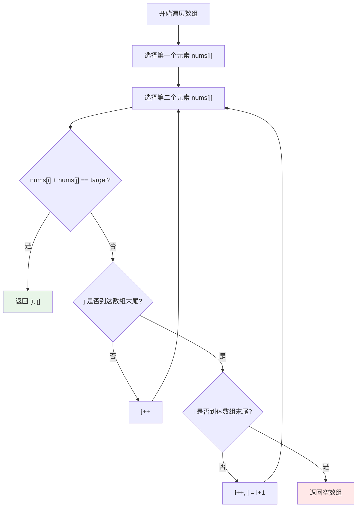
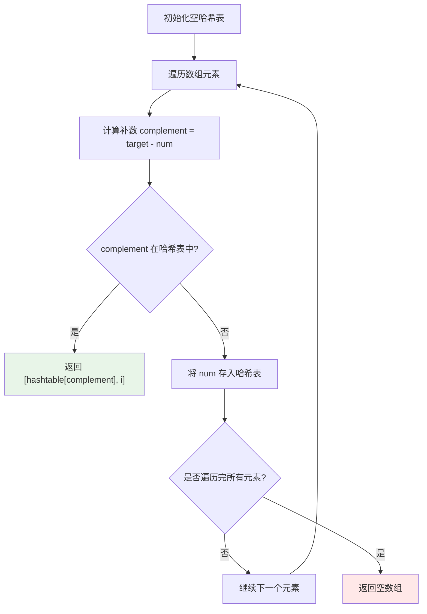
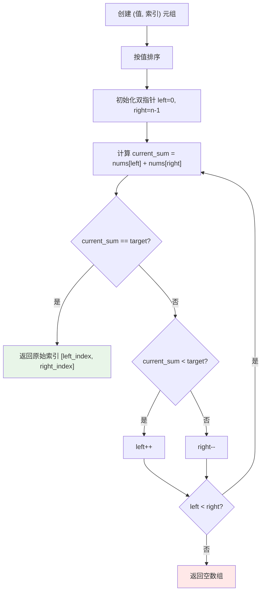

# LeetCode 1. 两数之和完全解析 - 从暴力枚举到哈希表优化的算法进阶之路

## 📖 摘要

想成为算法高手？两数之和是必学经典！揭秘三种核心解法：暴力枚举（O(n²)/O(1)）、哈希表优化（O(n)/O(n)）、双指针技巧（O(n log n)/O(n)），从算法小白快速进阶为解题高手！

## 🎯 题目概述

### 题目描述
给定一个整数数组 `nums` 和一个整数目标值 `target`，请你在该数组中找出和为目标值 `target` 的那两个整数，并返回它们的数组下标。

### 核心约束
- 每种输入只会对应一个答案
- 不能使用两次相同的元素
- 可以按任意顺序返回答案

### 示例分析
```python
# 示例 1
输入：nums = [2,7,11,15], target = 9
输出：[0,1]
解释：因为 nums[0] + nums[1] == 9，返回 [0, 1]

# 示例 2  
输入：nums = [3,2,4], target = 6
输出：[1,2]

# 示例 3
输入：nums = [3,3], target = 6
输出：[0,1]
```

## 🧠 核心算法思路

### 生活化比喻：寻找配对
想象你在一个聚会上，需要找到两个人，他们的年龄加起来等于目标年龄。你可以：

1. **暴力搜索**：逐个询问每个人，再询问其他人（效率低）
   - 固定第一个人："你几岁？"（比如25岁）
   - 问第二个人："你几岁？"（比如30岁），计算：25+30=55，不对
   - 问第三个人："你几岁？"（比如35岁），计算：25+35=60，找到了！返回位置1和位置3
   - 如果没找到，继续问第四个人："你几岁？"（比如20岁），计算：25+20=45，不对
   - 继续问第五个人："你几岁？"（比如15岁），计算：25+15=40，不对
   - 问完所有人后，固定第二个人："你几岁？"（比如30岁）
   - 问第三个人："你几岁？"（比如35岁），计算：30+35=65，不对
   - 问第四个人："你几岁？"（比如20岁），计算：30+20=50，不对
   - 继续问完后面所有人...
   - 问题：每个人都要和后面所有人配对，需要问很多次，效率很低

2. **智能记录**：记录每个人的年龄在笔记本上，遇到新朋友时快速在笔记本中查找是否有匹配的年龄（效率高）
   - 准备一个笔记本，记录"年龄→位置"的对应关系
   - 遇到第一个人："你几岁？"（25岁），记录"25岁→位置1"
   - 遇到第二个人："你几岁？"（30岁），先查笔记本：60-30=30，笔记本里有30岁吗？没有，记录"30岁→位置2"
   - 遇到第三个人："你几岁？"（35岁），先查笔记本：60-35=25，笔记本里有25岁吗？有！在位置1
   - 找到了！返回位置1和位置3
   - 优势：只需要问一次，查找很快

3. **有序配对**：按年龄排序后，从两端开始配对（需要排序）
   - 先把所有人的年龄按从小到大排序：[20, 25, 30, 35, 40]
   - 设置左指针指向最年轻的人（20岁），右指针指向最年长的人（40岁）
   - 为什么这样设置？因为我们要找两个数的和，从最大和最小开始尝试最有效率
   - 从两端开始配对：20岁 + 40岁 = 60岁
   - 如果年龄和等于目标（60岁），找到了！返回这两个人的位置
   - 如果年龄和太大（比如20+40=60，但目标是50），右指针左移选择更年轻的人：20岁 + 35岁 = 55岁
   - 如果年龄和太小（比如20+30=50，但目标是60），左指针右移选择更年长的人：25岁 + 30岁 = 55岁
   - 重要规则：两个指针不能同时移动，每次只能移动一个指针
   - 但是可以选择移动哪个指针，比如年龄和太大时，既可以右指针左移，也可以左指针右移，效果一样
   - 继续移动左右指针，直到找到年龄和等于目标年龄的两个人
   - 优势：不需要问很多人，最多问n次就能找到
   - 问题：需要先排序，改变原来的顺序，而且排序需要额外时间和空间

### 算法核心思想
- **问题转化**：寻找 `nums[i] + nums[j] = target` 等价于寻找 `nums[j] = target - nums[i]`
- **优化策略**：用空间换时间，用哈希表快速查找
- **边界处理**：确保不重复使用同一元素

## 🔧 三种解法详解

### 解法一：暴力枚举法（小白入门）

#### 核心思路
使用两层循环，枚举数组中的每一对元素，检查它们的和是否等于目标值。

#### 代码实现
```python
class Solution:
    def twoSum(self, nums: List[int], target: int) -> List[int]:
        """
        暴力枚举解法 - 适合小白理解
        时间复杂度：O(n²) 空间复杂度：O(1)
        """
        n = len(nums)
        # 外层循环：遍历每个元素
        for i in range(n):
            # 内层循环：遍历当前元素后面的所有元素
            for j in range(i + 1, n):
                # 检查两数之和是否等于目标值
                if nums[i] + nums[j] == target:
                    return [i, j]  # 返回下标
        return []  # 未找到解
```

#### 执行流程


#### 复杂度分析
- **时间复杂度**：O(n²) - 最坏情况下需要检查每一对元素
- **空间复杂度**：O(1) - 只使用常数额外空间

### 解法二：哈希表优化法（经典解法）

#### 核心思路
使用哈希表存储已遍历的元素及其索引，对于每个新元素，快速查找是否存在 `target - num`。

#### 代码实现
```python
class Solution:
    def twoSum(self, nums: List[int], target: int) -> List[int]:
        """
        哈希表优化解法 - 经典解法
        时间复杂度：O(n) 空间复杂度：O(n)
        """
        # 创建一个空的哈希表（字典），用来存储已经遍历过的数字和它们的位置
        # 格式：{数字值: 在数组中的位置}
        hashtable = {}
        
        # 遍历数组中的每个元素，i是位置，num是数字值
        for i, num in enumerate(nums):
            # 计算当前数字的"补数"（complement）
            # 补数就是目标值减去当前数字，如果补数在哈希表中，说明找到了解
            # 例如：目标值是9，当前数字是2，那么补数就是9-2=7
            complement = target - num
            
            # 检查补数是否已经存在于哈希表中
            # 如果存在，说明之前遍历过这个补数，现在找到了配对
            if complement in hashtable:
                # 找到了解！返回两个位置
                # hashtable[complement] 是补数的位置，i 是当前数字的位置
                return [hashtable[complement], i]
            
            # 如果没找到补数，就把当前数字和它的位置存入哈希表
            # 这样下次遍历时就能快速查找了
            hashtable[num] = i
        
        # 如果遍历完整个数组都没找到解，返回空列表
        return []
```

#### 执行流程


#### 复杂度分析
- **时间复杂度**：O(n) - 线性时间，通过哈希表将嵌套循环的二次复杂度优化为线性
- **空间复杂度**：O(n) - 以空间换时间，哈希表存储元素的开销

### 解法三：双指针优化法（高级技巧）

#### 核心思路
如果数组已排序，可以使用双指针从两端向中间移动，根据和的大小调整指针位置。

#### 代码实现
```python
class Solution:
    def twoSum(self, nums: List[int], target: int) -> List[int]:
        """
        双指针优化解法 - 需要排序
        时间复杂度：O(n log n) 空间复杂度：O(n)（包含排序时间）
        """
        # 对原数组进行排序，sorted()函数会返回一个新的排序后的数组
        # 注意：排序会改变元素的顺序，所以后面需要找回原始位置
        nums_sorted = sorted(nums)
        nums_len = len(nums)  # 获取数组长度
        
        # 双指针初始化
        # pointer_start 指向排序后数组的最左边（最小值）
        # pointer_end 指向排序后数组的最右边（最大值）
        pointer_start, pointer_end = 0, nums_len - 1

        # 双指针移动循环，当两个指针相遇时停止
        while pointer_start < pointer_end:
            # 计算当前两个指针指向的数字的和
            current_sum = nums_sorted[pointer_start] + nums_sorted[pointer_end]
            
            # 如果和太大，说明需要减小和
            # 右指针左移，选择更小的数字
            if current_sum > target:
                pointer_end -= 1
                continue  # 跳过本次循环的剩余部分，继续下一次循环
            
            # 如果和太小，说明需要增大和
            # 左指针右移，选择更大的数字
            if current_sum < target:
                pointer_start += 1
                continue  # 跳过本次循环的剩余部分，继续下一次循环

            # 如果和等于目标值，说明找到了解
            # 但是需要返回原始数组中的位置，不是排序后数组的位置
            # nums.index() 函数会在原数组中查找元素的位置
            result = [nums.index(nums_sorted[pointer_start]), nums.index(nums_sorted[pointer_end])]
            
            # 处理相同元素的情况
            # 如果两个元素相同，index()会返回第一个找到的位置
            # 所以需要找到第二个相同元素的位置
            if result[0] == result[1]:
                # nums[result[1] + 1:] 是从第二个位置开始的子数组
                # .index(nums_sorted[pointer_end]) 在这个子数组中查找相同元素
                # + result[1] + 1 是为了得到在原数组中的真实位置
                return [result[0], nums[result[1] + 1:].index(nums_sorted[pointer_end]) + result[1] + 1]

            # 如果两个元素不同，直接返回结果
            return result
        
        # 如果遍历完所有可能都没有找到解，返回空列表
        return []
```

#### 执行流程


#### 复杂度分析
- **时间复杂度**：O(n log n) - 由排序主导，双指针遍历 O(n)
- **空间复杂度**：O(n) - 由排序后的数组占用空间主导

## 📊 算法对比分析

### 性能对比表格
| 解法 | 时间复杂度 | 空间复杂度 | 适用场景 | 优势 | 劣势 |
|------|------------|------------|----------|------|------|
| 暴力枚举 | O(n²) | O(1) | 学习理解 | 思路简单，易理解 | 效率低，不适合大数据 |
| 哈希表 | O(n) | O(n) | 面试场景 | 理论最优，通用性强 | 需要额外空间，哈希冲突 |
| 双指针 | O(n log n) | O(n) | 面试场景，生产环境 | 实际性能更优，缓存友好 | 需要排序预处理 |

### 深度算法分析

#### 方法一：暴力枚举法深度分析
**核心思想**：穷举所有可能的数对组合
- **实现复杂度**：极低，适合初学者理解
- **内存使用**：最优，只使用常数额外空间
- **适用数据规模**：小规模数据（n < 100）
- **实际应用**：教学演示、小数据集处理
- **性能瓶颈**：嵌套循环导致的时间复杂度爆炸

#### 方法二：哈希表法深度分析
**核心思想**：空间换时间，用哈希表快速查找
- **实现复杂度**：中等，需要理解哈希表概念
- **内存使用**：需要O(n)额外空间存储哈希表
- **适用数据规模**：大规模数据（n > 1000）
- **实际应用**：面试高频，理论最优
- **性能优势**：线性时间复杂度，查找效率O(1)
- **潜在问题**：哈希冲突、内存开销

#### 方法三：双指针法深度分析
**核心思想**：排序后利用有序性进行高效搜索
- **实现复杂度**：较高，需要理解排序和双指针
- **内存使用**：需要O(n)空间存储排序后的数组
- **适用数据规模**：大规模数据（n > 1000，相比暴力枚举优势明显）
- **实际应用**：面试装逼首选，生产环境实际性能更优
- **性能优势**：在实际应用中与哈希表法性能相近，甚至更优
- **核心优势**：
  - **缓存友好**：连续内存访问，CPU缓存命中率高
  - **无哈希冲突**：避免了哈希表的冲突处理开销
  - **内存局部性**：排序后的数组访问模式更规律
  - **可预测性**：时间复杂度稳定，不受数据分布影响

### 方法二 vs 方法三：深度对比

#### 时间复杂度对比
- **哈希表法**：O(n) - 每个元素只访问一次
- **双指针法**：O(n log n) - 排序占主导，但实际常数因子较小，性能差距不大

#### 空间复杂度对比
- **哈希表法**：O(n) - 哈希表存储
- **双指针法**：O(n) - 排序后数组存储

#### 实际空间使用分析
**哈希表法的空间占用**：
- 需要存储键值对（数字值: 索引位置）
- Python字典的额外开销：哈希表结构、冲突处理、动态扩容
- 实际占用：**通常比理论O(n)更大**
- 内存碎片化：哈希表的随机访问模式

**双指针法的空间占用**：
- 排序后数组存储：连续内存块
- 如果原地排序：空间复杂度可降至O(1)
- 实际占用：**通常接近理论O(n)**
- 内存局部性：连续内存访问，缓存友好

**实际空间对比**：
- **哈希表法空间占用更大**：由于字典的额外开销和内存碎片
- **双指针法空间效率更高**：连续内存存储，无额外结构开销
- **内存利用率**：双指针法 > 哈希表法

#### 实际性能分析
**理论 vs 实际性能**：
- 虽然理论上哈希表法O(n)优于双指针法O(n log n)
- 但实际应用中，性能差距并不显著
- 现代排序算法效率很高，排序开销相对较小
- 对于中小规模数据，两种方法性能相近

**哈希表法的潜在问题**：
- 哈希函数计算开销
- 哈希冲突处理成本
- 内存分配和释放开销
- 缓存不友好（随机访问模式）

**双指针法的优势**：
- 排序后连续内存访问
- 无哈希计算开销
- 更好的CPU缓存利用率
- 时间复杂度可预测
- **实际性能与哈希表法差距很小**

#### 适用场景分析
**选择哈希表法的情况**：
- 数组未排序且排序成本高
- 需要保持原始数组顺序
- 数据规模非常大（n > 10000）
- 内存充足的环境

**选择双指针法的情况**：
- 数组已排序或排序成本低
- 对内存访问效率要求高
- 数据规模较大（n > 1000，相比暴力枚举优势明显）
- 需要稳定的性能表现

### 实际应用建议
1. **学习阶段**：从暴力枚举开始，理解问题本质
2. **面试场景**：展示双指针解法，体现算法深度和技术水平
3. **生产环境**：根据数据特征选择最优算法
4. **性能敏感场景**：考虑双指针法的缓存优势


## ⚠️ 常见问题预警

### 问题一：索引顺序错误
**错误做法**：
```python
# 错误：返回顺序可能不符合要求
return [i, j]  # 可能返回 [1, 0] 而不是 [0, 1]
```

**正确做法**：
```python
# 正确：确保返回顺序正确
return [hashtable[complement], i]  # 先返回较小的索引
```

### 问题二：重复使用同一元素
**错误做法**：
```python
# 错误：可能使用同一元素两次
for j in range(n):  # j 从 0 开始
    if nums[i] + nums[j] == target:
        return [i, j]
```

**正确做法**：
```python
# 正确：确保不重复使用
for j in range(i + 1, n):  # j 从 i+1 开始
    if nums[i] + nums[j] == target:
        return [i, j]
```

### 问题三：哈希表键值混淆
**错误做法**：
```python
# 错误：键值对颠倒
hashtable[i] = num  # 键是索引，值是数字
```

**正确做法**：
```python
# 正确：键是数字，值是索引
hashtable[num] = i  # 键是数字，值是索引
```

### 问题四：边界条件处理不当
**错误做法**：
```python
# 错误：没有处理无解情况
def twoSum(self, nums, target):
    # 直接返回，可能返回 None
    pass
```

**正确做法**：
```python
# 正确：明确处理无解情况
def twoSum(self, nums, target):
    # ... 查找逻辑 ...
    return []  # 明确返回空列表
```

## 🚀 学习路径建议

### 小白（零基础）
1. **理解题目**：仔细阅读题目描述和示例
2. **暴力枚举**：先掌握最直观的解法
3. **复杂度分析**：理解时间复杂度和空间复杂度概念
4. **练习题目**：多做类似的双重循环题目

### 初级（有基础）
1. **哈希表学习**：掌握哈希表的基本操作
2. **空间换时间**：理解优化策略的核心思想
3. **代码实现**：熟练实现哈希表解法
4. **性能对比**：比较不同解法的效率

### 中级（熟练）
1. **双指针技巧**：学习排序后的双指针方法
2. **算法设计**：理解不同算法的设计思路
3. **边界处理**：掌握各种边界情况的处理
4. **代码优化**：学会代码的细节优化

### 高级（精通）
1. **算法分析**：深入理解算法复杂度分析
2. **变种题目**：解决三数之和、四数之和等变种
3. **实际应用**：将算法思想应用到实际项目中
4. **教学分享**：能够清晰地向他人解释算法

## 💡 最佳实践总结

### 算法选择原则
- **学习阶段**：优先使用暴力枚举，理解基本思路
- **面试场景**：推荐使用双指针解法，展示算法深度和技术水平
- **生产环境**：优先选择双指针解法，实际性能更优

### 代码质量保证
- **变量命名**：使用有意义的变量名（如 `complement`、`hashtable`）
- **注释完善**：为关键步骤添加清晰注释
- **边界处理**：正确处理无解和异常情况
- **测试验证**：使用多个测试用例验证正确性

### 性能优化建议
- **空间优化**：在空间充足时优先考虑时间复杂度
- **预处理**：对于多次查询，考虑预处理优化
- **数据结构**：根据问题特点选择合适的数据结构
- **算法选择**：根据数据规模选择最优算法

## 🎉 总结

两数之和是算法学习的经典入门题目，通过三种不同的解法，我们可以深入理解：

1. **暴力枚举**：最直观的思路，适合初学者理解问题本质
2. **哈希表优化**：空间换时间的经典案例，理论最优
3. **双指针技巧**：实际性能更优的优雅解法，展示算法设计的多样性

掌握这道题目，不仅能够提升算法思维，更能为后续学习更复杂的算法打下坚实基础。记住，算法学习是一个循序渐进的过程，从理解到熟练，从模仿到创新，每一步都值得认真对待！

**继续加油，算法高手之路就在前方！** 🚀

---

**厦门工学院人工智能创作坊 -- 郑恩赐**  
**2025 年 10 月 22 日**
