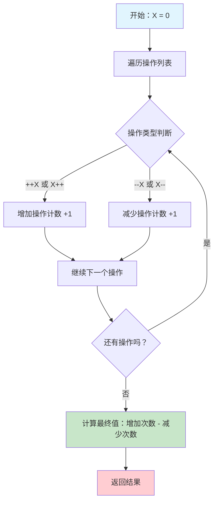

# LeetCode 2011 执行操作后的变量值完全解析

## 📝 摘要

LeetCode 2011 题通过统计操作次数解决变量值计算问题，提供 Python、Java、JavaScript、TypeScript、C 五种语言实现，展示不同语言的实现技巧，适合跨语言学习。

## 🎯 题目概述

### 题目描述
存在一种仅支持 4 种操作和 1 个变量 X 的编程语言（programming language）：

- `++X` 和 `X++` 使变量 X 的值 **加 1**
- `--X` 和 `X--` 使变量 X 的值 **减 1**

最初，X 的值是 0。给你一个字符串数组（string array）`operations`，这是由操作组成的一个列表，返回执行所有操作后，X 的最终值。

### 生活化比喻 🏪

想象你是一个**便利店收银员**，手边有一个**计数器**（变量 X）：

- **++X** 和 **X++** 就像顾客**购买商品**，计数器 +1
- **--X** 和 **X--** 就像顾客**退货**，计数器 -1
- 无论商品是**先扫描再结账**（++X）还是**先结账再扫描**（X++），最终都是**购买了一件商品**

你的任务就是根据一天的**操作记录**（operations），计算出**最终的库存变化**！

## 🔍 核心解题思路

### 关键洞察 💡

**前缀和后缀操作效果相同**：
- `++X` 和 `X++` 都是让 X 加 1
- `--X` 和 `X--` 都是让 X 减 1

**统计思维**：
- 不需要逐个执行操作
- 只需要统计**增加操作**和**减少操作**的次数
- 最终值 = 增加次数 - 减少次数

### 执行流程图 📊



## 💻 代码实现详解

### Python 最优解法 ⭐

```python
class Solution:
    def finalValueAfterOperations(self, operations: List[str]) -> int:
        """
        计算执行所有操作后变量 X 的最终值
        
        参数:
            operations: 操作字符串列表，包含 "++X", "X++", "--X", "X--"
        
        返回:
            int: 执行所有操作后 X 的最终值
        
        适用水平: 小白（零基础）
        """
        # 统计增加操作次数：++X 和 X++
        increase_count = operations.count("++X") + operations.count("X++")
        
        # 统计减少操作次数：--X 和 X--
        decrease_count = operations.count("--X") + operations.count("X--")
        
        # 最终值 = 增加次数 - 减少次数
        return increase_count - decrease_count
```

### Python 一行代码版本 🚀

```python
class Solution:
    def finalValueAfterOperations(self, operations: List[str]) -> int:
        """
        一行代码版本：直接计算最终值
        
        适用水平: 初级
        """
        return operations.count("++X") + operations.count("X++") - operations.count("--X") - operations.count("X--")
```

### Java 实现版本 ☕

```java
class Solution {
    public int finalValueAfterOperations(String[] operations) {
        /**
         * 计算执行所有操作后变量 X 的最终值
         * 
         * 参数:
         *     operations: 操作字符串数组，包含 "++X", "X++", "--X", "X--"
         * 
         * 返回:
         *     int: 执行所有操作后 X 的最终值
         * 
         * 适用水平: 小白（零基础）
         */
        int result = 0;  // 初始化结果变量
        
        // 遍历操作数组
        for (String op : operations) {
            // 判断操作类型并更新结果
            if (op.equals("++X") || op.equals("X++")) {
                result++;  // 增加操作：结果 +1
            } else {
                result--;  // 减少操作：结果 -1
            }
        }
        
        return result;  // 返回最终结果
    }
}
```

### Java 性能优化版本 ⚡

```java
class Solution {
    public int finalValueAfterOperations(String[] operations) {
        /**
         * Java 性能优化版本：使用字符判断减少字符串比较
         * 
         * 适用水平: 中级
         */
        int result = 0;
        
        for (String op : operations) {
            // 通过字符判断：如果第二个字符是 '+' 则为增加操作
            if (op.charAt(1) == '+') {
                result++;
            } else {
                result--;
            }
        }
        
        return result;
    }
}
```

### JavaScript 实现版本 🟨

```javascript
/**
 * 计算执行所有操作后变量 X 的最终值
 * 
 * @param {string[]} operations - 操作字符串数组，包含 "++X", "X++", "--X", "X--"
 * @return {number} - 执行所有操作后 X 的最终值
 * 
 * 适用水平: 小白（零基础）
 */
var finalValueAfterOperations = function(operations) {
    let x = 0;  // 初始化结果变量
    
    // 遍历操作数组
    for (const op of operations) {
        // 判断操作类型并更新结果
        if (op === "++X" || op === "X++") {
            x++;  // 增加操作：结果 +1
        } else {
            x--;  // 减少操作：结果 -1
        }
    }
    
    return x;  // 返回最终结果
};
```

### JavaScript ES6+ 版本 ⚡

```javascript
/**
 * JavaScript ES6+ 版本：使用箭头函数和 const
 * 
 * 适用水平: 初级
 */
const finalValueAfterOperations = (operations) => {
    let x = 0;
    
    // 使用 for...of 循环遍历数组
    for (const op of operations) {
        // 使用严格相等比较
        if (op === "++X" || op === "X++") {
            x++;
        } else {
            x--;
        }
    }
    
    return x;
};
```

### JavaScript 函数式编程版本 🚀

```javascript
/**
 * JavaScript 函数式编程版本：使用 reduce 方法
 * 
 * 适用水平: 中级
 */
const finalValueAfterOperations = (operations) => {
    return operations.reduce((x, op) => {
        // 使用三元运算符简化条件判断
        return op === "++X" || op === "X++" ? x + 1 : x - 1;
    }, 0);  // 初始值为 0
};
```

### TypeScript 实现版本 🔷

```typescript
/**
 * 计算执行所有操作后变量 X 的最终值
 * 
 * @param operations - 操作字符串数组，包含 "++X", "X++", "--X", "X--"
 * @returns 执行所有操作后 X 的最终值
 * 
 * 适用水平: 小白（零基础）
 */
function finalValueAfterOperations(operations: string[]): number {
    let x: number = 0;  // 初始化结果变量，明确类型声明
    
    // 遍历操作数组
    for (const op of operations) {
        // 判断操作类型并更新结果
        if (op === "++X" || op === "X++") {
            x++;  // 增加操作：结果 +1
        } else {
            x--;  // 减少操作：结果 -1
        }
    }
    
    return x;  // 返回最终结果
}
```

### TypeScript 高级版本 ⚡

```typescript
/**
 * TypeScript 高级版本：使用类型别名和更严格的类型检查
 * 
 * 适用水平: 中级
 */
type Operation = "++X" | "X++" | "--X" | "X--";

function finalValueAfterOperations(operations: Operation[]): number {
    let x: number = 0;
    
    // 使用类型安全的操作处理
    for (const op of operations) {
        switch (op) {
            case "++X":
            case "X++":
                x++;
                break;
            case "--X":
            case "X--":
                x--;
                break;
            default:
                // TypeScript 会确保这里永远不会执行
                const _exhaustiveCheck: never = op;
                throw new Error(`Unexpected operation: ${_exhaustiveCheck}`);
        }
    }
    
    return x;
}
```

### TypeScript 函数式编程版本 🚀

```typescript
/**
 * TypeScript 函数式编程版本：使用 reduce 和类型安全
 * 
 * 适用水平: 高级
 */
const finalValueAfterOperations = (operations: string[]): number => {
    return operations.reduce<number>((x: number, op: string): number => {
        // 使用三元运算符简化条件判断，类型安全
        return op === "++X" || op === "X++" ? x + 1 : x - 1;
    }, 0);  // 初始值为 0
};
```

### C 语言实现版本 🔧

```c
#include <string.h>

/**
 * 计算执行所有操作后变量 X 的最终值
 * 
 * @param operations - 操作字符串数组，包含 "++X", "X++", "--X", "X--"
 * @param operationsSize - 操作数组的大小
 * @return 执行所有操作后 X 的最终值
 * 
 * 适用水平: 小白（零基础）
 */
int finalValueAfterOperations(char** operations, int operationsSize) {
    int result = 0;  // 初始化结果变量
    
    // 遍历操作数组
    for (int i = 0; i < operationsSize; i++) {
        char *op = operations[i];  // 获取当前操作字符串
        
        // 判断操作类型并更新结果
        if (strcmp(op, "++X") == 0 || strcmp(op, "X++") == 0) {
            result++;  // 增加操作：结果 +1
        } else {
            result--;  // 减少操作：结果 -1
        }
    }
    
    return result;  // 返回最终结果
}
```

### C 语言优化版本 ⚡

```c
#include <string.h>

/**
 * C 语言优化版本：使用字符比较减少字符串比较开销
 * 
 * 适用水平: 中级
 */
int finalValueAfterOperations(char** operations, int operationsSize) {
    int result = 0;
    
    for (int i = 0; i < operationsSize; i++) {
        char *op = operations[i];
        
        // 通过字符比较：如果第二个字符是 '+' 则为增加操作
        if (op[1] == '+') {
            result++;
        } else {
            result--;
        }
    }
    
    return result;
}
```

### C 语言指针版本 🚀

```c
#include <string.h>

/**
 * C 语言指针版本：使用指针操作提升性能
 * 
 * 适用水平: 高级
 */
int finalValueAfterOperations(char** operations, int operationsSize) {
    int result = 0;
    char **op_ptr = operations;  // 使用指针遍历
    
    // 使用指针遍历数组
    for (int i = 0; i < operationsSize; i++, op_ptr++) {
        char *op = *op_ptr;
        
        // 使用 strcmp 进行字符串比较
        if (strcmp(op, "++X") == 0 || strcmp(op, "X++") == 0) {
            result++;
        } else {
            result--;
        }
    }
    
    return result;
}
```

### 逐行代码解析 🔍

#### Python 版本解析
```python
# 第 1 行：统计 "++X" 操作次数
operations.count("++X")

# 第 2 行：统计 "X++" 操作次数  
operations.count("X++")

# 第 3 行：统计 "--X" 操作次数
operations.count("--X")

# 第 4 行：统计 "X--" 操作次数
operations.count("X--")

# 最终计算：增加操作总数 - 减少操作总数
```

#### Java 版本解析
```java
// 第 1 行：初始化结果变量
int result = 0;

// 第 2 行：增强型 for 循环遍历操作数组
for (String op : operations) {

// 第 3 行：判断是否为增加操作
if (op.equals("++X") || op.equals("X++")) {

// 第 4 行：执行增加操作
result++;

// 第 5 行：else 分支处理减少操作
} else {

// 第 6 行：执行减少操作
result--;

// 第 7 行：返回最终结果
return result;
```

#### JavaScript 版本解析
```javascript
// 第 1 行：初始化结果变量
let x = 0;

// 第 2 行：for...of 循环遍历操作数组
for (const op of operations) {

// 第 3 行：判断是否为增加操作
if (op === "++X" || op === "X++") {

// 第 4 行：执行增加操作
x++;

// 第 5 行：else 分支处理减少操作
} else {

// 第 6 行：执行减少操作
x--;

// 第 7 行：返回最终结果
return x;
```

#### TypeScript 版本解析
```typescript
// 第 1 行：函数声明，明确参数和返回值类型
function finalValueAfterOperations(operations: string[]): number {

// 第 2 行：初始化结果变量，明确类型声明
let x: number = 0;

// 第 3 行：for...of 循环遍历操作数组
for (const op of operations) {

// 第 4 行：判断是否为增加操作
if (op === "++X" || op === "X++") {

// 第 5 行：执行增加操作
x++;

// 第 6 行：else 分支处理减少操作
} else {

// 第 7 行：执行减少操作
x--;

// 第 8 行：返回最终结果
return x;
```

#### C 语言版本解析
```c
// 第 1 行：包含字符串处理头文件
#include <string.h>

// 第 2 行：函数声明，参数为字符串数组和数组大小
int finalValueAfterOperations(char** operations, int operationsSize) {

// 第 3 行：初始化结果变量
int result = 0;

// 第 4 行：for 循环遍历操作数组
for (int i = 0; i < operationsSize; i++) {

// 第 5 行：获取当前操作字符串
char *op = operations[i];

// 第 6 行：使用 strcmp 判断是否为增加操作
if (strcmp(op, "++X") == 0 || strcmp(op, "X++") == 0) {

// 第 7 行：执行增加操作
result++;

// 第 8 行：else 分支处理减少操作
} else {

// 第 9 行：执行减少操作
result--;

// 第 10 行：返回最终结果
return result;
```

## 🎯 算法复杂度分析

### 时间复杂度 ⏱️
- **O(n)**：需要遍历操作列表一次
- `count()` 方法内部也是 O(n) 复杂度
- 总体：**O(n)**

### 空间复杂度 💾
- **O(1)**：只使用了常数个变量
- 不需要额外的数据结构

### 性能对比 📈

| 语言 | 方法 | 时间复杂度 | 空间复杂度 | 代码简洁度 | 推荐指数 |
|------|------|------------|------------|------------|----------|
| Python | 统计计数法 | O(n) | O(1) | ⭐⭐⭐⭐⭐ | ⭐⭐⭐⭐⭐ |
| Python | 逐个执行法 | O(n) | O(1) | ⭐⭐⭐ | ⭐⭐⭐ |
| Java | 逐个执行法 | O(n) | O(1) | ⭐⭐⭐⭐ | ⭐⭐⭐⭐ |
| Java | 字符判断法 | O(n) | O(1) | ⭐⭐⭐⭐⭐ | ⭐⭐⭐⭐⭐ |
| JavaScript | 逐个执行法 | O(n) | O(1) | ⭐⭐⭐⭐ | ⭐⭐⭐⭐ |
| JavaScript | 函数式编程 | O(n) | O(1) | ⭐⭐⭐⭐⭐ | ⭐⭐⭐⭐⭐ |
| TypeScript | 基础版本 | O(n) | O(1) | ⭐⭐⭐⭐ | ⭐⭐⭐⭐ |
| TypeScript | 高级版本 | O(n) | O(1) | ⭐⭐⭐⭐⭐ | ⭐⭐⭐⭐⭐ |
| TypeScript | 函数式编程 | O(n) | O(1) | ⭐⭐⭐⭐⭐ | ⭐⭐⭐⭐⭐ |
| C | 基础版本 | O(n) | O(1) | ⭐⭐⭐⭐ | ⭐⭐⭐⭐⭐ |
| C | 优化版本 | O(n) | O(1) | ⭐⭐⭐⭐⭐ | ⭐⭐⭐⭐⭐ |
| C | 指针版本 | O(n) | O(1) | ⭐⭐⭐⭐ | ⭐⭐⭐⭐ |

## 🚨 常见问题预警

### 1. 理解操作效果错误 ❌
```python
# 错误理解：认为 ++X 和 X++ 效果不同
def wrong_solution(operations):
    result = 0
    for op in operations:
        if op == "++X":
            result += 1
        elif op == "X++":  # 错误：认为效果不同
            result += 0.5
```

**正确理解**：`++X` 和 `X++` 都是让 X 加 1，只是**执行时机**不同，但**最终效果**相同。

### 2. 过度复杂化 ❌
```python
# 错误：使用复杂的条件判断
def over_complicated(operations):
    result = 0
    for op in operations:
        if op.startswith("++") or op.endswith("++"):
            result += 1
        elif op.startswith("--") or op.endswith("--"):
            result -= 1
```

**正确做法**：直接使用 `count()` 方法统计，简洁高效。

### 3. 忽略边界情况 ❌
```python
# 错误：没有考虑空列表
def no_boundary_check(operations):
    if not operations:  # 忘记处理空列表
        return 0
```

```java
// 错误：没有考虑空数组
public int noBoundaryCheck(String[] operations) {
    if (operations.length == 0) {  // 忘记处理空数组
        return 0;
    }
}
```

**正确做法**：题目保证 `1 <= operations.length <= 100`，但仍要注意边界情况。

### 4. Java 字符串比较错误 ❌
```java
// 错误：使用 == 比较字符串
if (op == "++X" || op == "X++") {  // 错误：比较引用而非内容
    result++;
}

// 错误：使用 charAt 时没有检查长度
if (op.charAt(1) == '+') {  // 可能抛出 StringIndexOutOfBoundsException
    result++;
}
```

**正确做法**：
```java
// 正确：使用 equals() 方法比较字符串内容
if (op.equals("++X") || op.equals("X++")) {
    result++;
}

### 5. JavaScript 类型比较错误 ❌
```javascript
// 错误：使用 == 进行类型比较
if (op == "++X" || op == "X++") {  // 错误：可能发生类型转换
    x++;
}

// 错误：使用 var 声明变量（函数作用域）
var finalValueAfterOperations = function(operations) {
    var x = 0;  // 错误：var 有函数作用域问题
    for (var i = 0; i < operations.length; i++) {
        // 错误：使用传统 for 循环
    }
};
```

**正确做法**：
```javascript
// 正确：使用 === 进行严格比较
if (op === "++X" || op === "X++") {
    x++;
}

### 6. TypeScript 类型声明错误 ❌
```typescript
// 错误：缺少类型声明
function finalValueAfterOperations(operations) {  // 错误：参数没有类型
    let x = 0;  // 错误：变量没有类型声明
    return x;
}

// 错误：类型不匹配
function finalValueAfterOperations(operations: string[]): string {  // 错误：返回类型错误
    let x: number = 0;
    return x;  // 错误：返回 number 但声明为 string
}

// 错误：使用 any 类型
function finalValueAfterOperations(operations: any[]): any {  // 错误：失去类型安全
    let x: any = 0;
    return x;
}
```

**正确做法**：
```typescript
// 正确：完整的类型声明
function finalValueAfterOperations(operations: string[]): number {
    let x: number = 0;  // 正确：明确类型声明
    return x;  // 正确：类型匹配
}

### 7. C 语言字符串比较错误 ❌
```c
// 错误：使用 == 比较字符串
if (op == "++X" || op == "X++") {  // 错误：比较指针地址而非内容
    result++;
}

// 错误：忘记包含头文件
int finalValueAfterOperations(char** operations, int operationsSize) {
    if (strcmp(op, "++X") == 0) {  // 错误：strcmp 未声明
        result++;
    }
}

// 错误：数组越界访问
for (int i = 0; i <= operationsSize; i++) {  // 错误：应该是 < 而不是 <=
    char *op = operations[i];
}
```

**正确做法**：
```c
// 正确：包含必要的头文件
#include <string.h>

// 正确：使用 strcmp 比较字符串内容
if (strcmp(op, "++X") == 0 || strcmp(op, "X++") == 0) {
    result++;
}

// 正确：避免数组越界
for (int i = 0; i < operationsSize; i++) {
    char *op = operations[i];
}
```

## 🎓 学习路径建议

### 小白（零基础）👶
1. **理解题目**：先理解四种操作的含义
2. **手工计算**：用纸笔计算几个简单例子
3. **选择语言**：Python 学习 `count()` 方法，Java 学习 `equals()` 方法，JavaScript 学习 `===` 比较，TypeScript 学习类型声明，C 语言学习 `strcmp()` 函数
4. **编写代码**：实现基础版本

### 初级（刚入门）🌱
1. **优化代码**：Python 尝试一行代码版本，Java 尝试字符判断版本，JavaScript 尝试 ES6+ 语法，TypeScript 尝试高级类型，C 语言尝试字符比较优化
2. **复杂度分析**：理解时间和空间复杂度
3. **边界测试**：测试各种边界情况
4. **代码规范**：注意代码格式和注释

### 中级（入门一段时间）🌿
1. **多种解法**：尝试不同语言的实现方式
2. **性能优化**：比较不同方法的性能差异
3. **语言特性**：利用各语言的特性和优势（Python 的 `count()`，Java 的字符判断，JavaScript 的函数式编程，TypeScript 的类型安全，C 语言的指针操作）
4. **最佳实践**：总结解题模式和技巧

### 高级（资深开发者）🌳
1. **算法设计**：从算法设计角度分析问题
2. **跨语言思维**：理解不同语言的实现差异和设计哲学
3. **底层理解**：深入理解 C 语言的内存管理和指针操作
4. **类型系统**：深入理解 TypeScript 的类型系统和编译时检查
5. **代码重构**：优化代码结构和可读性
6. **知识传授**：帮助其他开发者理解

## 🏆 最佳实践总结

### 解题策略 🎯
1. **理解题意**：仔细分析题目要求和约束条件
2. **寻找规律**：发现操作的本质规律和共同点
3. **选择方法**：选择最简洁高效的实现方式
4. **验证结果**：用测试用例验证代码正确性

### 代码质量 📝
1. **简洁明了**：优先选择简洁的解决方案
2. **注释完善**：为关键逻辑添加清晰注释
3. **变量命名**：使用有意义的变量名
4. **格式规范**：保持代码格式整洁
5. **语言特性**：充分利用各语言的特性和优势

### 性能优化 ⚡
1. **避免重复计算**：Python 使用 `count()`，Java 使用字符判断，JavaScript 使用函数式编程，TypeScript 使用类型安全的方法，C 语言使用字符比较
2. **减少内存使用**：避免创建不必要的中间变量
3. **算法选择**：选择时间复杂度最优的算法
4. **边界优化**：提前处理边界情况
5. **字符串操作**：Java 中注意字符串比较的正确方法，JavaScript 中使用 `===` 严格比较，TypeScript 中使用类型别名，C 语言中使用 `strcmp()` 函数
6. **现代语法**：JavaScript 中使用 ES6+ 语法，TypeScript 中使用高级类型系统，C 语言中使用指针操作提升代码可读性和性能
7. **类型安全**：TypeScript 中充分利用编译时类型检查，C 语言中注意内存管理和指针安全
8. **底层优化**：C 语言中利用字符比较和指针操作实现最高性能

## 🌟 总结

LeetCode 2011 题是一个**优秀的算法入门题目**，它教会我们：

- **统计思维**：通过计数而非逐个执行来解决问题
- **代码简洁**：一行代码就能解决看似复杂的问题  
- **算法效率**：O(n) 时间复杂度的优雅解决方案
- **编程思维**：从问题本质出发，寻找最优解法
- **跨语言实现**：Python 的 `count()` 方法、Java 的字符判断、JavaScript 的函数式编程、TypeScript 的类型安全和 C 语言的底层优化各有优势
- **语言特性**：充分利用不同编程语言的特性和优势，如 Python 的简洁性、Java 的类型安全、JavaScript 的灵活性、TypeScript 的编译时检查、C 语言的性能优势

这道题虽然简单，但体现了**优秀算法设计**的核心思想：**化繁为简，直击本质**。无论是算法新手还是资深开发者，都能从中获得启发。

**继续加油！** 每一道算法题都是提升编程思维的宝贵机会，相信通过不断练习和思考，你一定能成为算法高手！🚀

---

**厦门工学院人工智能创作坊 -- 郑恩赐**  
**2025 年 10 月 20 日**
