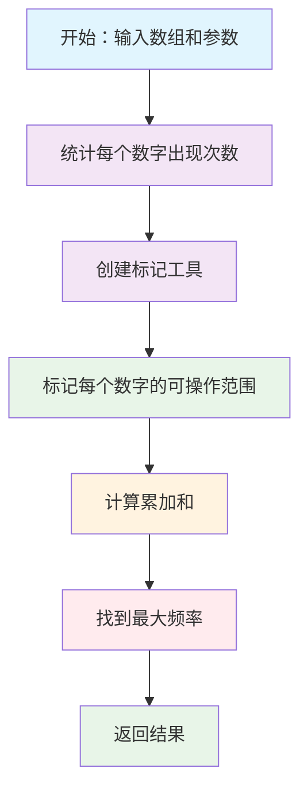
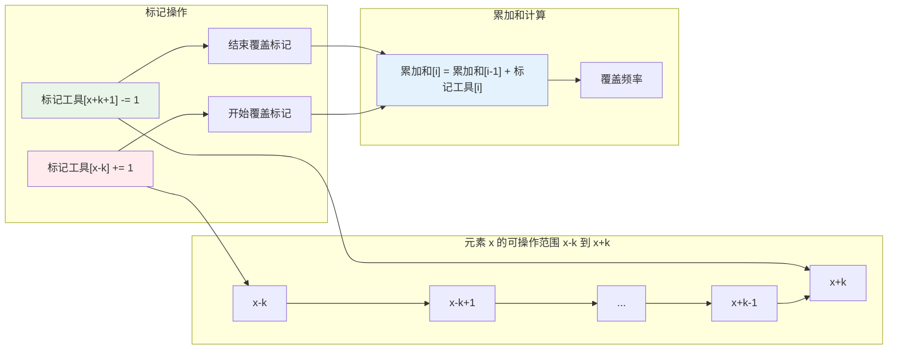

# LeetCode 3347 执行操作后元素的最高频率 II 解题思路完全指南 - 从暴力枚举到差分数组优化的算法进阶利器

## 📋 摘要

想掌握困难算法题的解题思路？本指南揭秘 LeetCode 3347 的核心解法，教你从暴力枚举快速进阶为算法优化高手！通过"标记工具"巧妙解决区间覆盖问题，让复杂算法变得简单易懂！

## ⚠️ 前置知识点说明

在阅读本文档之前，建议您先掌握以下知识点，以便更好地理解解题思路：

### 🔰 基础知识点（小白必学）

#### 📋 数组操作
**什么是数组**：数组就像一排编号的盒子，每个盒子可以放一个数字。
- **访问**：`nums[0]` 表示访问第1个盒子（编号从0开始）
- **修改**：`nums[0] = 5` 表示把第1个盒子的数字改成5
- **遍历**：用循环逐个检查每个盒子里的数字

#### 🗂️ 哈希表 (Hash Table)
**什么是哈希表**：哈希表就像一个智能字典，可以快速查找"键"对应的"值"。
- **存储**：`dict["苹果"] = 3` 表示"苹果"这个键对应数字3
- **查找**：`dict["苹果"]` 可以快速找到对应的数字3
- **优势**：查找速度非常快，不需要逐个检查

#### 🔄 循环结构
**什么是循环**：循环就是重复执行某些操作。
- **for循环**：`for i in range(5)` 表示重复5次
- **while循环**：`while 条件成立` 表示条件成立时一直重复

#### 🤔 条件判断
**什么是条件判断**：根据条件决定执行不同的操作。
- **if语句**：`if 条件成立: 执行操作A`
- **else语句**：`else: 执行操作B`

### 📚 进阶知识点（初级推荐）

#### 📊 前缀和 (Prefix Sum)
**什么是前缀和**：前缀和就是"累加和"，用来快速计算一段数字的总和。
- **例子**：数组 `[1, 2, 3, 4]` 的前缀和是 `[1, 3, 6, 10]`
- **作用**：有了前缀和，可以快速计算任意一段数字的总和
- **比喻**：就像楼梯的台阶高度，每层台阶的高度是前面所有台阶高度的总和

#### 🎯 差分数组 (Difference Array)
**什么是差分数组**：差分数组是一种"标记工具"，用来记录变化。
- **作用**：可以快速标记一段范围内的所有数字
- **比喻**：就像在日历上标记假期，在开始日期标记"开始"，在结束日期标记"结束"
- **优势**：比逐个标记每个日期要快得多

#### ⏱️ 时间复杂度
**什么是时间复杂度**：用来衡量算法运行速度的快慢。
- **O(1)**：运行时间固定，非常快
- **O(n)**：运行时间与数据量成正比
- **O(n log n)**：运行时间比O(n)稍慢一些
- **比喻**：就像快递配送，O(1)是即时送达，O(n)是按距离收费

#### 🔢 排序算法
**什么是排序**：把一堆数字按照从小到大（或从大到小）的顺序排列。
- **例子**：`[3, 1, 4, 2]` 排序后变成 `[1, 2, 3, 4]`
- **作用**：排序后的数据更容易查找和处理

### 🎯 高级知识点（中级可选）

#### 📈 区间更新
**什么是区间更新**：对一段连续的数字进行相同的操作。
- **例子**：把第3到第7个数字都加上5
- **挑战**：如何高效地处理大量区间更新操作

#### 🧮 数学推导
**什么是数学推导**：用数学方法分析问题的本质。
- **作用**：找到问题的数学规律，设计更高效的算法

#### 🚀 算法优化
**什么是算法优化**：把慢的算法改进成快的算法。
- **目标**：用更少的时间和空间解决问题
- **方法**：寻找重复计算，用巧妙的数据结构避免重复

### 💡 学习建议
- **小白（零基础）**：建议先学习基础知识点，再阅读本文档
- **初级（入门不久）**：可以跳过基础知识点，重点关注进阶知识点
- **中级（入门一段时间）**：可以直接阅读，重点关注算法优化思路
- **高级（资深开发者）**：重点关注差分数组的设计思想和数学原理

**建议**：如果对某个知识点不熟悉，可以先学习相关基础内容，再回来阅读本文档，这样理解效果会更好。

## 🔧 代码语法基础（小白必读）

### Python 常用语法解释

#### 📦 defaultdict 是什么？
**defaultdict** 是 Python 中的一个特殊字典，它的特点是：如果访问一个不存在的键，会自动创建一个默认值。

**普通字典的问题**：
```python
# 普通字典：如果键不存在会报错
normal_dict = {}
normal_dict["苹果"] += 1  # 报错！因为"苹果"这个键不存在
```

**defaultdict 的解决方案**：
```python
# defaultdict：如果键不存在，自动创建默认值
from collections import defaultdict
smart_dict = defaultdict(int)  # int表示默认值是0
smart_dict["苹果"] += 1  # 不会报错！自动创建"苹果": 0，然后+1变成1
```

**生活化比喻**：就像智能储物柜，如果你要放东西到不存在的柜子，它会自动创建一个空柜子给你。

#### 🔢 sorted() 是什么？
**sorted()** 是用来排序的函数，可以把一堆数字按从小到大排列。

**例子**：
```python
# 排序前
numbers = [3, 1, 4, 2]
print(numbers)  # 输出：[3, 1, 4, 2]

# 排序后
sorted_numbers = sorted(numbers)
print(sorted_numbers)  # 输出：[1, 2, 3, 4]
```

**生活化比喻**：就像整理书架，把书按照编号从小到大排列。

#### 📋 .items() 是什么？
**.items()** 是用来获取字典中所有键值对的方法。

**例子**：
```python
# 字典
fruit_dict = {"苹果": 3, "香蕉": 2, "橙子": 1}

# 获取所有键值对
for fruit, count in fruit_dict.items():
    print(f"{fruit}有{count}个")
# 输出：
# 苹果有3个
# 香蕉有2个
# 橙子有1个
```

**生活化比喻**：就像查看购物清单，逐个检查每种商品的数量。

#### 🎯 List[int] 是什么？
**List[int]** 是类型注解，表示这个列表里只能放整数。

**例子**：
```python
# 类型注解：告诉别人这个函数需要什么类型的参数
def maxFrequency(self, nums: List[int], k: int, numOperations: int) -> int:
    # nums: List[int] 表示nums是一个整数列表
    # k: int 表示k是一个整数
    # numOperations: int 表示numOperations是一个整数
    # -> int 表示这个函数返回一个整数
```

**生活化比喻**：就像产品说明书，告诉你这个产品需要什么材料，会产出什么结果。

## 📚 目录导航

- [⚠️ 前置知识点说明](#前置知识点说明)
- [🔧 代码语法基础（小白必读）](#代码语法基础小白必读)
- [题目描述与示例](#题目描述与示例)
- [题目理解与核心思想](#题目理解与核心思想)
- [生活化比喻理解](#生活化比喻理解) 🎯 重要
- [📊 解题思路可视化](#解题思路可视化)
- [核心算法详解](#核心算法详解)
- [代码实现分析](#代码实现分析)
- [复杂度分析](#复杂度分析)
- [常见问题预警](#常见问题预警)
- [🛤️ 学习路径建议](#学习路径建议)
- [💡 总结](#总结)

## 📝 题目描述与示例

### 题目要求

给你一个整数数组 `nums` 和两个整数 `k` 和 `numOperations`。

你必须对 `nums` 执行 **操作** `numOperations` 次。每次操作中，你可以：

1. 选择一个下标 `i`，它在之前的操作中 **没有** 被选择过
2. 将 `nums[i]` 增加范围 `[-k, k]` 中的一个整数

在执行完所有操作以后，请你返回 `nums` 中出现 **频率最高** 元素的出现次数。

一个元素 `x` 的 **频率** 指的是它在数组中出现的次数。

### 示例 1

**输入**：`nums = [1,4,5]`，`k = 1`，`numOperations = 2`

**输出**：`2`

**解释**：
通过以下操作得到最高频率 2 ：
- 将 `nums[1]` 增加 0，`nums` 变为 `[1, 4, 5]`
- 将 `nums[2]` 增加 -1，`nums` 变为 `[1, 4, 4]`

### 示例 2

**输入**：`nums = [5,11,20,20]`，`k = 5`，`numOperations = 1`

**输出**：`2`

**解释**：
通过以下操作得到最高频率 2 ：
- 将 `nums[1]` 增加 0

### 提示

- **数组长度**：数组最少有1个数字，最多有10万个数字
- **数字大小**：每个数字最小是1，最大是10亿
- **调整范围**：k最小是0，最大是10亿
- **操作次数**：操作次数最少是0次，最多等于数组长度

## 🎯 题目理解与核心思想

### 题目核心要求

**LeetCode 3347** 要求我们通过有限次操作，让数组中某个元素的出现频率达到最大值。

**关键约束**：
- 每个下标只能被选择一次
- 每次操作可以将元素增加 `[-k, k]` 范围内的任意整数
- 目标：最大化某个元素的出现频率

**生活化比喻**：就像调色师 🎨 有有限次机会调整颜料，让尽可能多的颜料变成同一种颜色。

### 核心解题思想

**核心洞察**：我们需要找到所有元素通过操作后能够"汇聚"到的值，然后计算这些值的最大覆盖频率。

**关键思路**：
1. **范围计算**：每个元素 `x` 可以变成 `[x-k, x+k]` 范围内的任意值
2. **频率统计**：使用差分数组 (Difference Array) 统计每个可能值的覆盖频率
3. **最优选择**：找到覆盖频率最高的值

## 🎯 生活化比喻理解

### 比喻一：调色师统一颜色 🎨

**场景设定**：调色师有 3 种颜料，每种颜料都可以在一定范围内调整颜色。

**传统方法的问题**：
- 调色师需要逐个尝试每种可能的颜色
- 计算每种颜色能覆盖多少种颜料
- 重复计算导致效率低下

**差分数组优化方案**：
- 调色师预先标记每种颜料的"可调范围"
- 在范围起点标记 "+1"，在范围终点+1 标记 "-1"
- 通过一次扫描就能知道每种颜色的覆盖频率

**核心思想**：将重复计算转化为范围标记，后续查询直接使用标记结果。

### 比喻二：教室座位分配系统 📚

**场景设定**：老师需要将学生分配到不同座位，每个学生可以选择一定范围内的座位。

**传统分配方法**：
- 老师需要逐个检查每个座位能容纳多少学生
- 每次分配都要重新计算座位占用情况
- 分配效率低下

**差分数组优化方案**：
- 老师预先标记每个学生的"可选座位范围"
- 在范围起点标记学生进入，在范围终点+1 标记学生离开
- 通过一次统计就能知道每个座位的占用情况

**设计思维**：标记 + 快速统计 = 高效分配。

### 比喻三：停车场车位管理系统 🅿️

**场景设定**：停车场需要统计不同时间段内，哪些车位被车辆占用。

**传统统计方法**：
- 每次统计都要重新检查每个车位
- 统计 1-5 号车位的占用需要逐个检查
- 统计 6-10 号车位的占用又要重新检查

**差分数组优化方案**：
- 预先在车辆进入的车位号起点标记 "+1"
- 在车辆离开的车位号终点+1 处标记 "-1"
- 统计任意时间段的车位占用只需一次标记操作

**优化价值**：从逐个统计优化到一次标记，性能提升显著。

### 比喻四：班级座位安排系统 🪑

**场景设定**：老师要给班级学生安排座位，每个学生可以选择一定范围内的座位号。

**传统安排方法**：
- 老师需要逐个检查每个座位号能坐多少学生
- 安排1-5号座位需要逐个检查每个座位
- 安排6-10号座位又要重新检查
- 效率低下，容易出错

**标记工具优化方案**：
- 老师预先记录每个学生的"可选座位范围"
- 在范围起点记录"学生进入"，在范围终点+1处记录"学生离开"
- 统计任意座位号的占用情况只需查看标记记录

**核心思想**：预先标记 + 快速统计 = 高效安排。

**实际应用**：就像电影院座位预订系统，预先标记座位占用情况，查询时直接使用标记结果。

## 📊 解题思路可视化

### 算法执行流程图



### 标记工具工作原理图



## 🔍 核心算法详解

### 🎯 无代码版本：纯文字解释

#### 第一步：理解问题本质
**问题**：我们有一堆数字，每个数字都可以在一定范围内调整，我们要让尽可能多的数字变成同一个值。

**例子**：假设我们有数字 [1, 4, 5]，每个数字可以调整 ±1，那么：
- 数字1可以变成：0, 1, 2
- 数字4可以变成：3, 4, 5  
- 数字5可以变成：4, 5, 6

**目标**：找到哪个值能被最多的数字"变成"。

#### 第二步：传统方法的问题
**传统思路**：逐个检查每个可能的值
- 检查值0：只有数字1能变成0，所以覆盖1个数字
- 检查值1：数字1能变成1，所以覆盖1个数字
- 检查值2：数字1能变成2，所以覆盖1个数字
- 检查值3：数字4能变成3，所以覆盖1个数字
- 检查值4：数字1和4都能变成4，所以覆盖2个数字
- 检查值5：数字4和5都能变成5，所以覆盖2个数字
- 检查值6：只有数字5能变成6，所以覆盖1个数字

**问题**：这种方法效率很低，需要检查很多值。

#### 第三步：优化方法的核心思想
**核心洞察**：我们不需要逐个检查每个值，而是用"标记"的方法。

**标记原理**：
1. 当数字1能影响范围[0,2]时，我们在0处标记"开始影响+1"，在3处标记"结束影响-1"
2. 当数字4能影响范围[3,5]时，我们在3处标记"开始影响+1"，在6处标记"结束影响-1"
3. 当数字5能影响范围[4,6]时，我们在4处标记"开始影响+1"，在7处标记"结束影响-1"

**为什么这样标记**：
- 标记"开始影响+1"：表示从这个位置开始，有一个数字能影响这个值
- 标记"结束影响-1"：表示从这个位置开始，不再有数字影响这个值
- 通过累加这些标记，我们就能知道每个值被多少个数字影响

**为什么要在结束位置+1处标记-1**：
- 如果我们在结束位置标记-1，那么结束位置本身还会被计算在内
- 但我们要的是"到结束位置为止"，不包括结束位置本身
- 所以在结束位置+1处标记-1，这样结束位置就不会被计算了

**为什么累加能算出覆盖频率**：
- 累加值表示"到目前为止，有多少个数字能影响当前值"
- 当遇到+1标记时，累加值增加，表示有一个新的数字开始影响
- 当遇到-1标记时，累加值减少，表示有一个数字停止影响
- 最终的累加值就是当前值被多少个数字影响

#### 第四步：标记过程详解
**数字1的影响范围[0,2]**：
- 在位置0标记+1（开始影响）
- 在位置3标记-1（结束影响）

**数字4的影响范围[3,5]**：
- 在位置3标记+1（开始影响）
- 在位置6标记-1（结束影响）

**数字5的影响范围[4,6]**：
- 在位置4标记+1（开始影响）
- 在位置7标记-1（结束影响）

#### 第五步：累加计算
**按位置顺序累加标记**：
- 位置0：累加值 = 0 + 1 = 1（值0被1个数字影响）
- 位置1：累加值 = 1 + 0 = 1（值1被1个数字影响）
- 位置2：累加值 = 1 + 0 = 1（值2被1个数字影响）
- 位置3：累加值 = 1 + 1 = 2（值3被2个数字影响）
- 位置4：累加值 = 2 + 1 = 3（值4被3个数字影响）
- 位置5：累加值 = 3 + 0 = 3（值5被3个数字影响）
- 位置6：累加值 = 3 + 0 = 3（值6被3个数字影响）

**结果**：值4、5、6都被3个数字影响，这是最大值！

### "标记工具"构建原理

**核心思想**：将"逐个标记"转化为"端点标记"，用空间换取时间效率。

**具体做法**：
- 对于元素 `x`，其可操作范围为 `x-k 到 x+k`（这个数字能变成的最小值到最大值）
- 在标记工具中记录：在 `x-k` 处标记 +1，在 `x+k+1` 处标记 -1
- 通过"累加计算"得到每个值的覆盖频率

**关键洞察**：
- 每个元素都能贡献到其可操作范围内的所有值
- 标记工具记录了每个值的"净贡献"
- 累加计算得到最终的覆盖频率

**为什么这样做**：
- 传统方法：需要逐个标记每个可能的值，效率低
- 优化方法：只在端点标记，后续通过累加计算得到结果，效率高

### 算法步骤详解

#### 步骤 1：统计原始频率
```python
# 统计每个元素的原始出现次数
nums_count_dict = defaultdict(int)
for num in nums:
    nums_count_dict[num] += 1
```

**为什么需要统计原始频率**：
- 我们需要知道每个数字在数组中原本出现了多少次
- 这样在计算最终频率时，可以加上原始频率
- 例如：如果数字4原本出现了2次，我们还能通过操作让它再出现更多次

#### 步骤 2：构建"标记工具"
```python
# 为每个元素标记其可操作范围
difference_dict = defaultdict(int)  # 创建标记工具
for num in nums:
    difference_dict[num]  # 确保该值存在
    difference_dict[num - k] += 1      # 在范围起点标记 +1
    difference_dict[num + k + 1] += -1  # 在范围终点+1处标记 -1
```

**为什么要在范围起点标记+1**：
- 表示从这个位置开始，有一个数字能影响这个值
- 累加时，这个+1会被加到所有后续位置

**为什么要在范围终点+1处标记-1**：
- 表示从这个位置开始，不再有数字影响这个值
- 累加时，这个-1会抵消之前的+1，停止影响

**为什么要在终点+1处标记，而不是终点处**：
- 如果我们在终点处标记-1，那么终点本身还会被计算在内
- 但我们要的是"到终点为止"，不包括终点本身
- 所以在终点+1处标记-1，这样终点就不会被计算了

#### 步骤 3：计算"累加和"
```python
# 通过累加和计算每个值的覆盖频率
answer = sum_num = 0
for num, count in sorted(difference_dict.items()):
    sum_num += count  # 累加和计算
    # 最大频率 = min(覆盖频率, 原始频率 + 操作次数)
    answer = max(answer, min(sum_num, nums_count_dict[num] + numOperations))
```

**为什么需要排序**：
- 我们需要按照数字大小顺序处理，这样才能正确计算累加和
- 如果顺序乱了，累加和就会出错

**为什么用min(覆盖频率, 原始频率 + 操作次数)**：
- 覆盖频率：有多少个数字能变成当前值
- 原始频率 + 操作次数：理论上最多能有多少个当前值
- 取最小值是因为实际能达到的频率不能超过理论最大值

## 💻 代码实现分析

### Python 实现详解

```python
class Solution:
    def maxFrequency(self, nums: List[int], k: int, numOperations: int) -> int:
        # 第1步：创建两个字典来存储数据
        # nums_count_dict：用来统计每个数字在数组中出现了多少次
        # difference_dict：用来记录差分数组的标记
        nums_count_dict = defaultdict(int)  # defaultdict(int) 表示如果键不存在，默认值是0
        difference_dict = defaultdict(int)  # 同样，默认值是0

        # 第2步：遍历数组中的每个数字
        for num in nums:
            # 统计这个数字出现了多少次
            nums_count_dict[num] += 1
            
            # 确保这个数字在差分字典中存在（即使值为0）
            difference_dict[num]  # 这行代码的作用是确保num这个键存在
            
            # 标记这个数字可以影响的范围
            # num - k：这个数字能变成的最小值
            # num + k + 1：这个数字能变成的最大值+1
            difference_dict[num - k] += 1      # 在范围起点标记 +1
            difference_dict[num + k + 1] += -1  # 在范围终点+1处标记 -1
            
        # 第3步：计算前缀和，找到最大频率
        answer = 0      # 记录最终答案（最大频率）
        sum_num = 0     # 前缀和，用来计算覆盖频率
        
        # 按照数字大小排序，从小到大处理
        for num, count in sorted(difference_dict.items()):
            # 计算前缀和：sum_num += count
            # 这表示到目前为止，有多少个数字可以变成num这个值
            sum_num += count
            
            # 计算这个数字能达到的最大频率
            # nums_count_dict[num]：原来就有多少个num
            # numOperations：我们还有多少次操作机会
            # nums_count_dict[num] + numOperations：理论上最多能有多少个num
            # min(sum_num, nums_count_dict[num] + numOperations)：实际能达到的最大频率
            # max(answer, ...)：更新最大频率
            answer = max(answer, min(sum_num, nums_count_dict[num] + numOperations))
            
        return answer  # 返回最大频率
```

**代码逐行解释**：

#### 🔧 第1步：创建存储工具
- `nums_count_dict = defaultdict(int)`：创建一个字典，用来统计每个数字出现了多少次
- `difference_dict = defaultdict(int)`：创建另一个字典，用来记录差分数组的标记

#### 🔄 第2步：处理每个数字
- `for num in nums:`：遍历数组中的每个数字
- `nums_count_dict[num] += 1`：统计这个数字出现了多少次
- `difference_dict[num]`：确保这个数字在差分字典中存在
- `difference_dict[num - k] += 1`：在范围起点标记+1
- `difference_dict[num + k + 1] += -1`：在范围终点+1处标记-1

#### 📊 第3步：计算最大频率
- `for num, count in sorted(difference_dict.items())`：按数字大小排序处理
- `sum_num += count`：计算前缀和，表示有多少个数字可以变成当前值
- `answer = max(answer, min(sum_num, nums_count_dict[num] + numOperations))`：更新最大频率

### Java 实现详解

```java
class Solution {
    public int maxFrequency(int[] nums, int k, int numOperations) {
        Map<Integer, Integer> numCountDict = new HashMap<>();
        Map<Integer, Integer> differenceDict = new HashMap<>();

        // 统计原始频率并构建差分数组
        for (int num : nums) {
            numCountDict.put(num, numCountDict.getOrDefault(num, 0) + 1);
            differenceDict.put(num, differenceDict.getOrDefault(num, 0));
            differenceDict.put(num - k, differenceDict.getOrDefault(num - k, 0) + 1);
            differenceDict.put(num + k + 1, differenceDict.getOrDefault(num + k + 1, 0) - 1);
        }
        
        // 计算前缀和，找到最大频率
        int answer = 0, sumNum = 0;
        List<Integer> keys = new ArrayList<>(differenceDict.keySet());
        Collections.sort(keys);
        
        for (Integer key : keys) {
            sumNum += differenceDict.get(key);
            answer = Math.max(answer, Math.min(sumNum, numCountDict.getOrDefault(key, 0) + numOperations));
        }
        return answer;
    }
}
```

**Java 实现特点详解**：

#### 🔧 Java 与 Python 的区别
- **HashMap vs defaultdict**：Java使用HashMap，需要手动处理键不存在的情况
- **getOrDefault方法**：`getOrDefault(key, 0)` 表示如果键不存在返回0，存在则返回对应值
- **Collections.sort()**：Java中排序集合的方法
- **Math.max() 和 Math.min()**：Java中进行数值比较的方法

#### 📝 关键语法解释
- `Map<Integer, Integer>`：创建一个键和值都是整数的字典
- `new HashMap<>()`：创建HashMap的实例
- `keySet()`：获取字典中所有的键
- `new ArrayList<>()`：创建ArrayList的实例

## 📊 复杂度分析

### 时间复杂度分析

| 操作 | 时间复杂度 | 说明 |
|------|------------|------|
| **统计原始频率** | O(n) | 遍历数组一次 |
| **构建差分数组** | O(n) | 每个元素处理 3 次操作 |
| **排序键值** | O(m log m) | m 为不同值的数量 |
| **前缀和计算** | O(m) | 遍历所有不同值 |
| **总体复杂度** | O(n + m log m) | n 为数组长度，m 为不同值数量 |

### 空间复杂度分析

| 数据结构 | 空间复杂度 | 说明 |
|----------|------------|------|
| **nums_count_dict** | O(m) | 存储不同值的频率 |
| **difference_dict** | O(m) | 存储差分数组 |
| **总体复杂度** | O(m) | m 为不同值的数量 |

### 性能优势

**相比暴力枚举**：
- **时间复杂度**：从 O(n²) 优化到 O(n + m log m)
- **空间复杂度**：从 O(1) 增加到 O(m)
- **适用场景**：数据规模较大时优势明显

## ⚠️ 常见问题预警

### 问题 1：差分数组理解错误

**错误做法**：
```python
# 错误：直接累加所有可能值
for num in nums:
    for i in range(num - k, num + k + 1):
        frequency[i] += 1
```

**正确做法**：
```python
# 正确：使用差分数组标记
for num in nums:
    difference_dict[num - k] += 1
    difference_dict[num + k + 1] += -1
```

**原因**：差分数组避免了重复计算，提高了效率。

### 问题 2：操作次数限制忽略

**错误做法**：
```python
# 错误：只考虑覆盖频率
answer = max(answer, sum_num)
```

**正确做法**：
```python
# 正确：考虑操作次数限制
answer = max(answer, min(sum_num, nums_count_dict[num] + numOperations))
```

**原因**：操作次数有限，不能无限增加频率。

### 问题 3：键值排序遗漏

**错误做法**：
```python
# 错误：直接遍历字典
for num, count in difference_dict.items():
    sum_num += count
```

**正确做法**：
```python
# 正确：先排序再遍历
for num, count in sorted(difference_dict.items()):
    sum_num += count
```

**原因**：差分数组需要按顺序计算前缀和。

### 问题 4：边界条件处理不当

**错误做法**：
```python
# 错误：忽略原始频率
answer = max(answer, sum_num)
```

**正确做法**：
```python
# 正确：考虑原始频率
answer = max(answer, min(sum_num, nums_count_dict[num] + numOperations))
```

**原因**：需要考虑元素本身的出现次数。

## 🛤️ 学习路径建议

### 小白（零基础）
1. **理解题目**：理解操作规则和约束条件
2. **生活化比喻**：通过调色师等比喻理解差分数组思想
3. **简单示例**：通过小规模示例理解算法流程

### 初级（入门不久）
1. **差分数组原理**：掌握差分数组的基本概念和数学原理
2. **代码实现**：理解 Python 和 Java 的代码实现
3. **复杂度分析**：理解时间复杂度和空间复杂度

### 中级（入门一段时间）
1. **算法优化**：理解差分数组相比暴力枚举的优势
2. **边界处理**：掌握各种边界条件的处理方法
3. **实际应用**：了解差分数组在其他问题中的应用

### 高级（资深开发者）
1. **算法设计**：能够设计类似的差分数组算法
2. **性能优化**：进一步优化算法的时间和空间复杂度
3. **问题扩展**：解决更复杂的变种问题

## 💡 总结

LeetCode 3347 是一道典型的差分数组 (Difference Array) 应用题目，它通过巧妙的标记机制将区间更新问题转化为端点标记问题，实现了从 O(n²) 到 O(n + m log m) 的时间复杂度优化。

**核心要点**：
1. **差分数组思想**：将区间操作转化为端点标记
2. **前缀和计算**：通过前缀和得到最终的覆盖频率
3. **操作限制**：考虑操作次数的约束条件
4. **排序重要性**：差分数组需要按顺序计算前缀和

**算法价值**：
- **优化思想**：展示了如何通过数据结构优化算法效率
- **问题建模**：将复杂问题转化为简单的数学计算
- **实用性强**：差分数组在区间更新问题中应用广泛

记住，每一个优秀的算法工程师都是从理解基础算法思想开始的。差分数组就像是你算法思维中的瑞士军刀 🛠️，简单、高效、实用。继续探索，继续学习，你一定能成为算法优化的高手！

---

**厦门工学院人工智能创作坊 -- 郑恩赐**  
**2025 年 10 月 23 日**
