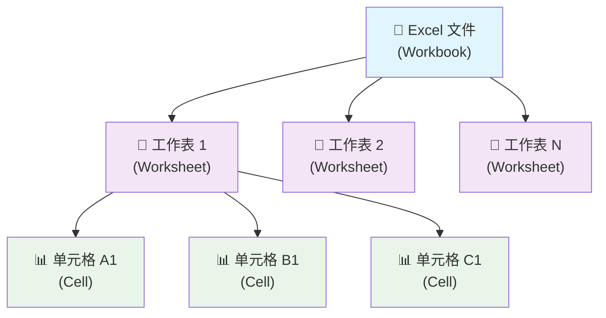
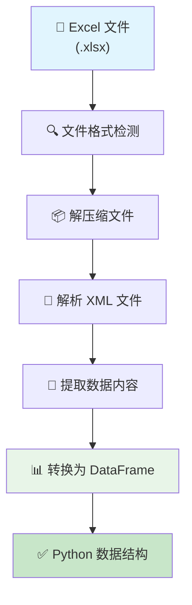

# Excel 文件结构完全指南 - 从基础概念到 Python 读取的实用宝典

## 📋 摘要

还在为 Excel 数据读取不全而烦恼？从零基础到高级应用，掌握 pandas、openpyxl 核心库。提供实战场景，解决数据不全、中文乱码等痛点，让 Python 成为你的 Excel 超级助手！

## 🎯 什么是 Excel

Excel（Microsoft Excel）是微软公司开发的电子表格软件（spreadsheet software），广泛应用于数据处理、分析、可视化等领域。想象一下，Excel 就像一个**数字化的账本**，可以记录、计算、分析各种数据。

### Excel 的核心特点

- **表格化存储**：数据以行列形式整齐排列
- **公式计算**：支持复杂的数学运算和函数
- **图表可视化**：将数据转化为直观的图表
- **多工作表**：一个文件可包含多个数据表

## 🏗️ Excel 文件结构详解

Excel 文件就像一个**多层建筑**，每一层都有特定的功能和作用。

### 文件格式类型

| 格式 | 扩展名 | 特点 | 适用场景 |
|------|--------|------|----------|
| Excel 97-2003 | `.xls` | 二进制格式，文件较大 | 兼容老版本 |
| Excel 2007+ | `.xlsx` | XML 格式，文件较小 | 现代应用 |

### 三层架构结构



### .xlsx 文件内部结构

`.xlsx` 文件实际上是一个**压缩包**，包含多个 XML 文件：

```
📦 example.xlsx
├── 📄 [Content_Types].xml     # 内容类型定义
├── 📁 _rels/                   # 关系文件
├── 📁 docProps/                # 文档属性
└── 📁 xl/                      # 核心数据
    ├── 📄 workbook.xml         # 工作簿结构
    ├── 📁 worksheets/          # 工作表数据
    │   ├── 📄 sheet1.xml
    │   └── 📄 sheet2.xml
    ├── 📄 styles.xml           # 样式定义
    └── 📄 sharedStrings.xml    # 共享字符串
```

## 🔧 Python 读取 Excel 文件原理

Python 读取 Excel 文件的过程就像**翻译官**，将 Excel 的"语言"翻译成 Python 能理解的"语言"。

### 读取流程



### 核心库对比

| 库名 | 功能 | 优势 | 适用场景 |
|------|------|------|----------|
| **pandas** | 数据分析 | 简单易用，功能强大 | 数据分析、处理 |
| **openpyxl** | Excel 操作 | 精确控制，支持格式 | 复杂 Excel 操作 |
| **xlrd** | 只读 .xls | 轻量级 | 简单读取老格式 |

## 💻 Python 读取 Excel 代码实战

### 基础读取方法

#### 方法一：使用 pandas（推荐）

```python
import pandas as pd  # 导入 pandas 库，用于数据分析和处理

# 基础读取方法
# 读取整个 Excel 文件（默认读取第一个工作表）
df = pd.read_excel('data.xlsx')  # df 是 DataFrame 对象，类似 Excel 表格
print("数据形状:", df.shape)  # shape 返回 (行数, 列数) 的元组
print("前 5 行数据:")
print(df.head())  # head() 默认显示前 5 行，可指定行数如 head(10)

# 读取指定工作表
df_sheet1 = pd.read_excel('data.xlsx', sheet_name = 'Sheet1')  # sheet_name 指定工作表名称
print("Sheet1 数据:")
print(df_sheet1.head())

# ⚠️ 数据不全问题解决方案
# 1. 检查所有工作表
excel_file = pd.ExcelFile('data.xlsx')  # ExcelFile 对象，用于获取文件信息
print("所有工作表名称:", excel_file.sheet_names)  # sheet_names 返回所有工作表名称列表

# 2. 读取所有工作表
all_sheets = pd.read_excel('data.xlsx', sheet_name = None)  # None 表示读取所有工作表
# all_sheets 是一个字典，键是工作表名，值是 DataFrame
for sheet_name, data in all_sheets.items():  # 遍历字典的键值对
    print(f"\n工作表: {sheet_name}")
    print(f"数据形状: {data.shape}")  # 显示每个工作表的数据维度
    print("前 3 行:")
    print(data.head(3))  # 显示前 3 行数据

# 3. 完整显示数据（避免省略）
pd.set_option('display.max_rows', None)  # 设置显示所有行，不省略
pd.set_option('display.max_columns', None)  # 设置显示所有列，不省略
df_full = pd.read_excel('data.xlsx')
print("完整数据:")
print(df_full)

# 4. 处理合并单元格问题
df_merged = pd.read_excel('data.xlsx', engine = 'openpyxl')  # 使用 openpyxl 引擎处理复杂格式
# 前向填充合并单元格的缺失值
df_merged.fillna(method = 'ffill', inplace = True)  # ffill 表示前向填充，inplace = True 直接修改原数据
print("处理合并单元格后:")
print(df_merged)

# 5. 指定数据类型避免解析错误
df_typed = pd.read_excel('data.xlsx', dtype = {'ID': 'str', 'Name': 'str'})  # dtype 指定列的数据类型
print("指定数据类型后:")
print(df_typed.dtypes)  # dtypes 显示每列的数据类型
```

**适用水平**：小白（零基础）

#### 方法二：使用 openpyxl（精确控制）

```python
from openpyxl import load_workbook  # 导入 openpyxl 库的 load_workbook 函数

# 加载工作簿（Workbook）
wb = load_workbook('data.xlsx')  # 加载 Excel 文件，返回 Workbook 对象
print(f"工作簿包含 {len(wb.sheetnames)} 个工作表")  # 获取工作表数量

# 获取工作表（Worksheet）
sheet = wb['Sheet1']  # 通过工作表名称获取工作表对象
# 或者使用 wb.active 获取活动工作表（当前选中的工作表）

# 读取单个单元格（Cell）
cell_value = sheet['A1'].value  # 获取 A1 单元格的值
print(f"A1 单元格的值: {cell_value}")

# 读取整行数据
row_data = []  # 创建空列表存储行数据
for cell in sheet[1]:  # sheet[1] 表示第 1 行，遍历该行的所有单元格
    row_data.append(cell.value)  # 将单元格值添加到列表中
print(f"第 1 行数据: {row_data}")

# 读取指定范围
range_data = []  # 创建空列表存储范围数据
for row in sheet['A1:C3']:  # 读取 A1 到 C3 范围的所有行
    row_values = [cell.value for cell in row]  # 列表推导式，获取每行的所有值
    range_data.append(row_values)  # 将行数据添加到范围数据中
print(f"A1:C3 范围数据: {range_data}")

# 读取所有数据（遍历所有行）
all_data = []  # 创建空列表存储所有数据
for row in sheet.iter_rows(values_only = True):  # iter_rows 遍历所有行，values_only = True 只获取值
    all_data.append(row)  # 将每行数据添加到列表中
print(f"所有数据: {all_data}")

# 获取工作表信息
print(f"工作表名称: {sheet.title}")  # title 属性获取工作表名称
print(f"最大行数: {sheet.max_row}")  # max_row 获取最大行数
print(f"最大列数: {sheet.max_column}")  # max_column 获取最大列数

# 读取多个工作表
for sheet_name in wb.sheetnames:  # wb.sheetnames 返回所有工作表名称列表
    current_sheet = wb[sheet_name]  # 获取当前工作表对象
    print(f"\n工作表: {sheet_name}")
    print(f"数据范围: A1:{current_sheet.max_column}{current_sheet.max_row}")  # 显示数据范围
```

**适用水平**：初级

### 高级读取技巧

#### 处理多个工作表

```python
import pandas as pd  # 导入 pandas 库

# 读取所有工作表
all_sheets = pd.read_excel('data.xlsx', sheet_name = None)  # None 表示读取所有工作表
print("所有
工作表名称:", list(all_sheets.keys()))  # keys() 获取字典的所有键（工作表名）

# 遍历所有工作表
for sheet_name, df in all_sheets.items():  # items() 返回键值对，sheet_name 是键，df 是值
    print(f"\n工作表: {sheet_name}")
    print(f"数据形状: {df.shape}")  # shape 返回 (行数, 列数)
    print("前 3 行:")
    print(df.head(3))  # head(3) 显示前 3 行数据

# 合并多个工作表的数据
combined_data = pd.concat(all_sheets.values(), ignore_index = True)  # concat 合并多个 DataFrame
# ignore_index = True 重新生成索引，避免索引重复
print(f"合并后数据形状: {combined_data.shape}")
```

**适用水平**：中级

#### 数据清洗和预处理

```python
import pandas as pd  # 导入 pandas 库

# 读取数据并处理
df = pd.read_excel('data.xlsx')  # 读取 Excel 文件
print(f"原始数据形状: {df.shape}")  # 显示原始数据维度

# 处理空值（删除包含空值的行）
df_cleaned = df.dropna()  # dropna() 删除包含 NaN 值的行
print("删除空值后:", df_cleaned.shape)  # 显示清理后的数据维度

# 数据类型转换
df['日期列'] = pd.to_datetime(df['日期列'])  # 将字符串转换为日期时间类型
# to_datetime 可以自动识别常见的日期格式
df['数值列'] = pd.to_numeric(df['数值列'], errors = 'coerce')  # 转换为数值类型
# errors = 'coerce' 表示无法转换的值设为 NaN，而不是报错

# 数据筛选（筛选数值列大于 100 的行）
filtered_data = df[df['数值列'] > 100]  # 布尔索引，筛选满足条件的行
print("筛选后数据:", filtered_data.shape)

# 数据去重
df_unique = df.drop_duplicates()  # drop_duplicates() 删除重复行
print("去重后数据:", df_unique.shape)

# 保存处理后的数据
df_cleaned.to_excel('cleaned_data.xlsx', index = False)  # 保存为 Excel 文件
# index = False 表示不保存行索引
print("数据已保存到 cleaned_data.xlsx")
```

**适用水平**：中级

### 实际应用场景

#### 场景一：学生成绩管理系统

```python
import pandas as pd  # 导入 pandas 库

# 读取学生成绩表
scores_df = pd.read_excel('student_scores.xlsx')  # 读取学生成绩 Excel 文件
print(f"学生总数: {len(scores_df)}")  # len() 获取学生数量

# 计算平均分
scores_df['平均分'] = scores_df[['语文', '数学', '英语']].mean(axis = 1)  # axis = 1 表示按行计算平均值
# mean() 计算平均值，axis = 1 表示对每行的三科成绩求平均

# 按平均分排序
sorted_scores = scores_df.sort_values('平均分', ascending = False)  # ascending = False 表示降序排列
# sort_values() 按指定列排序，ascending = False 表示从高到低排序

# 输出前 10 名
print("前 10 名学生:")
print(sorted_scores[['姓名', '平均分']].head(10))  # 只显示姓名和平均分两列

# 统计各科平均分
subject_avg = scores_df[['语文', '数学', '英语']].mean()  # 默认 axis = 0，按列计算平均值
print("\n各科平均分:")
print(subject_avg)

# 找出不及格学生
failed_students = scores_df[scores_df['平均分'] < 60]  # 布尔索引筛选不及格学生
print(f"\n不及格学生数量: {len(failed_students)}")
if len(failed_students) > 0:  # 如果有不及格学生
    print("不及格学生名单:")
    print(failed_students[['姓名', '平均分']])  # 显示不及格学生的姓名和平均分
```

**适用水平**：初级

#### 场景二：销售数据分析

```python
import pandas as pd  # 导入 pandas 库

# 读取销售数据
sales_df = pd.read_excel('sales_data.xlsx')  # 读取销售数据 Excel 文件
print(f"销售记录总数: {len(sales_df)}")  # 显示销售记录数量

# 按月份分组统计
monthly_sales = sales_df.groupby('月份')['销售额'].sum()  # groupby 按月份分组，sum 求和
# groupby('月份') 按月份分组，['销售额'].sum() 对销售额求和
print("月度销售统计:")
print(monthly_sales)

# 计算同比增长率
sales_df['同比增长率'] = sales_df['销售额'].pct_change() * 100  # pct_change() 计算百分比变化
# pct_change() 计算相邻行的百分比变化，*100 转换为百分比

# 找出销售冠军
top_salesperson = sales_df.loc[sales_df['销售额'].idxmax()]  # idxmax() 返回最大值的索引
# loc[] 通过索引定位行，idxmax() 找到销售额最大值的行索引
print(f"\n销售冠军: {top_salesperson['销售员']}")
print(f"销售额: {top_salesperson['销售额']}")

# 按产品类别统计
category_stats = sales_df.groupby('产品类别').agg({  # agg() 聚合函数，可以对不同列应用不同函数
    '销售额': ['sum', 'mean', 'count']  # sum 求和，mean 平均值，count 计数
}).round(2)  # round(2) 保留 2 位小数
print("\n产品类别统计:")
print(category_stats)

# 计算销售排名
sales_df['销售排名'] = sales_df['销售额'].rank(ascending = False, method = 'dense')
# rank() 计算排名，ascending = False 降序，method = 'dense' 密集排名（无间隔）
print("\n销售排名:")
print(sales_df[['销售员', '销售额', '销售排名']].head(10))  # 显示前 10 名销售员
```

**适用水平**：中级

## ⚠️ 常见问题与解决方案

### 问题一：pandas 读取数据不全

**错误现象**：使用 `pd.read_excel()` 读取后，发现数据不完整或缺失

**可能原因**：
1. **未指定正确的工作表**：Excel 文件有多个工作表，默认只读取第一个
2. **数据被省略显示**：pandas 默认只显示部分数据
3. **合并单元格问题**：合并单元格导致数据缺失
4. **数据类型解析错误**：某些列被错误解析

**解决方案**：
```python
import pandas as pd  # 导入 pandas 库

# 1. 检查所有工作表
excel_file = pd.ExcelFile('data.xlsx')  # ExcelFile 对象用于获取文件信息
print("所有工作表:", excel_file.sheet_names)  # sheet_names 属性返回工作表名称列表

# 2. 读取指定工作表
df = pd.read_excel('data.xlsx', sheet_name = '目标工作表名')  # sheet_name 指定要读取的工作表
print(f"指定工作表数据形状: {df.shape}")

# 3. 读取所有工作表
all_sheets = pd.read_excel('data.xlsx', sheet_name = None)  # None 表示读取所有工作表
print(f"共读取 {len(all_sheets)} 个工作表")

# 4. 完整显示数据
pd.set_option('display.max_rows', None)  # 设置显示所有行，不省略
pd.set_option('display.max_columns', None)  # 设置显示所有列，不省略
print("完整数据:")
print(df)

# 5. 处理合并单元格
df = pd.read_excel('data.xlsx', engine = 'openpyxl')  # 使用 openpyxl 引擎处理复杂格式
df.fillna(method = 'ffill', inplace = True)  # ffill 前向填充，inplace = True 直接修改原数据
print("处理合并单元格后:")
print(df)

# 6. 指定数据类型
df = pd.read_excel('data.xlsx', dtype = {'ID': 'str'})  # dtype 字典指定列的数据类型
print("指定数据类型后:")
print(df.dtypes)  # dtypes 显示每列的数据类型
```

**适用水平**：小白

### 问题二：文件读取失败

**错误信息**：`FileNotFoundError: [Errno 2] No such file or directory`

**解决方案**：
```python
import os  # 导入 os 模块

# 检查文件是否存在
file_path = 'data.xlsx'
if os.path.exists(file_path):  # os.path.exists() 检查文件是否存在
    df = pd.read_excel(file_path)
    print("文件读取成功")
else:
    print(f"文件 {file_path} 不存在")
    # 列出当前目录的文件
    print("当前目录文件:", os.listdir('.'))  # os.listdir() 列出目录中的文件
```

**适用水平**：小白

### 问题三：中文乱码问题

**错误信息**：Excel 中的中文显示为乱码

**解决方案**：
```python
# 指定编码格式
df = pd.read_excel('data.xlsx', encoding = 'utf-8')  # encoding 指定文件编码

# 或者使用 openpyxl（推荐）
from openpyxl import load_workbook
wb = load_workbook('data.xlsx')  # openpyxl 自动处理编码问题
```

**适用水平**：初级

### 问题四：大文件读取缓慢

**解决方案**：
```python
# 分块读取大文件
chunk_size = 1000  # 设置每次读取的行数
chunks = pd.read_excel('large_file.xlsx', chunksize = chunk_size)  # chunksize 分块读取

for chunk in chunks:  # 遍历每个数据块
    # 处理每个数据块
    processed_chunk = chunk.dropna()
    print(f"处理了 {len(processed_chunk)} 行数据")

# 只读取需要的列
df = pd.read_excel('data.xlsx', usecols = ['列1', '列2', '列3'])  # usecols 指定要读取的列

# 指定数据类型减少内存占用
df = pd.read_excel('data.xlsx', dtype = {'ID': 'int32', 'Name': 'string'})  # dtype 指定数据类型
```

**适用水平**：高级

## 📊 性能对比分析

| 方法 | 读取速度 | 内存占用 | 功能丰富度 | 推荐指数 |
|------|----------|----------|------------|----------|
| pandas | ⭐⭐⭐⭐ | ⭐⭐⭐ | ⭐⭐⭐⭐⭐ | ⭐⭐⭐⭐⭐ |
| openpyxl | ⭐⭐⭐ | ⭐⭐⭐⭐ | ⭐⭐⭐⭐ | ⭐⭐⭐⭐ |
| xlrd | ⭐⭐⭐⭐⭐ | ⭐⭐⭐⭐⭐ | ⭐⭐ | ⭐⭐⭐ |

## 🎯 最佳实践建议

### 1. 选择合适的库

- **数据分析**：优先选择 pandas
- **格式控制**：使用 openpyxl
- **简单读取**：考虑 xlrd

### 2. 错误处理

```python
try:  # try-except 异常处理
    df = pd.read_excel('data.xlsx')
    print("读取成功")
except FileNotFoundError:  # 捕获文件不存在异常
    print("文件不存在")
except Exception as e:  # 捕获其他异常
    print(f"读取失败: {e}")
```

### 3. 内存优化

```python
# 只读取需要的列
df = pd.read_excel('data.xlsx', usecols = ['列1', '列2', '列3'])

# 指定数据类型
df = pd.read_excel('data.xlsx', dtype = {'ID': 'int32', 'Name': 'string'})
```

## 📚 学习路径建议

### 小白（零基础）
1. 学习 Excel 基本概念
2. 掌握 pandas 基础用法
3. 练习简单的数据读取

### 初级开发者
1. 深入学习 pandas 数据处理
2. 了解 openpyxl 精确控制
3. 掌握数据清洗技巧

### 中级开发者
1. 学习数据分析和可视化
2. 掌握性能优化技巧
3. 处理复杂的数据结构

### 高级开发者
1. 自定义 Excel 处理工具
2. 开发自动化数据处理流程
3. 优化大规模数据处理性能

## 🔮 未来发展趋势

- **云端处理**：Excel 文件将更多在云端处理
- **AI 集成**：智能数据分析和预测
- **实时协作**：多人同时编辑和处理
- **自动化**：更智能的数据处理流程

## 📝 总结

Excel 文件结构虽然复杂，但通过 Python 的强大库支持，我们可以轻松读取和处理各种 Excel 数据。无论是简单的数据查看，还是复杂的数据分析，Python 都能提供完美的解决方案。

**记住**：选择合适的方法，处理常见问题，持续学习新技术，你就能成为 Excel 数据处理的高手！加油，数据处理的路上我们一起前行！ 🚀

---

**厦门工学院人工智能创作坊 -- 郑恩赐**  
**2025 年 1 月 17 日**