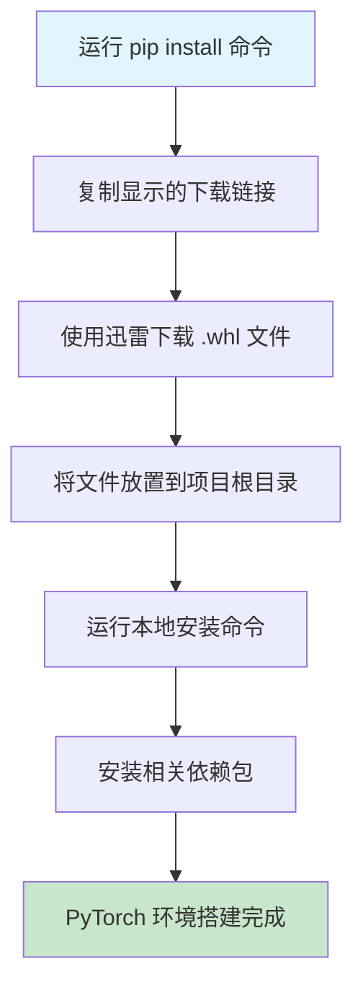

# PyTorch 迅雷加速下载小妙招 - 解决大文件下载慢的实用技巧

## 📋 摘要

pip 下载 PyTorch 大文件慢？本小妙招提供迅雷加速下载方案，通过手动下载 + 本地安装，轻松突破网络限制，快速完成 PyTorch 环境搭建。

---

## 🎯 问题背景

在使用 pip 安装 PyTorch 时，经常会遇到以下问题：

- **文件过大**：PyTorch 安装包通常超过 1GB，下载时间漫长
- **网络不稳定**：官方源下载速度慢，经常中断
- **重复下载**：网络问题导致多次重新下载，浪费时间

## 🚀 解决方案：迅雷加速下载法

### 第一步：获取下载链接

当您在**终端**（Terminal）或**命令行**（Command Line）中运行以下命令时：
```bash
# 示例命令（请根据您的实际需求调整版本号）
pip install torch==2.5.1 torchvision==0.20.1 torchaudio==2.5.1 --index-url https://download.pytorch.org/whl/cu124
```

终端会显示类似这样的下载链接：
```
https://download.pytorch.org/whl/cu124/torch-2.5.1%2Bcu124-cp312-cp312-win_amd64.whl
```

### 第二步：使用迅雷下载

1. **复制链接**：右键复制上述下载链接
2. **打开迅雷**：启动迅雷下载工具
3. **新建任务**：粘贴链接，开始下载
4. **等待完成**：迅雷的多线程下载能显著提升速度

### 第三步：放置文件到项目目录

将下载完成的 `.whl` 文件移动到您的项目根目录下：

> **💡 小贴士**：`.whl` 文件是 Python 的预编译安装包（Wheel Package），就像组装好的家具，拿来就能用。文档后面的"技术细节说明"部分有详细介绍。

**假设**下载后的文件名为 `torch-2.5.1+cu124-cp312-cp312-win_amd64.whl`，则项目目录结构如下：
```
项目根目录/
├── torch-2.5.1+cu124-cp312-cp312-win_amd64.whl
└── 其他项目文件...
```

### 第四步：本地安装 PyTorch

在项目根目录下运行以下命令：

```bash
# 示例命令（请根据您的实际文件名调整）
# 假设您的文件名是 torch-2.5.1+cu124-cp312-cp312-win_amd64.whl
pip install "torch-2.5.1+cu124-cp312-cp312-win_amd64.whl"
```

### 第五步：安装相关依赖包

继续安装 torchvision 和 torchaudio：

```bash
# 示例命令（请根据您的实际版本需求调整）
pip install torch==2.5.1 torchvision==0.20.1 torchaudio==2.5.1 --index-url https://download.pytorch.org/whl/cu124
```

## 📊 安装流程图



## 🎯 适用场景

### ✅ 推荐使用的情况

1. **网络环境差**：网速慢、不稳定，pip 下载经常失败
2. **大文件下载**：PyTorch 等大型机器学习框架安装包
3. **重复安装**：需要在多台机器上安装相同环境
4. **离线环境**：无法直接访问外网，需要预先下载
5. **企业环境**：公司网络限制，无法使用 pip 直接下载

### ⚠️ 注意事项

1. **版本匹配**：确保下载的 `.whl` 文件与您的 Python 版本和 CUDA 版本匹配
2. **路径正确**：conda 环境路径需要根据实际情况调整
3. **文件完整性**：下载完成后检查文件大小，确保下载完整

## 🔧 技术细节说明

### 什么是 .whl 文件？

`.whl` 文件是 Python 的 **Wheel 格式安装包**（Wheel Package），它是一种预编译的二进制包格式。想象一下，如果安装软件包就像组装家具：

- **传统方式**（源码包）：给你一堆木板和螺丝，需要自己组装
- **Wheel 方式**：直接给你组装好的成品，拿来就能用

**Wheel 包的优势**：
- **🚀 安装速度快**：预编译好的代码，无需编译过程
- **💾 体积更小**：只包含必要的文件，没有源码
- **🔒 稳定性高**：避免了编译过程中的各种错误
- **📦 离线安装**：可以提前下载，断网也能安装

### 文件命名规则解析

以 `torch-2.5.1+cu124-cp312-cp312-win_amd64.whl` 为例：

- **torch**：包名称（PyTorch 深度学习框架）
- **2.5.1**：版本号（2025 年最新版本）
- **cu124**：CUDA 12.4 支持（GPU 加速计算）
- **cp312**：Python 3.12 兼容（Python 版本标识）
- **win_amd64**：Windows 64 位系统（操作系统和架构）
- **.whl**：Wheel 包格式标识

### 环境变量说明

使用通用的 `pip` 命令时，系统会自动使用当前 Python 环境中的 pip 工具，无需指定具体路径。

**适用开发者水平**：
- **小白（零基础）**：✅ 推荐，操作简单直观
- **刚入门不久（初级）**：✅ 强烈推荐，解决常见问题
- **入门一段时间（中级）**：✅ 推荐，提高工作效率
- **资深开发者（高级）**：✅ 推荐，批量环境部署

## 💡 进阶技巧

### 批量下载多个包

如果您需要下载多个相关包，可以：

1. **记录所有下载链接**：在 pip 安装过程中记录所有 `.whl` 文件的下载链接
2. **批量下载**：在迅雷中批量添加下载任务
3. **统一安装**：将所有文件放置在同一目录下，依次安装

### 创建本地缓存

```bash
# 创建本地包缓存目录
mkdir pytorch_cache
# 将下载的 .whl 文件移动到缓存目录
# 后续安装时直接使用本地文件
```

## 🎉 总结

通过使用迅雷加速下载 PyTorch，您可以：

- **大幅提升下载速度**：多线程下载比 pip 单线程快数倍
- **避免重复下载**：一次下载，多次使用
- **突破网络限制**：解决网络环境差的问题
- **提高工作效率**：快速完成环境搭建

这种方法特别适合网络环境不佳的开发者，是解决大文件下载慢问题的实用小妙招。相信通过本技巧分享，您一定能够轻松完成 PyTorch 环境的快速搭建！

---

**厦门工学院人工智能创作坊 -- 郑恩赐**  
**2025 年 10 月 12 日**
