# Python 学习路线完全指南 - 从零基础到精通的编程技能养成计划

## 📝 摘要

Python 完整学习路线涵盖基础语法到高级特性全流程，通过五阶段循序渐进：基础语法、数据结构、函数模块、面向对象、高级特性。系统掌握 Python 核心技能，全面提升编程能力。

## 🗺️ Python 完整学习路线图

```mermaid
graph TD
    Start["Python 学习路线图"]
    
    P1["第一阶段：基础语法<br/>(10-14天)"]
    P1A["了解 Python 特点和版本<br/>(P1A)"]
    P1B["安装 Python 和开发环境<br/>IDE（PyCharm/VS Code）<br/>(P1B)"]
    P1C["变量：整数、浮点数、布尔值<br/>(P1C)"]
    P1D["字符串：创建、拼接、格式化<br/>(P1D1,P1D2)"]
    P1E["运算符：算术、比较、逻辑、赋值<br/>(P1E)"]
    P1F["条件语句：if、elif、else、嵌套<br/>(P1F)"]
    P1G["循环语句：for 遍历、while 循环"]
    P1H["循环控制：break、continue、else"]
    P1I["输入输出：print、input、格式化输出<br/>(P1I)"]
    P1J["注释：单行、多行、文档字符串<br/>(P1J)"]
    
    P2["第二阶段：数据结构<br/>(10-14天)"]
    P2A["列表 List：创建、索引、切片<br/>(P2A)"]
    P2B["可迭代对象：列表、元组、字符串<br/>(P2B)"]
    P2C["元组 Tuple：创建、不可变性"]
    P2D["字典 Dictionary：键值对、创建、访问<br/>(P2D)"]
    P2E["字典操作：增删改查、遍历、嵌套<br/>(P2E)"]
    P2F["集合 Set：创建、去重、集合运算<br/>(P2F)"]
    P2G["字符串方法：split、join、strip、replace"]
    P2H["字符串格式化：format、f-string<br/>(P2H)"]
    P2I["正则表达式 re：模式匹配、搜索、替换<br/>(P2I)"]
    P2J["collections：namedtuple、defaultdict、Counter<br/>(P2J)"]
    P2K["collections：deque、OrderedDict<br/>(P2K)"]
    
    P3["第三阶段：函数与模块<br/>(10-14天)"]
    P3A["函数定义：def、参数、返回值<br/>(P3A)"]
    P3B["参数类型：位置参数、关键字参数<br/>(P3B)"]
    P3C["默认参数、可变参数、关键字参数<br/>(P3C)"]
    P3D["作用域：全局变量、局部变量<br/>(P3D)"]
    P3E["Lambda 表达式：匿名函数<br/>(P3E)"]
    P3F["内置函数：map、filter、reduce<br/>(P3F)"]
    P3G["模块导入：import、from...import<br/>(P3G)"]
    P3H["标准库：os、sys、datetime、random<br/>(P3H,P3H0,P3H1)"]
    P3I["包 Package：__init__.py、__all__"]
    P3J["JSON 模块：序列化与反序列化"]
    P3K["pathlib 模块：现代化路径处理"]
    P3L["itertools 模块：permutations、combinations、cycle、chain"]
    P3M["itertools 模块：groupby 分组迭代"]
    P3N["functools 模块：partial、wraps、lru_cache"]
    P3O["functools 模块：total_ordering 比较运算符"]
    P3P["typing 类型注解：List、Dict、Optional、Union、Callable"]
    
    P4["第四阶段：面向对象<br/>(12-16天)"]
    P4A["类 Class：定义、属性、方法<br/>(P4A)"]
    P4B["对象 Object：实例化、属性访问"]
    P4C["封装：私有属性、属性装饰器"]
    P4D["继承：单继承、多重继承、super"]
    P4E["多态：方法重写、鸭子类型"]
    P4F["特殊方法：__init__、__str__、__repr__"]
    P4G["异常处理：try、except、finally、else<br/>(P4G)"]
    P4H["自定义异常：raise、Exception 类"]
    P4I["文件操作：open、read、write、with"]
    P4J["上下文管理器：__enter__、__exit__"]
    P4K["property 属性：@property、setter、deleter"]
    P4L["__slots__：类属性限制"]
    P4M["enum 枚举类型：定义和使用枚举"]
    P4N["dataclass 数据类：@dataclass 装饰器"]
    P4O["抽象基类 ABC：abc.ABC、@abstractmethod"]
    P4P["with 语句进阶：多个上下文管理器"]
    
    P5["第五阶段：高级特性<br/>(12-16天)"]
    P5A["装饰器：函数装饰器、类装饰器"]
    P5B["生成器：yield、生成器表达式"]
    P5C["迭代器：iter、next、可迭代对象"]
    P5D["推导式：列表、字典、集合推导式<br/>(P5D)"]
    P5E["yield from：生成器委派"]
    P5F["描述符协议：__get__、__set__、__delete__"]
    P5G["多线程：threading、锁、队列"]
    P5H["多进程：multiprocessing、进程池<br/>(P5H)"]
    P5I["异步编程：async、await、asyncio<br/>(P5I)"]
    P5J["pickle 模块：对象序列化"]
    
    Links["专栏文档链接目录"]
    
    Start --> P1
    P1 --> P1A --> P1B --> P1C --> P1D --> P1E --> P1F --> P1G --> P1H --> P1I --> P1J
    P1J --> P2
    P2 --> P2A --> P2B --> P2C --> P2D --> P2E --> P2F --> P2G --> P2H --> P2I --> P2J --> P2K
    P2K --> P3
    P3 --> P3A --> P3B --> P3C --> P3D --> P3E --> P3F --> P3G --> P3H --> P3I --> P3J --> P3K --> P3L --> P3M --> P3N --> P3O --> P3P
    P3P --> P4
    P4 --> P4A --> P4B --> P4C --> P4D --> P4E --> P4F --> P4G --> P4H --> P4I --> P4J --> P4K --> P4L --> P4M --> P4N --> P4O --> P4P
    P4P --> P5
    P5 --> P5A --> P5B --> P5C --> P5D --> P5E --> P5F --> P5G --> P5H --> P5I --> P5J
    P5J --> Links
    
    style Start fill:#e3f2fd,stroke:#1976d2,stroke-width:3px
    style P1 fill:#e1f5fe,stroke:#0288d1
    style P2 fill:#e8f5e9,stroke:#388e3c
    style P3 fill:#fff3e0,stroke:#f57c00
    style P4 fill:#f3e5f5,stroke:#7b1fa2
    style P5 fill:#ffebee,stroke:#d32f2f
    style Links fill:#fff9c4,stroke:#fbc02d
```

**📚 专栏文档链接目录（按学习顺序排序）：**
- P0A-Python学习路线完全指南-从零基础到精通的编程技能养成计划：本文档
- P0B-Python基础知识分类：[掘金](https://juejin.cn/post/7615831974130909230)
- P0C-Python语言特性详解：[掘金](https://juejin.cn/post/7615894592198754354) ✅
- P1A-Python特点和版本完全指南-从零基础到选择最适合的编程语言：[掘金](https://juejin.cn/post/7566535266597666825) ✅
- P1B-Python环境配置基础完全指南-Windows系统安装与验证：[掘金](https://juejin.cn/post/7618125717469593609) | [CSDN](https://blog.csdn.net/2301_79239314/article/details/159174477) ✅
- P1C-Python变量和数据类型详解：[掘金](https://juejin.cn/post/7615831974130941998) ✅
- P1D1-Python字符串完全指南-从创建拼接到格式化的高效实践：[掘金](https://juejin.cn/post/7566840769794342921) ✅
- P1D2-Python转义字符完全指南-从换行符到制表符的字符串处理利器：[掘金](https://juejin.cn/post/7564634569261989951) ✅
- P1E-Python-7大运算符类别详解：is和==有什么区别？优先级陷阱如何避免？：[掘金](https://juejin.cn/post/7567281062520111123) ✅
- P1F-Python控制结构详解：[掘金](https://juejin.cn/post/7615894592198803506) ✅
- P1I-Python输入输出-什么是print()和input()？为什么大厂程序员都用f-string格式化？怎么快速掌握程序交互？：[掘金](https://juejin.cn/post/7567581946144620595) ✅
- P1J-Python注释-什么是注释？为什么大厂程序员都在写文档字符串？怎么快速掌握注释规范？：[掘金](https://juejin.cn/post/7567581662101389363) ✅
- P2A-Python列表-什么是列表？切片为什么这么强大？怎么快速掌握增删改查？：[掘金](https://juejin.cn/post/7567678315303501874) ✅
- P2B-Python可迭代对象完全指南-从列表到生成器的Python编程利器：[掘金](https://juejin.cn/post/7627317516664094746) | [CSDN](https://blog.csdn.net/2301_79239314/article/details/160089157) ✅
- P2D-Python_哈希表完全指南-从字典到高效查找的Python编程利器：[掘金](https://juejin.cn/post/7563950984256208946) ✅
- P2E-Python字典操作完全指南-从增删改查到遍历嵌套的Python编程利器：[掘金](https://juejin.cn/spost/7626681742502625306) | [CSDN](https://blog.csdn.net/2301_79239314/article/details/160015439) ✅
- P2F-Python集合完全指南-从创建到去重集合运算的Python编程利器：[掘金](https://juejin.cn/post/7626697192071348260) | [CSDN](https://blog.csdn.net/2301_79239314/article/details/160020767) ✅
- P2G-Python字符串方法完全指南-split、join、strip、replace的Python编程利器：[微信公众号](https://mp.weixin.qq.com/s/NuMqLyowLyML91o02a4R5w) | [CSDN](https://zheng-en-ci.blog.csdn.net/article/details/160089716) | [掘金](https://juejin.cn/post/7627870163740753970) ✅
- P2H-Python字符串格式化完全指南-format和f-string的Python编程利器：[微信公众号](https://mp.weixin.qq.com/s/04NbwreopEBmaifulZY1mg) | [CSDN](https://blog.csdn.net/2301_79239314/article/details/160112452) | [掘金](https://juejin.cn/post/7627774689625391131) ✅
- P2I-Python正则表达式-什么是正则表达式？为什么程序员都在用re模块？怎么快速掌握模式匹配和替换？：[掘金](https://juejin.cn/post/7567769662478761993) ✅
- P2J-Python-collections-什么是namedtuple、defaultdict和Counter？为什么一线开发者都在用？怎么快速掌握？：[掘金](https://juejin.cn/post/7568315756073615410) ✅
- P2K-Python-collections-什么是deque和OrderedDict？为什么需要双端队列和有序字典？怎么快速掌握？：[掘金](https://juejin.cn/post/7568388327729545226) ✅
- P3A-Python函数定义和调用详解：[掘金](https://juejin.cn/post/7615827622843940915) ✅
- P3B-90%Python初学者参数传错位置？合格程序员都这样选择参数类型：[掘金](https://juejin.cn/post/7569548172534136872) | [CSDN](https://blog.csdn.net/2301_79239314/article/details/154541746)
- P3C-为什么95%初学者踩坑可变默认参数？合格程序员都用args和kwargs写出灵活函数：[掘金](https://juejin.cn/post/7569886315197431859) ✅
- P3D-Python局部变量和全局变量-什么是作用域？为什么90%初学者踩坑global关键字？怎么快速掌握LEGB规则？：[掘金](https://juejin.cn/post/7570902473433677824) ✅
- P3E-Python Lambda表达式完全指南-什么是匿名函数？为什么90%程序员都在用？怎么快速掌握函数式编程利器？：[掘金](https://juejin.cn/post/7571636682694328360) ✅
- P3F-Python内置函数完全指南-什么是内置函数？为什么90%程序员都在用？怎么快速掌握70+个核心函数？：[掘金](https://juejin.cn/post/7572880767584501811) ✅
- P3G-Python模块与包完全指南-从import到自定义模块的代码组织利器：[掘金](https://juejin.cn/post/7565732382312333338) ✅
- P3H-Python魔术方法协议-为什么内置函数必须依赖它们？直接调用会踩哪些坑？怎么写出兼容代码？：[掘金](https://juejin.cn/post/7573980331755094042) ✅
- P3H0-Python-os模块完全指南-操作系统接口与文件路径处理利器：[掘金](https://juejin.cn/post/7575456858426687534) ✅
- P3H1-Python-sys模块完全指南-系统参数与命令行参数处理利器：[掘金](https://juejin.cn/post/7577737385955721226) ✅
- P4A-Python类基础详解：[掘金](https://juejin.cn/post/7615919828885307430) ✅
- P4G-Python_try-except-finally完全指南-从异常处理到程序稳定的Python编程利器：[掘金](https://juejin.cn/post/7562164252635725865) ✅
- P5D-Python_推导式完全指南-从列表推导式到字典推导式的Python编程利器：[掘金](https://juejin.cn/post/7563597691680489491) ✅
- P5H-Python惰性求值 vs 立即求值-为什么内存优化和调试体验总是对着干？：[掘金](https://juejin.cn/post/7573589277005086758) ✅
- P5I-Python_async异步编程完全指南-从协程到高并发的Python编程利器：[掘金](https://juejin.cn/post/7562283242936008723) ✅
- P6A-FastAPI项目结构完全指南-从零基础到企业级应用的Python Web开发利器：[掘金](https://juejin.cn/post/7562103549842227246) ✅

---

最后更新时间：2026-04-13

